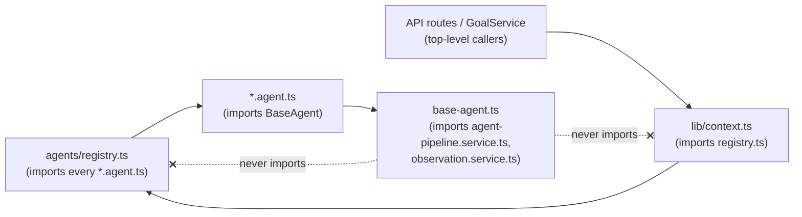

# The Agent SDK & `BaseAgent`

## Scope

`apps/web/features/agents/lib/agent-definition.ts` is the entire interface an agent must implement.
Its own doc comment draws the parallel to Phase 6's Tool SDK deliberately
(`agent-definition.ts:9-16`):

```ts
/**
 * The Agent SDK (Phase 7). Every agent implements exactly these 9 methods —
 * no custom entry points, mirroring Phase 6's own "exactly these 8 methods"
 * rule for `ToolDefinition`. `BaseAgent` (`base-agent.ts`) implements the
 * shared mechanics of every method; concrete agents override persona/
 * `supportedTools`/`supportedKnowledge` and narrow `analyze()`/`think()`
 * refinements only.
 */
```

This doc covers every type in `agent-definition.ts`, walks the 9 methods one by one — what each does,
and exactly what `apps/web/features/agents/lib/base-agent.ts`'s `BaseAgent` abstract class already
provides versus what a concrete agent under `apps/web/features/agents/definitions/` is left to
override — and closes with the module-boundary rule that keeps `base-agent.ts` free of a circular
import into the agent registry.

## The supporting types

`agent-definition.ts:18-77` declares six plain types every SDK method reads or returns:

```ts
export interface AgentContext {
  organizationId: string;
  userId: string;
  conversationId?: string;
  organization: { id: string; name: string };
  availableTools: readonly ToolName[];
  role: Role;
  availableAgents: AgentDescriptor[];
}

export interface AgentAnalysis {
  /** [0,1], deterministic (keyword/category overlap against `supportedKnowledge`/`capabilities`) — never a fabricated LLM confidence score. */
  relevance: number;
  reason: string;
}

export interface AgentObservation {
  summary: string;
  /** Entity/Message/TimelineEvent ids the observation is about. */
  relatedEntityIds: string[];
}

export interface AgentHealthStatus {
  healthy: boolean;
  registryStatus: 'ACTIVE' | 'DISABLED';
  providerHealthy: boolean;
  message?: string;
  latencyMs?: number;
}

export interface AgentPlanStep {
  phase: 'PLAN' | 'OBSERVE' | 'SUGGEST' | 'WAIT' | 'CONTINUE';
  description: string;
}

export interface AgentDescriptor {
  agentKey: string;
  version: string;
  name: string;
  displayName: string;
  description: string;
  avatar: string;
  category: AgentCategory;
  capabilities: string[];
  supportedTools: readonly ToolName[];
  supportedKnowledge: string[];
  priority: number;
  model?: string;
  temperature?: number;
  maxContext?: number;
  minimumRole: Role;
}
```

`AgentDescriptor` is the single object every concrete agent module defines once — the six real
descriptors are catalogued in [registry.md](./registry.md). `avatar` is a lucide-icon name string
(e.g. `'Bot'`, `'Landmark'`); `model`/`temperature`/`maxContext` are all optional per-agent overrides
of the organization's effective AI config, unset by every one of the six agents today.

## The 9 methods

```ts
export interface AgentDefinition {
  readonly descriptor: AgentDescriptor;

  describe(): AgentDescriptor;
  health(): Promise<AgentHealthStatus>;
  analyze(input: string): AgentAnalysis;
  plan(goalTitle: string): AgentPlanStep[];
  observe(ctx: AgentContext, since?: Date): Promise<AgentObservation[]>;
  think(ctx: AgentContext, input: string, history: ChatMessage[], budget: DelegationBudget): AsyncGenerator<AgentStreamEvent>;
  delegate(ctx: AgentContext, targetAgentKey: string, question: string, budget: DelegationBudget): Promise<string>;
  handoff(ctx: AgentContext, targetAgentKey: string, question: string, history: ChatMessage[], budget: DelegationBudget): AsyncGenerator<AgentStreamEvent>;
  summarize(ctx: AgentContext, pieces: Array<{ agentKey: string; content: string }>): Promise<string>;
}
```
(`agent-definition.ts:88-104`)

### 1. `describe(): AgentDescriptor`

```ts
describe(): AgentDescriptor {
  return this.descriptor;
}
```
(`base-agent.ts:35-37`)

The plain getter every consumer that only needs an agent's metadata (Agent Discovery, the registry's
`syncToDatabase`) calls instead of reaching into `descriptor` directly. `BaseAgent` provides this in
full; no concrete agent overrides it.

### 2. `health(): Promise<AgentHealthStatus>`

```ts
async health(): Promise<AgentHealthStatus> {
  const { isAIProviderConfigured, getAIProvider } = await import('@/features/ai/services/ai-provider.service');
  if (!isAIProviderConfigured()) {
    return { healthy: false, registryStatus: 'ACTIVE', providerHealthy: false, message: 'No AI provider configured.' };
  }
  const start = Date.now();
  const status = await getAIProvider().health();
  return {
    healthy: status.healthy,
    registryStatus: 'ACTIVE',
    providerHealthy: status.healthy,
    message: status.message,
    latencyMs: status.latencyMs ?? Date.now() - start,
  };
}
```
(`base-agent.ts:39-53`)

Checks whether an AI provider is configured at all, then reports the same provider health-check every
agent shares (there's exactly one AI provider per organization today, not one per agent — see
[../ai/providers.md](../ai/providers.md)). The `ai-provider.service` import is a dynamic `import()`
inside the method body rather than a top-level import, so a module that only needs the
`AgentDefinition` type doesn't eagerly pull in AI provider bootstrapping. `registryStatus` is always
reported `'ACTIVE'` — the `AgentRegistryStatus.DISABLED` enum value exists on the DB row
([registry.md](./registry.md)) but nothing in this feature ever sets it, so `health()` has no live
signal to report anything else. This backs `GET /api/agents/status` — see [routing.md](./routing.md).

### 3. `analyze(input: string): AgentAnalysis`

```ts
analyze(input: string): AgentAnalysis {
  const haystack = `${this.descriptor.capabilities.join(' ')} ${this.descriptor.supportedKnowledge.join(' ')}`.toLowerCase();
  const words = input.toLowerCase().split(/[^a-z0-9]+/).filter((word) => word.length > 2);
  if (words.length === 0) return { relevance: 0, reason: 'No meaningful terms to match.' };
  const matched = words.filter((word) => haystack.includes(word));
  const relevance = matched.length / words.length;
  const reason = matched.length > 0
    ? `Matched: ${Array.from(new Set(matched)).slice(0, 5).join(', ')}`
    : "No overlap with this agent's known domains.";
  return { relevance, reason };
}
```
(`base-agent.ts:56-71`)

Deterministic keyword/category overlap against `capabilities`/`supportedKnowledge` — never a
fabricated LLM confidence score, matching this codebase's "no hallucinated summaries" principle
applied to routing. `relevance` is a plain fraction: matched words over total words (words shorter
than 3 characters are filtered out first), computed against a concrete agent's own `capabilities`/
`supportedKnowledge` arrays. `BaseAgent` provides this in full; none of the 6 current agents override
it. Note that `analyze()` is not itself part of the routing mechanism the Coordinator uses — see
[routing.md](./routing.md) for why routing is a `<<DELEGATE:...>>` marker, not a call to `analyze()`.

### 4. `plan(goalTitle: string): AgentPlanStep[]`

```ts
const GOAL_PHASE_TEMPLATE: AgentPlanStep['phase'][] = ['PLAN', 'OBSERVE', 'SUGGEST', 'WAIT', 'CONTINUE'];

plan(goalTitle: string): AgentPlanStep[] {
  return GOAL_PHASE_TEMPLATE.map((phase) => ({ phase, description: `${phase}: ${goalTitle}` }));
}
```
(`base-agent.ts:17,73-75`)

A fixed, deterministic 5-phase template, identical for every agent regardless of domain. This is what
`GoalService.createGoal` calls to build a new `AgentGoal.originalPlan` — see [goals.md](./goals.md).
`plan()` itself does nothing beyond describe the cycle a goal will move through; it never executes any
of it.

### 5. `observe(ctx: AgentContext, since?: Date): Promise<AgentObservation[]>`

```ts
async observe(ctx: AgentContext, since?: Date): Promise<AgentObservation[]> {
  return observeForAgent(ctx.organizationId, this.descriptor, since);
}
```
(`base-agent.ts:77-79`)

A thin call into `observeForAgent` (`apps/web/features/agents/services/observation.service.ts`,
[insights.md](./insights.md)) — a deterministic diff query against the organization timeline,
read-only. No concrete agent overrides it.

### 6. `think(...)`: the core reasoning loop

```ts
think(ctx: AgentContext, input: string, history: ChatMessage[], budget: DelegationBudget): AsyncGenerator<AgentStreamEvent> {
  return runThinkLoop(this, ctx, input, history, budget);
}
```
(`base-agent.ts:81-83`)

The interface's own comment calls this out as "the core reasoning loop — retrieval, prompt assembly,
tool/action/delegation dispatch, streaming." `BaseAgent` provides the full implementation as a thin
call into `runThinkLoop` (`apps/web/features/agents/services/agent-pipeline.service.ts:161-388`),
where retrieval, prompt building, the tool-call/action-propose/delegate dispatch loop, and the final
token stream all actually live — in exactly one place, not duplicated per agent. No concrete agent
overrides `think()`; a persona difference between agents comes entirely from `descriptor` fields
(`description`, `supportedTools`, `supportedKnowledge`) that `runThinkLoop` reads generically, never
from agent-specific reasoning code. Full walkthrough in [routing.md](./routing.md) and
[delegation.md](./delegation.md).

### 7. `delegate(...)`: consult, don't transfer

```ts
async delegate(ctx: AgentContext, targetAgentKey: string, question: string, budget: DelegationBudget): Promise<string> {
  return runDelegate(this, ctx, targetAgentKey, question, budget);
}
```
(`base-agent.ts:85-87`)

"Consult another agent; the response is accumulated (not streamed to the client) and returned as plain
text for the caller to incorporate and keep driving" (`agent-definition.ts:98`). Thin call into
`runDelegate`, which drains the target's own `think()` with `persist: false` and hands back the
accumulated text. Full mechanics in [delegation.md](./delegation.md).

### 8. `handoff(...)`: transfer full control

```ts
handoff(ctx, targetAgentKey, question, history, budget): AsyncGenerator<AgentStreamEvent> {
  return runHandoff(this, ctx, targetAgentKey, question, history, budget);
}
```
(`base-agent.ts:89-97`)

"Transfer full control — the target's own `think()` events become this turn's remaining output"
(`agent-definition.ts:100`). Thin call into `runHandoff`, which recurses into the target's `think()`
with `persist: true` and `yield*`s its events directly. This is also the exact mechanism behind
routing itself — see [routing.md](./routing.md).

### 9. `summarize(...)`: reconcile, don't silently pick a winner

```ts
async summarize(ctx: AgentContext, pieces: Array<{ agentKey: string; content: string }>): Promise<string> {
  return runSummarize(ctx, pieces);
}
```
(`base-agent.ts:99-101`)

"A real LLM synthesis call reconciling multiple agents' answers (Consensus/Parallel) — explicitly
surfaces disagreement rather than silently favoring whichever answered last" (`agent-definition.ts:102`).
Thin call into `runSummarize`, a real `provider.generate()` call — see
[delegation.md](./delegation.md) for the full prompt and the Consensus/Parallel patterns it enables.

## What `BaseAgent` provides vs. what a concrete agent overrides

Every one of the 9 methods above is implemented in full by `BaseAgent`. The abstract class declares
exactly one abstract member:

```ts
export abstract class BaseAgent implements AgentDefinition {
  abstract readonly descriptor: AgentDescriptor;
  ...
}
```
(`base-agent.ts:32-33`)

Every concrete agent under `apps/web/features/agents/definitions/` is, in its entirety, a class that
extends `BaseAgent` and supplies `descriptor`, plus a singleton export. `project.agent.ts` is
representative of all six (`apps/web/features/agents/definitions/project.agent.ts:8-30`):

```ts
const SUPPORTED_TOOLS: readonly ToolName[] = ['projects', 'timeline', 'graph', 'search'];

const descriptor: AgentDescriptor = {
  agentKey: 'project_agent',
  version: '1',
  name: 'project_agent',
  displayName: 'Project Agent',
  description: 'Specialist in projects, tasks, roadmaps, milestones, sprint planning, and dependencies.',
  avatar: 'FolderKanban',
  category: 'PROJECT',
  capabilities: ['project_planning', 'task_tracking', 'dependency_analysis'],
  supportedTools: SUPPORTED_TOOLS,
  supportedKnowledge: ['Projects', 'Tasks', 'Roadmaps', 'Milestones', 'Sprint Planning', 'Dependencies'],
  priority: 50,
  minimumRole: ROLES.MEMBER,
};

export class ProjectAgent extends BaseAgent {
  readonly descriptor = descriptor;
}

export const projectAgent = new ProjectAgent();
```

No agent definition file imports `agent-pipeline.service.ts`, `observation.service.ts`, or any AI
provider code directly — every one of those imports lives inside `base-agent.ts` alone. This is the
same "thin wrapper" shape Phase 6's reference tools used over their underlying services: a concrete
agent supplies data (`descriptor`), never behavior.

## The module-boundary note: `base-agent.ts` never imports the registry

`base-agent.ts`'s own doc comment states why it imports `agent-pipeline.service.ts` and
`observation.service.ts` directly rather than through the feature's composition root
(`base-agent.ts:19-31`):

```ts
/**
 * Deliberately imports `agent-pipeline.service.ts` and `observation.service.ts`
 * directly rather than through `agents/lib/container.ts` — the container
 * composes concrete agents (via `agents/registry.ts`) FROM this class, so
 * this file importing the container back would be a real circular
 * dependency, not just a theoretical one.
 */
```

The dependency graph, traced one hop at a time: `agents/registry.ts` imports every `*.agent.ts` and
calls `register()` on each; every `*.agent.ts` imports `BaseAgent` from `base-agent.ts` (to extend it)
and `AgentDescriptor` from `agent-definition.ts`. If `base-agent.ts` also imported `agents/registry.ts`
— or `agents/lib/container.ts`, which itself calls `getAgentRegistry()` — the cycle would be direct:
`registry.ts` → `*.agent.ts` → `base-agent.ts` → `registry.ts`. That is not a hypothetical risk; it is
the literal shape a naive implementation of "an agent needs to look up other agents to delegate to"
would produce, since the registry is *built from* the same concrete agent classes that need to consult
it.

Two places in the SDK need exactly that lookup capability, and both solve it the same way: injection
by whatever caller is already outside the cycle.

`DelegationBudget.resolveAgent` (`apps/web/features/agents/lib/delegation-budget.ts:30-47`) is the
resolver `delegate()`/`handoff()`/`think()`'s delegate-marker branch call to turn an `agentKey` into a
live `AgentDefinition`. `AgentContext.availableAgents` is the equivalent for `think()`'s own
delegate-instructions prompt ([routing.md](./routing.md)) — resolved the same way, once per turn, by
the same kind of top-level caller. See [delegation.md](./delegation.md) for `DelegationBudget`'s full
contract.

`apps/web/features/agents/lib/context.ts` is that top-level caller for both. `buildAgentContext`
populates `availableAgents` by calling `getAgentRegistry().listOthers(...)`; `createRootDelegationBudget`
populates `resolveAgent` with a closure over the same registry (`context.ts:26-49`):

```ts
export async function buildAgentContext(input: BuildAgentContextInput): Promise<AgentContext> {
  ...
  return {
    ...
    availableAgents: getAgentRegistry()
      .listOthers(input.agent.descriptor.agentKey)
      .map((other) => other.descriptor),
  };
}

export function createRootDelegationBudget(rootAgentKey: string): DelegationBudget {
  const env = getEnv();
  return createDelegationBudget(env.BOND_MAX_TOOL_CALLS, env.AGENT_MAX_DELEGATION_DEPTH, rootAgentKey, (agentKey) =>
    getAgentRegistry().get(agentKey),
  );
}
```

`context.ts` is allowed to import `agents/registry.ts` precisely because nothing imports `context.ts`
back into the cycle — `base-agent.ts` and `agent-pipeline.service.ts` never import it. Its own doc
comment (`context.ts:9-16`) names the callers that do: "API routes and `GoalService` call this once
per turn/step." Once `AgentContext`/`DelegationBudget` are built, they are plain data threaded down
through `think()`/`delegate()`/`handoff()`'s recursive calls — every recursive call reuses the same
`resolveAgent` closure and the same `availableAgents` array rather than re-resolving either, so the
registry is only ever touched once per turn, at the top, by code that was always going to import it
anyway.



## What this does NOT do

- **No concrete agent overrides any method but `descriptor`.** All 6 agents under
  `apps/web/features/agents/definitions/` are, today, exactly the shape shown above — a descriptor and
  nothing else. The SDK's "narrow `analyze()`/`think()` refinements" allowance exists for a future
  agent that needs it, not because any current agent uses it.
- **No agent-specific reasoning code.** `runThinkLoop` is the same function for all 6 agents; a
  specialist's behavior differs only through data (`descriptor.description`, `descriptor.supportedTools`,
  `descriptor.supportedKnowledge`) that the shared loop reads generically — never a per-agent branch in
  `agent-pipeline.service.ts`.
- **No import of the registry from `base-agent.ts` or `agent-pipeline.service.ts`, ever.** This is a
  checkable property, exactly like Phase 6's "the execution engine knows nothing about Projects" —
  `agents/registry.ts`'s own comment states it as fact: "`agents/lib/base-agent.ts` and
  `agents/services/agent-pipeline.service.ts` never import this file."

## Documentation index

- [overview.md](./overview.md) — the top-level framework map: Coordinator + specialists, routing, the
  write boundary.
- [registry.md](./registry.md) — the registry `resolveAgent`/`availableAgents` are ultimately backed
  by.
- [delegation.md](./delegation.md) — `DelegationBudget`'s cycle detection and depth accounting in
  full, and the collaboration patterns `delegate()`/`handoff()` enable.
- [goals.md](./goals.md) — `plan()`/`observe()`'s role in the Goal lifecycle.
- [communication.md](./communication.md) — the structured message/event types `think()`/`handoff()`
  stream and persist.
- [../api/tools.md](../api/tools.md) — the Phase 6 Tool SDK this one deliberately mirrors ("exactly
  these N methods, no custom entry points").
