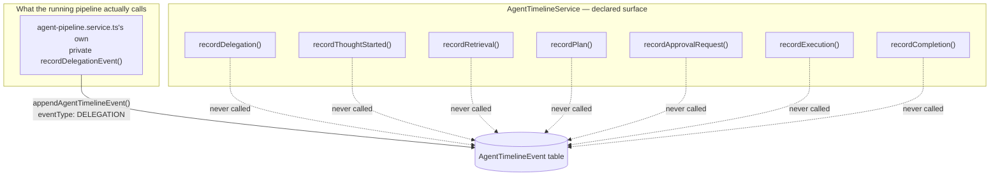

# Agent-to-Agent Communication

## Scope

Agent-to-agent communication is deliberately not free-form prose passed around in application state.
`apps/web/features/agents/lib/agent-message.ts`'s own comment states the constraint the spec imposes
(`agent-message.ts:3-10`):

```ts
/**
 * Structured agent-to-agent communication (Phase 7 spec: "Agents never
 * exchange free-form prompts"). `AgentMessage` is a discriminated union
 * describing every shape one agent (or the pipeline) can hand another —
 * never persisted as-is; the `AgentTimelineEvent` it produces is what's
 * stored (see `agent-timeline.service.ts`), and only ever as a structured,
 * allowlisted DTO — never this message's raw text.
 */
```

This doc covers three layers of structure this discipline shows up in: `AgentMessage` (the
discriminated union describing what one agent hands another), `AgentStreamEvent` (what `think()`/
`handoff()` actually stream to a client), and `AgentTimelineEvent` (what gets durably persisted) — plus
a real, verifiable gap in how much of that third layer is actually wired up today.

## `AgentMessage`: the shape of what one agent can hand another

```ts
export type AgentMessage =
  | { type: 'Request'; fromAgentKey: string | null; content: string }
  | { type: 'Response'; fromAgentKey: string; content: string; citations?: BondCitation[] }
  | { type: 'Delegation'; fromAgentKey: string; toAgentKey: string; question: string; handoff: boolean }
  | { type: 'Observation'; fromAgentKey: string; summary: string; relatedEntityIds: string[] }
  | { type: 'Summary'; fromAgentKey: string; content: string; sourceAgentKeys: string[] }
  | { type: 'Plan'; fromAgentKey: string; goalTitle: string; steps: string[] }
  | { type: 'Error'; fromAgentKey: string | null; message: string }
  | { type: 'ApprovalRequest'; fromAgentKey: string; planId: string; summary: string };
```
(`agent-message.ts:12-20`)

Each variant is a small, typed, named-field record — never an opaque string blob one agent hands
another to interpret however it likes. `Request`/`Response` map to a plain turn; `Delegation` is the
structured form of what a `<<DELEGATE:...>>` marker parses into (see [delegation.md](./delegation.md));
`Observation` mirrors `AgentObservation` (see [insights.md](./insights.md)); `Summary` is what
`summarize()` reconciles into; `Plan` mirrors `AgentPlanStep[]` (see [base-agent.md](./base-agent.md));
`Error` is a typed failure; `ApprovalRequest` mirrors the shape `proposeAction` returns when an
`<<ACTION:...>>` marker fires (see [overview.md](./overview.md)).

`AgentMessage` is important as a *type* — it names every shape communication in this feature can take —
but it is not itself a wire format or a database table. It is "never persisted as-is": what actually
gets streamed to a client is `AgentStreamEvent`, and what actually gets durably recorded is
`AgentTimelineEvent`. Both are covered below, and both intentionally carry less information than a full
`AgentMessage` would — a `Delegation` message's `question` field, for instance, is exactly the free
text this system allows (a single named field in a JSON payload), but even that is never written
verbatim into `AgentTimelineEvent.metadata`; only `{ toAgentKey, toAgentDisplayName, handoff }` is
(see below).

## `AgentStreamEvent`: what a client actually receives

```ts
/**
 * `think()`/`handoff()`'s streamed output — the agent-layer analogue of
 * `apps/web/features/bond/lib/stream-events.ts`'s `BondStreamEvent`. Kept as
 * a distinct type (not a reuse of `BondStreamEvent`) since it needs an
 * `agentKey` on every variant — which agent is actually speaking matters
 * once more than one agent can answer in a turn.
 */
export type AgentStreamEvent =
  | { type: 'status'; agentKey: string; stage: 'retrieving' | 'planning' | 'tool_call' | 'delegating' | 'generating'; detail?: Record<string, unknown> }
  | { type: 'token'; agentKey: string; text: string }
  | { type: 'citations'; agentKey: string; citations: BondCitation[] }
  | { type: 'suggestions'; agentKey: string; questions: string[] }
  | {
      type: 'done';
      agentKey: string;
      conversationId: string;
      messageId: string;
      model: string;
      tokenUsage: { promptTokens: number; completionTokens: number; totalTokens: number };
    }
  | {
      type: 'action_proposed';
      agentKey: string;
      conversationId: string;
      messageId: string;
      planId: string;
      summary: string;
      steps: Array<{ key: string; toolKey: string; displayName: string; summary: string }>;
      requiredRole: string;
      estimatedTimeMs: number;
      rollbackStrategy: string;
      expiresAt: string;
    }
  | { type: 'error'; agentKey: string | null; message: string };
```
(`agent-message.ts:22-55`)

Every variant carries `agentKey` — this is the field that lets a client render "Mr. Bond is thinking…"
and then, mid-turn, "Project Agent is answering…" once a handoff happens, since `runThinkLoop`'s
recursive `yield*` into a target agent's own `runThinkLoop` call naturally switches which `agentKey`
each subsequent event carries (see [routing.md](./routing.md) for the full handoff walkthrough). This
is a deliberately distinct type from Phase 5's `BondStreamEvent` for exactly that reason — a
single-agent pipeline never needed to say *which* agent was speaking, because there was only ever one.

`POST /api/agents/chat` streams these events directly over SSE, one `data: <json>\n\n` frame per event
— never wrapped in the standard `{success, data}` `ApiResponse` envelope the rest of this codebase's
JSON routes use (see [../api/agents.md](../api/agents.md)). `stage` on a `status` event tracks where in
`runThinkLoop` the turn currently is: `retrieving` (context-builder call), `planning` (the
`temperature: 0` tool/action/delegate decision call), `tool_call`/`delegating` (dispatching a parsed
marker), `generating` (the final streamed answer). `action_proposed` and `done` are the two possible
terminal events for a `persist: true` turn; a `persist: false` consult (`delegate()`) never emits
either — see [delegation.md](./delegation.md).

## `AgentTimelineEvent`: the durable, structured record

```prisma
/// The 7 structured event kinds an agent's Timeline records (spec: "store
/// structured events only, never chain-of-thought").
enum AgentEventType {
  THOUGHT_STARTED
  RETRIEVAL
  DELEGATION
  PLAN
  APPROVAL_REQUEST
  EXECUTION
  COMPLETION
}
```
(`packages/database/prisma/schema.prisma:1549-1559`)

```prisma
/// Immutable, append-only — mirrors `AuditEvent`/`TimelineEvent`'s "never
/// edited or deleted" convention. `metadata` is always an explicit,
/// allowlisted structured DTO per `eventType` (built in
/// AgentTimelineService) — deliberately never a raw prompt/completion
/// capture, which is what "never store chain-of-thought" means in practice.
/// Also powers the Delegation Graph UI (query eventType=DELEGATION for a
/// conversation) — no separate Delegation table needed.
model AgentTimelineEvent {
  id             String         @id @default(cuid())
  organizationId String
  agentId        String
  conversationId String?
  goalId         String?
  eventType      AgentEventType
  metadata       Json
  createdAt      DateTime       @default(now())

  organization Organization  @relation(fields: [organizationId], references: [id], onDelete: Cascade)
  agent        Agent         @relation(fields: [agentId], references: [id], onDelete: Restrict)
  conversation Conversation? @relation(fields: [conversationId], references: [id], onDelete: SetNull)

  @@index([organizationId])
  @@index([agentId])
  @@index([conversationId])
  @@map("agent_timeline_events")
}
```
(`schema.prisma:1672-1697`)

`AgentTimelineService`'s own comment states the discipline directly (`agent-timeline.service.ts:12-19`):

```ts
/**
 * Records and queries the immutable Agent Timeline (Phase 7 spec: "Store
 * structured events only. Never store chain-of-thought."). Every `record*`
 * method below builds an explicit, allowlisted metadata DTO — there is no
 * code path here that writes a raw prompt/completion string into
 * `metadata`. Also the sole source powering the Delegation Graph UI
 * (`eventType=DELEGATION`, see docs/delegation.md).
 */
```

Every `eventType` has its own allowlisted metadata interface (`agent-timeline.service.ts:21-55`):

```ts
export interface DelegationEventMetadata { toAgentKey: string; toAgentDisplayName: string; handoff: boolean; }
export interface PlanEventMetadata { planId: string; summary: string; requiredRole: string; }
export interface ExecutionEventMetadata { planId: string; status: string; }
export interface CompletionEventMetadata { durationMs: number; toolCallsUsed: number; }
export interface RetrievalEventMetadata { resultCount: number; }
export interface ThoughtStartedEventMetadata {
  /** Truncated to 200 chars — the same content already visible in the persisted `Message`, never internal reasoning. */
  inputPreview: string;
}
export interface ApprovalRequestEventMetadata { planId: string; requiredRole: string; }
```

Note even `ThoughtStartedEventMetadata.inputPreview` — the closest thing to "what did the user ask" in
this whole surface — is explicitly bounded to 200 characters and is the same content already visible in
the persisted chat `Message`, never a capture of the model's own internal reasoning. Nothing in this
service, or anywhere else in `apps/web/features/agents/`, writes a raw prompt or a raw model completion
into `AgentTimelineEvent.metadata`.

`resolveAgentId` (`agent-timeline.service.ts:60-71`) caches `agentKey@version → Agent.id` lookups
per-process and returns `undefined` (never throws) if the registry hasn't synced to the database yet —
"this is observability, never a gate on the delegation itself succeeding."

## A real, verifiable gap: only `DELEGATION` events are ever actually written

`AgentTimelineService` declares 7 public `record*` methods, one per `AgentEventType` value:
`recordDelegation`, `recordThoughtStarted`, `recordRetrieval`, `recordPlan`, `recordApprovalRequest`,
`recordExecution`, `recordCompletion` (`agent-timeline.service.ts:73-143`). Every one of them funnels
into the same private `append` helper, which is the only thing that actually calls the repository's
`appendAgentTimelineEvent`:

```ts
private async append(organizationId, agentKey, agentVersion, conversationId, eventType, metadata): Promise<void> {
  const agentId = await this.resolveAgentId(agentKey, agentVersion);
  if (!agentId) return;
  await appendAgentTimelineEvent({ organizationId, agentId, conversationId, eventType, metadata });
}
```
(`agent-timeline.service.ts:153-170`)

Grepping this codebase for every call site of these 7 methods, plus every call site of
`getAgentTimelineService()` (the only way to obtain an instance of this class), turns up exactly three
files:

```
apps/web/features/agents/services/agent-pipeline.service.ts
apps/web/features/agents/services/agent-timeline.service.ts   (the class's own definitions)
apps/web/app/api/agents/timeline/route.ts
```

`app/api/agents/timeline/route.ts` only ever calls `.list()` (`route.ts:12-17`):

```ts
export const GET = apiHandler(async (request) => {
  const organizationId = await requireActiveOrganizationId();
  const query = parseQueryParams(request, agentTimelineQuerySchema);
  const result = await getAgentTimelineService().list(organizationId, query);
  return apiSuccess(result);
});
```

And `agent-pipeline.service.ts` never calls any of the 7 `record*` methods on `AgentTimelineService`
either — it writes the one `DELEGATION` event it produces through a completely separate, private helper
of its own, `recordDelegationEvent` (`agent-pipeline.service.ts:105-129`), which calls the raw
repository function `appendAgentTimelineEvent` **directly**, bypassing `AgentTimelineService` entirely:

```ts
async function recordDelegationEvent(ctx, from, to, handoff): Promise<void> {
  const fromAgent = await getAgentByKey(from.agentKey, from.version);
  if (!fromAgent) return;
  await appendAgentTimelineEvent({
    organizationId: ctx.organizationId,
    agentId: fromAgent.id,
    conversationId: ctx.conversationId,
    eventType: 'DELEGATION',
    metadata: { toAgentKey: to.agentKey, toAgentDisplayName: to.displayName, handoff },
  });
}
```

Confirmed by grepping every call site of `appendAgentTimelineEvent` (the repository function) across
this codebase: it is called from exactly two places — `agent-timeline.service.ts`'s own private
`append` (itself only reached by the 7 unused `record*` methods), and `agent-pipeline.service.ts:122`
above.

**The upshot: in practice, `THOUGHT_STARTED`, `RETRIEVAL`, `PLAN`, `APPROVAL_REQUEST`, `EXECUTION`, and
`COMPLETION` events are never written by anything today — only `DELEGATION` events actually land in the
`AgentTimelineEvent` table**, and they land there through a code path that doesn't even use
`AgentTimelineService`'s own `recordDelegation` method. The `AgentTimelineService` class's 6 other
`record*` methods, their metadata interfaces, and the corresponding `AgentEventType` enum values are
all real, well-typed, and would work correctly if called — they are simply never invoked by anything in
the running pipeline. This is dead code that compiles and would pass a type-check, not a stub or a
`TODO` — the kind of gap that is only visible by tracing actual call sites, which is exactly what this
section did.



This matters for anyone consuming `GET /api/agents/timeline` expecting a full picture of an agent's
turn: querying without an `eventType` filter today returns only `DELEGATION` rows, never a
`THOUGHT_STARTED`/`RETRIEVAL`/`PLAN`/`EXECUTION`/`COMPLETION` trail alongside them, regardless of how
many turns, tool calls, or action proposals actually happened. The Delegation Graph UI, which
specifically filters to `eventType=DELEGATION`, is unaffected by this gap — it is the one event type
that does work end-to-end.

## `GET /api/agents/timeline`

File: `apps/web/app/api/agents/timeline/route.ts`. Query — `agentTimelineQuerySchema`
(`packages/shared/src/schemas/agents.ts:72-77`):

```ts
export const AGENT_EVENT_TYPES = ['THOUGHT_STARTED', 'RETRIEVAL', 'DELEGATION', 'PLAN', 'APPROVAL_REQUEST', 'EXECUTION', 'COMPLETION'] as const;
export const agentTimelineQuerySchema = paginationQuerySchema.pick({ page: true, pageSize: true }).extend({
  conversationId: z.string().min(1).optional(),
  agentId: z.string().min(1).optional(),
  eventType: agentEventTypeSchema.optional(),
});
```

The route's own comment flags it as "not in the original spec's enumerated endpoint list, but
required" — it's what the Delegation Graph UI queries with `eventType=DELEGATION`. Response:
`PaginatedResult<AgentTimelineEventItem>`.

## The other structured records this feature writes

Two sibling models follow the identical "structured, allowlisted, never raw text" discipline, covered
in their own docs:

- **`GoalStep.output`** ([goals.md](./goals.md)) — `{ planSteps }`, `{ observations }`,
  `{ suggestion, truncated }`, or `{ note }` depending on phase; never a transcript of the `think()`
  loop's internal tool calls/delegations.
- **`Insight`** ([insights.md](./insights.md)) — `type`/`title`/`description`/`relatedEntityIds` are
  explicit fields a caller supplies deliberately; `record()`'s `insight.created` event payload is
  itself a small allowlisted object (`{ insightId, agentKey, type, title }`), not the insight's full
  `description`.

## What this does NOT do

- **No free-form prompts between agents.** The `question` string in a `<<DELEGATE:...>>` payload or a
  direct `delegate()`/`handoff()` call is the closest thing to free text this system has, and even that
  is structured as a single named field in a JSON payload, never interpolated into a larger opaque blob
  before being recorded. See [delegation.md](./delegation.md).
- **No raw prompt/completion capture anywhere.** Not in `AgentTimelineEvent.metadata`, not in
  `GoalStep.output`, not in `Insight`. Every one of these is an explicit, typed, bounded shape.
- **No full observability today, despite the schema supporting it.** As documented above, 6 of the 7
  `AgentEventType` values are declared and typed but never actually produced by the running pipeline —
  a consumer of `GET /api/agents/timeline` should not assume a complete `THOUGHT_STARTED → RETRIEVAL →
  PLAN → ... → COMPLETION` trail exists for any turn; only `DELEGATION` rows are reliably present, and
  only for turns that actually delegated.
- **No separate `Delegation` table.** `AgentTimelineEvent` with `eventType: 'DELEGATION'` is the entire
  record; there is no dedicated model for delegation history.

## Documentation index

- [overview.md](./overview.md) — the `AgentContext` every structured message ultimately travels
  alongside.
- [delegation.md](./delegation.md) — the `<<DELEGATE:...>>` marker `AgentMessage`'s `Delegation`
  variant mirrors, and the `DELEGATION` event this doc traces end-to-end.
- [routing.md](./routing.md) — the full `AgentStreamEvent` sequence a client sees during a routed turn.
- [goals.md](./goals.md) / [insights.md](./insights.md) — the two sibling "structured record, never raw
  text" models this feature also maintains.
- [../security/audit.md](../security/audit.md) — the codebase-wide "immutable, append-only,
  never-edited" convention `AgentTimelineEvent` follows, shared with `AuditEvent`/`TimelineEvent`.
