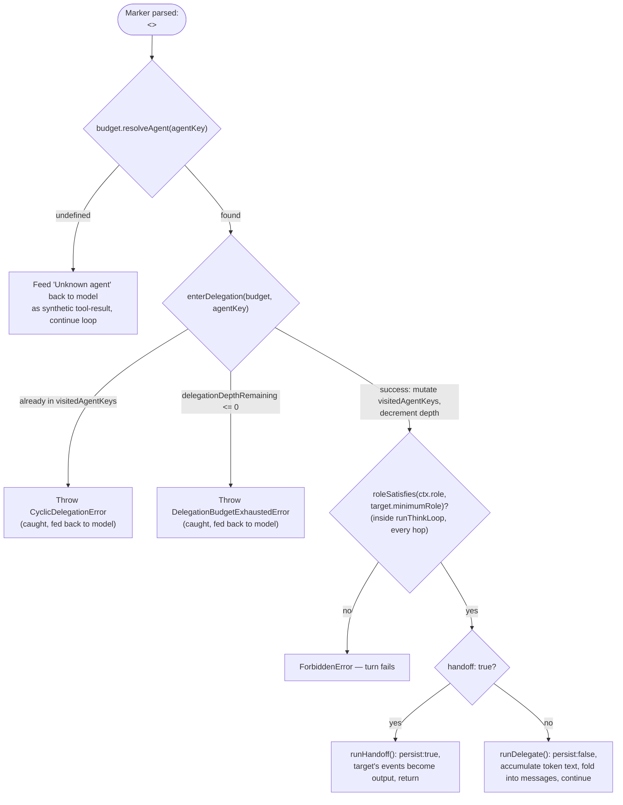

# Delegation & Handoff

## Scope

Agents consult and hand off to one another through one marker syntax and one shared budget object.
This doc covers the `<<DELEGATE:...>>` marker, the distinction between `delegate()` (consult) and
`handoff()` (transfer control), `DelegationBudget`'s cycle detection and depth accounting
(`apps/web/features/agents/lib/delegation-budget.ts`), the per-hop role re-check that closes a real
enforcement gap a naive implementation would have, `POST /api/agents/delegate`, and the three named
collaboration patterns — Sequential, Consensus, and Parallel — that `delegate()`/`summarize()` compose
into.

## The `<<DELEGATE:...>>` marker

Exactly like the `<<ACTION:...>>` and `<<TOOL:...>>` markers elsewhere in this codebase, a delegation
is a single-line marker an agent's planning turn can emit instead of a prose answer
(`agent-pipeline.service.ts:137-154`):

```ts
const DELEGATE_MARKER = /<<DELEGATE:([a-zA-Z0-9_]+)>>\s*(\{[^\n]*\})/;

function parseDelegateCall(text: string): ParsedDelegateCall | null {
  const match = DELEGATE_MARKER.exec(text);
  if (!match) return null;
  const [, agentKey, payloadJson] = match;
  try {
    const payload = JSON.parse(payloadJson!) as Record<string, unknown>;
    if (typeof payload.question !== 'string') return null;
    return { agentKey: agentKey!, question: payload.question, handoff: payload.handoff === true };
  } catch {
    return null;
  }
}
```

The prompt instructing the model how to emit it (`buildDelegateInstructions`,
`agent-pipeline.service.ts:93-103`) shows both forms:

```
To consult one and keep answering yourself, reply with ONLY one line: <<DELEGATE:agent_key>>{"question":"...","handoff":false}
To hand off the entire request (their answer becomes the final response), use the same form with "handoff":true.
```

A malformed marker — unparseable JSON, or a payload missing `question` — parses to `null` and is
treated as "no delegation," matching `parseToolCall`/`parseActionCall`'s existing fail-closed posture
in this codebase: the surrounding text falls through to being handled as prose rather than crashing
the turn.

### Mutual exclusion with `TOOL`/`ACTION` markers

A single planning turn's response can propose at most one thing — a tool call, a write action, or a
delegation, never a combination. `runThinkLoop` counts how many marker kinds parsed successfully out
of a single response and bails to a plain answer if more than one did (`agent-pipeline.service.ts:223-224`):

```ts
const markerKinds = [containsActionMarker(plan.content), containsDelegateMarker(plan.content), parseToolCall(plan.content) !== null].filter(Boolean).length;
if (markerKinds > 1) break; // more than one marker type present — malformed, fall through to a final prose answer
```

The prompt tells the model this directly ("Only one action/tool/delegate marker per turn — never
combine them"), but the check above is what actually enforces it — a model that violates the
instruction anyway produces a turn that answers in prose rather than one that non-deterministically
picks which marker to honor.

## `delegate()` vs. `handoff()`

Both take the same shape of arguments and both call `enterDelegation` before recursing, but they
differ in what happens to the target's output and whether the turn persists anything.

**`delegate()`** — consult, keep driving. `runDelegate` drains the target agent's own `think()` with
`persist: false`, accumulating only its `token` events into a plain string, and returns that string to
the caller (`agent-pipeline.service.ts:390-409`):

```ts
/** `BaseAgent.delegate()` — drains the target's `think()` (persist:false) and returns the accumulated text. Used directly (not via marker) for chained Sequential/Consensus collaboration. */
export async function runDelegate(caller, ctx, targetAgentKey, question, budget): Promise<string> {
  enterDelegation(budget, targetAgentKey);
  const targetAgent = budget.resolveAgent(targetAgentKey);
  if (!targetAgent) throw new Error(`Unknown agent "${targetAgentKey}".`);
  await recordDelegationEvent(ctx, caller.descriptor, targetAgent.descriptor, false);
  let answer = '';
  for await (const event of runThinkLoop(targetAgent, ctx, question, [], budget, { persist: false })) {
    if (event.type === 'token') answer += event.text;
  }
  return answer;
}
```

`persist: false` means the target's answer never becomes its own `Message` row, never emits
`citations`/`suggestions`/`done` events, and is never streamed to the client — `runThinkLoop`'s own
comment on the branch is explicit (`agent-pipeline.service.ts:342-347`): "A `delegate()` consult — the
caller already accumulated `token` events above. No `Message`, no citations/suggestions/done for an
answer the user never sees as its own turn." The caller (the delegating agent's own `think()` loop)
pushes the consult's question and answer back onto its own `messages` array as a synthetic
assistant/user exchange and continues its planning loop — the consult is an internal research step,
invisible to the end user except through whatever the delegating agent ultimately writes in its own
final answer.

**`handoff()`** — transfer full control. `runHandoff` recurses into the target's `think()` with
`persist: true` and yields its events directly as the remaining output of the current turn
(`agent-pipeline.service.ts:412-426`):

```ts
/** `BaseAgent.handoff()` — the target's own `think()` events (persist:true) become the caller's remaining output directly. */
export async function* runHandoff(caller, ctx, targetAgentKey, question, history, budget): AsyncGenerator<AgentStreamEvent> {
  enterDelegation(budget, targetAgentKey);
  const targetAgent = budget.resolveAgent(targetAgentKey);
  if (!targetAgent) throw new Error(`Unknown agent "${targetAgentKey}".`);
  await recordDelegationEvent(ctx, caller.descriptor, targetAgent.descriptor, true);
  yield* runThinkLoop(targetAgent, ctx, question, history, budget, { persist: true });
}
```

The target's own tokens stream to the client, its own `Message` gets persisted, its own
`citations`/`suggestions`/`done` events fire — from the client's perspective, the turn simply switches
which `agentKey` is speaking partway through. This is the mechanism behind routing itself (see
[routing.md](./routing.md)): the Coordinator handing off on its very first planning turn is not a
special case, it is `handoff()` called at the earliest possible point in a turn.

Both are also reachable from inside `runThinkLoop`'s own marker-dispatch branch (a delegation
triggered by the model mid-conversation, not called directly by other code) — the handoff arm returns
immediately, the consult arm folds the answer back into `messages` and `continue`s
(`agent-pipeline.service.ts:294-312`):

```ts
if (delegateCall.handoff) {
  yield { type: 'status', agentKey, stage: 'delegating', detail: { to: delegateCall.agentKey, handoff: true } };
  await recordDelegationEvent(ctx, descriptor, targetAgent.descriptor, true);
  yield* runThinkLoop(targetAgent, ctx, delegateCall.question, history, budget, options);
  return;
}

yield { type: 'status', agentKey, stage: 'delegating', detail: { to: delegateCall.agentKey, handoff: false } };
await recordDelegationEvent(ctx, descriptor, targetAgent.descriptor, false);
let consultAnswer = '';
for await (const event of runThinkLoop(targetAgent, ctx, delegateCall.question, [], budget, { persist: false })) {
  if (event.type === 'token') consultAnswer += event.text;
}
messages.push({ role: 'assistant', content: plan.content });
messages.push({ role: 'user', content: `${targetAgent.descriptor.displayName}'s answer:\n${consultAnswer || '(no answer)'}` });
toolCallsUsed += 1;
budget.toolCallsRemaining -= 1;
continue;
```

## Cycle detection: why a depth counter alone isn't enough

`delegation-budget.ts`'s own doc comment states the exact failure mode a depth counter alone would
allow, and why `visitedAgentKeys` is the mechanism that actually closes it (`delegation-budget.ts:1-14`):

```ts
/**
 * Delegation/handoff safety (Phase 7). A depth counter alone only bounds
 * *termination*, not *waste* — A delegates to B, B delegates back to A,
 * ping-pongs forever inside one open SSE connection (no bytes flushed until
 * a final stream), burning the entire budget before failing with no
 * diagnosable error. `visitedAgentKeys` is the real cycle guard, checked
 * BEFORE every delegate/handoff call — mirroring `apps/web/features/planner/lib/dag.ts`'s
 * own `PlanGraphError` cycle detection (throws immediately on a cycle,
 * doesn't just bound iteration). The depth counter is the backstop for
 * long-but-acyclic chains. Both `toolCallsRemaining` and
 * `delegationDepthRemaining` are DECREMENTED through every recursive call,
 * never reset per hop — otherwise a delegation tree's total LLM-call count
 * scales multiplicatively with depth.
 */
```

Concretely: if the only safeguard were "stop after N hops," an A→B→A→B… cycle would still run N full
`generate()` calls — each one a real LLM round-trip — before finally erroring out, and the error at
the end (`DelegationBudgetExhaustedError`) wouldn't tell anyone that the *reason* the budget ran out
was a two-agent ping-pong rather than N legitimately different specialists being consulted in
sequence. A depth counter answers "will this eventually stop?" but not "is this repeating something it
has already done?" — those are different questions, and only the second one catches a cycle *before*
it burns through the budget's real LLM calls.

`visitedAgentKeys` is a `Set<string>` of every agent already in this turn's ancestor chain, checked
before a call is ever attempted (`delegation-budget.ts:16-81`):

```ts
export class CyclicDelegationError extends Error {
  constructor(agentKey: string, chain: readonly string[]) {
    super(`Cyclic delegation detected: "${agentKey}" is already in this turn's delegation chain (${chain.join(' -> ')}).`);
    this.name = 'CyclicDelegationError';
  }
}

export class DelegationBudgetExhaustedError extends Error {
  constructor() {
    super('Maximum delegation depth reached for this turn.');
    this.name = 'DelegationBudgetExhaustedError';
  }
}

export interface DelegationBudget {
  toolCallsRemaining: number;
  delegationDepthRemaining: number;
  visitedAgentKeys: Set<string>;
  resolveAgent: (agentKey: string) => AgentDefinition | undefined;
}

/**
 * Throws `CyclicDelegationError` if `targetAgentKey` is already in this
 * turn's ancestor chain, or `DelegationBudgetExhaustedError` if depth is
 * exhausted — call this BEFORE recursing into `runAgentPipeline` for the
 * target, never after. Mutates `budget` (adds the target to
 * `visitedAgentKeys`, decrements `delegationDepthRemaining`) only on
 * success, so a caught/handled error leaves the budget consistent for a
 * caller that wants to try a different agent instead.
 */
export function enterDelegation(budget: DelegationBudget, targetAgentKey: string): void {
  if (budget.visitedAgentKeys.has(targetAgentKey)) {
    throw new CyclicDelegationError(targetAgentKey, Array.from(budget.visitedAgentKeys));
  }
  if (budget.delegationDepthRemaining <= 0) {
    throw new DelegationBudgetExhaustedError();
  }
  budget.visitedAgentKeys.add(targetAgentKey);
  budget.delegationDepthRemaining -= 1;
}
```

A cycle throws immediately — zero extra LLM calls spent discovering it — the same posture
`computeLayers`'s `PlanGraphError` takes on a `dependsOn` cycle in the Plan Graph: fail fast and loud,
don't just bound iteration and let it run anyway. `enterDelegation` only mutates `budget` on the
success path, so `runThinkLoop`'s own `try`/`catch` around a marker-triggered delegation attempt can
catch `CyclicDelegationError`/`DelegationBudgetExhaustedError`, tell the model what went wrong, and let
it try a different agent (or answer from what it already knows) with the budget left exactly as it was
before the failed attempt (`agent-pipeline.service.ts:265-292`):

```ts
// Resolve existence BEFORE enterDelegation — a hallucinated/nonexistent
// agent key must not consume real delegation-depth budget.
const targetAgent = budget.resolveAgent(delegateCall.agentKey);
if (!targetAgent) {
  messages.push({ role: 'assistant', content: plan.content });
  messages.push({ role: 'user', content: `Delegation failed: Unknown agent "${delegateCall.agentKey}". Answer using what you already know instead.` });
  toolCallsUsed += 1;
  budget.toolCallsRemaining -= 1;
  continue;
}

try {
  enterDelegation(budget, delegateCall.agentKey);
} catch (error) {
  const message = error instanceof Error ? error.message : 'Delegation failed.';
  messages.push({ role: 'assistant', content: plan.content });
  messages.push({ role: 'user', content: `Delegation failed: ${message}. Answer using what you already know instead.` });
  toolCallsUsed += 1;
  budget.toolCallsRemaining -= 1;
  continue;
}
```

Note the ordering: existence is checked (via `budget.resolveAgent`) *before* `enterDelegation` is ever
called, specifically so a hallucinated or nonexistent agent key never consumes real delegation-depth
budget — `enterDelegation` mutates `visitedAgentKeys`/`delegationDepthRemaining` on success, and that
mutation is reserved for genuine hops.



## The shared `DelegationBudget`: threaded, not recreated

A fresh budget is only ever created once per top-level turn — `createRootDelegationBudget`
(`apps/web/features/agents/lib/context.ts:44-49`) seeds `visitedAgentKeys` with the root agent's own
key (so the root can never delegate back to itself) and pulls its numeric limits from environment
config:

```ts
export function createRootDelegationBudget(rootAgentKey: string): DelegationBudget {
  const env = getEnv();
  return createDelegationBudget(env.BOND_MAX_TOOL_CALLS, env.AGENT_MAX_DELEGATION_DEPTH, rootAgentKey, (agentKey) =>
    getAgentRegistry().get(agentKey),
  );
}
```

```ts
// packages/shared/src/env.ts
BOND_MAX_TOOL_CALLS: z.coerce.number().int().min(0).max(10).default(3),          // line 79
AGENT_MAX_DELEGATION_DEPTH: z.coerce.number().int().min(0).max(10).default(3),   // line 89, "the depth backstop on top of visitedAgentKeys' own cycle detection"
```

From there, the exact same `budget` object is passed down through every recursive `think()`/
`delegate()`/`handoff()` call for the rest of that turn — `runDelegate`/`runHandoff` never call
`createDelegationBudget` themselves, only `enterDelegation(budget, ...)` on the one they were handed.
This is what makes `toolCallsRemaining`/`delegationDepthRemaining` decrement cumulatively across an
entire delegation tree rather than resetting per hop: a 5-hop-deep chain and a 5-agent-wide fan-out
both draw from the same finite pool, so neither shape lets a turn's total LLM-call count scale
multiplicatively with how deep or wide it delegates. Budgets never cross turns —
`createRootDelegationBudget` is called fresh by `agent-chat.service.ts`, `GoalService.advance`'s
`SUGGEST` phase (see [goals.md](./goals.md)), and `agent-delegate.service.ts`'s standalone call (below)
— nothing persists `visitedAgentKeys` or remaining depth/tool-call counts across turns.

## The Phase 7 enforcement fix: role is re-checked on every hop, not just the first

A subtle correctness gap a naive implementation of delegation would have: check the caller's role once
at the top of the turn, then let every delegation hop after that run unchecked. `runThinkLoop` closes
this explicitly — the very first thing every call to it does, on every hop, is re-verify the caller's
role against **that specific agent's** `minimumRole` (`agent-pipeline.service.ts:169,174-182`):

```ts
await requireRole(ctx.organizationId, ROLES.MEMBER);
...
// The single choke point every entry point (top-level chat, delegate,
// handoff, a Goal's SUGGEST phase) funnels through — `ctx.role` is the
// caller's real membership role, resolved once at the top of the turn and
// threaded unchanged through every recursive call, so a target agent with
// a stricter `minimumRole` than the chain's root agent is enforced on
// every hop, not just the first.
if (!roleSatisfies(ctx.role, descriptor.minimumRole)) {
  throw new ForbiddenError(`${descriptor.displayName} requires the ${descriptor.minimumRole} role or higher.`);
}
```

Because `runHandoff`/`runDelegate` both recurse straight back into `runThinkLoop` for the target agent
(`yield* runThinkLoop(targetAgent, ...)` / `for await (... runThinkLoop(targetAgent, ...))`), this
check runs again for the target, with the target's own `descriptor.minimumRole` — not the root agent's.
`ctx.role` itself is resolved exactly once, at the very top of the turn (from the caller's real
`Membership.role`, via `buildAgentContext`), and threaded unchanged through every recursive call — a
user's role cannot change mid-turn, but which agent's `minimumRole` gate applies to that unchanged role
absolutely can, hop to hop.

Concretely, this matters the moment any agent in the registry declares a `minimumRole` stricter than
`MEMBER` (today, all six declare `MEMBER` — see [registry.md](./registry.md) — so this check is not
yet load-bearing in practice, but it is exercised on literally every hop of every delegation chain that
runs today, and is what would immediately stop a `MEMBER`-level user's turn from silently reaching a
hypothetical future `ADMIN`-only specialist through a chain of consults/handoffs that started at a
`MEMBER`-accessible Coordinator). Without this per-hop re-check, only the entry point's role would ever
be validated, and a multi-hop delegation chain would have no way to enforce a stricter downstream
agent's own role floor — exactly the kind of gap a single top-level `requireRole` call, checked once
and never again, would silently reintroduce.

## Recorded, not stored as chain-of-thought

Every successful delegation — via marker or via a direct `delegate()`/`handoff()` call — appends one
`AgentTimelineEvent` (`eventType: 'DELEGATION'`) through `recordDelegationEvent`, a structured,
allowlisted metadata object, best-effort (`agent-pipeline.service.ts:105-129`):

```ts
async function recordDelegationEvent(ctx, from, to, handoff): Promise<void> {
  const fromAgent = await getAgentByKey(from.agentKey, from.version);
  if (!fromAgent) return;
  await appendAgentTimelineEvent({
    organizationId: ctx.organizationId,
    agentId: fromAgent.id,
    conversationId: ctx.conversationId,
    eventType: 'DELEGATION',
    metadata: { toAgentKey: to.agentKey, toAgentDisplayName: to.displayName, handoff },
  });
}
```

This is also the sole source powering the Delegation Graph UI (query `eventType=DELEGATION` via
`GET /api/agents/timeline`) — no separate `Delegation` table exists; `AgentTimelineEvent.metadata` for
this event type is the entire record. `recordDelegationEvent` resolves `agentId` via the plain
`getAgentByKey` *repository* function, not the registry/container, carrying no circular-import risk the
way importing `agents/registry.ts` into `agent-pipeline.service.ts` would; it silently no-ops if the
agent hasn't been synced to the database yet, since this is observability, never a gate on the
delegation itself succeeding. See [communication.md](./communication.md) for the full
`AgentTimelineEvent` picture, including the gap where every other event type's `record*` method is
never actually called.

## `POST /api/agents/delegate` — explicit, standalone one-hop calls

File: `apps/web/app/api/agents/delegate/route.ts`. Auth: `assertSameOrigin` + `requireAuth()` +
`requireActiveOrganizationId()`, plus the service's own `requireRole(organizationId, ROLES.MEMBER)`.
Body — `delegateRequestSchema` (`packages/shared/src/schemas/agents.ts:16-23`):

```ts
export const delegateRequestSchema = z.object({
  fromAgentKey: z.string().min(1),
  toAgentKey: z.string().min(1),
  message: z.string().trim().min(1).max(8000),
  handoff: z.boolean().default(false),
  conversationId: z.string().min(1).optional(),
});
```

`runDelegateRequestService` (`apps/web/features/agents/services/agent-delegate.service.ts:24-55`)
builds a **fresh** root `DelegationBudget` seeded with `fromAgentKey` — not a shared one from some
other in-flight turn — since this is a standalone one-hop call, not a continuation of an existing
conversation's budget:

```ts
const ctx = await buildAgentContext({ organizationId, userId, conversationId: input.conversationId, role: membership.role, agent: fromAgent });
const budget = createRootDelegationBudget(fromAgent.descriptor.agentKey);

if (input.handoff) {
  let answer = '';
  for await (const event of fromAgent.handoff(ctx, input.toAgentKey, input.message, [], budget)) {
    if (event.type === 'token') answer += event.text;
  }
  return { fromAgentKey: input.fromAgentKey, toAgentKey: input.toAgentKey, handoff: true, answer };
}

const answer = await fromAgent.delegate(ctx, input.toAgentKey, input.message, budget);
return { fromAgentKey: input.fromAgentKey, toAgentKey: input.toAgentKey, handoff: false, answer };
```

This is an explicit admin/debug invocation of a single delegation hop — also what the Delegation
Graph UI's "replay" affordance calls. `AgentTimelineEvent`/`Message` side effects are whatever
`delegate()`/`handoff()` already produce; this service adds no persistence of its own.

## Collaboration patterns: Sequential, Consensus, Parallel

There are exactly two runtime primitives — `delegate()` and `summarize()` — and no dedicated "run this
pattern" function for any of the three named patterns; each pattern is a way the *calling* code (an
agent's own `think()` loop today; a future orchestrator tomorrow) composes those two primitives, not a
separate code path with its own cycle/budget handling.

**Sequential** — a chain of `delegate()` calls, each awaited before the next begins, where a later
call's `question` can incorporate an earlier call's answer. `runDelegate`'s own comment names this
directly: "Used directly (not via marker) for chained Sequential/Consensus collaboration." Example: a
user asks the Coordinator "What's blocking the Acme project, and does the customer know about the
delay?" — the Coordinator consults Project Agent first (`delegate()`, `handoff: false`) to learn
what's blocking the project, folds that answer into its own `messages`, then consults Sales Agent with
a question informed by what Project Agent said. This is exactly the shape `runThinkLoop`'s own consult
branch already produces when a model chooses to consult more than one agent across successive planning
iterations of the same turn.

**Consensus** — also built from chained `delegate()` calls, but aimed at reconciliation rather than
research: multiple specialists are asked (in sequence or, see Parallel below, concurrently) and their
answers are fed into `summarize()`, whose own comment states the goal explicitly: "A real LLM synthesis
call reconciling multiple agents' answers (Consensus/Parallel) — explicitly surfaces disagreement
rather than silently favoring whichever answered last" (`agent-pipeline.service.ts:429-453`):

```ts
export async function runSummarize(ctx: AgentContext, pieces: Array<{ agentKey: string; content: string }>): Promise<string> {
  await requireRole(ctx.organizationId, ROLES.MEMBER);
  if (pieces.length === 0) return '';
  if (pieces.length === 1) return pieces[0]!.content;

  const config = await resolveEffectiveAiConfigService(ctx.organizationId);
  const provider = getAIProviderById(config.providerId);
  const sections = pieces.map((piece) => `--- ${piece.agentKey} ---\n${piece.content}`).join('\n\n');
  const result = await provider.generate({
    model: config.model,
    temperature: config.temperature,
    maxTokens: config.maxTokens,
    messages: [
      { role: 'system', content: 'Reconcile the following specialist answers into one coherent response. If they disagree or one flags a concern with another\'s assumptions, say so explicitly rather than silently picking one. Do not invent a confidence score.' },
      { role: 'user', content: sections },
    ],
  });
  return result.content;
}
```

Example: "Are we in good shape to close out Q3?" touches Project (delivery status), Sales
(pipeline/revenue), and Finance (budget/forecast) all at once. If Sales says the pipeline looks healthy
but Finance flags the budget is over, the reconciled answer says so rather than presenting one
optimistic view.

**Parallel** — the same two primitives, but the individual `delegate()` calls are issued *concurrently*
rather than one after another (e.g. `Promise.all([agentA.delegate(...), agentB.delegate(...)])` against
the shared `budget`), fanning out to several specialists on the same question at once, then fanning back
in through one `summarize()` call over every result. This is a *topology* distinction from
Sequential/Consensus, not a different mechanism: both end at `summarize()`; Parallel just doesn't pay
the latency cost of awaiting each specialist one at a time when their answers don't actually depend on
each other. Sharing one mutable `budget` object across concurrent calls is safe because
`enterDelegation`'s check-then-mutate is synchronous — it runs to completion before either concurrent
call's next `await`, so two concurrent calls can never interleave mid-check the way a naive
depth-counter-only guard sharing state across true parallelism might.

`DelegationBudget`'s cycle/depth accounting applies identically regardless of which pattern the
calling code assembles — `visitedAgentKeys` still prevents a Sequential chain from looping back through
an agent it already consulted this turn, and the same shared `budget` object is safe to read/mutate
from concurrent Parallel calls for the reason above.

## What this does NOT do

- **No free-form prompts between agents.** `agent-message.ts`'s own comment states the constraint
  directly ("Agents never exchange free-form prompts") — the `question` string in a `<<DELEGATE:...>>`
  payload or a direct `delegate()`/`handoff()` call is the closest thing to free text this system has,
  and even that is structured as a single named field in a JSON payload, never interpolated into a
  larger opaque blob before being recorded. Full picture in [communication.md](./communication.md).
- **No named `runSequential`/`runConsensus`/`runParallel` function.** All three collaboration patterns
  above are compositions of `delegate()` and `summarize()` by calling code — there is no third code
  path with independent cycle/budget-safety logic to keep in sync with `runDelegate`/`runHandoff`.
- **No cross-turn or cross-conversation budget.** `createRootDelegationBudget` builds a brand-new
  budget for every top-level turn — nothing persists `visitedAgentKeys` or remaining depth/tool-call
  counts across turns.
- **No delegation to an unregistered or unknown agent.** `resolveAgent` returning `undefined` throws a
  plain `Error` immediately (`runDelegate`/`runHandoff`'s `if (!targetAgent) throw ...`), which
  `runThinkLoop`'s marker-dispatch `catch` surfaces to the model the same way a cyclic/exhausted budget
  error does.

## Documentation index

- [overview.md](./overview.md) — routing as a turn-1 handoff, the write boundary every
  delegated/handed-off agent still respects.
- [base-agent.md](./base-agent.md) — the module-boundary reasoning `delegation-budget.ts`'s
  `resolveAgent` comment refers to, and why it can't just import the registry itself.
- [registry.md](./registry.md) — the registry `resolveAgent`/`availableAgents` are ultimately resolved
  against.
- [routing.md](./routing.md) — the request-entry side of the same marker/handoff mechanism.
- [communication.md](./communication.md) — `AgentTimelineEvent`'s `DELEGATION` type and the gap where
  the other 6 event types are never actually written.
- [../workflows/workflow-engine.md](../workflows/workflow-engine.md) — `workflow-dispatch-budget.ts`,
  the direct sibling of `delegation-budget.ts` for workflow dispatch instead of agent delegation.
