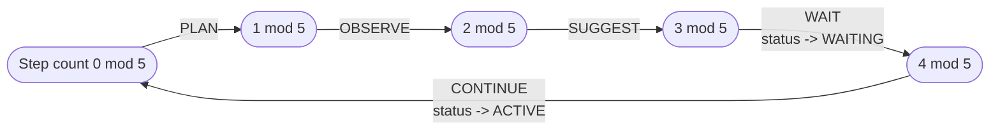

# Long-Running Goals

## Scope

`apps/web/features/agents/services/goal.service.ts`'s own doc comment states the spec requirement and
the resulting invocation model in one breath (`goal.service.ts:22-29`):

```ts
/**
 * Long-running Goals (Phase 7 spec: "Plan -> Observe -> Suggest -> Wait ->
 * Continue. Goals persist. No automatic execution."). `advance()` runs
 * exactly ONE more `GoalStep` and returns — it is only ever called from an
 * explicit trigger (a user visiting the Goal detail page, or an explicit
 * "Continue" button/API call), never a background loop: no scheduler
 * exists anywhere in this codebase to drive one.
 */
```

This doc covers the 5-phase cycle itself, the `AgentGoal`/`GoalStep` schema split, `GoalService`'s full
method surface, the `/api/agents/goals/**` routes, and why "explicitly invoked only" is not just a
design preference but a checkable fact about what does and doesn't exist in this codebase.

## The Plan/Observe/Suggest/Wait/Continue cycle

`GoalService.advance` runs exactly one phase per call, cycling through a fixed 5-phase template
(`goal.service.ts:31`):

```ts
const PHASE_CYCLE: GoalStepPhase[] = ['PLAN', 'OBSERVE', 'SUGGEST', 'WAIT', 'CONTINUE'];
```

```ts
async advance(id: string, organizationId: string, userId: string): Promise<GoalStepData> {
  const { membership } = await requireRole(organizationId, ROLES.MEMBER);

  const goal = await getAgentGoalById(id, organizationId);
  if (!goal) throw new NotFoundError('Goal not found.');
  if (goal.status === 'COMPLETED' || goal.status === 'CANCELLED') {
    throw new ValidationError(`Goal is ${goal.status.toLowerCase()} and cannot be advanced.`);
  }

  const registeredAgent = await getAgentById(goal.agentId);
  if (!registeredAgent) throw new NotFoundError('The agent that owns this goal is no longer registered.');
  const agent = getAgentRegistry().get(registeredAgent.agentKey, registeredAgent.version);
  if (!agent) throw new NotFoundError('The agent that owns this goal is no longer registered.');

  const priorSteps = await listGoalSteps(id);
  const phase = PHASE_CYCLE[priorSteps.length % PHASE_CYCLE.length]!;

  const output = await this.runPhase(phase, { organizationId, userId, conversationId: goal.conversationId ?? undefined, role: membership.role, agent }, goal.title);

  const step = await createGoalStep({ goalId: id, order: priorSteps.length, phase, output, triggeredBy: 'USER' });

  const nextStatus: GoalStatus = phase === 'WAIT' ? 'WAITING' : 'ACTIVE';
  await updateAgentGoalStatus(id, organizationId, { status: nextStatus });

  return step;
}
```
(`goal.service.ts:85-123`)

The phase for the *next* call is derived purely from how many `GoalStep` rows already exist —
`priorSteps.length % PHASE_CYCLE.length` — so the cycle is stateless in the sense that nothing on the
`AgentGoal` row itself tracks "which phase are we on"; it's recomputed from the step count every time,
and wraps around indefinitely (a goal that's been advanced 7 times is on its 3rd `SUGGEST`, i.e.
`PHASE_CYCLE[7 % 5] === PHASE_CYCLE[2] === 'SUGGEST'`).



Each phase's actual work, in the private `runPhase` (`goal.service.ts:135-171`):

- **`PLAN`** (no I/O) — returns `{ planSteps: agent.plan(goalTitle) }`, the owning agent's own `plan()`
  method (see [base-agent.md](./base-agent.md) — the fixed 5-phase template every agent inherits from
  `BaseAgent` unmodified). No LLM call, no data write beyond the `GoalStep` row itself.
- **`OBSERVE`** — calls the owning agent's real `observe(ctx)`, which is `observeForAgent`'s
  deterministic diff query against the organization timeline (see [insights.md](./insights.md)).
  Read-only.
- **`SUGGEST`** — the one phase that makes a real LLM call: it builds an `AgentContext`, a fresh root
  `DelegationBudget`, and drives the agent's own `think()` loop with a fixed prompt asking what it
  would suggest doing next, accumulating only the token text (`goal.service.ts:150-165`):

  ```ts
  if (phase === 'SUGGEST') {
    const ctx = await buildAgentContext(ctxInput);
    const budget = createRootDelegationBudget(ctxInput.agent.descriptor.agentKey);
    let suggestion = '';
    for await (const event of ctxInput.agent.think(ctx, `Given this goal ("${goalTitle}"), what would you suggest doing next?`, [], budget)) {
      if (event.type === 'token') suggestion += event.text;
    }
    const truncated = suggestion.length > MAX_SUGGESTION_LENGTH;
    return { suggestion: suggestion.slice(0, MAX_SUGGESTION_LENGTH), truncated };
  }
  ```

  `MAX_SUGGESTION_LENGTH = 8000` (`goal.service.ts:34`) — the same content bound
  `agentChatSchema.content` uses for a user turn. Because this runs through the real `think()` loop, the
  agent is free to consult a specialist (`delegate()`) or even propose a write action mid-suggestion the
  same as any other turn — but `SUGGEST` itself only ever *records* the resulting text as a
  `GoalStep.output`; it never acts on anything the agent proposed beyond persisting the
  plan/approval-request side effects `proposeAction` already produces on its own (see
  [overview.md](./overview.md)'s write-boundary section — a goal advancing through `SUGGEST` gets a
  proposed plan sitting `AWAITING_APPROVAL` exactly like any other agent turn would, never an executed
  one). Note also: a goal created without a `conversationId` never gets a persisted `Message` for this
  turn (per `runThinkLoop`'s own `if (ctx.conversationId)` guard), so `GoalStep.output` is the *only*
  surviving record of that `SUGGEST` call — the 8000-char cap keeps that surviving record bounded rather
  than an unbounded completion dump.
- **`WAIT` / `CONTINUE`** — deterministic, no LLM call, no data write beyond the step itself
  (`goal.service.ts:167-170`):

  ```ts
  // WAIT / CONTINUE — deterministic, no LLM call, no data write. "Goals
  // persist. No automatic execution" means these phases are checkpoints
  // for a human to act on, not steps that do something on their own.
  return { note: `${phase} — waiting for explicit user input before this goal advances further.` };
  ```

`WAIT` is also the one phase that changes the goal's own status: `advance()` sets `AgentGoal.status` to
`WAITING` specifically when the just-run phase was `WAIT`, `ACTIVE` for every other phase — `WAITING`
is the visible signal, on the goal itself, that the cycle has reached its checkpoint and is sitting
idle until a human acts.

## `AgentGoal` vs. `GoalStep`: immutable definition, indexed history

```prisma
/// A long-running goal's immutable definition + current status only —
/// mirrors `ExecutionPlan`. The actual Plan/Observe/Suggest/Wait/Continue
/// history lives in `GoalStep` (its own indexed table), not embedded here as
/// a growing Json array — same "immutable definition vs. queryable,
/// accumulating history" split Phase 6 already used for
/// `ExecutionPlan`/`ExecutionStep`. "No automatic execution": `lastActivityAt`
/// only ever advances from an explicit user action (visiting the goal, an
/// explicit Continue click) — nothing in this codebase can set it on a timer.
model AgentGoal {
  id             String     @id @default(cuid())
  organizationId String
  agentId        String
  conversationId String?
  createdById    String?
  title          String
  originalPlan   Json
  status         GoalStatus @default(ACTIVE)
  lastActivityAt DateTime   @default(now())
  createdAt      DateTime   @default(now())
  updatedAt      DateTime   @updatedAt

  organization Organization  @relation(fields: [organizationId], references: [id], onDelete: Cascade)
  agent        Agent         @relation(fields: [agentId], references: [id], onDelete: Restrict)
  conversation Conversation? @relation(fields: [conversationId], references: [id], onDelete: SetNull)
  createdBy    User?         @relation("AgentGoalCreatedBy", fields: [createdById], references: [id], onDelete: SetNull)
  steps        GoalStep[]
  insights     Insight[]

  @@index([organizationId])
  @@index([organizationId, status])
  @@map("agent_goals")
}
```

```prisma
/// One row per Plan/Observe/Suggest/Wait/Continue phase actually run for a
/// goal. `output` is structured only (same discipline as
/// `AgentTimelineEvent.metadata`) — never a raw prompt/completion dump.
model GoalStep {
  id          String        @id @default(cuid())
  goalId      String
  order       Int
  phase       GoalStepPhase
  output      Json
  triggeredBy TriggeredBy   @default(USER)
  createdAt   DateTime      @default(now())

  goal AgentGoal @relation(fields: [goalId], references: [id], onDelete: Cascade)

  @@index([goalId, order])
  @@map("goal_steps")
}
```
(`packages/database/prisma/schema.prisma:1594-1643`)

```prisma
enum GoalStatus {
  ACTIVE
  WAITING
  COMPLETED
  CANCELLED
}

enum GoalStepPhase {
  PLAN
  OBSERVE
  SUGGEST
  WAIT
  CONTINUE
}
```
(`schema.prisma:1508-1521`)

`originalPlan` on `AgentGoal` is written exactly once, by `createGoal` (`agent.plan(input.title)`), and
never updated again — it's what the agent originally laid out, kept as a fixed reference point even as
real `GoalStep` rows accumulate a phase-by-phase history that may diverge from it (an `OBSERVE` step
can surface something the original plan didn't anticipate; the plan itself doesn't get rewritten to
match). This is the exact same reasoning `ExecutionPlan`/`ExecutionStep` used in Phase 6:
`ExecutionPlan.steps` is the plan as approved and never mutated afterward, while `ExecutionStep` rows
accumulate one-per-attempt runtime status. Embedding a growing history as a `Json[]` on `AgentGoal`
itself would mean every `advance()` call rewriting the whole row (lost-update risk under concurrent
advances, and an ever-growing column with no natural index), where `GoalStep`'s own
`@@index([goalId, order])` lets `listGoalSteps` fetch a goal's full ordered history as a normal indexed
query and lets `advance()` insert one new row rather than read-modify-write an existing one.

`output`'s "structured only" discipline mirrors `AgentTimelineEvent.metadata` (see
[communication.md](./communication.md)) — a `SUGGEST` step's output is `{ suggestion: string,
truncated: boolean }` (the accumulated final answer text, not a transcript of the `think()` loop's
internal tool calls/delegations that produced it), a `PLAN` step's is `{ planSteps: AgentPlanStep[] }`,
an `OBSERVE` step's is `{ observations: AgentObservation[] }`, and `WAIT`/`CONTINUE` steps' is a fixed
`{ note: string }` — every phase writes a small, predictable shape, never a raw prompt/completion
capture.

## `TriggeredBy`: `USER` today, `SYSTEM` reserved and unused

```prisma
/// SYSTEM is reserved and unused — no worker exists anywhere in this codebase
/// to ever set it (confirmed: no cron/scheduler/queue-consumer exists). Same
/// "prepare the interface, ship only the working half" pattern already used
/// by `Queue`/`Cache`. Every `GoalStep` today is `USER`-triggered.
enum TriggeredBy {
  USER
  SYSTEM
}
```
(`schema.prisma:1523-1530`)

`GoalService.advance` always passes `triggeredBy: 'USER'` — there is no other call site anywhere under
`apps/web` that creates a `GoalStep`. The `SYSTEM` value exists on the enum so a future background
driver could distinguish its own writes from a human's without a schema migration, but nothing in this
codebase produces one today.

## Explicitly invoked only, no background loop — and why that claim is checkable

The claim isn't just stated in a comment; it's a checkable property of the codebase. Searching this
entire codebase for any of the mechanisms a background poller/scheduler would need turns up nothing:

```
$ grep -rn "setInterval\|node-cron\|bullmq\|cron\." apps/web/features packages
(no matches)
```

There is no `node-cron` dependency, no `bullmq` (or any other job-queue) consumer loop, no
`setInterval`-based poller anywhere under `apps/web/features` or `packages`. `advance()`'s own doc
comment states the conclusion this search supports: "it is only ever called from an explicit trigger
(a user visiting the Goal detail page, or an explicit 'Continue' button/API call), never a background
loop: no scheduler exists anywhere in this codebase to drive one." `POST /api/agents/goals/[id]/continue`
is the one HTTP entry point that calls it (`apps/web/app/api/agents/goals/[id]/continue/route.ts:1-20`):

```ts
/** Runs exactly one more phase of the goal's cycle — never a background loop; only ever an explicit user trigger. */
export const POST = apiHandler<Context>(async (request, { params }) => {
  assertSameOrigin(request);
  const { user } = await requireAuth();
  const organizationId = await requireActiveOrganizationId();
  const { id } = await params;
  const step = await getGoalService().advance(id, organizationId, user.id);
  return apiSuccess(step);
});
```

A synchronous, single-request handler — there is no code path from an incoming request to a loop that
keeps calling `advance()` on its own. `AgentGoal.lastActivityAt`'s own schema comment states the same
invariant from the data side: "only ever advances from an explicit user action... nothing in this
codebase can set it on a timer." A goal sitting `WAITING` stays exactly as it is, indefinitely, until a
human calls `advance()` again — there is no expiry, no auto-continue, no retry. This is the same
"explicitly invoked, one step at a time, state persists" shape the Workflow Engine's run driver uses —
see [../workflows/workflow-engine.md](../workflows/workflow-engine.md).

## Goal lifecycle: `ACTIVE` / `WAITING` / `COMPLETED` / `CANCELLED`

`advance()` refuses to run against a terminal goal:

```ts
if (goal.status === 'COMPLETED' || goal.status === 'CANCELLED') {
  throw new ValidationError(`Goal is ${goal.status.toLowerCase()} and cannot be advanced.`);
}
```

`GoalService.complete`/`GoalService.cancel` (`goal.service.ts:125-133`) are the only two ways to reach
either terminal state — both a single `updateAgentGoalStatus` call, both requiring only `ROLES.MEMBER`,
both callable at any point in the cycle (there is no rule that a goal must reach `WAIT` before it can be
cancelled). Once `COMPLETED`/`CANCELLED`, a goal's `GoalStep` history remains queryable (`getGoal` still
returns `{ goal, steps }`) but the cycle itself is over.

## Creating a goal

```ts
async createGoal(organizationId: string, userId: string, input: { agentKey: string; title: string; conversationId?: string }): Promise<AgentGoalData> {
  await requireRole(organizationId, ROLES.MEMBER);
  const agent = getAgentRegistry().get(input.agentKey);
  if (!agent) throw new NotFoundError(`Unknown agent "${input.agentKey}".`);
  const registeredAgent = await getAgentByKey(input.agentKey, agent.descriptor.version);
  if (!registeredAgent) throw new NotFoundError(`Agent "${input.agentKey}" has not been synced to the database yet.`);
  return createAgentGoal({
    organizationId,
    agentId: registeredAgent.id,
    conversationId: input.conversationId ?? null,
    createdById: userId,
    title: input.title,
    originalPlan: agent.plan(input.title),
  });
}
```
(`goal.service.ts:37-58`)

Two lookups, not one: `getAgentRegistry().get(...)` resolves the live `AgentDefinition` (needed to call
its real `plan()` method), and `getAgentByKey(...)` resolves the corresponding `Agent` DB row (needed
for the foreign key `AgentGoal.agentId` requires). A goal can only be created for an agent that has
already been synced to the database (see [registry.md](./registry.md)) — the registry knowing about an
agent in-process isn't sufficient on its own, since `AgentGoal.agent` is a hard `onDelete: Restrict`
relation, not a nullable one.

## `GoalService`: full method surface

| Method | Role floor | Notes |
|---|---|---|
| `createGoal(organizationId, userId, { agentKey, title, conversationId? })` | MEMBER | Resolves agent from registry + DB, seeds `originalPlan` |
| `getGoal(id, organizationId)` | MEMBER | `NotFoundError` if missing; returns `{ goal, steps }` |
| `listGoals(organizationId, { page, pageSize, status? })` | MEMBER | Paginated |
| `advance(id, organizationId, userId)` | MEMBER | Runs exactly one more phase; `ValidationError` if terminal |
| `cancel(id, organizationId)` | MEMBER | → `CANCELLED`, callable from any non-terminal status |
| `complete(id, organizationId)` | MEMBER | → `COMPLETED`, callable from any non-terminal status |

## `/api/agents/goals/**`

| Route | Method | Body/Query | Response |
|---|---|---|---|
| `apps/web/app/api/agents/goals/route.ts` | GET | `goalListQuerySchema` = `{page,pageSize,status?}` | `PaginatedResult<AgentGoalData>` |
| `apps/web/app/api/agents/goals/route.ts` | POST | `createGoalSchema` = `{agentKey,title,conversationId?}` | 201, `AgentGoalData` |
| `apps/web/app/api/agents/goals/[id]/route.ts` | GET | — | `{ goal, steps }` |
| `apps/web/app/api/agents/goals/[id]/continue/route.ts` | POST | — | `GoalStepData` (the newly created step) |

`createGoalSchema` and `goalListQuerySchema` (`packages/shared/src/schemas/agents.ts:32-45`):

```ts
export const createGoalSchema = z.object({
  agentKey: z.string().min(1),
  title: z.string().trim().min(1).max(300),
  conversationId: z.string().min(1).optional(),
});

export const GOAL_STATUSES = ['ACTIVE', 'WAITING', 'COMPLETED', 'CANCELLED'] as const;
export const goalListQuerySchema = paginationQuerySchema.pick({ page: true, pageSize: true }).extend({
  status: goalStatusSchema.optional(),
});
```

There is no `PATCH /api/agents/goals/[id]` and no dedicated cancel/complete route — `cancel()`/
`complete()` exist on `GoalService` but are not wired to their own HTTP endpoints in the current route
tree; only `createGoal`, `getGoal`, `listGoals`, and `advance` are reachable via `/api/agents/goals/**`
today.

## What this does NOT do

- **No automatic execution of anything a `SUGGEST` phase proposes.** `SUGGEST`'s `think()` call can
  propose a write action exactly like any other turn, but the resulting `ExecutionPlan` sits
  `AWAITING_APPROVAL` under the unmodified Phase 6 chain (see [overview.md](./overview.md)) —
  `advance()` never itself calls `proposeAction`'s downstream approval/execution and never inspects
  whether the suggestion contained an action marker at all; it only records the accumulated text.
- **No background driver for `WAIT`/`CONTINUE`.** Both phases are deterministic placeholders whose
  entire job is to mark a checkpoint — see "Explicitly invoked only" above for the grep-checkable claim
  that nothing exists to drive a goal past one without a human.
- **No `SYSTEM`-triggered `GoalStep`.** `TriggeredBy.SYSTEM` is reserved on the enum for a future
  scheduler that does not exist in this codebase today.
- **No goal-level retry or timeout.** A goal that never gets a follow-up `advance()` call simply sits
  in whatever status it last reached — there is no `expiresAt` on `AgentGoal` the way there is on
  `ApprovalRequest` (see [../workflows/approvals.md](../workflows/approvals.md)), and no automatic
  cancellation of a long-idle goal.
- **No editing `originalPlan` after creation.** It is written once by `createGoal` and read-only from
  then on; a goal's evolving understanding lives entirely in its `GoalStep` history, never by mutating
  the original plan to match.

## Documentation index

- [overview.md](./overview.md) — the write boundary a `SUGGEST` phase's proposed action still respects.
- [base-agent.md](./base-agent.md) — `plan()`/`observe()`, the two SDK methods `runPhase` calls
  directly.
- [insights.md](./insights.md) — the Observation Engine `OBSERVE` calls into, and its own "explicitly
  invoked only, no background loop" reasoning (the same claim, made about a sibling engine).
- [registry.md](./registry.md) — why `createGoal` needs both a live `AgentDefinition` and a synced
  `Agent` DB row.
- [delegation.md](./delegation.md) — the fresh `DelegationBudget` a `SUGGEST` phase's `think()` call
  creates.
- [../workflows/approvals.md](../workflows/approvals.md) — the `ExecutionPlan`/`ExecutionStep` split
  this feature's `AgentGoal`/`GoalStep` split directly mirrors.
