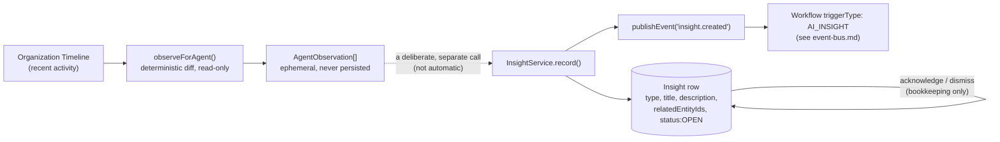

# The Insight Engine & Observation Engine

## Scope

`insight.service.ts`'s own doc comment states the spec requirement and the single mutation it allows
for in the same breath (`insight.service.ts:13-20`):

```ts
/**
 * The Insight Engine (Phase 7 spec: "Risks, Missing Information, Conflicts,
 * Duplicates, Recommendations... Never modify data"). This service has
 * exactly one write operation on domain-adjacent state — `status`
 * (acknowledge/dismiss) — and it is bookkeeping on the insight row itself,
 * never a change to a Project/Task/Customer/etc. There is no `record()`
 * call path anywhere that touches a domain table.
 */
export class InsightService {
```

This doc covers the 5 insight types, `InsightService`'s full method surface including the
`insight.created` event it publishes, why `status` acknowledge/dismiss doesn't need the Phase 6
approval chain, the `/api/agents/insights/**` routes, and the Observation Engine that feeds Goals and
an agent's own reasoning — a deterministic diff query, explicitly invoked, never a background poll.

## Insight types

```prisma
enum InsightType {
  RISK
  MISSING_INFO
  CONFLICT
  DUPLICATE
  RECOMMENDATION
}
```
(`packages/database/prisma/schema.prisma:1532-1538`)

These are the 5 categories the spec names — `RISK` (something looks likely to go wrong),
`MISSING_INFO` (a gap the agent noticed), `CONFLICT` (two pieces of information disagree), `DUPLICATE`
(likely-redundant data), `RECOMMENDATION` (a suggested next step) — stored as a plain enum column on
the `Insight` model, chosen by whatever caller records the insight (`InsightService.record`'s
`input.type`). Nothing in this feature auto-classifies free text into one of these 5 buckets; a caller
supplies the type explicitly along with `title`/`description`/`relatedEntityIds`.

## `Insight`: never modifies domain data

```prisma
/// An agent's observation, never a data mutation (spec: "Never modify
/// data"). `status` is the one field a user can change directly — it's
/// bookkeeping on the insight itself (acknowledge/dismiss), not a write to
/// any domain table, so it does not need to go through the Phase 6
/// Plan -> Approval -> Execution chain.
model Insight {
  id               String        @id @default(cuid())
  organizationId   String
  agentId          String
  goalId           String?
  type             InsightType
  title            String
  description      String
  relatedEntityIds Json
  status           InsightStatus @default(OPEN)
  createdAt        DateTime      @default(now())
  updatedAt        DateTime      @updatedAt

  organization Organization @relation(fields: [organizationId], references: [id], onDelete: Cascade)
  agent        Agent        @relation(fields: [agentId], references: [id], onDelete: Restrict)
  goal         AgentGoal?   @relation(fields: [goalId], references: [id], onDelete: SetNull)

  @@index([organizationId])
  @@index([organizationId, status])
  @@map("insights")
}

/// `OPEN` -> `ACKNOWLEDGED`/`DISMISSED` is bookkeeping on the insight row
/// itself, not domain data — it does not go through the Phase 6 approval
/// chain (see the model comment on `Insight`).
enum InsightStatus {
  OPEN
  ACKNOWLEDGED
  DISMISSED
}
```
(`schema.prisma:1540-1670`, model at `1650-1670`)

`InsightService` has exactly three write-shaped methods, and `record`/`acknowledge`/`dismiss` are the
entire mutation surface (`insight.service.ts:22-79`):

```ts
export class InsightService {
  async record(organizationId, agentKey, agentVersion, input): Promise<InsightData> {
    await requireRole(organizationId, ROLES.MEMBER);
    const registeredAgent = await getAgentByKey(agentKey, agentVersion);
    if (!registeredAgent) throw new NotFoundError(`Agent "${agentKey}" has not been synced to the database yet.`);

    const created = await createInsight({
      organizationId,
      agentId: registeredAgent.id,
      goalId: input.goalId ?? null,
      type: input.type,
      title: input.title,
      description: input.description,
      relatedEntityIds: input.relatedEntityIds,
    });

    const { publishEvent } = await import('@/features/workflows/services/event-bus.service');
    await publishEvent({
      organizationId,
      eventType: 'insight.created',
      source: 'AI_COPILOT',
      payload: { insightId: created.id, agentKey, type: created.type, title: created.title },
      entityType: 'INSIGHT',
      entityId: created.id,
    });

    return created;
  }

  async list(organizationId, filters): Promise<PaginatedResult<InsightData>> {
    await requireRole(organizationId, ROLES.MEMBER);
    return listInsights({ organizationId, ...filters });
  }

  async acknowledge(id: string, organizationId: string): Promise<void> {
    await requireRole(organizationId, ROLES.MEMBER);
    const updated = await updateInsightStatus(id, organizationId, 'ACKNOWLEDGED');
    if (!updated) throw new NotFoundError('Insight not found.');
  }

  async dismiss(id: string, organizationId: string): Promise<void> {
    await requireRole(organizationId, ROLES.MEMBER);
    const updated = await updateInsightStatus(id, organizationId, 'DISMISSED');
    if (!updated) throw new NotFoundError('Insight not found.');
  }
}
```

`record` inserts a new `Insight` row — it never touches a `Project`, `Task`, `Customer`, or any other
domain table; `relatedEntityIds` is just an array of ids the insight *references*, a pointer, not a
foreign-key write into whatever those ids belong to. `acknowledge`/`dismiss` both call the same
`updateInsightStatus` repository function against a single column on the `Insight` row itself. There is
no fourth method that edits `title`/`description`/`type`/`relatedEntityIds` after creation, and no
method anywhere in this service (or called by it) that writes to any table other than `insights`.

## The `insight.created` event

`record()`'s last act, after the `Insight` row is created, is to publish an `insight.created` event
onto the Event Bus (`insight.service.ts:43-55`):

```ts
// Dynamically imported, not statically — kept consistent with every other
// curated publishEvent() call site even though this specific file isn't on
// the Tool Registry's import chain today.
const { publishEvent } = await import('@/features/workflows/services/event-bus.service');
await publishEvent({
  organizationId,
  eventType: 'insight.created',
  source: 'AI_COPILOT',
  payload: { insightId: created.id, agentKey, type: created.type, title: created.title },
  entityType: 'INSIGHT',
  entityId: created.id,
});
```

The dynamic `import()` (rather than a static top-level import) is the same discipline every other
curated `publishEvent()` call site in this codebase uses. This is what lets a `WorkflowDefinition` with
`triggerType: 'AI_INSIGHT'` fire off a workflow run the moment an agent records a new insight — see
[../workflows/event-bus.md](../workflows/event-bus.md) for `mapEventTypeToTriggerType`'s
`insight.* → AI_INSIGHT` mapping and the full event-dispatch chain. Publishing this event is the entire
extent of `record()`'s reach outside the `insights` table — nothing about the event's own downstream
dispatch is something `InsightService` controls or waits on; `publishEvent` is fire-and-forget from
`record()`'s perspective (it's synchronous and in-process, but `record()` doesn't inspect what, if
anything, the event triggered).

## Why status acknowledge/dismiss doesn't need the Phase 6 approval chain

Phase 6's entire framework exists to gate *writes to domain data* — a `Project` created, a `Task`
updated, a project archived (see [../workflows/approvals.md](../workflows/approvals.md)) — behind an
explicit human approval, because those writes have real consequences for other users' data.
`Insight.status` fails every test that would make that gate necessary:

- **It isn't domain data.** Acknowledging or dismissing an insight changes nothing about the
  `Project`/`Customer`/whatever the insight's `relatedEntityIds` point at — those rows are completely
  untouched. The mutation is scoped to an `Insight` row's own bookkeeping column, the same way marking
  a notification "read" doesn't require approval even though a notification *references* real data.
- **It isn't reversible-with-consequence.** `OPEN → ACKNOWLEDGED`/`DISMISSED` has no `RollbackSupport`
  concept because there's nothing to roll back that anyone outside the acting user would notice —
  compare this to `archive_project`, which changes a `Project.status` every other org member observing
  that project would see. Acknowledging/dismissing an insight is visible only to the organization's own
  insight list, never to anyone as a change in their data.
- **A tool's `execute()` is the only thing Phase 6 gates, and `InsightService` isn't one.**
  `acknowledge`/`dismiss` aren't registered `ToolDefinition`s, don't appear in
  `apps/web/features/tools/registry.ts`'s `ALL_TOOLS`, and don't flow through `PlannerService`/
  `ApprovalService`/`ExecutionService` at all — they're a plain service method behind
  `requireRole(organizationId, ROLES.MEMBER)`, the same authorization floor every other read/light-write
  service call in this codebase uses, with no elevated role and no plan/approval step in between.

Put together: the Phase 6 approval chain gates *proposed changes to organizational data that other
people rely on*. `Insight.status` is neither — it's a personal, non-destructive, fully-scoped-to-itself
bookkeeping flag, so gating it behind a plan/approval/execution cycle would add process without
protecting anything real.

## `/api/agents/insights/**`

| Route | Method | Body/Query | Response |
|---|---|---|---|
| `apps/web/app/api/agents/insights/route.ts` | GET | `insightListQuerySchema` = `{page,pageSize,status?,agentId?}` | `PaginatedResult<InsightData>` |
| `apps/web/app/api/agents/insights/[id]/route.ts` | PATCH | `updateInsightStatusSchema` = `{status: 'ACKNOWLEDGED'\|'DISMISSED'}` | `{id, status}` |

`updateInsightStatusSchema` (`packages/shared/src/schemas/agents.ts:56-59`) deliberately excludes
`OPEN` as a settable value — `OPEN` is only ever the initial default, never something a caller sets it
back to. The PATCH route dispatches to `InsightService.acknowledge`/`.dismiss` based on `body.status`,
both throwing `NotFoundError` (404) if the insight doesn't exist. There is no dedicated `POST` route
for `record()` — recording an insight happens only from within agent code (an agent's own reasoning
during `think()`, or a Goal's phase logic — see below), never directly from an external HTTP caller.

## The Observation Engine: `observeForAgent`

```ts
/**
 * The Observation Engine (Phase 7 spec: "Agents observe... Observation
 * creates insights. Not actions."). A deterministic diff query — new/changed
 * activity since a timestamp — explicitly invoked (from an agent's own turn,
 * a Goal being advanced, or an explicit "Check for updates" action), NEVER
 * a background poll: no scheduler/cron exists anywhere in this codebase to
 * drive one, and building a poll loop with no caller would be dead code
 * that looks like it works.
 */

const DEFAULT_LOOKBACK_DAYS = 7;
const MAX_OBSERVATIONS = 20;

export async function observeForAgent(organizationId: string, descriptor: AgentDescriptor, since?: Date): Promise<AgentObservation[]> {
  const cutoff = since ?? new Date(Date.now() - DEFAULT_LOOKBACK_DAYS * 24 * 60 * 60 * 1000);
  const timeline = await getOrganizationTimeline({ organizationId, page: 1, pageSize: MAX_OBSERVATIONS });
  const recent = timeline.items.filter((event) => event.createdAt >= cutoff);
  return recent.map((event) => ({
    summary: `${event.entity.title}: ${event.description}`,
    relatedEntityIds: [event.entity.id],
  }));
}
```
(`apps/web/features/agents/services/observation.service.ts:7-38`)

**Deterministic diff query.** No LLM call, no embedding, no fuzzy matching — `observeForAgent` fetches
the organization's most recent `MAX_OBSERVATIONS` (20) timeline entries (see
[../knowledge/timeline.md](../knowledge/timeline.md)) and filters to whatever landed after `cutoff`, a
plain `createdAt >= cutoff` comparison. Two calls against the same organization with the same `since`
will return the same observations (modulo new activity happening in between) — this is a read, not a
generative summary.

**Lookback window.** `since`, when the caller supplies one (`BaseAgent.observe(ctx, since?)`'s own
optional parameter), is used as-is; when omitted, it defaults to `DEFAULT_LOOKBACK_DAYS` (7 days) back
from now. A goal that's never been observed before gets a full week of recent activity on its first
`OBSERVE` phase (see [goals.md](./goals.md)); a goal being observed repeatedly can pass its own
last-observed timestamp to get only what's new since then.

**Explicitly invoked only.** The doc comment names the call sites this function actually has:
`BaseAgent.observe()` (called from an agent's own `think()`/tool-dispatch flow, or directly by
`GoalService.runPhase`'s `OBSERVE` branch), and any future explicit "Check for updates" action. There
is no timer, no cron job, no queue consumer anywhere in this codebase that calls `observeForAgent` on
its own — the same grep-checkable claim [goals.md](./goals.md) makes about `advance()`:

```
$ grep -rn "setInterval\|node-cron\|bullmq\|cron\." apps/web/features packages
(no matches)
```

The comment is explicit about why this matters beyond "it happens to be true today": "building a poll
loop with no caller would be dead code that looks like it works" — a background poller with nothing
scheduling it would sit in the codebase implying a capability ("insights get generated automatically")
that doesn't actually exist, which is a worse failure mode than simply not having the poller at all.

**Org-wide, not yet filtered by domain.** `observeForAgent` takes `descriptor` (the calling agent's
`AgentDescriptor`) but does not currently use it to filter the timeline query to that agent's own
`supportedKnowledge` categories (`observation.service.ts:20-27`):

```ts
/**
 * The function `BaseAgent.observe()` calls directly — no dependency on the
 * agents DI container, see `base-agent.ts`'s module-boundary note. Org-wide
 * for now (not yet filtered by the calling agent's `supportedKnowledge`
 * category — a reasonable future refinement once there's real usage data
 * showing that's worth the added complexity; today it would just be a
 * fuzzy, unreliable entity-type guess dressed up as precision).
 */
```

Every agent's `observe()` today sees the same organization-wide recent activity — a Finance Agent and a
Project Agent calling `observe()` on the same organization at the same time get identical results, even
though most of what's returned may be irrelevant to either one's domain.

`ObservationService` (`observation.service.ts:41-46`) is the thin, container-managed wrapper other
callers (API routes, `GoalService`) actually use — it adds the same `requireRole` org-membership check
every other service in this codebase performs, on top of the module-level `observeForAgent` function
`BaseAgent.observe()` calls directly without going through the container (see
[base-agent.md](./base-agent.md)'s module-boundary note for why `base-agent.ts` can't import the
container).

## Observation creates insights, not actions

The Observation Engine's own comment names the spec line directly: "Observation creates insights. Not
actions." Nothing about `observeForAgent`'s return value — a plain array of `{ summary,
relatedEntityIds }` — automatically becomes an `Insight` row, and nothing about it can become an
`<<ACTION:...>>` proposal on its own. The two engines are related but distinct: an `AgentObservation` is
a raw, ephemeral fact about recent activity (returned from a function call, never itself persisted); an
`Insight` is a deliberately-recorded, typed, persisted judgment (`InsightService.record`) that some
caller — an agent's own reasoning during `think()`, or a Goal's `OBSERVE` phase output being reviewed —
chose to elevate into one of the 5 `InsightType`s. `GoalStep`'s `OBSERVE` output today is just
`{ observations }` — the raw list — recording it as an `Insight` (or several) is a decision this
feature leaves to whatever surface consumes that `GoalStep`, not something `observeForAgent` or
`GoalService.runPhase` does automatically.



## What this does NOT do

- **No write to any domain table, ever, from either engine.** `InsightService.record` writes exactly
  one row to `insights`; `observeForAgent` performs exactly one read against the organization timeline.
  Neither calls `proposeAction`, neither imports anything from `apps/web/features/execution/` or
  `apps/web/features/tools/`.
- **No background polling.** Covered in full above — no scheduler exists anywhere in this codebase to
  drive `observeForAgent` (or `GoalService.advance`) without an explicit human or in-flight-turn
  trigger.
- **No automatic insight generation from an observation.** An `AgentObservation` and an `Insight` are
  distinct types with no automatic conversion between them; recording an `Insight` from an observation
  is always a deliberate, separate call.
- **No `supportedKnowledge`-filtered observation query.** Covered above — every agent's `observe()`
  sees the same org-wide recent-activity window today; per-domain filtering is named explicitly as a
  future refinement, not a current gap being papered over.
- **No editing an insight's `title`/`description`/`type`/`relatedEntityIds` after creation.** The only
  mutation `InsightService` exposes post-creation is the `status` transition covered above.
- **No elevated role for acknowledge/dismiss.** Both require only `ROLES.MEMBER`, the same floor as
  `record`/`list` — there is no `ADMIN`-only insight-management tier the way `archive_project` needed
  one in Phase 6.

## Documentation index

- [goals.md](./goals.md) — the `OBSERVE` phase that calls `observeForAgent` as part of the Goal cycle,
  and the identical "explicitly invoked only, no background loop" reasoning applied to `advance()`.
- [overview.md](./overview.md) — the write boundary (`proposeAction`) that stays completely separate
  from either engine described here.
- [base-agent.md](./base-agent.md) — `observe()`'s place among the Agent SDK's 9 methods, and why
  `observeForAgent` is called directly rather than through the container.
- [communication.md](./communication.md) — the structured `metadata`/`output` discipline `Insight` and
  `GoalStep` both follow.
- [../workflows/event-bus.md](../workflows/event-bus.md) — the `insight.created` event and its
  `AI_INSIGHT` trigger-type mapping.
- [../workflows/approvals.md](../workflows/approvals.md) — the approval chain `Insight.status` is
  deliberately exempt from, and why.
