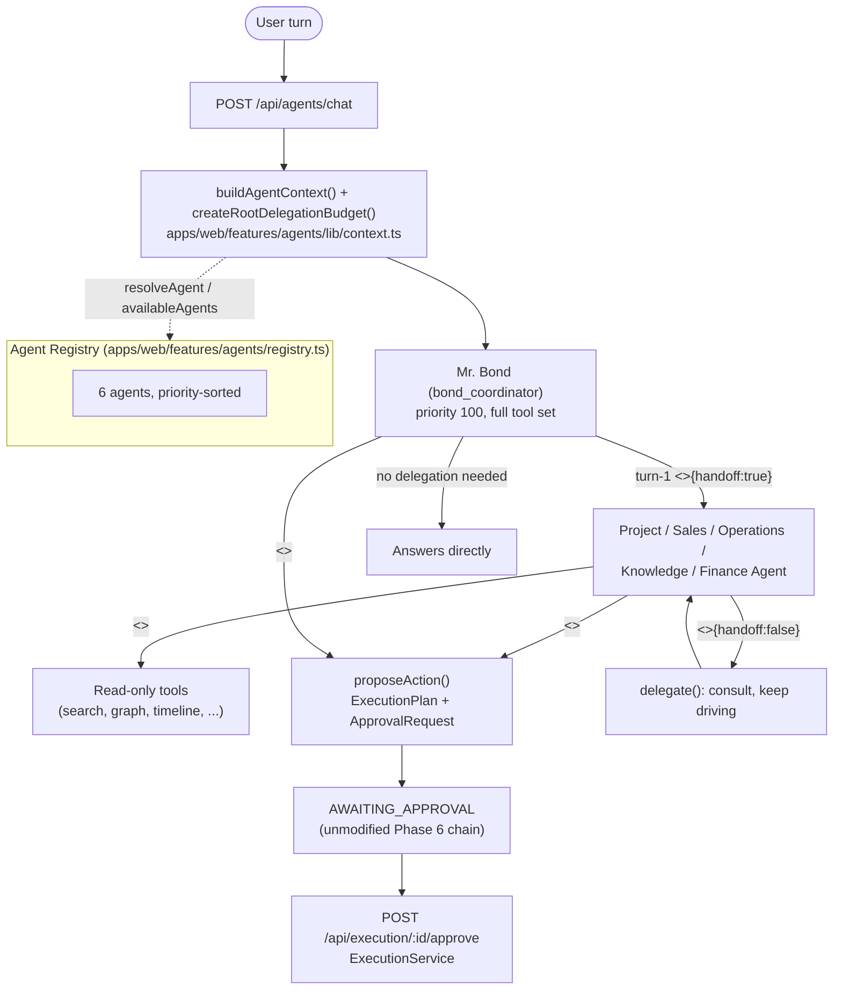

# The Multi-Agent Framework — Overview

## Scope

BOND OS's Phase 7 work turns Mr. Bond from a single Phase 5 assistant into a **Chief Coordinator**
sitting over five domain specialists. All six share one SDK, one registry pattern, and — critically —
one write boundary that Phase 6 (the [Tool Execution Framework](../workflows/approvals.md)) already
built and this phase does not touch. `packages/database/prisma/schema.prisma`'s own header comment for
the Phase 7 section states the design in one breath:

```prisma
// ── Phase 7: Multi-Agent Architecture (AI Workforce) ────────────────────────
// Mr. Bond becomes a Coordinator over 5 specialist agents. Every write still
// flows through the unmodified Phase 6 chain (Agent -> Execution Plan ->
// Approval -> Execution -> Audit) — no agent ever calls a Tool's execute()
// directly; that remains ExecutionService's sole responsibility. Agent
// behavior (the 9 SDK methods) lives in code (apps/web/features/agents/),
// never in the DB — the `Agent` model below is a queryable metadata
// snapshot, same "code owns behavior, DB stores metadata" split as `Tool`.
```
(`packages/database/prisma/schema.prisma:1483-1492`)

This document is the map of the whole framework. Each piece gets its own deep-dive doc in this
directory; this page explains how they fit together and where a request actually enters the system.

## The seven pieces

| Piece | What it is | Doc |
|---|---|---|
| The Agent SDK | 9 methods (`describe`, `health`, `analyze`, `plan`, `observe`, `think`, `delegate`, `handoff`, `summarize`) every agent implements identically | [base-agent.md](./base-agent.md) |
| `BaseAgent` | Abstract class implementing all 9 methods' shared mechanics; a concrete agent overrides only `descriptor` | [base-agent.md](./base-agent.md) |
| The Agent Registry | In-memory singleton, mirrors `ToolRegistryService`; the single source of truth for which agents exist | [registry.md](./registry.md) |
| Routing | How a turn reaches an agent, and how the Coordinator hands it to a specialist | [routing.md](./routing.md) |
| Delegation | The `<<DELEGATE:...>>` marker, `delegate()`/`handoff()`, cycle-safe budget threading | [delegation.md](./delegation.md) |
| Goals | The Plan → Observe → Suggest → Wait → Continue lifecycle, explicitly invoked only | [goals.md](./goals.md) |
| Insights & Observation | A read-only engine that records typed judgments and diffs recent activity — never mutates domain data | [insights.md](./insights.md) |

A separate doc, [communication.md](./communication.md), covers the structured message/event types
(`AgentMessage`, `AgentStreamEvent`, `AgentTimelineEvent`) every one of the pieces above uses instead
of passing free-form text between agents.

## The six agents

`apps/web/features/agents/definitions/` holds exactly six agent modules, all registered in
`apps/web/features/agents/registry.ts:20`:

```ts
const ALL_AGENTS: AgentDefinition[] = [bondCoordinatorAgent, projectAgent, salesAgent, operationsAgent, knowledgeAgent, financeAgent];
```

| Agent | agentKey | category | priority | supportedTools | supportedKnowledge |
|---|---|---|---|---|---|
| Mr. Bond (Coordinator) | `bond_coordinator` | `COORDINATOR` | 100 | all 9 (`TOOL_NAMES`) | General, Organization Overview, Cross-domain Routing |
| Project Agent | `project_agent` | `PROJECT` | 50 | `projects`, `timeline`, `graph`, `search` | Projects, Tasks, Roadmaps, Milestones, Sprint Planning, Dependencies |
| Sales Agent | `sales_agent` | `SALES` | 50 | `customers`, `emails`, `search`, `graph` | Customers, CRM, Meetings, Pipeline, Emails, Opportunities |
| Operations Agent | `operations_agent` | `OPERATIONS` | 50 | `documents`, `timeline`, `analytics`, `search` | Processes, Execution, Inventory, Documents, Operations |
| Knowledge Agent | `knowledge_agent` | `KNOWLEDGE` | 50 | `search`, `graph`, `timeline`, `documents`, `analytics` | Knowledge Graph, Documents, Memory, Search, Entities, Timeline |
| Finance Agent | `finance_agent` | `FINANCE` | 50 | `analytics`, `search` | Budgets, Expenses, Invoices, Forecasts, Reports |

Full descriptors (`agentKey`, `avatar`, `description`, `capabilities`, `minimumRole`) are in
[registry.md](./registry.md). All six extend `BaseAgent` and override only `descriptor`
(`apps/web/features/agents/definitions/*.agent.ts`) — no agent-specific reasoning code exists anywhere;
see [base-agent.md](./base-agent.md).

## System shape



## The write boundary: propose, never execute

The schema comment above states it as a hard invariant, checkable the same way Phase 6's "the
execution engine knows nothing about Projects" is checkable: no file under `apps/web/features/agents/`
imports `getExecutionService` or calls a tool's `execute()`. When an agent's planning turn produces an
`<<ACTION:...>>` marker, `runThinkLoop` calls the exact same `proposeAction` function Phase 6's
`rag-pipeline.service.ts` and `POST /api/execution/plan` already share
(`apps/web/features/agents/services/agent-pipeline.service.ts:231-234`):

```ts
const proposed = await proposeAction(
  { organizationId: ctx.organizationId, userId: ctx.userId, conversationId: ctx.conversationId },
  actionRequest,
);
```

`proposeAction` builds an `ExecutionPlan`, requests an `ApprovalRequest`, and returns — the turn ends
there, yielding an `action_proposed` event, with no further LLM call for that turn
(`agent-pipeline.service.ts:249-262`). From that point on, the plan sits `AWAITING_APPROVAL` exactly
like any Phase 5/6-originated plan, and only `POST /api/execution/[id]/approve` (see
[../workflows/approvals.md](../workflows/approvals.md)) can ever move it toward `ExecutionService`.
Nothing about being agent-proposed shortens, bypasses, or auto-approves that chain — an agent's
proposal is indistinguishable, once persisted, from one Mr. Bond proposed in Phase 6. This holds with
**no exceptions**: not for the Coordinator, not for a specialist, not for a Goal's `SUGGEST` phase
(see [goals.md](./goals.md), which produces only a suggestion string, never an action marker's
side-effects), and not for the Insight Engine (see [insights.md](./insights.md), which never modifies
domain data).

## `AgentContext`: what every SDK method threads

Every SDK method that needs organization/session state takes an `AgentContext`
(`apps/web/features/agents/lib/agent-definition.ts:18-34`):

```ts
export interface AgentContext {
  organizationId: string;
  userId: string;
  conversationId?: string;
  organization: { id: string; name: string };
  /** This agent's own allowlist — never the full 9-tool set unless the agent declares it (Coordinator does). */
  availableTools: readonly ToolName[];
  role: Role;
  /** Every other agent available to delegate/hand off to (excluding self) — resolved once per turn. */
  availableAgents: AgentDescriptor[];
}
```

`buildAgentContext` (`apps/web/features/agents/lib/context.ts:26-41`) is the one place this gets
assembled, once per turn, by a top-level caller — a route handler or `GoalService`. See
[base-agent.md](./base-agent.md) for why it has to be a top-level caller rather than something
`BaseAgent` builds itself (the module-boundary / circular-import rule).

## Two entry points, one unchanged

Phase 5's `POST /api/bond/chat` still calls `runBondChatPipeline` directly and is completely
unmodified by this phase — see [../api/bond.md](../api/bond.md). Phase 7 adds a new, parallel entry
point, `POST /api/agents/chat` (`apps/web/app/api/agents/chat/route.ts:17-35` →
`runAgentChatPipeline`, `apps/web/features/agents/services/agent-chat.service.ts:20-53`), structurally
identical to Mr. Bond's own conversation bootstrapping (get-or-create conversation, persist the `USER`
message, load recent history) but dispatching to whichever `AgentDefinition.think()` is selected — an
explicit `agentKey`, or the Coordinator by default:

```ts
const registry = getAgentRegistryService();
const agent = input.agentKey ? registry.get(input.agentKey) : registry.getLatest('bond_coordinator');
```
(`agent-chat.service.ts:40-41`)

`agent-pipeline.service.ts`'s own comment is direct about the relationship between the two pipelines
(`agent-pipeline.service.ts:25-34`): `runThinkLoop` is "generalized from (and, in the next build step,
reused BY) `rag-pipeline.service.ts`" — as of this phase, neither pipeline wraps the other; both call
the same retrieval/prompt/tool primitives independently, so Mr. Bond's proven, externally-consumed
Phase 5 event contract never becomes structurally dependent on this newer, higher-surface-area code.
See [routing.md](./routing.md) for the full request-flow walkthrough and the rest of the
`/api/agents/**` surface.

## Do NOT Build — the explicit line this phase draws

- **No unapproved autonomous execution.** Every agent's only path to a domain write is
  `<<ACTION:...>>` → `proposeAction` → the unmodified Phase 6 `AWAITING_APPROVAL` → explicit human
  approval chain. No agent, no Goal phase, and no Insight/Observation call anywhere in this feature
  calls a tool's `execute()` or `getExecutionService()` directly.
- **No self-modifying or self-improving agents.** `descriptor` is a `const` object defined once per
  agent module. Nothing under `apps/web/features/agents/` writes back to a `descriptor` field, an
  `Agent` DB row's behavior-relevant columns, or a source file at runtime.
- **No agent-created agents.** `ALL_AGENTS` in `agents/registry.ts` is a literal, compile-time array of
  6 entries — no method, API route, or admin UI registers a new `AgentDescriptor` at runtime.
- **No background writes without approval.** No scheduler/cron/queue-consumer exists anywhere in this
  codebase (see [goals.md](./goals.md)'s grep-checkable claim) that could drive a write outside a
  request a human explicitly made and then explicitly approved.
- **No email/calendar/financial-transaction integrations.** Sales Agent's `supportedTools` includes
  `emails` — Phase 5's existing *read-only* email-listing tool — but nothing in this phase sends an
  email, creates a calendar event, or initiates a financial transaction.
- **No accounting integrations for Finance Agent.** Its own `description` states this as policy:
  "Does not integrate with accounting systems."

## Verification note

Every claim in this suite is grounded in direct reads of `apps/web/features/agents/**`,
`packages/database/prisma/schema.prisma`, and `packages/shared/src/schemas/agents.ts` as they exist in
this repository today. One gap worth stating plainly up front, expanded on in
[communication.md](./communication.md): `AgentTimelineService` declares 7 `record*` methods for the 7
`AgentEventType` values, but only the `DELEGATION` path is ever actually invoked by the running
pipeline — `THOUGHT_STARTED`, `RETRIEVAL`, `PLAN`, `APPROVAL_REQUEST`, `EXECUTION`, and `COMPLETION`
events are never written by anything today. There is also no automated test suite covering this
feature area (no `*.test.ts`/`*.spec.ts` files exist under `apps/web/features/agents/`) — see
[../testing/strategy.md](../testing/strategy.md) for the codebase-wide state of that gap.

## Documentation index

- [base-agent.md](./base-agent.md) — the 9-method SDK, `AgentDescriptor`, `AgentDefinition`, and what
  `BaseAgent` provides vs. what a concrete agent overrides.
- [registry.md](./registry.md) — the Agent Registry, every registered agent's full descriptor, and
  `syncToDatabase`.
- [routing.md](./routing.md) — how a turn reaches an agent, and the full `/api/agents/**` surface.
- [delegation.md](./delegation.md) — `DelegationBudget`, cycle detection, and the Phase 7 per-hop role
  enforcement fix.
- [goals.md](./goals.md) — `GoalService`, `AgentGoal`/`GoalStep`, the explicitly-invoked driver pattern.
- [insights.md](./insights.md) — `InsightService`, the Insight Engine, the Observation Engine, and the
  `insight.created` event.
- [communication.md](./communication.md) — `AgentMessage`, `AgentStreamEvent`, `AgentTimelineEvent`,
  and the "no free-form prompts" discipline.
- [../workflows/approvals.md](../workflows/approvals.md) / [../api/tools.md](../api/tools.md) — the
  unmodified Phase 6 write chain every agent-proposed action still flows through.
