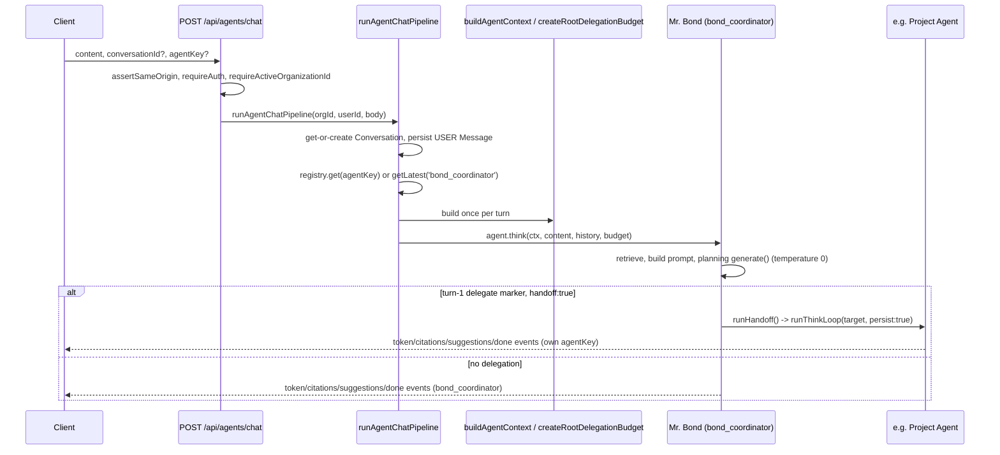

# Routing: How a Turn Reaches an Agent

## Scope

There is no dedicated "which agent should handle this?" model call anywhere in this codebase — routing
reuses the exact same mechanism a mid-conversation consult/handoff uses. This doc walks a request from
`POST /api/agents/chat` through the Coordinator's first planning turn to (possibly) a specialist, then
covers the rest of the `/api/agents/**` read/introspection surface that supports routing decisions.

## A turn-1 handoff, not a separate classifier

`runThinkLoop` (`apps/web/features/agents/services/agent-pipeline.service.ts`) appends a
delegate-instructions system message alongside the existing tool/action instructions, on **every**
planning turn, for **every** agent including the Coordinator (`agent-pipeline.service.ts:93-103`):

```ts
function buildDelegateInstructions(availableAgents: AgentDescriptor[]): string {
  if (availableAgents.length === 0) return '';
  const list = availableAgents.map((agent) => `${agent.agentKey} (${agent.description})`).join('; ');
  return [
    'If another specialist is better suited to this request, you may consult or fully hand off to them.',
    `Available agents: ${list}.`,
    'To consult one and keep answering yourself, reply with ONLY one line: <<DELEGATE:agent_key>>{"question":"...","handoff":false}',
    'To hand off the entire request (their answer becomes the final response), use the same form with "handoff":true.',
    'Only one action/tool/delegate marker per turn — never combine them.',
  ].join(' ');
}
```

A user's message always reaches the Coordinator first — `agent-chat.service.ts`'s
`runAgentChatPipeline` defaults to `registry.getLatest('bond_coordinator')` when no `agentKey` is given
(`agent-chat.service.ts:40-41`). If the Coordinator's very first `provider.generate()` call for that
turn comes back with `<<DELEGATE:project_agent>>{"question":"...","handoff":true}`, `runThinkLoop`
treats it exactly like any other handoff mid-conversation: it calls `runHandoff` (via the
handoff-marker branch at `agent-pipeline.service.ts:294-299`), which recurses into the target's own
`think()` and streams *its* events as the rest of this turn's output. There is no routing table, no
embeddings-based classifier, no separate "route this" LLM call — routing is just the degenerate case
of delegation where it happens to be the first thing the Coordinator does. This is the same design
instinct BOND OS's Intent Detection uses elsewhere (see [../ai/tool-calling.md](../ai/tool-calling.md)):
rather than adding a second LLM round-trip before the real planning loop, the existing loop's response
is widened to mean more.

Delegate/action/tool markers are mutually exclusive on a single turn — `runThinkLoop` counts how many
marker kinds are present in one response and falls through to a plain prose answer if more than one is
(`agent-pipeline.service.ts:223-224`):

```ts
const markerKinds = [containsActionMarker(plan.content), containsDelegateMarker(plan.content), parseToolCall(plan.content) !== null].filter(Boolean).length;
if (markerKinds > 1) break; // more than one marker type present — malformed, fall through to a final prose answer
```

Full marker mechanics, cycle safety, and the `delegate()`/`handoff()` distinction are covered in
[delegation.md](./delegation.md) — this doc focuses on the request-entry side.

## Turn walkthrough



## `POST /api/agents/chat` — the entry point

File: `apps/web/app/api/agents/chat/route.ts:17-35`.

Auth: `assertSameOrigin` + `requireAuth()` + `requireActiveOrganizationId()`; the pipeline internally
re-checks `requireRole(organizationId, ROLES.MEMBER)` (`agent-pipeline.service.ts:169`). Rate-limited
20 requests/60s. Structurally mirrors `POST /api/bond/chat` (see [../api/bond.md](../api/bond.md)).

Body — `agentChatSchema` (`packages/shared/src/schemas/agents.ts:8-13`):

```ts
export const agentChatSchema = z.object({
  conversationId: z.string().min(1).optional(),
  content: z.string().trim().min(1, 'A message is required.').max(8000),
  agentKey: z.string().min(1).optional(),
});
```

Omitting `agentKey` lets the Coordinator auto-route. Response is an SSE stream of `AgentStreamEvent`
(full shape in [communication.md](./communication.md)): `status` → `token`* → `citations` →
`suggestions` → terminal `done` **or** `action_proposed` **or** `error`.

`runAgentChatPipeline` (`apps/web/features/agents/services/agent-chat.service.ts:20-53`):

```ts
const registry = getAgentRegistryService();
const agent = input.agentKey ? registry.get(input.agentKey) : registry.getLatest('bond_coordinator');
if (!agent) {
  throw new NotFoundError(input.agentKey ? `Unknown agent "${input.agentKey}".` : 'Coordinator agent is not registered.');
}

await createMessage({ conversationId, organizationId, userId, role: 'USER', content: input.content });

const ctx = await buildAgentContext({ organizationId, userId, conversationId, role: membership.role, agent });
const history = await getRecentConversationHistory(organizationId, conversationId, 10);
const budget = createRootDelegationBudget(agent.descriptor.agentKey);

yield* agent.think(ctx, input.content, history, budget);
```

This get-or-create-conversation / persist-USER-message / load-recent-history sequence is structurally
identical to Mr. Bond's own Phase 5 conversation bootstrapping — the last 10 messages of history are
loaded via `getRecentConversationHistory`, and a fresh root `DelegationBudget` is created for the whole
turn (see [delegation.md](./delegation.md)).

The route wraps the generator in `apiHandler`, primes it once with `await generator.next()` *inside*
`apiHandler`'s try/catch, then hands the primed generator to `createSseStream` — so pre-stream errors
(auth, validation, unknown `agentKey`) still return a normal JSON error response; only in-stream errors
become a terminal `{type:'error', message}` SSE event.

## The rest of `/api/agents/**`

The remaining 11 routes under `apps/web/app/api/agents/` are Agent Discovery, introspection, and
admin/debug tooling — none of them are on the routing hot path a normal chat turn takes, but they are
what the UI (Agent Discovery panels, the Delegation Graph, Goals, Insights) reads.

| Route | Method | Backs |
|---|---|---|
| `apps/web/app/api/agents/route.ts` | GET | `listAgentsService` — the live registry mapped to `AvailableAgent[]` |
| `apps/web/app/api/agents/list/route.ts` | GET | Literal `export { GET } from '../route'` alias — spec requires both names to work identically |
| `apps/web/app/api/agents/[id]/route.ts` | GET | Single agent by **`agentKey`** (not a DB row id) — `getAgentService` |
| `apps/web/app/api/agents/chat/route.ts` | POST (SSE) | `runAgentChatPipeline` — covered above |
| `apps/web/app/api/agents/context/route.ts` | GET | `previewAgentContextService` — introspection only |
| `apps/web/app/api/agents/delegate/route.ts` | POST | `runDelegateRequestService` — see [delegation.md](./delegation.md) |
| `apps/web/app/api/agents/status/route.ts` | GET | `getAgentStatusService` — every agent's real `health()` |
| `apps/web/app/api/agents/timeline/route.ts` | GET | `AgentTimelineService.list` — see [communication.md](./communication.md) |
| `apps/web/app/api/agents/goals/route.ts` | GET/POST | `GoalService.listGoals`/`createGoal` — see [goals.md](./goals.md) |
| `apps/web/app/api/agents/goals/[id]/route.ts` | GET | `GoalService.getGoal` |
| `apps/web/app/api/agents/goals/[id]/continue/route.ts` | POST | `GoalService.advance` — see [goals.md](./goals.md) |
| `apps/web/app/api/agents/insights/route.ts` | GET | `InsightService.list` — see [insights.md](./insights.md) |
| `apps/web/app/api/agents/insights/[id]/route.ts` | PATCH | `InsightService.acknowledge`/`dismiss` |

All 13 routes sit behind `requireActiveOrganizationId()` at minimum, with the actual
`requireRole(organizationId, ROLES.MEMBER)` re-check happening inside the service layer for every one
of them (the universal pattern across this codebase's API surface — see
[../security/authorization.md](../security/authorization.md)). No route in this table requires more
than `MEMBER`.

### `GET /api/agents/context` — introspection without side effects

File: `apps/web/app/api/agents/context/route.ts`. Query — `agentContextQuerySchema`
(`packages/shared/src/schemas/agents.ts:26-30`): `{ q: string (1-8000 chars), agentKey?: string }`.

`previewAgentContextService` (`apps/web/features/agents/services/agent-context-preview.service.ts:30-60`)
runs the *exact same* retrieval (`buildContext`) and prompt-assembly (`buildPrompt`) primitives a real
turn would use — see [../ai/retrieval.md](../ai/retrieval.md) and
[../ai/prompt-builder.md](../ai/prompt-builder.md) — but **never calls the AI provider and persists
nothing**:

```ts
export async function previewAgentContextService(
  organizationId: string,
  query: AgentContextQuery,
): Promise<AgentContextPreview> {
  await requireRole(organizationId, ROLES.MEMBER);
  const registry = getAgentRegistryService();
  const agent = query.agentKey ? registry.get(query.agentKey) : registry.getLatest('bond_coordinator');
  if (!agent) throw new NotFoundError(...);
  ...
  const context = await buildContext(organizationId, query.q, tokenBudget);
  const built = buildPrompt(context, context.rawResults, { id: organization.id, name: organization.name }, tokenBudget, { conversationHistory: [] });
  return {
    agentKey: agent.descriptor.agentKey,
    displayName: agent.descriptor.displayName,
    availableTools: [...agent.descriptor.supportedTools],
    supportedKnowledge: agent.descriptor.supportedKnowledge,
    retrievedSources: context.rawResults.map((result) => ({ ref: result.key, title: result.title, snippet: result.snippet })),
    estimatedPromptTokens: countTokensService(built.messages.map((message) => message.content).join('\n')),
    truncated: built.truncated,
  };
}
```

Because this preview reuses the same primitives `runThinkLoop` calls for real, it is never out of sync
with what an actual turn would retrieve — useful for debugging why a specialist did or didn't have the
context it needed to answer well, without spending an LLM call or writing anything.

### `GET /api/agents/status` — live health, not fabricated metrics

`getAgentStatusService` calls every registered agent's real `health()` (see
[base-agent.md](./base-agent.md)'s method 2) and returns `{ agentKey, displayName, health }[]` — the
comment on the service is explicit: "no fabricated uptime/metrics." `registryStatus` is always
`'ACTIVE'` in practice, since nothing sets `AgentRegistryStatus.DISABLED` (see
[registry.md](./registry.md)).

## Per-agent tool boundary at dispatch time, not just in the prompt

`buildToolInstructions(descriptor.supportedTools)` narrows the *hint text* shown to the model per
agent, but the real enforcement boundary is `executeToolCall`'s `allowedTools` parameter
(`agent-pipeline.service.ts:318`):

```ts
const toolResult = await executeToolCall(ctx.organizationId, toolCall, descriptor.supportedTools);
```

A model that ignores its own prompt and emits a `<<TOOL:...>>` marker for a tool outside its
`supportedTools` is rejected at execution time by `executeToolCall`, not merely discouraged by the
prompt — this is the same "prompt is a hint, code is the gate" posture the write boundary uses (see
[overview.md](./overview.md)).

## What this does NOT do

- **No embeddings-based or ML classifier for routing.** The Coordinator's decision to delegate is the
  same LLM planning call every turn already makes, widened to also recognize the `<<DELEGATE:...>>`
  marker — there is no separate "which agent?" model, no vector similarity search over agent
  descriptors, and `analyze()`'s deterministic keyword overlap ([base-agent.md](./base-agent.md)) is
  not wired into the routing decision at all today.
- **No routing table or static rules file.** `AgentContext.availableAgents` is resolved fresh from the
  live registry every turn; there is no separate configuration mapping keywords/categories to agent
  keys.
- **No cross-conversation routing memory.** Each new top-level turn (a fresh `POST /api/agents/chat`
  call without a prior handoff already in flight) starts back at the Coordinator by default unless the
  caller explicitly passes `agentKey` — there is no "this conversation already routed to Sales, keep
  routing there" state that persists between turns.

## Documentation index

- [overview.md](./overview.md) — the write boundary every routed-to agent still respects.
- [base-agent.md](./base-agent.md) — `think()`/`handoff()`, the two SDK methods this doc's flow is
  built from.
- [delegation.md](./delegation.md) — the full `<<DELEGATE:...>>` marker mechanics, cycle detection,
  and `delegate()` vs. `handoff()`.
- [communication.md](./communication.md) — the `AgentStreamEvent` shapes a client actually receives
  during and after routing.
- [../api/agents.md](../api/agents.md) — the complete `/api/agents/**` reference (request/response
  shapes for all 13 routes).
