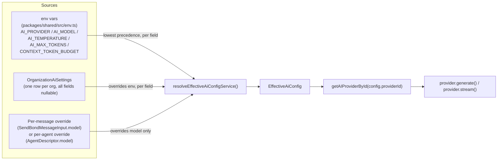

# Model Selection

## Scope

How BOND OS decides, for one specific request, *which* AI provider and *which* model actually
answer it. There is no single global setting — three independent sources merge, field by field,
into one `EffectiveAiConfig` object, resolved fresh on every call:

```
env defaults  →  org settings (OrganizationAiSettings)  →  per-message / per-agent override
(packages/shared/src/env.ts)   (DB row, one per org)        (the highest-precedence source, when present)
```

The resolver is `resolveEffectiveAiConfigService` in
`apps/web/features/bond/services/ai-settings.service.ts`. It is called by every code path that
talks to an `AIProvider` for generation: Mr. Bond's chat pipeline
(`rag-pipeline.service.ts`), the multi-agent reasoning loop (`agent-pipeline.service.ts`), and the
multi-agent answer-reconciliation call (`runSummarize`). See [Providers](./providers.md) for the
`AIProvider` interface this resolves *into*, and [Tool Calling](./tool-calling.md) for how the
resolved config drives the actual generation loop.

## `EffectiveAiConfig`

```ts
export interface EffectiveAiConfig {
  providerId: AIProviderId;
  model: string;
  temperature: number;
  topP: number | undefined;
  maxTokens: number;
  streamingEnabled: boolean;
  contextWindow: number;
  retrievalDepth: number;
}
```

## The resolver

`ai-settings.service.ts`:

```ts
export async function resolveEffectiveAiConfigService(
  organizationId: string,
  modelOverride?: string,
): Promise<EffectiveAiConfig> {
  await requireRole(organizationId, ROLES.MEMBER);
  const env = getEnv();
  const settings = await getOrganizationAiSettings(organizationId);

  const providerId = ((settings?.provider as AIProviderId | null) ?? env.AI_PROVIDER) || undefined;
  if (!providerId) throw new ValidationError('No AI provider configured for this organization.');
  if (!isAIProviderIdConfigured(providerId)) {
    throw new ValidationError(`AI provider "${providerId}" is not configured (missing API key).`);
  }

  const model = modelOverride || settings?.model || env.AI_MODEL;
  if (!model) throw new ValidationError('No AI model configured for this organization.');

  return {
    providerId,
    model,
    temperature: settings?.temperature ?? env.AI_TEMPERATURE,
    topP: settings?.topP ?? undefined,
    maxTokens: settings?.maxTokens ?? env.AI_MAX_TOKENS,
    streamingEnabled: settings?.streamingEnabled ?? true,
    contextWindow: settings?.contextWindow ?? env.CONTEXT_TOKEN_BUDGET,
    retrievalDepth: settings?.retrievalDepth ?? 30,
  };
}
```

`OrganizationAiSettings` (`packages/database/prisma/schema.prisma`) is **one row per org, every
field nullable**:

```prisma
model OrganizationAiSettings {
  id                String   @id @default(cuid())
  organizationId    String   @unique
  provider          String?
  model             String?
  temperature       Float?
  topP              Float?
  maxTokens         Int?
  streamingEnabled  Boolean  @default(true)
  contextWindow     Int?
  retrievalDepth    Int?
  updatedById       String?
  ...
}
```

A `null` field falls back to the env-var default, never to a hardcoded product default — the org's
own environment config remains the single source of truth until an ADMIN explicitly overrides a
field. This is a **per-field** merge, not "org settings entirely present or entirely absent": an org
can override just `model` while still inheriting the environment's `temperature`.

## Precedence, field by field

| Field | 1st (highest) | 2nd | 3rd (lowest) | Notes |
|---|---|---|---|---|
| `providerId` | — | `settings.provider` | `env.AI_PROVIDER` | No per-message override for provider — only model can be overridden per-message. |
| `model` | `modelOverride` (per-message / per-agent) | `settings.model` | `env.AI_MODEL` | The only field with three real levels. |
| `temperature` | — | `settings.temperature` | `env.AI_TEMPERATURE` (default `0.7`) | |
| `topP` | — | `settings.topP` | **`undefined`** — no env fallback | See [asymmetry](#topp-has-no-env-level-fallback) below. |
| `maxTokens` | — | `settings.maxTokens` | `env.AI_MAX_TOKENS` (default `2048`) | |
| `streamingEnabled` | — | `settings.streamingEnabled` | `true` (hardcoded, not env-driven) | Field exists on `OrganizationAiSettings` but is not consulted by `rag-pipeline.service.ts`, which always streams the final answer — see [gap](#streamingenabled-is-resolved-but-not-actually-consulted) below. |
| `contextWindow` | — | `settings.contextWindow` | `env.CONTEXT_TOKEN_BUDGET` (default `8000`) | Threaded into `buildContext`'s token budget — see [Context Builder](./context-builder.md). |
| `retrievalDepth` | — | `settings.retrievalDepth` | `30` (hardcoded here, not env-driven) | Resolved but **not threaded into retrieval** — see [gap](#retrievaldepth-is-resolved-but-not-actually-used) below. |



## Where the third-level override comes from

The `modelOverride` parameter has **two distinct real-world sources**, both funneling into the same
resolver parameter:

1. **Mr. Bond chat — the per-message Model Selector.** `POST /api/bond/chat`'s request body
   (`sendBondMessageSchema`, `packages/shared/src/schemas/bond.ts`) accepts an optional `model:
   string`:

   ```ts
   /** The `/api/bond/chat` request body. `conversationId` omitted starts a new conversation.
    * `model` is a per-message override (spec §9's Model Selector) — falls back to the
    * organization's configured model, then the env default. */
   export const sendBondMessageSchema = z.object({
     conversationId: z.string().min(1).optional(),
     content: z.string().trim().min(1, 'A message is required.').max(8000),
     model: z.string().trim().min(1).optional(),
   });
   ```

   `rag-pipeline.service.ts` passes it straight through:
   `resolveEffectiveAiConfigService(organizationId, input.model)`. A user can pick a different model
   for a single message without changing the org's saved settings.

2. **Agent turns — the agent's own configured model.** `agent-pipeline.service.ts`'s `runThinkLoop`
   calls `resolveEffectiveAiConfigService(ctx.organizationId, descriptor.model)`, where
   `descriptor.model` is `AgentDescriptor.model?: string` — an optional field a specialist agent's
   own definition can set. There is no user-facing model picker for an agent turn; the "override"
   slot here is filled by the agent's own static configuration, not a per-request user choice.
   `AgentDescriptor.maxContext?: number` similarly overrides `config.contextWindow` for that agent's
   own token budget (`const tokenBudget = descriptor.maxContext ?? config.contextWindow;`) — a
   fourth field with its own agent-level override, outside the `EffectiveAiConfig` merge entirely.

`runSummarize()` (the agent-answer-reconciliation call) calls the resolver with **no** override at
all — `resolveEffectiveAiConfigService(ctx.organizationId)` — so multi-agent synthesis always uses
whatever the org/env configuration resolves to, never a per-message model choice.

**Neither override is validated against the resolved provider's `listModels()`.** A per-message
`model` string, or an agent's own `AgentDescriptor.model`, is passed straight to
`provider.generate()`/`provider.stream()` as-is. If it names a model the provider doesn't recognize,
the failure surfaces as an `AIProviderError` from the HTTP call itself (a non-2xx response), not as
a validation error earlier in the pipeline.

## Provider readiness is re-checked at resolution time, not just at settings-save time

`updateOrganizationAiSettingsService` (ADMIN-only) already refuses to save a `provider` that isn't
configured:

```ts
if (input.provider && !isAIProviderIdConfigured(input.provider)) {
  throw new ValidationError(`AI provider "${input.provider}" is not configured (missing API key).`);
}
```

But `resolveEffectiveAiConfigService` performs the **same check again**, every time, on the
already-resolved `providerId` (`isAIProviderIdConfigured(providerId)`, see the resolver source
above). This matters concretely: if an org previously saved `provider: 'ANTHROPIC'` while
`ANTHROPIC_API_KEY` was set, and an operator later removes that env var, the saved setting is not
retroactively invalidated in the database — but the *next* chat request against that org throws
`ValidationError('AI provider "ANTHROPIC" is not configured (missing API key).')` at resolution
time, not a stale success. Configuration correctness is enforced per-request, not just at the moment
a setting was written.

## Access control on the two halves

- **Reading** the org's effective config (`resolveEffectiveAiConfigService`,
  `getOrganizationAiSettingsService`) requires only `ROLES.MEMBER`.
- **Writing** it (`updateOrganizationAiSettingsService`, `PATCH /api/ai/settings`) requires
  `ROLES.ADMIN`. Any org member can trigger a chat turn using whatever the org's current effective
  config resolves to (including picking a different *model* per-message), but only an ADMIN can
  change the org's default *provider*/`temperature`/`maxTokens`/etc.

`GET /api/ai/settings` / `PATCH /api/ai/settings` (`apps/web/app/api/ai/settings/route.ts`) is the
one route pair backing this — see [AI API](../api/ai.md).

## Two gaps in the resolved config, confirmed by reading the callers

### `streamingEnabled` is resolved but not actually consulted

`EffectiveAiConfig.streamingEnabled` is computed (`settings?.streamingEnabled ?? true`) but neither
`rag-pipeline.service.ts` nor `agent-pipeline.service.ts` branches on it anywhere — both
unconditionally call `provider.stream()` for the final answer regardless of this field's value.
`OrganizationAiSettings.streamingEnabled` is a real, persisted, admin-settable column with no
observable effect on pipeline behavior today, based on the code as read.

### `retrievalDepth` is resolved but not actually used

`EffectiveAiConfig.retrievalDepth` defaults to `30` inside this service
(`settings?.retrievalDepth ?? 30` — note this default lives in `ai-settings.service.ts`, not in
`packages/shared/src/env.ts` alongside the other env-driven defaults). But the actual retrieval call
in [Context Builder](./context-builder.md) — `retrieve(organizationId, question, { limit: 30 })`
inside `buildContext` — uses a **separate, independently hardcoded** literal `30` in
`context-builder.service.ts`, not a read of `config.retrievalDepth`. `buildContext`'s signature only
accepts a `tokenBudget` parameter; it has no parameter for a result-count limit at all. An org
admin setting `retrievalDepth` to, say, `50` via `PATCH /api/ai/settings` changes the *resolved*
config object but — based on the code paths read for this doc — does not change how many candidates
`retrieve()` actually pulls per query. This is worth a maintainer confirming is intentional (a
currently-unused, forward-declared config field) versus a wiring gap.

## Token accounting is a local approximation, not provider-reported usage

`GenerateResult.usage` (real, provider-reported token counts) is only available from
`provider.generate()` — the non-streamed planning calls. The final answer always goes through
`provider.stream()`, which returns `AsyncIterable<string>` with no usage object at all. Both
pipelines compute the persisted `tokenUsage` for the final answer entirely locally, after the fact:

```ts
const promptTokens = countTokensService(messages.map((message) => message.content).join('\n'));
const completionTokens = countTokensService(finalContent);
const tokenUsage = { promptTokens, completionTokens, totalTokens: promptTokens + completionTokens };
```

This uses the same `cl100k_base` tokenizer described in [Providers](./providers.md#basaiprovider--shared-token-counting) —
an approximation, consistent across providers, but never a provider's own reported figure for the
turn that actually gets persisted and shown to the user. Planning turns' real `usage` (from
`generate()`) is computed by the provider but never read or aggregated by either pipeline.

## Related docs

- [Providers](./providers.md) — the `AIProvider` interface and the four concrete implementations
  `resolveEffectiveAiConfigService`'s output feeds into.
- [Tool Calling](./tool-calling.md) — how `EffectiveAiConfig` drives the actual multi-turn generation
  loop.
- [Context Builder](./context-builder.md) — where `contextWindow` (and the `retrievalDepth` gap
  above) actually matter.
- [AI API](../api/ai.md) — `GET`/`PATCH /api/ai/settings`.
- [Authorization](../security/authorization.md) — the `ROLES.MEMBER` / `ROLES.ADMIN` gates used
  throughout this resolver.
- [Agents Overview](../agents/overview.md) — `AgentDescriptor.model`/`.maxContext` in context.
