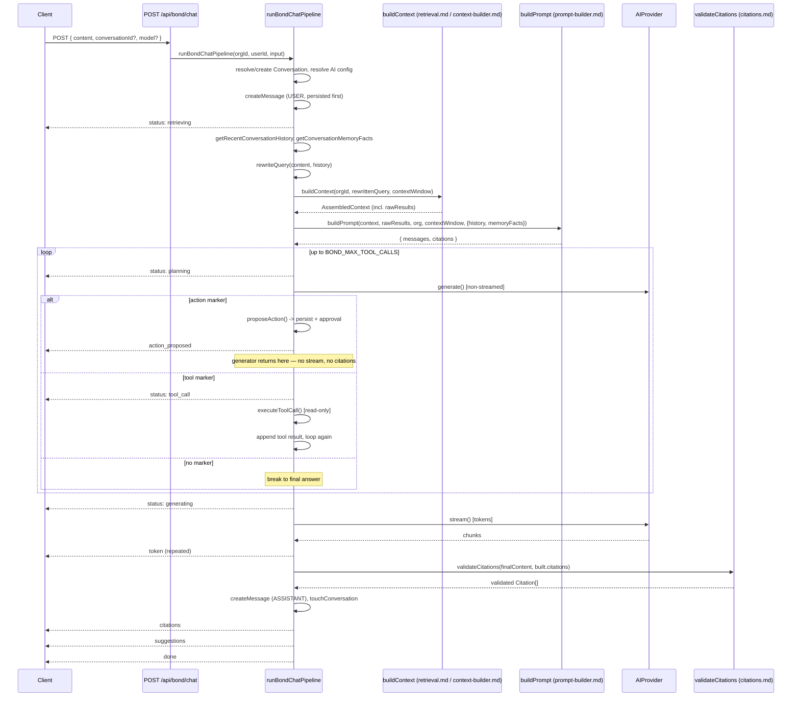

# RAG Pipeline

## Scope

`apps/web/features/bond/services/rag-pipeline.service.ts` — one exported async generator,
`runBondChatPipeline(organizationId, userId, input)`, that is the entire implementation behind
Mr. Bond's chat. It is what `POST /api/bond/chat` drains, turning each yielded `BondStreamEvent`
directly into an SSE frame. The file's own doc comment states its one hard rule:

```ts
/**
 * The RAG Pipeline: User Question -> Query Rewrite -> Hybrid Search ->
 * Knowledge Graph Expansion -> Context Builder -> Prompt Builder -> LLM ->
 * Streaming Response -> Citations. "No shortcuts. Never bypass retrieval."
 * — every branch below runs through `buildContext` (which itself calls
 * `retrieve()`/`hybridSearch` and does KG expansion internally), there is
 * no code path that calls the AI provider without first assembling context
 * from it.
 */
```

This document covers the pipeline end to end, stage by stage, as the code actually runs today —
including the parts that have grown past a strictly read-only design (see
[the critical note below](#the-pipeline-is-no-longer-strictly-read-only)).

## Read this first: the pipeline is no longer strictly read-only

Earlier phases of this codebase described `runBondChatPipeline` as having "no code path from a tool
call to any write operation" and "NO write operations." That description is still true of the
**automatic, per-turn tool-calling loop** — nothing `executeToolCall` dispatches to can write (see
[Tool Calling](./tool-calling.md)). But the pipeline as a whole now contains a second marker type,
`<<ACTION:...>>`, that lets the model *propose* a write (create/update/archive), gated behind
explicit human approval. This is real, wired code:

- `rag-pipeline.service.ts` imports `buildActionInstructions` (from `agent-pipeline.service.ts`),
  `containsActionMarker`/`parseActionCall` (from `intent-detection.service.ts`), and `proposeAction`
  (from `plan-proposal.service.ts`).
- Inside the tool-calling loop, each planning turn is checked for an action marker **before** being
  checked for a read-tool marker. If present, the pipeline builds and persists a plan, requests
  approval, persists a deterministic `ASSISTANT` message describing it, yields
  `{ type: 'action_proposed' }`, and **returns from the generator immediately** — no
  `provider.stream()` call, no citations, no `done` event for that turn.

The schema itself documents this directly (`packages/database/prisma/schema.prisma`, the Tool
Execution Framework section): *"A generic, approval-gated framework so Mr. Bond can propose and —
only after explicit user approval — execute writes. The read-only tool-calling path is untouched by
this section entirely."*

The precise, current statement is: **Mr. Bond's automatic per-turn behavior is still read-only**
(nothing in `executeToolCall` can write), but **the pipeline as a whole can propose a write action
that a human must separately approve before anything executes**. `proposeAction`
(`plan-proposal.service.ts`) calls `getPlannerService().buildPlan()` then
`getApprovalService().requestApproval()` — it never calls an executor itself. See
[Approvals](../security/approvals.md) and [Agents Overview](../agents/overview.md) for the approval
and execution machinery this hands off to.

### A second, related pipeline exists: `agent-pipeline.service.ts`

`apps/web/features/agents/services/agent-pipeline.service.ts`'s `runThinkLoop` is described in its
own doc comment as "the shared reasoning engine... generalized from (and, in the next build step,
reused BY) `rag-pipeline.service.ts` — neither pipeline wraps the other; both call the same
primitives." It adds a third marker type, `<<DELEGATE:agent_key>>`, for multi-agent consult/handoff
(see [Delegation](../agents/delegation.md)), and reuses `rewriteQuery`, `buildContext`, `buildPrompt`,
`executeToolCall`, `validateCitations`, and `generateSuggestedQuestions` from the exact same
Bond-feature files this document describes.

**`rag-pipeline.service.ts` itself imports `buildToolInstructions` and `buildActionInstructions`
from `agent-pipeline.service.ts`** — so the two files are already coupled at the instruction-text
level even though neither wraps the other's control flow. Anyone documenting or extending "the RAG
pipeline" should be aware both files exist and describe closely related but not identical behavior:
`agent-pipeline.service.ts`'s loop additionally supports delegation and per-agent
`supportedTools`/`minimumRole` gating that `rag-pipeline.service.ts` does not have. See
[Agents Overview](../agents/overview.md) for the full picture of `runThinkLoop`.

## End-to-end flow



## Stage by stage

### 1. Auth, conversation resolution, AI config

```ts
const { membership } = await requireRole(organizationId, ROLES.MEMBER);
```

If `input.conversationId` is given, the pipeline loads it via `getConversationById` and calls
`assertConversationAccess(existing, userId, membership.role, 'collaborate')` — the access-control
gate that decides whether this user may participate in this conversation. Otherwise it creates a new
`Conversation` with `title: input.content.slice(0, 80)`. It then loads the `Organization` row
(404 if missing) and resolves the effective AI config:

```ts
const config = await resolveEffectiveAiConfigService(organizationId, input.model);
const provider = getAIProviderById(config.providerId);
```

`resolveEffectiveAiConfigService` (`ai-settings.service.ts`) merges `OrganizationAiSettings` (a
per-org DB row, every field nullable) over env defaults; `input.model` — the per-message Model
Selector — wins over both. It throws `ValidationError` if no provider/model resolves at all.
`getAIProviderById(config.providerId)` resolves and caches the actual `AIProvider` instance — see
[Providers](./providers.md).

### 2. Persist the user message before anything else runs

```ts
await createMessage({ conversationId, organizationId, userId, role: 'USER', content: input.content });
yield { type: 'status', stage: 'retrieving' };
```

Deliberately ordered first: a failure anywhere downstream (retrieval, generation, an AI provider
outage) never loses the user's own input.

### 3. History, memory facts, query rewrite

```ts
const history = await getRecentConversationHistory(organizationId, conversationId, 10);
const memoryFacts = await getConversationMemoryFacts(organizationId, conversationId);
const rewrittenQuery = rewriteQuery(input.content, history);
```

Both memory reads are deterministic and non-generated — see [Memory](./memory.md).
`rewriteQuery` (`query-rewrite.service.ts`) is pure string logic, **not a second LLM call**:

```ts
const FOLLOW_UP_PRONOUNS = /\b(it|this|that|he|she|him|her|they|them|those|these|there)\b/i;
const MIN_STANDALONE_WORDS = 4;

function looksLikeFollowUp(question: string): boolean {
  if (FOLLOW_UP_PRONOUNS.test(question)) return true;
  return question.split(/\s+/).filter(Boolean).length < MIN_STANDALONE_WORDS;
}

export function rewriteQuery(question: string, recentHistory: ChatMessage[]): string {
  const trimmed = question.trim();
  if (!looksLikeFollowUp(trimmed)) return trimmed;

  const lastUserTurn = [...recentHistory].reverse().find((message) => message.role === 'user');
  if (!lastUserTurn) return trimmed;

  const priorQuestion = lastUserTurn.content.trim();
  if (!priorQuestion || priorQuestion === trimmed) return trimmed;

  return `${priorQuestion} ${trimmed}`;
}
```

A question is treated as a follow-up if it contains a pronoun (`it`, `this`, `he`, `they`, `there`,
…) or is shorter than 4 words. When it is, the prior user turn from conversation history is
prepended — so "What about him?" following "Who ran the Acme migration?" becomes "Who ran the Acme
migration? What about him?" before it ever reaches retrieval. The model that eventually answers still
sees the *original* question in `Question:` (see [Prompt Builder](./prompt-builder.md)) — only
retrieval itself gets the merged, self-contained version.

### 4. Retrieval + context assembly — the "no shortcuts" line

```ts
const context = await buildContext(organizationId, rewrittenQuery, config.contextWindow);
```

This is the single line in the entire pipeline that turns the user's question into retrieved
material. Everything below it — the tool-calling loop, the final `provider.stream()` call — only
ever adds to what this line already assembled; there is no second, parallel path that hands the raw
question straight to the model. Inside `buildContext` (fully documented in
[Context Builder](./context-builder.md)):

- **Hybrid Search** — `retrieve(organizationId, question, { limit: 30 })`, the 4-signal ranked
  search (text relevance, semantic similarity, relationship proximity, recency; see
  [Retrieval](./retrieval.md)).
- **Knowledge Graph Expansion** — for the top 5 highest-ranked entity results,
  `findConnectedEntities` (1-hop) and `getTimeline` are fetched in parallel — lazy, not run for every
  result.
- **Assembly** — the greedy, token-budgeted assembly of all of the above into one
  `AssembledContext`, stopping the instant the next item would exceed `config.contextWindow`.

### 5. Prompt Builder

```ts
const built = buildPrompt(
  context,
  context.rawResults,
  { id: organization.id, name: organization.name },
  config.contextWindow,
  { conversationHistory: history, memoryFacts },
);
```

Fully documented in [Prompt Builder](./prompt-builder.md) — synchronous, calls no model, produces
the `messages: ChatMessage[]` array and the `citations: Citation[]` list every citation this turn's
answer is later validated against.

### 6. The tool/action/delegate loop

```ts
let messages: ChatMessage[] = [...built.messages];
const maxToolCalls = getEnv().BOND_MAX_TOOL_CALLS;
let toolCallsUsed = 0;

if (maxToolCalls > 0) {
  messages = [
    messages[0]!,
    { role: 'system', content: buildToolInstructions(TOOL_NAMES) },
    { role: 'system', content: buildActionInstructions() },
    ...messages.slice(1),
  ];

  while (toolCallsUsed < maxToolCalls) {
    yield { type: 'status', stage: 'planning', detail: { attempt: toolCallsUsed + 1 } };

    const plan = await provider.generate({ model: config.model, messages, temperature: 0, maxTokens: config.maxTokens });

    const hasAction = containsActionMarker(plan.content);
    const toolCall = hasAction ? null : parseToolCall(plan.content);

    if (hasAction) {
      const actionRequest = parseActionCall(plan.content);
      if (actionRequest) {
        const proposedEvent = await proposeWriteAction({ organizationId, userId, conversationId }, actionRequest);
        yield proposedEvent;
        await logAiRequest({ organizationId, userId, action: 'bond.action_proposed', provider: config.providerId, metadata: { conversationId, planId: proposedEvent.planId, durationMs: Date.now() - start } });
        return; // turn ends here — no final stream() call this turn
      }
      break;
    }

    if (!toolCall) break;

    yield { type: 'status', stage: 'tool_call', detail: { tool: toolCall.tool } };
    const toolResult = await executeToolCall(organizationId, toolCall, TOOL_NAMES);
    messages.push({ role: 'assistant', content: plan.content });
    messages.push({ role: 'user', content: `Tool result for ${toolCall.tool}:\n${toolResult}` });
    toolCallsUsed += 1;
  }

  if (toolCallsUsed >= maxToolCalls) {
    messages.push({ role: 'system', content: NO_MORE_TOOLS_NOTICE });
  }
}
```

Only entered at all if `BOND_MAX_TOOL_CALLS > 0` (default 3, range 0–10) — at `0`, neither the tool
instructions nor the action instructions are ever added to `messages`, so the model is never told
either capability exists. Each iteration:

1. **Non-streamed planning call** — `provider.generate()`, `temperature: 0` (planning is meant to
   be as deterministic as the provider allows, unlike the final answer, which uses the org's actual
   configured `temperature`/`topP`).
2. **Action markers take precedence over tool markers.** `containsActionMarker` is checked first; if
   it matches, `parseToolCall` is never even attempted for that turn — a response containing both
   marker types is treated as malformed and falls through to a plain `break` rather than acting on
   either. This mirrors `parseToolCall`'s own "malformed → not a call" posture.
3. **A parsed action call ends the turn immediately.** `proposeWriteAction` (defined locally in
   `rag-pipeline.service.ts`, `:59-105`) calls `proposeAction` (which builds and persists an
   `ExecutionPlan` and requests approval via the shared planner/approval services also used by the
   standalone `POST /api/execution/plan` route), then persists a deterministic `ASSISTANT` message
   whose content is built entirely from the plan's own validated steps and tool-registry metadata —
   **never from the model's raw marker text** — mirroring how citations are validated against real
   retrieved data rather than trusted from LLM output. The generator then `return`s: no
   `provider.stream()` call, no citation validation, no `citations`/`suggestions`/`done` events for
   this turn. The client only ever sees `{ type: 'action_proposed' }` for that request. See
   [Approvals](../security/approvals.md).
4. **A parsed tool call executes and the loop continues.** `executeToolCall(organizationId, toolCall,
   TOOL_NAMES)` — always passed the **full** `TOOL_NAMES` set here (unlike specialist agents, which
   pass their own narrower `supportedTools`; see [Tool Calling](./tool-calling.md)). The model's own
   marker text is appended as an `assistant` turn, the tool's JSON result as a `user` turn, and the
   loop iterates again.
5. **No marker at all breaks straight to the final answer.**
6. **Exhausting the cap appends `NO_MORE_TOOLS_NOTICE`** ("No more tool calls are available. Answer
   now using only the information already gathered.") as one final `system` message before falling
   through to streaming — the loop can never spin forever waiting for a tool-free response.

`buildToolInstructions`/`buildActionInstructions` (imported from `agent-pipeline.service.ts` — see
[the note above](#a-second-related-pipeline-exists-agent-pipelineservicets)) build the exact prose
the model sees; `buildActionInstructions` dynamically lists the **live write-tool registry**
(`getToolRegistryService().list()`) and explicitly states "This NEVER executes anything by itself —
the user must explicitly approve it afterward." See [Tool Calling](./tool-calling.md) for the full
marker-parsing/dispatch mechanics and the structural argument for why the read-tool path can never
write.

### 7. Streaming — the only turn the user actually watches

```ts
yield { type: 'status', stage: 'generating' };

let finalContent = '';
for await (const chunk of provider.stream({
  model: config.model,
  messages,
  temperature: config.temperature,
  maxTokens: config.maxTokens,
  topP: config.topP,
})) {
  finalContent += chunk;
  yield { type: 'token', text: chunk };
}

if (!finalContent.trim()) {
  throw new ValidationError('The AI provider returned an empty response.');
}
```

Every planning turn (step 6) is non-streamed on purpose — a `<<TOOL:...>>`/`<<ACTION:...>>` marker
has to be parsed as a complete string, and a streamed response arrives as arbitrary token-sized
chunks that could split a marker anywhere. This final call is the only one whose output the user sees
token-by-token: each `chunk` is immediately re-yielded as `{ type: 'token' }`, which
`createSseStream` (`apps/web/lib/streaming-handler.ts`) turns into an SSE `data:` frame.

### 8. Citation validation

```ts
const citations = await validateCitations(organizationId, finalContent, built.citations);
```

Exactly once per turn, against the finished `finalContent` — never per-token, never before
generation completes. Fully documented in [Citations](./citations.md).

### 9. Token accounting — not the provider's own reported usage

```ts
const promptTokens = countTokensService(messages.map((message) => message.content).join('\n'));
const completionTokens = countTokensService(finalContent);
const tokenUsage = { promptTokens, completionTokens, totalTokens: promptTokens + completionTokens };
```

This is a real, checkable detail worth being precise about: `provider.stream()`'s return type is
`AsyncIterable<string>` — it has no `usage` field at all, so there is no provider-reported token
count available for the streamed final answer. `promptTokens`/`completionTokens` here are computed
*after the fact*, locally, via the same `cl100k_base` tokenizer [Context Builder](./context-builder.md)
uses, over the joined message contents and the final content respectively — an approximation, not a
readout of what the provider actually billed. (Planning turns via `provider.generate()` *do* return a
real `GenerateResult.usage` object, since `generate()`'s return type includes one — but that value is
never read or aggregated anywhere in this pipeline.)

### 10. Persist, yield remaining events, log

```ts
const assistantMessage = await createMessage({
  conversationId, organizationId, role: 'ASSISTANT', content: finalContent,
  citations: citations as unknown as Prisma.InputJsonValue, tokenUsage, model: config.model,
  metadata: { toolCallsUsed, durationMs: Date.now() - start },
});
await touchConversation(conversationId, organizationId);

yield { type: 'citations', citations };
yield { type: 'suggestions', questions: generateSuggestedQuestions(context) };
yield { type: 'done', conversationId, messageId: assistantMessage.id, model: config.model, tokenUsage };

await logAiRequest({ organizationId, userId, action: 'bond.chat', provider: config.providerId, metadata: { conversationId, toolCallsUsed, durationMs: Date.now() - start, truncated: built.truncated } });
```

`generateSuggestedQuestions` (`suggested-questions.service.ts`) is rule-based, **not
LLM-generated** — six `if` checks against the same `AssembledContext` the answer was built from
(meetings/projects/connected `PERSON` entities/customers/timeline events/documents present →
push a corresponding fixed suggestion string), capped at 4:

```ts
const MAX_SUGGESTIONS = 4;

export function generateSuggestedQuestions(context: AssembledContext): string[] {
  const suggestions: string[] = [];
  if (context.meetings.length > 0) suggestions.push('What happened after this meeting?');
  if (context.projects.length > 0) suggestions.push('Show related projects.');
  if (context.connectedEntities.some((entity) => entity.entityType === 'PERSON')) suggestions.push('Who worked on this?');
  if (context.customers.length > 0) suggestions.push('What is the status of this customer?');
  if (context.timelineEvents.length > 0) suggestions.push('What happened most recently?');
  if (context.documents.length > 0) suggestions.push('Summarize this document.');
  return suggestions.slice(0, MAX_SUGGESTIONS);
}
```

## The `BondStreamEvent` contract

`apps/web/features/bond/lib/stream-events.ts` — deliberately zero server-only imports, so both the
server pipeline and client chat components can import it:

```ts
export type BondStreamEvent =
  | { type: 'status'; stage: 'retrieving' | 'planning' | 'tool_call' | 'generating'; detail?: Record<string, unknown> }
  | { type: 'token'; text: string }
  | { type: 'citations'; citations: BondCitation[] }
  | { type: 'suggestions'; questions: string[] }
  | { type: 'done'; conversationId: string; messageId: string; model: string; tokenUsage: {...} }
  | { type: 'action_proposed'; conversationId: string; messageId: string; planId: string; summary: string; steps: BondProposedStep[]; requiredRole: string; estimatedTimeMs: number; rollbackStrategy: string; expiresAt: string }
  | { type: 'error'; message: string };
```

`action_proposed` is the write-proposal addition — its own doc comment notes it "ends the turn: no
`token`/`done` events follow in the same request." Content for an `action_proposed` event is built
entirely from the plan's own validated steps and tool-registry metadata, never from raw LLM text —
see [step 6](#6-the-toolactiondelegate-loop) above.

## The HTTP entry point

```ts
export const POST = apiHandler(
  withRateLimit(
    async (request) => {
      assertSameOrigin(request);
      const { user } = await requireAuth();
      const organizationId = await requireActiveOrganizationId();
      const body = await parseJsonBody(request, sendBondMessageSchema);

      const generator = runBondChatPipeline(organizationId, user.id, body);
      const first = await generator.next();
      return createSseStream(generator, first);
    },
    { limit: 20, windowSeconds: 60 },
  ),
);
```

`apps/web/app/api/bond/chat/route.ts` — the pipeline's only entry point. Rate-limited tighter than
the shared default (20 requests/60s) because each turn can involve several LLM round-trips (planning
+ tool calls + the final stream), the most expensive request shape in the codebase. The generator is
primed with one `.next()` call **inside** `apiHandler`'s own `try`/`catch`, specifically so
auth/validation/not-found errors that occur before the first event is yielded still return as a
normal JSON error response rather than a broken SSE stream — only once that first event succeeds does
`createSseStream` take over turning subsequent yields into `data:` frames.

## Configuration

| Env var | Default | Effect |
|---|---|---|
| `BOND_MAX_TOOL_CALLS` | `3` (range 0–10) | Caps planning-turn iterations; `0` disables the tool/action loop entirely — no instructions are even added to `messages`. |
| `CONTEXT_TOKEN_BUDGET` | `8000` | Fallback for `config.contextWindow` when no `OrganizationAiSettings.contextWindow` override exists — passed as both `buildContext`'s `tokenBudget` and `buildPrompt`'s `tokenLimit`. |
| `AI_PROVIDER` | unset, **no default** | Which generation provider `resolveEffectiveAiConfigService` falls back to when no org override exists — see [Providers](./providers.md) for why generation has no zero-config default the way embeddings do. |
| `AI_TEMPERATURE` | `0.7` | Final-answer generation temperature (planning turns always use `0`, hardcoded). |
| `AI_MAX_TOKENS` | `2048` | `maxTokens` for both planning and final-answer calls. |

See [Model Selection](./model-selection.md) for the full precedence chain
(`input.model` → `OrganizationAiSettings` → env) `resolveEffectiveAiConfigService` implements.

## What's deliberately not built

- **No shortcuts around retrieval.** There is no branch anywhere in `runBondChatPipeline` that calls
  `provider.generate()`/`provider.stream()` without `buildContext` having run first for that turn's
  question.
- **No second LLM call for query rewriting.** `rewriteQuery` is regex + string concatenation, keeping
  the pipeline's latency and cost predictable per turn.
- **No summarization of retrieved content.** Chunks and entities enter the prompt as their raw stored
  text; conversation history and memory facts are added alongside it, never rewriting what's already
  there.
- **No cross-conversation memory beyond citations.** `getConversationMemoryFacts` only aggregates
  entities *this* conversation's own past citations have touched.
- **No unvalidated citations.** Every `[ref]` in the model's final answer is checked against what was
  actually retrieved before it is persisted or shown.
- **No automatic write execution.** `<<ACTION:...>>` can only ever produce a proposal awaiting human
  approval — nothing in this file (or anything it calls) can execute a write on its own.
- **No delegation.** `runBondChatPipeline` has no `<<DELEGATE:...>>` handling — that capability exists
  only in `agent-pipeline.service.ts`'s `runThinkLoop`, for specialist agents. See
  [Delegation](../agents/delegation.md).

## See also

- [Retrieval](./retrieval.md), [Context Builder](./context-builder.md) — stage 4.
- [Prompt Builder](./prompt-builder.md) — stage 5.
- [Tool Calling](./tool-calling.md) — the read-tool half of stage 6.
- [Approvals](../security/approvals.md) — what happens after an `action_proposed` event.
- [Citations](./citations.md) — stage 8.
- [Memory](./memory.md) — stage 3's history and memory facts.
- [Agents Overview](../agents/overview.md), [Delegation](../agents/delegation.md) — the parallel,
  more general `runThinkLoop` engine.
- [Prompt Injection](../security/prompt-injection.md) — the injection-guard mitigation folded into
  every system message this pipeline builds.
- [API: Bond](../api/bond.md) — the full `POST /api/bond/chat` request/response contract.
