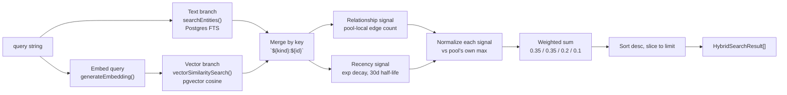

# Retrieval (Hybrid Search)

## Scope

How BOND OS turns a question (or any query string) into a ranked list of candidate material —
entities, document chunks, emails, meetings — before anything is assembled into an AI prompt. Two
files own this end to end:

- `apps/web/features/retrieval/services/hybrid-search.service.ts` — the 4-signal ranker itself,
  `hybridSearch()`.
- `apps/web/features/retrieval/services/retrieval.service.ts` — the permission-checked,
  audit-logged wrapper the rest of the app actually calls, `retrieve()` and `findSimilar()`.

This is the layer [Context Builder](./context-builder.md) assembles on top of, and the layer the
`search` tool in the [RAG pipeline](./rag.md)'s tool-calling loop calls directly. It has nothing to
do with generation: neither file imports anything from `@bond-os/ai`'s provider surface. See
[Embeddings](./embeddings.md) for how the vectors this feature searches are produced, and
[Citation Validation](./citations.md) for what happens to a `HybridSearchResult` once it becomes
something an AI answer can cite.

## Hybrid search: 4 signals, one ranked list

`hybridSearch(organizationId, query, options)` combines text relevance, semantic similarity,
relationship proximity, and recency into a single `score` per candidate:

```ts
const RECENCY_HALF_LIFE_DAYS = 30;
const WEIGHTS = { text: 0.35, semantic: 0.35, relationship: 0.2, recency: 0.1 };
```

These are fixed constants — hand-tuned once, not fit against click data, feedback, or any learned
ranking model.

### Candidate pool

```ts
const limit = options.limit ?? 20;
const candidatePoolSize = limit * 3;
```

Every caller asks for a final `limit` (the [Context Builder](./context-builder.md) always passes
`30`; the `search` tool passes `10`), but the pool of candidates considered *before* ranking is
`3×` that — up to 90 candidates pulled from each branch when the final limit is 30. Only after all
four signals are scored does the pool get sorted and sliced down to `limit`.

### The two candidate-producing branches

Both branches run in parallel and both take `organizationId` as a required first argument, which is
where organization scope is actually enforced (see below):

```ts
const provider = getEmbeddingProvider();
const [textHits, queryVector] = await Promise.all([
  searchEntities(organizationId, query, candidatePoolSize),
  provider.generateEmbedding(query),
]);
const vectorHits = await vectorSimilaritySearch(organizationId, queryVector, { limit: candidatePoolSize });
```

- **Text branch** — `searchEntities` (`packages/database/src/repositories/search.ts`), Postgres
  full-text search: `ts_rank`/`ts_headline` over
  `to_tsvector('english', e.title || ' ' || coalesce(e.description, ''))`, matched with
  `websearch_to_tsquery('english', query)`. Its `ts_rank` score becomes `textScore`. This is the
  **only** text-search branch wired into hybrid search — see [a genuine dead-code gap](#gap-a-second-full-text-search-function-with-no-caller)
  below.
- **Semantic branch** — `provider.generateEmbedding(query)` (whichever
  [embedding provider](./embeddings.md) is configured) followed by `vectorSimilaritySearch`
  (`packages/database/src/repositories/embeddings.ts`), pgvector cosine similarity
  (`1 - (vector <=> queryVector)`) over `Embedding.vector`, ordered nearest-first. Its `similarity`
  becomes `semanticScore`.

### Organization scope is a hard filter, not a signal

The 4 weighted signals above are the entire ranking model — organization scope is deliberately not
one of them. It's enforced as a hard filter inside both branches: `searchEntities(organizationId, …)`
and `vectorSimilaritySearch(organizationId, …)` each filter on `organizationId` in their own SQL
`WHERE` clause. A result can score anywhere on text/semantic/relationship/recency, but it can never
appear at all for the wrong org — there is no weight high enough to let a cross-org match "win."

### Dedup: `${kind}:${id}` as the identity key

```ts
export type RetrievalSourceKind = 'ENTITY' | 'CHUNK' | 'EMAIL' | 'MEETING';
```

Every candidate — from either branch — is keyed by `` `${kind}:${id}` `` in one `Map<string,
HybridSearchResult>` (`byKey`), so a source found by both branches merges into one candidate instead
of appearing twice. Text hits are always keyed `ENTITY:${id}` (a text-search hit is, by construction,
always an `Entity` row). Vector hits are keyed via `sourceTypeToKind`:

```ts
/** NOTE embeddings key off the source Entity's id — the same identity space a plain Entity search hit uses — so a NOTE found by both branches merges into one candidate instead of appearing twice. */
export function sourceTypeToKind(sourceType: EmbeddingSourceType): RetrievalSourceKind {
  return sourceType === 'NOTE' ? 'ENTITY' : sourceType;
}
```

`EmbeddingSourceType` (schema) has 4 values — `CHUNK | NOTE | EMAIL | MEETING` — one more than
`RetrievalSourceKind` has. A NOTE embedding and a plain `Entity` search hit for the same NOTE entity
need to land on the same map key, so `NOTE` maps straight onto `ENTITY`. `CHUNK`/`EMAIL`/`MEETING`
pass through unchanged since those embedding source types have no text-search branch to collide
with.

Merge order: text hits populate the map first; vector hits either update an existing entry's
`semanticScore` (`Math.max` of any repeat — a defensive choice in case a source were ever double
embedded) or insert a brand-new candidate keyed by `` `${sourceTypeToKind(hit.sourceType)}:${hit.sourceId}` ``,
with `title`/`snippet` derived from the embedding's own stored `content` (`hit.content.slice(0, 80)` /
`.slice(0, 240)`) since a vector-only hit has no `Entity` row to read a title from.

### Relationship proximity — pool-local, not graph-wide

Only computed over the entity candidates already sitting in the pool, never a graph-wide degree:

```ts
const idSet = new Set(entityIds);
const connectionCounts = new Map<string, number>();
for (const edge of edges) {
  if (!idSet.has(edge.sourceEntity.id) || !idSet.has(edge.targetEntity.id)) continue;
  connectionCounts.set(edge.sourceEntity.id, (connectionCounts.get(edge.sourceEntity.id) ?? 0) + 1);
  connectionCounts.set(edge.targetEntity.id, (connectionCounts.get(edge.targetEntity.id) ?? 0) + 1);
}
```

`listRelationshipsForEntities(entityIds, organizationId)` (Phase 3's already-batched relationship
lookup, see [Knowledge Graph](../knowledge/graph.md)) fetches every edge touching any entity
candidate, but an edge only counts toward `connectionCounts` if **both** endpoints are already in
this query's own candidate set (`idSet`). A candidate connected to something outside the current
result pool gets no credit for that edge at all — this is "how connected is this candidate to other
things this exact query already surfaced," not "how connected is this entity in general."

This same block also patches in each entity candidate's real `createdAt` via one batched
`prisma.entity.findMany` — the initial text-branch insert uses a placeholder `new Date(0)` because
`searchEntities`'s own result shape doesn't carry `createdAt`.

### Recency — exponential decay, half-life 30 days

```ts
function recencyScore(createdAt: Date): number {
  const ageDays = (Date.now() - createdAt.getTime()) / (1000 * 60 * 60 * 24);
  return Math.pow(0.5, Math.max(ageDays, 0) / RECENCY_HALF_LIFE_DAYS);
}
```

A candidate created today scores `1.0`; one 30 days old scores `0.5`; one 60 days old scores `0.25`.
Already `[0,1]` by construction, so — unlike the other three signals — it never goes through the
normalizer below.

### Normalization: relative to this query's own pool, not a fixed scale

```ts
/** Min-max style normalization against the pool's own max (not a fixed scale) — every signal lands in [0,1] relative to this query's own candidates. */
function normalizer(values: number[]): (value: number) => number {
  const max = Math.max(0, ...values);
  if (max <= 0) return () => 0;
  return (value: number) => Math.max(0, Math.min(1, value / max));
}
```

`textScore` and `semanticScore` are each normalized independently across **all** candidates in the
pool; `relationshipScore` is normalized across just the entity candidates' connection counts. A
`ts_rank` value of `0.4` means something different from one query to the next — normalizing against
the pool's own max, rather than a fixed scale, keeps every signal comparably weighted regardless of
how "sharp" or "flat" that particular query's raw scores happen to be.

### Final score and sort

```ts
candidate.score =
  candidate.textScore * WEIGHTS.text +
  candidate.semanticScore * WEIGHTS.semantic +
  candidate.relationshipScore * WEIGHTS.relationship +
  candidate.recencyScore * WEIGHTS.recency;

return allCandidates.sort((a, b) => b.score - a.score).slice(0, limit);
```



## The Retrieval Engine — "No LLM calls. Only retrieve."

`retrieval.service.ts` wraps `hybridSearch` with the three things beyond ranking itself: query
preprocessing, permission checks, and audit logging.

```ts
function preprocessQuery(raw: string): string {
  return raw.trim().replace(/\s+/g, ' ');
}

export async function retrieve(
  organizationId: string,
  rawQuery: string,
  options: RetrieveOptions = {},
): Promise<HybridSearchResult[]> {
  await requireRole(organizationId, ROLES.MEMBER);

  const query = preprocessQuery(rawQuery);
  if (!query) return [];

  const start = Date.now();
  const results = await hybridSearch(organizationId, query, options);
  const durationMs = Date.now() - start;

  await logAiRequest({
    organizationId,
    action: 'retrieval.search',
    metadata: { query: rawQuery, resultCount: results.length, durationMs },
  });

  return results;
}
```

Preprocessing is deliberately simple — trim and collapse whitespace, nothing NLP-shaped. Every call
is role-gated (`ROLES.MEMBER`) and produces one `AiAuditLog` row with the query, result count, and
timing.

The file's own import list is the actual enforcement mechanism for "No LLM calls. Only retrieve," not
just a comment promising it: `retrieval.service.ts` imports `hybridSearch` (one layer down),
`@bond-os/auth`, `@bond-os/database`, `@bond-os/shared`, and the embedding provider getter (only for
`findSimilar`'s re-embedding) — nothing from `@bond-os/ai`'s generation surface. `@bond-os/embeddings`
(the actual embedding provider implementation) is only ever touched one layer further down, inside
`hybrid-search.service.ts`. A future change that tried to make this file call a generation model would
have to add a new import to do it — there's nothing here to repurpose.

## `findSimilar` — "more like this"

Backs `GET /api/retrieval/similar`. Rather than reading a source's already-stored vector back out of
Postgres, it re-embeds the source's own stored `content`:

```ts
const source = await prisma.embedding.findFirst({
  where: { organizationId, sourceType, sourceId },
  select: { content: true },
});
if (!source) throw new NotFoundError('No embedding found for this source.');

const provider = getEmbeddingProvider();
const vector = await provider.generateEmbedding(source.content);
```

The reason is structural, not a performance choice: `Embedding.vector` is
`Unsupported("vector(1536)")` in the Prisma schema, so there is no typed way to `select` it back out
through the normal client — only `$queryRaw`/`$executeRaw` can touch it, and re-embedding a short
string is cheap enough for an interactive "more like this" lookup that hand-parsing pgvector's raw
text serialization wasn't worth doing here.

`findSimilar` filters the source itself out of its own results and maps hits directly into
`HybridSearchResult` shape with `score: hit.similarity` — this is **pure vector similarity**, not a
4-signal hybrid blend; text relevance, relationship proximity, and recency play no part in "more like
this."

## API surface

`apps/web/app/api/retrieval/`:

| Route | Backs |
|---|---|
| `search` (`GET`) | `retrieve()` — the ranked hybrid-search list |
| `similar` (`GET`) | `findSimilar()` |
| `citations` (`GET`) | `resolveCitationService()`, batched via `Promise.allSettled` over a `refs` array so one bad ref doesn't fail the whole request — see [Citations](./citations.md) |
| `context` (`GET`) | `buildContext()` — see [Context Builder](./context-builder.md) |
| `document` (`GET`) | `getDocumentRetrievalInfoService()` — document-level retrieval metadata, also what `SourcePanel` fetches when a citation points at a chunk |
| `entity` (`GET`) | `getEntityMemoryService()` — entity-level retrieval/memory info, also what `SourcePanel` fetches when a citation points at an entity |

All six follow the same `apiHandler` / `requireActiveOrganizationId` / `parseQueryParams` pattern as
every other route in the codebase. See [API: AI](../api/ai.md) and [API: Search](../api/search.md)
for the full request/response contracts.

## Gap: a second full-text search function with no caller

`packages/database/src/repositories/search.ts` also exports `searchKnowledgeDocumentContent` — a
fully implemented full-text search over `KnowledgeDocument.parsedText` (the actual parsed body text
of an uploaded document, not just its `Entity.title`/`description`):

```ts
/** Searches inside parsed document text, not just title/description. */
export async function searchKnowledgeDocumentContent(
  organizationId: string,
  query: string,
  limit = 5,
): Promise<DocumentContentSearchResult[]>
```

Confirmed by a repo-wide search: this function has **zero callers anywhere in the codebase** outside
its own definition file. It is not wired into `hybridSearch`, not called from any API route. This
means hybrid search's "text relevance" signal only ever matches against `Entity.title`/`description`
via `searchEntities` — a document whose title/description doesn't mention a term, but whose parsed
body text does, will not surface through the text-relevance signal at all. It may still surface
through the semantic/vector signal, but only if that document's chunks were actually embedded (see
[Embeddings](./embeddings.md)) — there is no guaranteed fallback. This is a real, checkable gap in
current coverage, not a design decision documented anywhere as intentional.

## What's deliberately not built

- **No query expansion or synonym handling** beyond what `websearch_to_tsquery`-based FTS already
  does natively — hybrid search adds a second (semantic) signal on top of text search, it doesn't add
  NLP to the text signal itself.
- **No learned or trained ranking model.** `WEIGHTS` is a fixed set of constants tuned by hand once,
  never fit against click data, feedback, or A/B results.
- **No personalization.** Results vary by `organizationId` (the hard filter) and by the query itself,
  never by which user within the org is asking — two members of the same org searching the same query
  get the same ranked list.
- **No cross-organization search of any kind**, by construction — both candidate-producing branches
  require `organizationId` and filter on it in their own SQL, so there is no code path that could even
  accidentally search across orgs.

## See also

- [Context Builder](./context-builder.md) — the only production caller of `retrieve()` that turns
  results into an AI-ready bundle.
- [RAG Pipeline](./rag.md) — where retrieval sits in the end-to-end flow, and how the `search` tool
  calls `retrieve()` directly mid-answer.
- [Citations](./citations.md) — how a `HybridSearchResult` becomes something an AI answer can cite,
  and how that citation is validated before being shown.
- [Embeddings](./embeddings.md) — how the vectors `vectorSimilaritySearch` searches are generated and
  stored.
- [Knowledge Graph](../knowledge/graph.md) — `listRelationshipsForEntities`, the relationship-signal
  data source.
