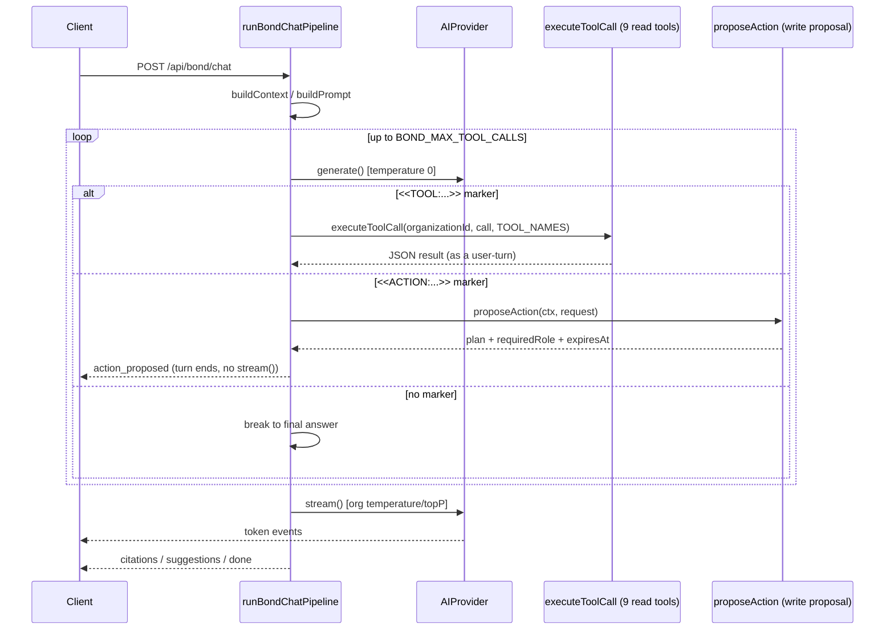

# Tool Calling (LLM Function-Calling Loop)

## Scope

This doc covers the **LLM function-calling mechanism** inside Bond's RAG pipeline — how a model,
mid-answer, asks BOND OS for more information (or proposes a write, or hands off to another agent)
using a plain-text marker convention, and how the pipeline dispatches that marker to real code.

This is **not** the P6 Tool Execution Framework (the approval-gated write-execution system with
`ToolDefinition`/`ToolRegistry`/`ExecutionService` — see [Tools API](../api/tools.md) and
[Approvals](../security/approvals.md) for that). The two meet at exactly one point — the `<<ACTION:...>>`
marker described below *proposes* a write by calling into the Tool Execution Framework's planner —
but the framework's validate/preview/execute/rollback machinery itself is out of scope here.

Read [Providers](./providers.md) first for the `AIProvider`/`GenerateInput` shape this loop is built
on, and [Model Selection](./model-selection.md) for how the `EffectiveAiConfig` driving each call is
resolved.

## Why a marker convention, not native per-provider function calling

BOND OS runs against four interchangeable generation providers (OpenAI, Anthropic, Gemini,
Ollama — [Providers](./providers.md)), each with its own native tool/function-calling wire format:
OpenAI's `tools` array with JSON-schema parameters, Anthropic's `tool_use` content blocks, Gemini's
`functionDeclarations`, Ollama's own partial/model-dependent support. `packages/ai`'s
`GenerateInput` has none of that:

```ts
export interface GenerateInput {
  model: string;
  messages: ChatMessage[];
  temperature?: number;
  maxTokens?: number;
  topP?: number;
}
```

There is no `tools` field, anywhere. Instead, the "protocol" is plain text embedded directly in a
`ChatMessage.content` string: the model is instructed, in prose, by a system message, to emit a
specific marker line when it wants something; the pipeline parses that line back out with a regex.
No provider-specific code exists anywhere in this feature — the identical marker convention works
unmodified against all four providers, because from each provider's perspective it's just an
ordinary chat turn. This keeps the Prompt Builder ([Prompt Builder](./prompt-builder.md))
provider-independent — no per-provider `tools` wire format to maintain.

## Three marker types (current state — this has grown since Phase 5)

The original Phase 5 design had one marker, `<<TOOL:name>>{...}`, strictly read-only. Two more have
since been added, sharing the same `<<WORD:key>>{...}` syntax convention:

| Marker | Introduced | Purpose | Can it write? | Handled in |
|---|---|---|---|---|
| `<<TOOL:name>>{args}` | Phase 5 | Fetch more information before answering | No — structurally cannot (see [below](#the-9-read-tools-and-why-none-can-write)) | Both pipelines |
| `<<ACTION:tool_key>>{params}` or `<<ACTION:plan>>{...}` | Phase 6 | *Propose* a create/update/archive — never executes automatically | Only after a separate, explicit human-approval step outside this loop | Both pipelines |
| `<<DELEGATE:agent_key>>{question, handoff}` | Phase 7 | Consult or hand off to another specialist agent | N/A — routes to another agent's own turn | Agent pipeline only, not Mr. Bond's |

All three are parsed out of the **same non-streamed planning turn** — a single `provider.generate()`
call per iteration — never out of the streamed final answer.

## The two pipelines that implement this loop

Two files implement essentially the same retrieve → prompt → marker-dispatch → stream loop:

- **`apps/web/features/bond/services/rag-pipeline.service.ts`** (`runBondChatPipeline`) — Mr. Bond's
  chat pipeline, the older of the two, supports `TOOL` and `ACTION` markers only.
- **`apps/web/features/agents/services/agent-pipeline.service.ts`** (`runThinkLoop`) — the shared
  multi-agent reasoning engine (Phase 7), a generalization of the same loop that additionally
  supports the `DELEGATE` marker and per-agent `supportedTools`/`minimumRole` gating.

The newer file's own doc comment states "neither pipeline wraps the other; both call the same
primitives" — but this is only partly true today: `rag-pipeline.service.ts` now imports
`buildActionInstructions` and `buildToolInstructions` *from* `agent-pipeline.service.ts`
(`import { buildActionInstructions, buildToolInstructions, NO_MORE_TOOLS_NOTICE } from
'@/features/agents/services/agent-pipeline.service'`) — so the two files are already coupled at the
prompt-text level, even though the two loop implementations themselves remain separate, hand-written
`while` loops with slightly different control flow (see [Differences between the two loops](#differences-between-the-two-loops)
below). A reader documenting "the RAG pipeline" should be aware both files exist and describe closely
related but not identical behavior.

## The 9 read tools, and why none can write

`apps/web/features/bond/services/tool-calling.service.ts`:

```ts
export const TOOL_NAMES = [
  'search', 'graph', 'timeline', 'documents', 'projects',
  'meetings', 'customers', 'emails', 'analytics',
] as const;
export type ToolName = (typeof TOOL_NAMES)[number];
```

The marker itself:

```ts
const TOOL_MARKER = /<<TOOL:([a-zA-Z]+)>>\s*(\{[^\n]*\})/;

export function parseToolCall(text: string): ToolCall | null {
  const match = TOOL_MARKER.exec(text);
  if (!match) return null;
  const [, toolName, argsJson] = match;
  if (!toolName || !isToolName(toolName)) return null;
  try {
    return { tool: toolName, args: JSON.parse(argsJson!) };
  } catch {
    return null;
  }
}
```

Both failure modes — an unrecognized tool name, or invalid JSON in the args object — return `null`,
never throw. A malformed marker can't crash the pipeline; it just means the model's text is used as
its final prose answer instead of a tool call.

Dispatch (`executeToolCall`) is a single, fixed, hardcoded `switch`:

| Tool | Args | Calls |
|---|---|---|
| `search` | `{"query"}` | `retrieve(organizationId, query, { limit: 10 })` |
| `graph` | `{"entityId"}` | `getNeighborsService(organizationId, entityId)` |
| `timeline` | `{"entityId"}` | `getTimelineService(organizationId, entityId, { page: 1, pageSize: 10 })` |
| `documents` | `{"documentId"}` | `getDocumentRetrievalInfoService(organizationId, knowledgeDocumentId)` |
| `projects` | `{"query"}` | `listProjectsService(organizationId, { ...LIST_PAGE, search, sortBy: 'createdAt' })` |
| `meetings` | `{"query"}` | `listMeetingsService(organizationId, { ...LIST_PAGE, search, sortBy: 'meetingDate' })` |
| `customers` | `{"query"}` | `listCustomersService(organizationId, { ...LIST_PAGE, search, sortBy: 'createdAt' })` |
| `emails` | `{"query"}` | `listEmailsService(organizationId, { ...LIST_PAGE, search, sortBy: 'sentAt' })` |
| `analytics` | `{}` | `getGraphAnalyticsService(organizationId)` + `getOrganizationMemoryService(organizationId)` in parallel |

`LIST_PAGE = { page: 1, pageSize: 10, sortDir: 'desc' }` is fixed — the model can supply a search
term but never a page or page size.

Read-only-ness here is a **structural** property, not a prompt instruction:

1. **`ToolCall.tool` is typed, not a free string.** `ToolName` is a union of exactly 9 literals.
   `parseToolCall` only produces a `ToolCall` after `isToolName()` passes — nothing outside those 9
   values can ever reach the switch, regardless of what a model (or an attacker injecting text into
   retrieved content — see [Prompt Injection](../security/prompt-injection.md)) puts inside a
   `<<TOOL:...>>` marker.
2. **The switch is exhaustive and hardcoded**, not a `Record<string, Function>` map a new entry
   could be added to at runtime. The `default` branch enforces this at compile time:
   `const exhaustive: never = call.tool` — a 10th tool cannot be silently dispatched without a
   source change a reviewer would see.
3. **`tool-calling.service.ts` imports zero mutation services.** Every function the 9 branches call
   is a pre-existing `list*`/`get*`/`retrieve` function — none is a `create*`/`update*`/`delete*`
   service. There is nothing importable from this file's import list that could perform a write even
   if the switch's structure were somehow subverted.

The file's own doc comment states the one intentional exception: "the `search` branch's `retrieve()`
call ... writes an `AiAuditLog` row via `logAiRequest` — bookkeeping, never a domain/business-data
table."

### The `allowedTools` parameter (Phase 7 addition)

`executeToolCall`'s current signature is:

```ts
export async function executeToolCall(
  organizationId: string,
  call: ToolCall,
  allowedTools: readonly ToolName[],
): Promise<string> {
  if (!allowedTools.includes(call.tool)) {
    return JSON.stringify({ error: `Tool "${call.tool}" is not available to this agent.` });
  }
  switch (call.tool) { /* ... */ }
}
```

This third parameter is "the caller's real permission boundary, not just a prompt suggestion" (the
function's own comment) — a per-agent `supportedTools` allowlist means nothing if any caller could
still invoke any of the 9 tools regardless of what the prompt told the model. `runBondChatPipeline`
always passes the full `TOOL_NAMES` set (identical to pre-Phase-7 behavior); specialist agents pass
their own narrower `descriptor.supportedTools`.

## The `<<ACTION:...>>` marker — proposing, never executing, a write

`apps/web/features/planner/services/intent-detection.service.ts` defines a second marker in a
completely separate file/regex, deliberately kept out of `tool-calling.service.ts`:

```ts
const ACTION_MARKER = /<<ACTION:([a-zA-Z_]+)>>\s*(\{[^\n]*\})/;

export function containsActionMarker(text: string): boolean {
  return ACTION_MARKER.test(text);
}

export function parseActionCall(text: string): PlanRequest | null {
  // <<ACTION:tool_key>>{...params} -> a single-tool action
  // <<ACTION:plan>>{"summary":"...","steps":[...]} -> a compound, multi-step plan
}
```

When a planning turn contains this marker, the pipeline calls `proposeAction()`
(`apps/web/features/planner/services/plan-proposal.service.ts`), which builds and validates a plan
via `PlannerService` and requests human approval via `ApprovalService` — **it never calls an
executor**. `rag-pipeline.service.ts`'s own doc comment on `proposeWriteAction` makes the guarantee
explicit: content shown to the user is "built entirely from the plan's own validated steps + tool
registry metadata ... never from the model's raw marker text — mirroring how citations are
validated against real retrieved data rather than trusted from LLM output." The turn then **ends
immediately** — `return` inside the async generator — with no `provider.stream()` call, no
citations, no `done` event; instead a `BondStreamEvent` of type `action_proposed` is yielded, and a
deterministic `ASSISTANT` message describing the proposal (never the model's own text) is persisted.

```ts
const hasAction = containsActionMarker(plan.content);
const toolCall = hasAction ? null : parseToolCall(plan.content);

if (hasAction) {
  const actionRequest = parseActionCall(plan.content);
  if (actionRequest) {
    const proposedEvent = await proposeWriteAction({ organizationId, userId, conversationId }, actionRequest);
    yield proposedEvent;
    // ... audit log ...
    return; // turn ends here — no stream() call this turn
  }
  break; // malformed action -> fall through to a final prose answer
}
```

The instruction text sent to the model is built dynamically from the **live write-tool registry**
(`buildActionInstructions()`, now living in `agent-pipeline.service.ts` — see
[below](#instruction-text-now-lives-in-agent-pipelineservicets)), not a hardcoded string — Phase 6's
"AI must never hardcode tool names" requirement — and states directly: *"This NEVER executes anything
by itself — the user must explicitly approve it afterward."*

### What this means for the Phase 5 "read-only" claim

`docs/rag.md`, `docs/tool-calling.md` (the older, flat Phase 5 doc this file supersedes for the
function-calling mechanism), and `docs/mr-bond.md` describe `runBondChatPipeline` as strictly
read-only: "no code path from a tool call to any write operation ... NO write operations." That
claim is still true of the **`<<TOOL:...>>` marker path** specifically — see the structural argument
above. It is no longer the accurate description of **the pipeline as a whole**, because the `<<ACTION:...>>`
path exists in the same function today. The precise, current statement is:

> Mr. Bond's *automatic*, per-turn behavior is still read-only — nothing reachable from a `<<TOOL:...>>`
> marker can write. But the pipeline as a whole can now **propose** a write action that a human must
> separately approve, through a completely different marker and a completely different code path
> (`proposeAction` → `PlannerService`/`ApprovalService`), before anything actually executes.

The schema itself documents this framing directly (`packages/database/prisma/schema.prisma`, Phase 6
section header): *"A generic, approval-gated framework so Mr. Bond can propose and — only after
explicit user approval — execute writes. The read-only tool-calling path from Phase 5 ... is
untouched by this section entirely."* See [Approvals](../security/approvals.md) and
[Tools API](../api/tools.md) for what happens after a proposal is approved.

## The `<<DELEGATE:...>>` marker — agent pipeline only

`agent-pipeline.service.ts` adds a third marker, not present in `rag-pipeline.service.ts` at all:

```ts
const DELEGATE_MARKER = /<<DELEGATE:([a-zA-Z0-9_]+)>>\s*(\{[^\n]*\})/;
```

`{"question": "...", "handoff": false}` consults another agent and folds its answer back in as a
tool-result-shaped turn (the loop continues); `{"handoff": true}` transfers the rest of the
conversation to the target agent entirely (`yield* runThinkLoop(targetAgent, ...)`, then `return`).
This is out of scope for Mr. Bond's own chat pipeline — see [Delegation](../agents/delegation.md) for
the full mechanism, including `DelegationBudget`'s cycle detection and the
`AGENT_MAX_DELEGATION_DEPTH` backstop.

## Instruction text now lives in `agent-pipeline.service.ts`

The Phase 5-era `TOOL_INSTRUCTIONS` hardcoded string has been replaced by parameterized builder
functions, all in `agent-pipeline.service.ts` (imported by `rag-pipeline.service.ts` where relevant):

```ts
export function buildToolInstructions(allowedTools: readonly ToolName[]): string {
  if (allowedTools.length === 0) return 'You have no read tools available for this turn.';
  const hints = allowedTools.map((name) => TOOL_ARG_HINTS[name]).join(', ');
  return [
    'You may call one read-only tool per turn if you need more information before answering.',
    'To do so, reply with ONLY a single line in this exact form: <<TOOL:name>>{"arg":"value"}',
    `Available tools: ${hints}.`,
    'Do not call a tool if the Context above already answers the question.',
    'When you have enough information, answer in prose, citing sources with their [ref] markers exactly as given.',
  ].join(' ');
}

export function buildActionInstructions(): string {
  const tools = getToolRegistryService().list(); // the live write-tool registry, not a fixed string
  // ... "This NEVER executes anything by itself — the user must explicitly approve it afterward." ...
}

function buildDelegateInstructions(availableAgents: AgentDescriptor[]): string {
  // only called from agent-pipeline.service.ts's own loop
}
```

Given the full `TOOL_NAMES` set, `buildToolInstructions` reproduces Mr. Bond's original hardcoded
text verbatim — a narrower per-agent `supportedTools` just yields a shorter hint list in the prompt;
the real per-agent boundary is `executeToolCall`'s `allowedTools` check (above), not this prompt
text.

## The bounded loop (Mr. Bond's version)

`BOND_MAX_TOOL_CALLS` (`packages/shared/src/env.ts`, default `3`, range `0`-`10`) caps how many
planning turns one answer can spend. The tool/action machinery is only wired up at all when it's
greater than zero:

```ts
let messages: ChatMessage[] = [...built.messages];
const maxToolCalls = getEnv().BOND_MAX_TOOL_CALLS;
let toolCallsUsed = 0;

if (maxToolCalls > 0) {
  messages = [
    messages[0]!,
    { role: 'system', content: buildToolInstructions(TOOL_NAMES) },
    { role: 'system', content: buildActionInstructions() },
    ...messages.slice(1),
  ];

  while (toolCallsUsed < maxToolCalls) {
    yield { type: 'status', stage: 'planning', detail: { attempt: toolCallsUsed + 1 } };

    const plan = await provider.generate({ model: config.model, messages, temperature: 0, maxTokens: config.maxTokens });

    const hasAction = containsActionMarker(plan.content);
    const toolCall = hasAction ? null : parseToolCall(plan.content);

    if (hasAction) {
      // ... proposeWriteAction, yield action_proposed, return — see above
    }
    if (!toolCall) break;

    yield { type: 'status', stage: 'tool_call', detail: { tool: toolCall.tool } };
    const toolResult = await executeToolCall(organizationId, toolCall, TOOL_NAMES);
    messages.push({ role: 'assistant', content: plan.content });
    messages.push({ role: 'user', content: `Tool result for ${toolCall.tool}:\n${toolResult}` });
    toolCallsUsed += 1;
  }

  if (toolCallsUsed >= maxToolCalls) {
    messages.push({ role: 'system', content: NO_MORE_TOOLS_NOTICE });
  }
}
```

Action markers take precedence over, and are mutually exclusive with, tool markers each iteration —
the comment in the source states this: a response containing both is treated as malformed, falling
through to the no-tool-call `break` rather than acting on either. `BOND_MAX_TOOL_CALLS=0` disables
the whole loop — the tool/action instruction messages are never even added, so the model is never
told any of this exists. Otherwise the loop runs at most `maxToolCalls` iterations, each either
finding a tool call (appends two messages: the model's own marker turn, then the tool's JSON result
as a `user` turn) or finding nothing and breaking to the final answer. If the cap is hit without a
plain-text answer, `NO_MORE_TOOLS_NOTICE` ("No more tool calls are available. Answer now using only
the information already gathered.") is appended — the loop can never spin forever.

## Differences between the two loops

`agent-pipeline.service.ts`'s `runThinkLoop` is the same shape with three additions:

- **A three-way marker check per iteration**, not a two-way one: it counts how many of
  `containsActionMarker`, `containsDelegateMarker`, and `parseToolCall(...) !== null` are truthy; if
  **more than one** kind is present in the same turn, it's treated as malformed and the loop breaks
  to a final prose answer (`rag-pipeline.service.ts` doesn't need this — it only ever checks two
  marker kinds, action-first).
- **`DelegationBudget`**: `budget.toolCallsRemaining` is decremented alongside `toolCallsUsed` on
  every tool/action/delegate iteration, and delegation specifically calls `enterDelegation(budget, ...)`
  (cycle detection + depth cap) before recursing — see [Delegation](../agents/delegation.md).
  Resolving the target agent happens *before* `enterDelegation` mutates state, so a hallucinated or
  nonexistent agent key never consumes real delegation-depth budget.
- **`ThinkOptions.persist`**: a `delegate()` consult sub-call runs with `persist: false` — no
  `Message` row, no citations/suggestions/`done` events for an answer the user never sees as its own
  turn; only `handoff()` and top-level calls persist.

## Planning turns are non-streamed; only the final turn streams

Every planning-turn call uses `provider.generate()` (a single `Promise<GenerateResult>`), never
`provider.stream()`, for two structural reasons:

- **The marker has to be parsed as a whole.** A streamed response arrives as arbitrary token-sized
  chunks that could split a marker anywhere (mid-tool-name, mid-JSON); `generate()` returns the full
  `plan.content` in one shot, so parsing is a single synchronous regex match.
- **The user should never see a raw marker line.** If a planning turn's tokens were streamed the
  client would flash `<<TOOL:search>>{"query":"..."}` before the pipeline had a chance to intercept
  it. Keeping every planning turn non-streamed means only fully-formed, already-marker-free content
  ever reaches the client.

`temperature: 0` on every planning call is also deliberate — "should I call a tool, and which one"
is meant to be as deterministic as the provider allows, unlike the final answer, which uses the
org's actual configured `temperature`/`topP` (see [Model Selection](./model-selection.md)).

Only once the loop exits does the pipeline call `provider.stream()`, exactly once, for the turn
whose tokens are actually yielded to the client as `{ type: 'token' }` events. So a single answer
makes at most `maxToolCalls + 1` provider calls: up to `maxToolCalls` non-streamed `generate()`
planning turns, followed by exactly one streamed `stream()` turn (unless an `ACTION` marker ends the
turn early with no `stream()` call at all).



## A gap: `sanitizeRetrievedText` only neutralizes `<<TOOL:`, not `<<ACTION:`/`<<DELEGATE:`

`apps/web/features/ai/services/prompt-builder.service.ts` neutralizes the literal tool-marker prefix
in anything sourced from retrieved content (chunk text, entity descriptions, connected-entity
titles, timeline descriptions, etc.) before it's joined into the prompt:

```ts
function sanitizeRetrievedText(text: string): string {
  return text.replace(/<<TOOL:/gi, '<<TOOL_');
}
```

This closes off a real prompt-injection vector structurally: if an ingested document happens to
contain the literal substring `<<TOOL:search>>{...}`, the model could otherwise reproduce it
verbatim from the shown context and trigger a real (if still read-only, still org-scoped) tool call.
**It does not do the same for `<<ACTION:` or `<<DELEGATE:`** — both later marker types use the
identical `<<WORD:name>>{...}` syntax convention but this function was not updated when they were
added. Retrieved org content containing a literal `<<ACTION:...>>` or `<<DELEGATE:...>>` substring is
not neutralized before being shown to the model. The practical impact is bounded — an action marker
can only *propose* a write requiring separate human approval, it can never auto-execute, and a
delegate marker only routes to another already-trusted internal agent — but it is a real, checkable
asymmetry worth flagging for anyone doing prompt-injection threat modeling. See
[Prompt Injection](../security/prompt-injection.md).

## What's deliberately not built

- **No native per-provider function calling** — see [above](#why-a-marker-convention-not-native-per-provider-function-calling).
- **No parallel tool calls** — one marker per planning turn, strictly sequential.
- **No tool call inside a tool result** — a tool's JSON result is appended as a plain `user`-role
  message; nothing in `executeToolCall` itself can trigger a further tool call, though the model can
  choose to call another tool on the *next* planning iteration (up to the cap).
- **No dynamic, runtime-configurable read-tool registry** — `TOOL_NAMES` is a compile-time constant
  tuple; adding a 10th read tool requires a source change. (The **write**-tool side, via `<<ACTION:...>>`,
  is dynamic — see [Tools API](../api/tools.md).)
- **No admin UI to reconfigure `BOND_MAX_TOOL_CALLS`/`AGENT_MAX_DELEGATION_DEPTH` per-org** — both
  are process-wide environment variables.

## Related docs

- [Providers](./providers.md) — the `AIProvider` interface these loops call.
- [Model Selection](./model-selection.md) — how `config.model`/`config.temperature`/etc. are resolved
  before the loop starts.
- [RAG Pipeline](./rag.md) — the full retrieve → prompt → generate pipeline this loop sits inside.
- [Prompt Builder](./prompt-builder.md) — `sanitizeRetrievedText` and the injection-guard system
  message.
- [Citations](./citations.md) — how the final streamed answer's `[ref]` markers are validated.
- [Agents Overview](../agents/overview.md) and [Delegation](../agents/delegation.md) — the
  `DELEGATE` marker's home.
- [Approvals](../security/approvals.md) and [Tools API](../api/tools.md) — what happens after an
  `ACTION` marker proposes a plan.
- [Prompt Injection](../security/prompt-injection.md) — the sanitization gap noted above.
