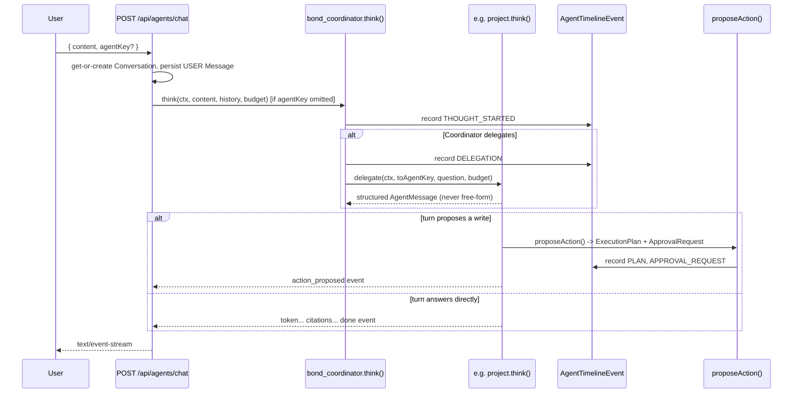
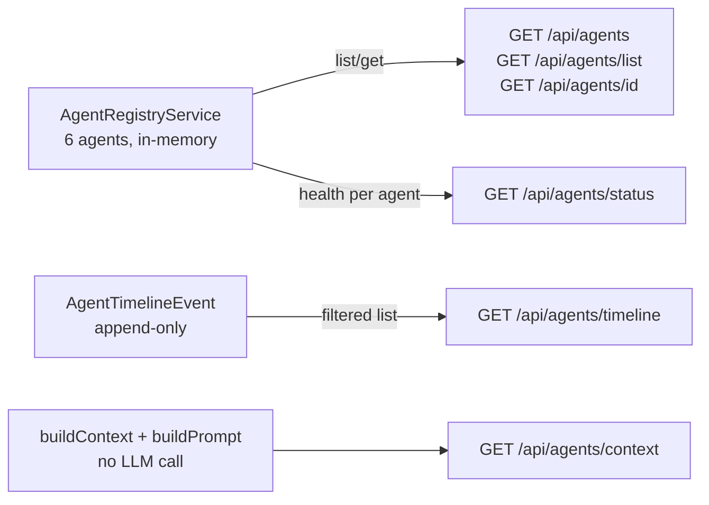

# Agents API

API reference for `/api/agents/**` — Phase 7, the Multi-Agent Architecture. Mr. Bond becomes a
Coordinator (`bond_coordinator`) over 5 specialist agents; every request first reaches the
Coordinator (or an explicitly named agent), which may delegate or hand off to a specialist
mid-turn. Every write an agent proposes still flows through the **unmodified** Phase 6 chain — no
agent ever calls a `Tool.execute()` directly; that remains `ExecutionService`'s sole
responsibility. See [Tools & Execution API](./tools.md) for that chain, and
[Overview](../agents/overview.md), [Base Agent](../agents/base-agent.md),
[Registry](../agents/registry.md), [Routing](../agents/routing.md),
[Delegation](../agents/delegation.md), [Goals](../agents/goals.md),
[Insights](../agents/insights.md), and [Communication](../agents/communication.md) for the
underlying design, plus the phase-era docs [agents.md](../agents.md),
[multi-agent.md](../multi-agent.md), [base-agent.md](../base-agent.md),
[agent-registry.md](../agent-registry.md), [delegation.md](../delegation.md),
[goals.md](../goals.md), and [insights.md](../insights.md).

**13 endpoints total**, including 1 literal route alias.

## Conventions

Same envelope, pagination, and error-mapping conventions as
[Tools & Execution API](./tools.md#conventions) apply throughout. Specific to this surface:

- Every mutating route calls `assertSameOrigin(request)`.
- Exactly one route in this surface is rate-limited: `POST /api/agents/chat` at 20 requests/60s —
  the same limit `POST /api/bond/chat` uses, since each turn can involve several LLM round-trips
  (planning, delegation, the final generation stream).
- **No automated tests exist for this surface** — see [Tools & Execution API](./tools.md#conventions).
- Registry backing this whole surface: exactly **6 registered agents**
  (`apps/web/features/agents/registry.ts:20`) — `bond_coordinator` plus 5 specialists:
  `project_agent`, `sales_agent`, `operations_agent`, `knowledge_agent`, `finance_agent`. Adding an
  agent is a source-code change (`ALL_AGENTS` is a literal array); there is no dynamic/plugin agent
  registration.
- **Agent-to-agent communication is always structured, never free-form.** `AgentMessage`
  (`apps/web/features/agents/lib/agent-message.ts`) is a discriminated union
  (`Request | Response | Delegation | Observation | Summary | Plan | Error | ApprovalRequest`) —
  this is the spec requirement "agents never exchange free-form prompts," made structural.

---

## `GET /api/agents` — Agent Discovery

**Method / Path**: `GET /api/agents`
**File**: `apps/web/app/api/agents/route.ts`
**Auth**: `requireActiveOrganizationId()` (route) → `listAgentsService` internally calls
`requireRole(organizationId, ROLES.MEMBER)` (`apps/web/features/agents/services/agent-discovery.service.ts:30`).

Maps the live in-memory `AgentRegistryService` to a plain, serializable shape — mirrors
`GET /api/tools` exactly.

### Response — `200`

`data: AvailableAgent[]`:

```ts
interface AvailableAgent {
  agentKey: string;
  version: string;
  name: string;
  displayName: string;
  description: string;
  avatar: string;
  category: string; // COORDINATOR | PROJECT | SALES | OPERATIONS | KNOWLEDGE | FINANCE
  capabilities: string[];
  supportedTools: string[]; // toolKeys this agent may propose plans against
  supportedKnowledge: string[];
  priority: number;
  minimumRole: string; // Role
}
```

```json
{
  "success": true,
  "data": [
    {
      "agentKey": "bond_coordinator",
      "version": "1",
      "name": "bond_coordinator",
      "displayName": "Mr. Bond",
      "description": "Routes every request to the right specialist, or answers directly for general/cross-domain questions.",
      "avatar": "Bot",
      "category": "COORDINATOR",
      "capabilities": ["routing", "general_qa", "delegation", "action_proposals"],
      "supportedTools": ["create_project", "update_project", "create_task", "create_meeting", "archive_project"],
      "supportedKnowledge": ["General", "Organization Overview", "Cross-domain Routing"],
      "priority": 100,
      "minimumRole": "MEMBER"
    },
    {
      "agentKey": "project_agent",
      "version": "1",
      "name": "project_agent",
      "displayName": "Project Agent",
      "description": "Specialist in projects, tasks, roadmaps, milestones, sprint planning, and dependencies.",
      "avatar": "FolderKanban",
      "category": "PROJECT",
      "capabilities": ["project_planning", "task_tracking", "dependency_analysis"],
      "supportedTools": ["create_project", "update_project", "create_task", "archive_project"],
      "supportedKnowledge": ["Projects", "Tasks", "Roadmaps", "Milestones", "Sprint Planning", "Dependencies"],
      "priority": 50,
      "minimumRole": "MEMBER"
    }
  ]
}
```

`priority` is what `AgentRegistryService.list()` sorts by (descending) — `bond_coordinator` is
`100`, every specialist agent is `50` (verified across all 5 specialist definition files), so the
Coordinator always sorts first in `GET /api/agents`'s response.

### Errors

| Status | Code | When |
|---|---|---|
| 401 | `AUTH_ERROR` | No session / no active organization. |
| 403 | `FORBIDDEN` | Not a member of the active org. |

---

## `GET /api/agents/list` — Alias of `GET /api/agents`

**Method / Path**: `GET /api/agents/list`
**File**: `apps/web/app/api/agents/list/route.ts` — the entire file body is:

```ts
// Spec requires both `GET /api/agents` and `GET /api/agents/list` to work identically.
export { GET } from '../route';
```

A **literal re-export**, not a separate implementation. Identical auth, response shape, and errors
to `GET /api/agents` above — required by the spec to keep both names working.

---

## `GET /api/agents/[id]` — Get One Agent

**Method / Path**: `GET /api/agents/{id}`
**File**: `apps/web/app/api/agents/[id]/route.ts`
**Auth**: `requireActiveOrganizationId()` → `getAgentService` (internally calls
`listAgentsService`, so `MEMBER`-gated identically).

**`{id}` is actually an `agentKey`** (e.g. `project_agent`, `bond_coordinator`), not a database row id —
the registry has no separate row-id lookup for this.

### Path params

| Param | Meaning |
|---|---|
| `id` | An `agentKey` |

### Response — `200`

`data: AvailableAgent` (single object, same shape as list items above).

### Errors

| Status | Code | When |
|---|---|---|
| 401 / 403 | `AUTH_ERROR` / `FORBIDDEN` | Auth/role failures. |
| 404 | `NOT_FOUND` | `id` doesn't match any registered `agentKey`. |

---

## `POST /api/agents/chat` — Multi-Agent Chat (SSE)

**Method / Path**: `POST /api/agents/chat`
**File**: `apps/web/app/api/agents/chat/route.ts`
**Auth**: `assertSameOrigin` → `requireAuth()` → `requireActiveOrganizationId()`; the pipeline
itself re-checks `requireRole(organizationId, ROLES.MEMBER)`
(`apps/web/features/agents/services/agent-chat.service.ts:25`).
**Rate limit**: 20 requests / 60 seconds.

The multi-agent pipeline's entry point. Structurally identical to `POST /api/bond/chat`
(get-or-create the `Conversation`, persist the `USER` message, load recent history), then hands
off to whichever `AgentDefinition.think()` is selected: an explicit `agentKey`, or the Coordinator
(`bond_coordinator`) by default — which may itself hand off to a specialist on its very first
planning turn (spec: "every request first reaches Mr. Bond").

### Body — `agentChatSchema`

```ts
{
  conversationId?: string; // omit to start a new conversation
  content: string; // 1-8000 chars, trimmed, required
  agentKey?: string; // omit to let the Coordinator auto-route
}
```

### Example request

```json
{ "content": "What's the status of the Q3 Onboarding Revamp project?" }
```

### Response — SSE stream (`Content-Type: text/event-stream`)

Each event is `data: <json>\n\n`, never the `{success,data}` envelope. Event union
(`apps/web/features/agents/lib/agent-message.ts`):

```ts
type AgentStreamEvent =
  | { type: 'status'; agentKey: string; stage: 'retrieving' | 'planning' | 'tool_call' | 'delegating' | 'generating'; detail?: Record<string, unknown> }
  | { type: 'token'; agentKey: string; text: string }
  | { type: 'citations'; agentKey: string; citations: BondCitation[] }
  | { type: 'suggestions'; agentKey: string; questions: string[] }
  | { type: 'done'; agentKey: string; conversationId: string; messageId: string; model: string; tokenUsage: { promptTokens: number; completionTokens: number; totalTokens: number } }
  | { type: 'action_proposed'; agentKey: string; conversationId: string; messageId: string; planId: string; summary: string; steps: Array<{ key: string; toolKey: string; displayName: string; summary: string }>; requiredRole: string; estimatedTimeMs: number; rollbackStrategy: string; expiresAt: string }
  | { type: 'error'; agentKey: string | null; message: string };
```

Typical Q&A turn:

```
data: {"type":"status","agentKey":"bond_coordinator","stage":"delegating","detail":{"toAgentKey":"project_agent"}}

data: {"type":"status","agentKey":"project_agent","stage":"retrieving"}

data: {"type":"token","agentKey":"project_agent","text":"The Q3 Onboarding Revamp "}
data: {"type":"token","agentKey":"project_agent","text":"project is currently ACTIVE..."}

data: {"type":"citations","agentKey":"project_agent","citations":[{"ref":"proj:abc123","title":"Q3 Onboarding Revamp","snippet":"..."}]}

data: {"type":"done","agentKey":"project_agent","conversationId":"conv_44d1...","messageId":"msg_c02a...","model":"claude-sonnet-4-5","tokenUsage":{"promptTokens":812,"completionTokens":94,"totalTokens":906}}
```

A turn that results in a proposed write ends in `action_proposed` instead of `done` — the exact
same plan shape `POST /api/execution/plan` returns (see the [Tools & Execution API](./tools.md)):

```
data: {"type":"status","agentKey":"project_agent","stage":"tool_call"}

data: {"type":"action_proposed","agentKey":"project_agent","conversationId":"conv_44d1...","messageId":"msg_d3f0...","planId":"plan_9a1b...","summary":"Create task \"Follow up on onboarding docs\"","steps":[{"key":"step_1","toolKey":"create_task","displayName":"Create Task","summary":"Create task \"Follow up on onboarding docs\""}],"requiredRole":"MEMBER","estimatedTimeMs":1200,"rollbackStrategy":"AUTOMATIC","expiresAt":"2026-07-20T14:32:00.000Z"}
```

Same pre-stream vs. in-stream error split as `POST /api/execution/[id]/approve` (see the
[Tools & Execution API](./tools.md)) — auth, validation, or not-found errors before the first event
return as a normal `{success:false,...}` JSON response; only a failure after the first successful
event becomes a terminal `{"type":"error",...}` SSE event.

### Errors (pre-stream)

| Status | Code | When |
|---|---|---|
| 401 | `AUTH_ERROR` | No session / no active organization. |
| 403 | `FORBIDDEN` | Missing/mismatched `Origin`, or not a member. |
| 404 | `NOT_FOUND` | `conversationId` supplied but doesn't exist in this org, or `agentKey` supplied but unregistered, or the Coordinator itself isn't registered. |
| 422 | `VALIDATION_ERROR` | Empty/over-length `content`. |
| 429 | `RATE_LIMITED` | More than 20 turns in 60s from this client. |

### Notes

- Structurally the agent-layer analogue of `POST /api/bond/chat` — kept as a distinct pipeline
  (not a thin wrapper) since `AgentStreamEvent` carries an `agentKey` on every variant, which
  matters once more than one agent can speak in a single turn.
- Delegation within a turn is bounded by a fresh, per-turn `DelegationBudget`
  (`createRootDelegationBudget`) — see [Delegation](../agents/delegation.md).

---

## `GET /api/agents/context` — Context Preview (Introspection Only)

**Method / Path**: `GET /api/agents/context`
**File**: `apps/web/app/api/agents/context/route.ts`
**Auth**: `requireActiveOrganizationId()` (route) → `previewAgentContextService` internally calls
`requireRole(organizationId, ROLES.MEMBER)` (`apps/web/features/agents/services/agent-context-preview.service.ts:34`).

Runs the **exact same** retrieval (`buildContext`) and prompt-assembly (`buildPrompt`) primitives
a real turn would use — but **never calls the AI provider and persists nothing**. Purely for
debugging what an agent would actually retrieve/prompt with for a given question.

### Query params — `agentContextQuerySchema`

| Field | Type | Notes |
|---|---|---|
| `q` | string (1-8000 chars) | required — the question to preview retrieval for |
| `agentKey` | string | optional — omit to preview the Coordinator |

### Response — `200`

```ts
interface AgentContextPreview {
  agentKey: string;
  displayName: string;
  availableTools: string[];
  supportedKnowledge: string[];
  retrievedSources: Array<{ ref: string; title: string; snippet: string }>;
  estimatedPromptTokens: number;
  truncated: boolean;
}
```

```json
{
  "success": true,
  "data": {
    "agentKey": "project_agent",
    "displayName": "Project Specialist",
    "availableTools": ["create_project", "update_project", "create_task", "archive_project"],
    "supportedKnowledge": ["PROJECTS", "TASKS"],
    "retrievedSources": [
      { "ref": "proj:abc123", "title": "Q3 Onboarding Revamp", "snippet": "Status: ACTIVE. Priority: MEDIUM..." }
    ],
    "estimatedPromptTokens": 918,
    "truncated": false
  }
}
```

### Errors

| Status | Code | When |
|---|---|---|
| 401 / 403 | `AUTH_ERROR` / `FORBIDDEN` | Auth/role failures. |
| 404 | `NOT_FOUND` | `agentKey` supplied but unregistered, the Coordinator isn't registered, or the organization doesn't resolve. |
| 422 | `VALIDATION_ERROR` | Empty/over-length `q`. |

### Notes

- Reuses the identical `buildContext`/`buildPrompt` primitives `agent-pipeline.service.ts` uses
  for a real turn — this preview can never drift out of sync with what a real turn would actually
  retrieve, because it isn't a separate reimplementation.

---

## `POST /api/agents/delegate` — Explicit Delegation Hop

**Method / Path**: `POST /api/agents/delegate`
**File**: `apps/web/app/api/agents/delegate/route.ts`
**Auth**: `assertSameOrigin` → `requireAuth()` → `requireActiveOrganizationId()` →
`runDelegateRequestService` internally calls `requireRole(organizationId, ROLES.MEMBER)`
(`apps/web/features/agents/services/agent-delegate.service.ts:29`).

Explicit admin/debug invocation of a single delegation hop between two named agents — also what
the Delegation Graph UI's "replay" affordance calls.

### Body — `delegateRequestSchema`

```ts
{
  fromAgentKey: string;
  toAgentKey: string;
  message: string; // 1-8000 chars
  handoff: boolean; // default false
  conversationId?: string;
}
```

`handoff: false` calls `fromAgent.delegate(...)` (returns one final answer). `handoff: true` calls
`fromAgent.handoff(...)` and drains its own stream, concatenating every `token` event into
`answer`.

### Example request

```json
{ "fromAgentKey": "bond_coordinator", "toAgentKey": "sales_agent", "message": "What's the pipeline value for Acme Corp?", "handoff": false }
```

### Response — `201`

```ts
interface DelegateResult {
  fromAgentKey: string;
  toAgentKey: string;
  handoff: boolean;
  answer: string;
}
```

```json
{
  "success": true,
  "data": {
    "fromAgentKey": "bond_coordinator",
    "toAgentKey": "sales_agent",
    "handoff": false,
    "answer": "Acme Corp's open pipeline value is $48,000 across 2 deals."
  }
}
```

### Errors

| Status | Code | When |
|---|---|---|
| 401 | `AUTH_ERROR` | No session / no active organization. |
| 403 | `FORBIDDEN` | Missing/mismatched `Origin`, or not a member. |
| 404 | `NOT_FOUND` | `fromAgentKey` or `toAgentKey` isn't registered. |
| 422 | `VALIDATION_ERROR` | Malformed body. |

### Notes

- Builds a **fresh** root `DelegationBudget` seeded with `fromAgentKey` — not shared with any
  other in-flight turn's budget. This is a standalone one-hop call, not a continuation of an
  existing conversation's delegation chain.
- Whatever `AgentTimelineEvent`/`Message` side effects `delegate()`/`handoff()` already produce are
  the only persistence this endpoint causes — the service adds none of its own.

---

## `GET /api/agents/status` — Agent Health

**Method / Path**: `GET /api/agents/status`
**File**: `apps/web/app/api/agents/status/route.ts`
**Auth**: `requireActiveOrganizationId()` (route) → `getAgentStatusService` internally calls
`requireRole(organizationId, ROLES.MEMBER)` (`apps/web/features/agents/services/agent-discovery.service.ts:63`).

### Response — `200`

`data: AgentStatus[]`, one entry per registered agent, `health` from each agent's own real
`health()` method (which itself checks the configured AI provider) — **no fabricated
uptime/metrics**.

```ts
interface AgentStatus {
  agentKey: string;
  displayName: string;
  health: AgentHealthStatus;
}

interface AgentHealthStatus {
  healthy: boolean;
  registryStatus: 'ACTIVE' | 'DISABLED';
  providerHealthy: boolean;
  message?: string;
  latencyMs?: number;
}
```

```json
{
  "success": true,
  "data": [
    { "agentKey": "bond_coordinator", "displayName": "Mr. Bond", "health": { "healthy": true, "registryStatus": "ACTIVE", "providerHealthy": true, "latencyMs": 142 } },
    { "agentKey": "project_agent", "displayName": "Project Agent", "health": { "healthy": true, "registryStatus": "ACTIVE", "providerHealthy": true, "latencyMs": 138 } }
  ]
}
```

### Errors

| Status | Code | When |
|---|---|---|
| 401 / 403 | `AUTH_ERROR` / `FORBIDDEN` | Auth/role failures. |

---

## `GET /api/agents/timeline` — Agent Timeline

**Method / Path**: `GET /api/agents/timeline`
**File**: `apps/web/app/api/agents/timeline/route.ts`
**Auth**: `requireActiveOrganizationId()` (route) → `AgentTimelineService.list` →
`requireRole(organizationId, ROLES.MEMBER)` (`agent-timeline.service.ts:149`).

Explicitly called out in the route file's own comment as **not in the original spec's enumerated
endpoint list, but required** — this is what the Delegation Graph UI queries (with
`eventType=DELEGATION`) to render the live delegation graph.

### Query params — `agentTimelineQuerySchema`

| Field | Type | Default | Notes |
|---|---|---|---|
| `page` | number | `1` | |
| `pageSize` | number | `20` | max `100` |
| `conversationId` | string | — | optional |
| `agentId` | string | — | optional; the `Agent` table row id, not an `agentKey` |
| `eventType` | enum | — | optional: `THOUGHT_STARTED, RETRIEVAL, DELEGATION, PLAN, APPROVAL_REQUEST, EXECUTION, COMPLETION` |

### Response — `200`

`data: PaginatedResult<AgentTimelineEventItem>` — `id, organizationId, agentId, conversationId,
goalId, eventType, metadata, createdAt`. `metadata` is always one of 7 explicit, allowlisted DTOs
per `eventType` — **never** a raw prompt/completion string (spec: "store structured events only,
never chain-of-thought"). For example, `THOUGHT_STARTED`'s metadata is `{ inputPreview: string }`,
truncated to 200 characters — the same content already visible in the persisted `Message`, never
internal reasoning.

```json
{
  "success": true,
  "data": {
    "items": [
      {
        "id": "evt_te_1",
        "organizationId": "org_1a2b...",
        "agentId": "agent_row_5f...",
        "conversationId": "conv_44d1...",
        "goalId": null,
        "eventType": "DELEGATION",
        "metadata": { "toAgentKey": "project_agent", "toAgentDisplayName": "Project Agent", "handoff": false },
        "createdAt": "2026-07-20T14:00:01.200Z"
      }
    ],
    "page": 1,
    "pageSize": 20,
    "total": 1,
    "totalPages": 1
  }
}
```

### Errors

| Status | Code | When |
|---|---|---|
| 401 / 403 | `AUTH_ERROR` / `FORBIDDEN` | Auth/role failures. |
| 422 | `VALIDATION_ERROR` | Invalid `eventType`/`page`/`pageSize`. |

### Notes

- `AgentTimelineEvent` is immutable/append-only — no update or delete path exists for it, mirroring
  `AuditEvent`'s convention.
- The 7 metadata DTO shapes (`DelegationEventMetadata`, `PlanEventMetadata`,
  `ExecutionEventMetadata`, `CompletionEventMetadata`, `RetrievalEventMetadata`,
  `ThoughtStartedEventMetadata`, `ApprovalRequestEventMetadata`) are defined in
  `apps/web/features/agents/services/agent-timeline.service.ts` — see
  [Communication](../agents/communication.md).

---

## `GET /api/agents/goals` — List Goals

**Method / Path**: `GET /api/agents/goals`
**File**: `apps/web/app/api/agents/goals/route.ts`
**Auth**: `requireActiveOrganizationId()` (route) → `GoalService.listGoals` →
`requireRole(organizationId, ROLES.MEMBER)`.

Long-running Goals: spec cycle "Plan → Observe → Suggest → Wait → Continue." **Goals persist —
there is no automatic execution.**

### Query params — `goalListQuerySchema`

| Field | Type | Default | Notes |
|---|---|---|---|
| `page` | number | `1` | |
| `pageSize` | number | `20` | max `100` |
| `status` | enum | — | optional: `ACTIVE, WAITING, COMPLETED, CANCELLED` |

### Response — `200`

`data: PaginatedResult<AgentGoalData>` — `id, organizationId, agentId, conversationId,
createdById, title, originalPlan, status, lastActivityAt, createdAt, updatedAt`.

```json
{
  "success": true,
  "data": {
    "items": [
      {
        "id": "goal_1a2b...",
        "organizationId": "org_1a2b...",
        "agentId": "agent_row_5f...",
        "conversationId": null,
        "createdById": "user_88ee...",
        "title": "Get the Q3 launch plan fully staffed",
        "originalPlan": { "steps": ["Identify open roles", "..."] },
        "status": "ACTIVE",
        "lastActivityAt": "2026-07-20T14:10:00.000Z",
        "createdAt": "2026-07-19T10:00:00.000Z",
        "updatedAt": "2026-07-20T14:10:00.000Z"
      }
    ],
    "page": 1,
    "pageSize": 20,
    "total": 1,
    "totalPages": 1
  }
}
```

### Errors

| Status | Code | When |
|---|---|---|
| 401 / 403 | `AUTH_ERROR` / `FORBIDDEN` | Auth/role failures. |
| 422 | `VALIDATION_ERROR` | Invalid `status`/`page`/`pageSize`. |

---

## `POST /api/agents/goals` — Create a Goal

**Method / Path**: `POST /api/agents/goals`
**File**: `apps/web/app/api/agents/goals/route.ts`
**Auth**: `assertSameOrigin` → `requireAuth()` → `requireActiveOrganizationId()` →
`GoalService.createGoal` → `requireRole(organizationId, ROLES.MEMBER)`.

### Body — `createGoalSchema`

```ts
{ agentKey: string; title: string; conversationId?: string } // title: 1-300 chars
```

### Example request

```json
{ "agentKey": "project_agent", "title": "Get the Q3 launch plan fully staffed" }
```

### Response — `201`

`data: AgentGoalData`, seeded with `originalPlan: agent.plan(title)` (the agent's own deterministic
initial plan for this title) and `status: "ACTIVE"`.

### Errors

| Status | Code | When |
|---|---|---|
| 401 | `AUTH_ERROR` | No session / no active organization. |
| 403 | `FORBIDDEN` | Missing/mismatched `Origin`, or not a member. |
| 404 | `NOT_FOUND` | `agentKey` isn't registered, **or** the agent hasn't been synced to the `Agent` database table yet ("not synced to the database yet"). |
| 422 | `VALIDATION_ERROR` | Empty/over-length `title`. |

---

## `GET /api/agents/goals/[id]` — Goal Detail

**Method / Path**: `GET /api/agents/goals/{id}`
**File**: `apps/web/app/api/agents/goals/[id]/route.ts`
**Auth**: `requireActiveOrganizationId()` → `GoalService.getGoal` →
`requireRole(organizationId, ROLES.MEMBER)`.

### Path params

| Param | Meaning |
|---|---|
| `id` | `AgentGoal.id` |

### Response — `200`

```ts
{ goal: AgentGoalData; steps: GoalStepData[] }
```

`GoalStepData`: `id, goalId, order, phase, output, triggeredBy, createdAt`. `phase` is one of
`PLAN, OBSERVE, SUGGEST, WAIT, CONTINUE`. `triggeredBy` is `USER | SYSTEM` — every `GoalStep` in
this codebase today is `USER`-triggered; `SYSTEM` is reserved and unused (no scheduler exists to
ever set it).

```json
{
  "success": true,
  "data": {
    "goal": {
      "id": "goal_1a2b...",
      "title": "Get the Q3 launch plan fully staffed",
      "status": "WAITING",
      "lastActivityAt": "2026-07-20T14:10:00.000Z"
    },
    "steps": [
      { "id": "gs_1", "goalId": "goal_1a2b...", "order": 0, "phase": "PLAN", "output": { "planSteps": ["Identify open roles"] }, "triggeredBy": "USER", "createdAt": "2026-07-19T10:00:00.000Z" },
      { "id": "gs_2", "goalId": "goal_1a2b...", "order": 1, "phase": "OBSERVE", "output": { "observations": [] }, "triggeredBy": "USER", "createdAt": "2026-07-19T15:00:00.000Z" }
    ]
  }
}
```

### Errors

| Status | Code | When |
|---|---|---|
| 401 / 403 | `AUTH_ERROR` / `FORBIDDEN` | Auth/role failures. |
| 404 | `NOT_FOUND` | No `AgentGoal` with this `id` in this organization. |

---

## `POST /api/agents/goals/[id]/continue` — Advance One Phase

**Method / Path**: `POST /api/agents/goals/{id}/continue`
**File**: `apps/web/app/api/agents/goals/[id]/continue/route.ts`
**Auth**: `assertSameOrigin` → `requireAuth()` → `requireActiveOrganizationId()` →
`GoalService.advance` → `requireRole(organizationId, ROLES.MEMBER)`.

**Runs exactly one more phase and returns.** Never a background loop — only ever an explicit user
trigger (visiting the goal detail page, or an explicit "Continue" call). No scheduler exists
anywhere in this codebase to drive this automatically, the same "no background worker" posture the
[Workflows API](./workflows.md)'s scheduler tick documents.

### Path params

| Param | Meaning |
|---|---|
| `id` | `AgentGoal.id` |

### Response — `200`

`data: GoalStepData` — the newly created step.

### Errors

| Status | Code | When |
|---|---|---|
| 401 | `AUTH_ERROR` | No session / no active organization. |
| 403 | `FORBIDDEN` | Missing/mismatched `Origin`, or not a member. |
| 404 | `NOT_FOUND` | No `AgentGoal` with this `id`, or the owning agent is no longer registered. |
| 422 | `VALIDATION_ERROR` | The goal is already `COMPLETED` or `CANCELLED`. |

### Notes — the phase cycle

The phase run is `PHASE_CYCLE[priorSteps.length % 5]` where `PHASE_CYCLE = [PLAN, OBSERVE, SUGGEST,
WAIT, CONTINUE]` — i.e. the 1st call runs `PLAN`, the 2nd `OBSERVE`, the 3rd `SUGGEST`, the 4th
`WAIT`, the 5th `CONTINUE`, the 6th wraps back to `PLAN`, and so on:

| Phase | What it does | Calls the LLM? |
|---|---|---|
| `PLAN` | Returns `{ planSteps: agent.plan(title) }` — deterministic. | No |
| `OBSERVE` | Calls the owning agent's real `observe()` — a deterministic diff query against current data. | No |
| `SUGGEST` | Calls `agent.think()` and captures only `token` events into a `suggestion` string, capped at 8000 chars (`truncated` flag set if it overflowed). | Yes |
| `WAIT` | A deterministic checkpoint note: `"WAIT — waiting for explicit user input before this goal advances further."` Sets `Goal.status = WAITING`. | No |
| `CONTINUE` | Same deterministic checkpoint shape as `WAIT`, but leaves `Goal.status = ACTIVE`. | No |

No phase ever writes domain data or auto-executes anything — matching the spec's "no automatic
execution" for Goals precisely. Goals created without a `conversationId` never get a persisted
`Message` for the `SUGGEST` phase's output — `GoalStep.output` is the only surviving record of it,
which is why it's size-capped the same way a user chat turn is bounded.

---

## `GET /api/agents/insights` — List Insights

**Method / Path**: `GET /api/agents/insights`
**File**: `apps/web/app/api/agents/insights/route.ts`
**Auth**: `requireActiveOrganizationId()` (route) → `InsightService.list` →
`requireRole(organizationId, ROLES.MEMBER)`.

The Insight Engine's read side — Risks, Missing Information, Conflicts, Duplicates,
Recommendations (`InsightType`: `RISK, MISSING_INFO, CONFLICT, DUPLICATE, RECOMMENDATION`).
**`InsightService` never modifies domain data** — its only write anywhere is `status` bookkeeping
on the insight row itself (see `PATCH /api/agents/insights/[id]` below); there is no code path
that touches a `Project`/`Task`/`Customer`/etc. table from this service.

### Query params — `insightListQuerySchema`

| Field | Type | Default | Notes |
|---|---|---|---|
| `page` | number | `1` | |
| `pageSize` | number | `20` | max `100` |
| `status` | enum | — | optional: `OPEN, ACKNOWLEDGED, DISMISSED` |
| `agentId` | string | — | optional; the `Agent` table row id |

### Response — `200`

`data: PaginatedResult<InsightData>` — `id, organizationId, agentId, goalId, type, title,
description, relatedEntityIds, status, createdAt, updatedAt`.

```json
{
  "success": true,
  "data": {
    "items": [
      {
        "id": "insight_1a2b...",
        "organizationId": "org_1a2b...",
        "agentId": "agent_row_5f...",
        "goalId": null,
        "type": "MISSING_INFO",
        "title": "Q3 Onboarding Revamp has no owner assigned",
        "description": "This project was created without an owner, which may delay approvals.",
        "relatedEntityIds": ["proj_11ee..."],
        "status": "OPEN",
        "createdAt": "2026-07-20T09:00:00.000Z",
        "updatedAt": "2026-07-20T09:00:00.000Z"
      }
    ],
    "page": 1,
    "pageSize": 20,
    "total": 1,
    "totalPages": 1
  }
}
```

### Errors

| Status | Code | When |
|---|---|---|
| 401 / 403 | `AUTH_ERROR` / `FORBIDDEN` | Auth/role failures. |
| 422 | `VALIDATION_ERROR` | Invalid `status`/`agentId`/`page`/`pageSize`. |

### Notes

- There is no `POST /api/agents/insights` route — insights are only ever created internally, by
  `InsightService.record()`, called from agent code (not exposed as a direct write endpoint). Every
  `record()` call also publishes an `insight.created` [Event](../workflows/event-bus.md).

---

## `PATCH /api/agents/insights/[id]` — Acknowledge or Dismiss

**Method / Path**: `PATCH /api/agents/insights/{id}`
**File**: `apps/web/app/api/agents/insights/[id]/route.ts`
**Auth**: `assertSameOrigin` → `requireAuth()` (called for its auth-gate side effect only — its
return value is discarded) → `requireActiveOrganizationId()` → `InsightService.acknowledge`/
`.dismiss` → `requireRole(organizationId, ROLES.MEMBER)`.

Bookkeeping-only status transition on the insight row itself — **never modifies domain data**.
Does not go through the Phase 6 approval chain, since nothing outside the `Insight` row itself
changes.

### Path params

| Param | Meaning |
|---|---|
| `id` | `Insight.id` |

### Body — `updateInsightStatusSchema`

```ts
{ status: 'ACKNOWLEDGED' | 'DISMISSED' } // OPEN is not settable — only the initial default
```

### Response — `200`

```json
{ "success": true, "data": { "id": "insight_1a2b...", "status": "ACKNOWLEDGED" } }
```

### Errors

| Status | Code | When |
|---|---|---|
| 401 | `AUTH_ERROR` | No session / no active organization. |
| 403 | `FORBIDDEN` | Missing/mismatched `Origin`, or not a member. |
| 404 | `NOT_FOUND` | No `Insight` with this `id` in this organization. |
| 422 | `VALIDATION_ERROR` | `status` is anything other than `ACKNOWLEDGED`/`DISMISSED` (e.g. attempting to set `OPEN`). |

---

## Diagrams

### Chat request → routing → (optional) delegation → (optional) proposed write



### Agent Discovery, Status, and Timeline — read-only introspection surface



## Cross-cutting notes

- **`GET /api/agents/list` is a literal alias**, not a distinct implementation — see its section
  above.
- **Insights and Goals never bypass the approval gate for writes.** `InsightService` has no domain
  write path at all; `GoalService`'s phases never call `tool.execute()` — only `SUGGEST` calls the
  LLM, and only to produce a size-capped text suggestion, never an executed action. If a goal's
  suggestion implies a write, that write still has to go through
  `POST /api/execution/plan`/`POST /api/agents/chat`'s own `action_proposed` path like any other
  proposal.
- **`POST /api/agents/chat` and `POST /api/execution/[id]/approve` are the only two rate-limited,
  SSE-streaming routes across Tools/Workflows/Agents** — both at 20/60s, both using the same
  `createSseStream` transport, both priming their generator inside `apiHandler`'s try/catch so
  pre-stream errors return as normal JSON.
- **`AgentTimelineEvent.metadata` is allowlisted per event type, by construction** — there is no
  code path in `AgentTimelineService` that accepts an arbitrary object; every `record*` method has
  its own named metadata interface.
- **In-memory rate limiting only** — see [Tools & Execution API](./tools.md#conventions).

## Related docs

- [Tools & Execution API](./tools.md) — the unmodified Phase 6 chain `action_proposed` events and
  `GoalService`/`InsightService` (indirectly, via agent-proposed writes) ultimately reach.
- [Workflows API](./workflows.md) — `INVOKE_AGENT` steps call into this same agent registry and
  `think()`/`delegate()` surface.
- [Base Agent](../agents/base-agent.md) — the 9-method `AgentDefinition` SDK every registered agent
  implements (`think`, `delegate`, `handoff`, `observe`, `plan`, `health`, …).
- [Registry](../agents/registry.md) — how the 6 agents are wired at process start, mirroring
  `apps/web/features/tools/registry.ts`.
- [Delegation](../agents/delegation.md) — `DelegationBudget`, cycle prevention, and the Delegation
  Graph UI this document's `timeline` endpoint powers.
- [Goals](../agents/goals.md) / [Insights](../agents/insights.md) — full design detail behind the
  two endpoint groups above.
