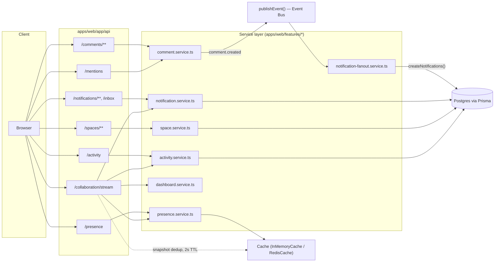
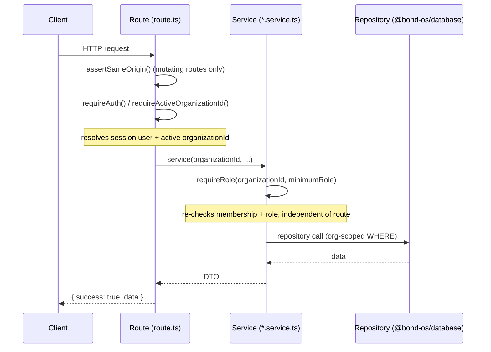
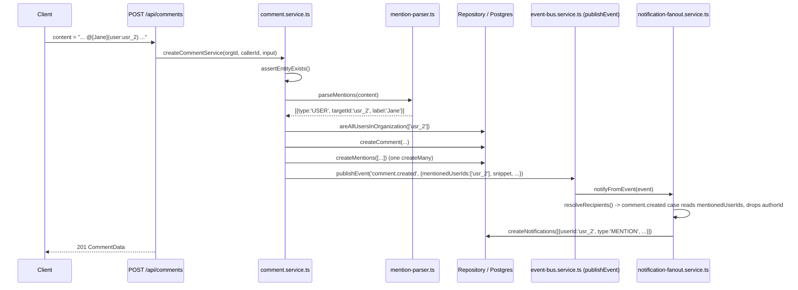
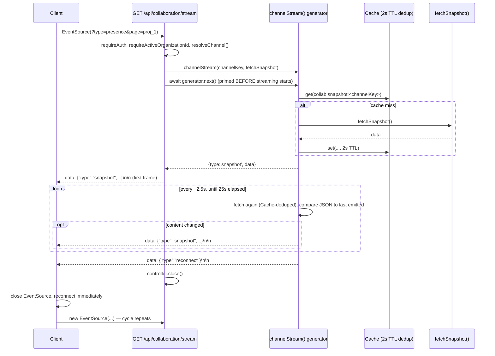

# Collaboration API Reference

Phase 9 — Enterprise Collaboration. Full endpoint reference for Comments, Mentions, Team Spaces,
Notifications & Inbox, the Activity Feed, Presence, and the generic realtime SSE channel
(`GET /api/collaboration/stream`). 28 route files, 32 HTTP endpoints, all read in full against the
current codebase for this reference.

This is a **reference** document — method, path, auth, params, request/response shapes, errors, and
implementation notes for every endpoint. For the *why* behind each subsystem's design (why presence
lives in `Cache` and not Postgres, why Spaces don't restrict visibility, why comments use a structured
mention token instead of NLP, etc.), see the design-rationale docs linked from each section and from
[See also](#see-also) — this reference does not repeat that reasoning, it points to it.

## Table of contents

- [Conventions used throughout this reference](#conventions-used-throughout-this-reference)
- [1. Comments — `/api/comments/**`](#1-comments--apicomments)
- [2. Mentions — `/api/mentions`](#2-mentions--apimentions)
- [3. Notifications & Inbox — `/api/notifications/**`, `/api/inbox`](#3-notifications--inbox--apinotifications-apiinbox)
- [4. Activity Feed — `/api/activity`](#4-activity-feed--apiactivity)
- [5. Presence — `/api/presence`](#5-presence--apipresence)
- [6. Team Spaces — `/api/spaces/**`](#6-team-spaces--apispaces)
- [7. Realtime channel — `GET /api/collaboration/stream`](#7-realtime-channel--get-apicollaborationstream)
- [8. Cross-cutting notes, gaps, and asymmetries](#8-cross-cutting-notes-gaps-and-asymmetries)
- [See also](#see-also)



## Conventions used throughout this reference

These apply to every endpoint below unless an endpoint's own section says otherwise. Source: `apps/web/lib/api-handler.ts`, `apps/web/lib/csrf.ts`, `packages/auth/src/session.ts`, `apps/web/lib/organization.ts`, `packages/shared/src/errors.ts`, `packages/shared/src/schemas/query.ts`, `packages/shared/src/types/index.ts`.

### Response envelope

Every response — success or error — is JSON matching `ApiResponse<T>` (`packages/shared/src/types/index.ts:3-17`):

```ts
// success
{ "success": true, "data": T }

// error
{ "success": false, "error": { "code": string, "message": string, "details"?: unknown } }
```

`apiHandler()` wraps every route handler in a try/catch that converts a thrown `ZodError` into 422, a thrown `AppError` subclass into its own status/code, or anything else into 500. Route handlers never hand-build error responses — they just `throw`.

### Two-layer authorization

Nearly every route in this surface is auth-gated twice:

1. **Route layer** — `requireAuth()` and/or `requireActiveOrganizationId()`. `requireActiveOrganizationId()` (`apps/web/lib/organization.ts:42`) calls `requireAuth()` internally and resolves the caller's active org from the `bondos_active_org` cookie (falling back to their first membership). **Several routes below call only `requireActiveOrganizationId()` and never call `requireAuth()` directly** — they are still fully authenticated, just implicitly. This is called out explicitly per-endpoint below because it means the caller's `user.id` is sometimes unavailable to the route at all (see `POST /api/comments/[id]/unresolve`, `GET /api/spaces/[id]`, `GET /api/comments`, `GET /api/activity`).
2. **Service layer** — `requireRole(organizationId, minimumRole)` (`packages/auth/src/session.ts:30`), called inside almost every service function in this surface, re-checks membership and role even though the route already resolved an org. This is what actually enforces "is this caller even allowed to touch this org's data," independent of how the route got the org id.



`roleSatisfies(role, required)` (`packages/shared/src/constants.ts:17`) compares `ROLE_HIERARCHY`: `OWNER: 3 > ADMIN: 2 > MEMBER: 1`. `ROLES.MEMBER` is the floor for virtually every read/write in this surface; a handful of specific actions (deleting someone else's comment, managing a Space) additionally require `ROLES.ADMIN` or being the resource's creator.

### CSRF

`assertSameOrigin(request)` (`apps/web/lib/csrf.ts:13`) is called first in every mutating route (POST/PATCH/DELETE) in this surface. It throws `ForbiddenError` (403) if the request has no `Origin` header, or if that header's origin doesn't match `getEnv().APP_URL`'s own origin. GET routes never call it.

### Error → status code table

| Error class | HTTP status | `error.code` |
|---|---|---|
| `ValidationError` | 422 | `VALIDATION_ERROR` |
| (thrown `ZodError`, e.g. bad query/body shape) | 422 | `VALIDATION_ERROR` |
| `AuthError` | 401 | `AUTH_ERROR` |
| `ForbiddenError` | 403 | `FORBIDDEN` |
| `NotFoundError` | 404 | `NOT_FOUND` |
| `ConflictError` | 409 | `CONFLICT` |
| `RateLimitError` | 429 | `RATE_LIMITED` |
| (unexpected error) | 500 | `INTERNAL_ERROR` |

Per-endpoint **Errors** tables below list only the errors that endpoint's own code path can realistically throw beyond this baseline (auth/CSRF/validation are implied by every mutating endpoint and omitted unless something endpoint-specific applies).

### Pagination

Every list endpoint (except `GET /api/mentions`, see §2) accepts `page` (default `1`) and `pageSize` (default `20`, max `100`) as query params, coerced from strings via `paginationQuerySchema` (`packages/shared/src/schemas/query.ts:8-14`), and returns a `PaginatedResult<T>`:

```ts
interface PaginatedResult<T> {
  items: T[];
  page: number;
  pageSize: number;
  total: number;
  totalPages: number;
}
```

### `UserSummary`

Every author/assignee/creator/member reference in every DTO below uses this shape (`packages/database/src/repositories/shared.ts:16-25`). Note the DB/session `image` field is renamed to `avatar`:

```ts
interface UserSummary {
  id: string;
  name: string;
  email: string;
  avatar: string | null;
}
```

---

## 1. Comments — `/api/comments/**`

**Route files**: `apps/web/app/api/comments/route.ts`, `apps/web/app/api/comments/[id]/route.ts`, `apps/web/app/api/comments/[id]/resolve/route.ts`, `apps/web/app/api/comments/[id]/unresolve/route.ts`, `apps/web/app/api/comments/[id]/attachments/route.ts`. **Service**: `apps/web/features/comments/services/comment.service.ts`. **Repository**: `packages/database/src/repositories/comments.ts`. **Schemas**: `packages/shared/src/schemas/comments.ts`. **Model**: `Comment`/`CommentAttachment`, `schema.prisma:2055-2096`. Design rationale: [`../comments.md`](../comments.md).

Universal comments attach to six entity types via `entityType`/`entityId` — **not a hard foreign key** (mirrors `Embedding.sourceType`/`sourceId`'s precedent). `assertEntityExists()` in the service layer is the app-level substitute, dispatching per `entityType` to the matching domain lookup and throwing `NotFoundError` if the target doesn't exist in the caller's own organization.

```ts
type CommentableEntityType = 'PROJECT' | 'TASK' | 'MEETING' | 'DOCUMENT' | 'CUSTOMER' | 'GRAPH_NODE';
```

### `CommentData`

```ts
interface CommentData {
  id: string;
  organizationId: string;
  entityType: CommentableEntityType;
  entityId: string;
  authorId: string;
  parentCommentId: string | null;
  content: string;
  resolved: boolean;
  resolvedBy: UserSummary | null;
  resolvedAt: string | null;   // ISO date
  author: UserSummary;
  attachments: CommentAttachmentData[];
  /** Only populated by the list endpoint — a comment fetched any other way (e.g. as a parent lookup) always returns []. */
  replies: CommentData[];
  createdAt: string;
  updatedAt: string;
}

interface CommentAttachmentData {
  id: string;
  commentId: string;
  fileName: string;   // the ORIGINAL filename — the storage path uses a regenerated UUID
  mimeType: string;
  size: number;        // bytes
  storagePath: string; // e.g. "comments/3f9c...-a1.png" — NOT a full/public URL
  createdAt: string;
}
```

`CommentAttachmentData` carries no `publicUrl` — only `storagePath`. Nothing in this surface calls the `getSignedDownloadUrl` helper (`apps/web/lib/supabase.ts:73-84`) to turn it into something fetchable; a client must derive/request a URL itself.

### `GET /api/comments`

| | |
|---|---|
| **Auth** | `requireActiveOrganizationId()` only — **no explicit `requireAuth()` call**; still fully auth-gated, but the route never resolves `user.id` |
| **CSRF** | n/a (GET) |
| **Route file** | `apps/web/app/api/comments/route.ts:10-15` |

**Query params** (`commentListQuerySchema`):

| Param | Type | Required | Notes |
|---|---|---|---|
| `entityType` | `CommentableEntityType` | yes | |
| `entityId` | `string` (min 1) | yes | |
| `page` | number, coerced | no (default `1`) | |
| `pageSize` | number, coerced | no (default `20`, max `100`) | |

**Success response** `200` — `PaginatedResult<CommentData>`. `items` are **root comments only** (`parentCommentId: null`), ordered `createdAt: asc`, paginated; every root's **full reply chain is eagerly attached in `replies`, unpaginated** — a thread with 200 replies returns all 200 alongside its one paginated root.

```json
{
  "success": true,
  "data": {
    "items": [
      {
        "id": "cmt_root1",
        "organizationId": "org_1",
        "entityType": "PROJECT",
        "entityId": "proj_1",
        "authorId": "usr_1",
        "parentCommentId": null,
        "content": "Ready for review @[Jane Doe](user:usr_2)",
        "resolved": false,
        "resolvedBy": null,
        "resolvedAt": null,
        "author": { "id": "usr_1", "name": "Alex Kim", "email": "alex@acme.com", "avatar": null },
        "attachments": [],
        "replies": [
          {
            "id": "cmt_reply1",
            "parentCommentId": "cmt_root1",
            "content": "Looks good",
            "replies": [],
            "...": "..."
          }
        ],
        "createdAt": "2026-07-18T10:00:00.000Z",
        "updatedAt": "2026-07-18T10:00:00.000Z"
      }
    ],
    "page": 1,
    "pageSize": 20,
    "total": 1,
    "totalPages": 1
  }
}
```

**Notes**
- Service: `listCommentsForEntityService` — `requireRole(organizationId, MEMBER)`.

### `POST /api/comments`

| | |
|---|---|
| **Auth** | `requireAuth()` + `requireActiveOrganizationId()` |
| **CSRF** | `assertSameOrigin()` |
| **Route file** | `apps/web/app/api/comments/route.ts:17-24` |

**Body** (`createCommentSchema`):

| Field | Type | Required | Notes |
|---|---|---|---|
| `entityType` | `CommentableEntityType` | yes | |
| `entityId` | `string` (min 1) | yes | |
| `content` | `string`, trimmed, 1–10,000 chars | yes | `"Comment cannot be empty."` if blank |
| `parentCommentId` | `string` (min 1) | no | replying to a comment |

```json
{
  "entityType": "TASK",
  "entityId": "task_42",
  "content": "Can @[Jane Doe](user:usr_2) take a look before Friday?"
}
```

**Success response** `201` — `CommentData` (the created comment; `replies: []`).

**Errors**

| Status | Code | When |
|---|---|---|
| 404 | `NOT_FOUND` | `entityType`/`entityId` doesn't resolve to a real row in the caller's org; or `parentCommentId` doesn't exist |
| 422 | `VALIDATION_ERROR` | `content` empty/too long; a reply's `parentCommentId` points at a comment on a **different** entity than the new comment (`"A reply must target the same entity as its parent comment."`); a `@[...](user:...)` id isn't an org member (`"You can only mention members of your organization."`); a `@[...](space:...)` id isn't an org Space (`"You can only mention spaces in your organization."`); a `@[...](agent:...)` key isn't in the Agent Registry (`` `Unknown agent: ${key}` ``) |

**Notes**
- Service: `createCommentService` (`comment.service.ts:90-162`). Full sequence:
  1. `requireRole(MEMBER)`, `assertEntityExists`.
  2. If `parentCommentId` given, loads the parent and enforces same-entity.
  3. `parseMentions(content)` (§1a below) extracts `@[Label](type:id)` tokens → validates every `user`/`space` target is in-org, every `agent` key exists in the registry.
  4. Creates the `Comment` row, then batch-inserts every parsed mention as one `Mention` row via a single `createMany` (never N sequential inserts).
  5. Publishes a `comment.created` Event (`source: 'COLLABORATION'`, `entityType`/`entityId` = the commented-on entity) with payload `{ commentId, entityType, entityId, authorId, mentionedUserIds, snippet }` — `snippet` is `content` truncated to 140 chars + `…`. **`mentionedUserIds` only — `spaceMentionIds` and agent mentions are never included in this payload.** See §3's fan-out table: this is the only mechanism producing a `MENTION` notification, and it only fires for `@user` mentions.
  6. `publishEvent` and the Agent Registry lookup are both **dynamically imported** (`getPublishEvent()`, `getAgentRegistryService()`) — the same defensive pattern used everywhere in this codebase to avoid a possible Tool Registry import cycle, applied even though `comment.service.ts` isn't currently proven to be on that cycle.
- A comment with zero `@user` mentions produces **zero notifications** — there is no generic "someone commented" notification in this phase.

### `PATCH /api/comments/[id]`

| | |
|---|---|
| **Auth** | `requireAuth()` + `requireActiveOrganizationId()` |
| **CSRF** | `assertSameOrigin()` |
| **Route file** | `apps/web/app/api/comments/[id]/route.ts:11-19` |

**Path params**: `id` — the comment id.

**Body** (`updateCommentSchema`): `{ "content": string, trimmed, 1-10,000 chars }`.

**Success response** `200` — the updated `CommentData` (`replies: []` — `getCommentById` never populates replies).

**Errors**

| Status | Code | When |
|---|---|---|
| 404 | `NOT_FOUND` | Comment doesn't exist in the caller's org |
| 403 | `FORBIDDEN` | Caller isn't the comment's author — `"Only the author can edit this comment."`. **No admin override for editing**, unlike delete below. |

**Notes**
- Service: `updateCommentService` (`comment.service.ts:164-173`) — `requireRole(MEMBER)`, author-only check, then a repo `updateMany` + re-fetch.
- Editing has no history — the previous `content` is simply overwritten, no version snapshot (`Comment` has no `version` column, unlike Document/Project/Meeting's Shared Editing — see [`../collaboration.md`](../collaboration.md)).

### `DELETE /api/comments/[id]`

| | |
|---|---|
| **Auth** | `requireAuth()` + `requireActiveOrganizationId()` |
| **CSRF** | `assertSameOrigin()` |
| **Route file** | `apps/web/app/api/comments/[id]/route.ts:21-28` |

**Path params**: `id`.

**Success response** `200` — `{ "id": string }`.

**Errors**

| Status | Code | When |
|---|---|---|
| 404 | `NOT_FOUND` | Comment doesn't exist |
| 403 | `FORBIDDEN` | Caller is neither the author nor an org `ADMIN`+ — `"Only the author or an organization admin can delete this comment."` |

**Notes**
- Service: `deleteCommentService` (`comment.service.ts:189-202`). `isAuthor OR roleSatisfies(membership.role, ADMIN)` — the **one** place in Comments a non-author can act, unlike edit/resolve.
- Repo `deleteComment` is an org-scoped `deleteMany`. Cascades to `replies` (self-relation `CommentReplies`, `onDelete: Cascade`) and `CommentAttachment` rows (`onDelete: Cascade`) at the database level.
- **No storage cleanup** — the underlying files in the Supabase bucket are never removed (`deletePublicFile` exists but isn't called from this path). A pre-existing gap this codebase already has for Documents too, not Phase-9-specific.

### `POST /api/comments/[id]/resolve`

| | |
|---|---|
| **Auth** | `requireAuth()` + `requireActiveOrganizationId()` |
| **CSRF** | `assertSameOrigin()` |
| **Route file** | `apps/web/app/api/comments/[id]/resolve/route.ts` |

**Path params**: `id`.

**Success response** `200` — updated `CommentData`, with `resolved: true`, `resolvedBy: UserSummary`, `resolvedAt: <ISO date>`.

**Errors**: `404 NOT_FOUND` if the comment doesn't exist.

**Notes**
- Service: `resolveCommentService` — `requireRole(MEMBER)` only. **Any org member can resolve any comment, not just the author or an admin.**

### `POST /api/comments/[id]/unresolve`

| | |
|---|---|
| **Auth** | `requireActiveOrganizationId()` only — **this route never calls `requireAuth()` and never captures the caller's id at all** |
| **CSRF** | `assertSameOrigin()` |
| **Route file** | `apps/web/app/api/comments/[id]/unresolve/route.ts` |

**Path params**: `id`.

**Success response** `200` — updated `CommentData`, `resolved: false`, `resolvedBy: null`, `resolvedAt: null`.

**Errors**: `404 NOT_FOUND` if the comment doesn't exist.

**Notes**
- Service signature is `unresolveCommentService(organizationId, id)` — **no `callerId` parameter at all**. This is a real, verified asymmetry with `resolve`, which records `resolvedById`: unresolve has no equivalent "who un-resolved this" trail. Both endpoints are equally authenticated/authorized (via `requireActiveOrganizationId` → `requireRole`), so this is an audit-trail gap, not an authorization gap.

### `POST /api/comments/[id]/attachments`

| | |
|---|---|
| **Auth** | `requireAuth()` + `requireActiveOrganizationId()` |
| **CSRF** | `assertSameOrigin()` |
| **Route file** | `apps/web/app/api/comments/[id]/attachments/route.ts` |
| **Content-Type** | `multipart/form-data` |

**Path params**: `id` — the comment id.

**Body**: form field `file` (a `Blob`). `422 VALIDATION_ERROR ("A file is required.")` if missing or if the field is a plain string rather than a file.

**Success response** `201` — `CommentAttachmentData`.

```json
{
  "success": true,
  "data": {
    "id": "att_1",
    "commentId": "cmt_root1",
    "fileName": "screenshot.png",
    "mimeType": "image/png",
    "size": 84213,
    "storagePath": "comments/6f2b6b2e-....png",
    "createdAt": "2026-07-18T10:05:00.000Z"
  }
}
```

**Errors**

| Status | Code | When |
|---|---|---|
| 422 | `VALIDATION_ERROR` | No file field, or file `> 20MB` (`MAX_ATTACHMENT_SIZE = 20 * 1024 * 1024`) |
| 404 | `NOT_FOUND` | Comment doesn't exist |
| 403 | `FORBIDDEN` | Caller isn't the comment's author — `"Only the author can attach files to this comment."` (stricter than resolve: attaching is author-only even after the comment already exists) |

**Notes**
- Service: `addCommentAttachmentService` (`comment.service.ts:211-233`). Storage filename is regenerated as `` `${crypto.randomUUID()}${extension}` `` — the original name is preserved only in the `fileName` DB column, never used as the actual storage key (avoids collisions/path traversal). Uploaded via `uploadPublicFile('comments', filename, file)` to the shared `bondos-public` bucket's `comments/` folder.
- **No per-attachment delete route exists.** `deleteCommentAttachment` exists in the repository (`comments.ts:192-195`) but has zero callers anywhere in `apps/web` — the only way to remove an attachment is deleting its whole parent comment (cascade).

### 1a. Mention token format (used by `POST /api/comments` and `PATCH /api/comments/[id]`)

`apps/web/features/comments/lib/mention-parser.ts`. Comment `content` embeds a **structured** token — not free-text name matching:

```
@[Jane Doe](user:usr_2)
@[Engineering](space:spc_1)
@[Finance Agent](agent:finance)
```

```
MENTION_TOKEN = /@\[([^\]]+)\]\((user|space|agent):([a-zA-Z0-9_-]+)\)/g
```

The client's own `@`-autocomplete UI is responsible for resolving "who"/"what" and inserting the already-resolved id into this token — the parser only extracts what's already resolved (a plain regex, not NLP). Duplicate tokens for the same `type:id` in one comment are deduped to a single `Mention` row. Every extracted id is still re-validated server-side (org membership / Space existence / Agent Registry lookup) before anything is persisted — a comment carrying an unresolvable target is rejected with `422`, not silently dropped.



---

## 2. Mentions — `/api/mentions`

**Route file**: `apps/web/app/api/mentions/route.ts`. **Service**: `apps/web/features/comments/services/mention.service.ts`. **Repository**: `packages/database/src/repositories/mentions.ts`. **Model**: `Mention`, `schema.prisma:2107-2126`.

This is a lightweight raw `Mention`-table lookup — distinct from the Inbox's `mentions` category (`GET /api/notifications?category=mentions`, §3), which is `Notification`-backed and has read/archive/snooze state. This endpoint has **no** read state at all.

### `GET /api/mentions`

| | |
|---|---|
| **Auth** | `requireAuth()` + `requireActiveOrganizationId()` |
| **CSRF** | n/a (GET) |
| **Route file** | `apps/web/app/api/mentions/route.ts` |

**Query params** (`mentionListQuerySchema` — just pagination, no filters): `page` (default `1`), `pageSize` (default `20`, max `100`).

**Success response** `200` — **a bare `MentionData[]` array, NOT a `PaginatedResult`** — the one list endpoint in this entire surface that doesn't use the standard envelope shape. `page`/`pageSize` are honored server-side (`skip`/`take`) but the response carries no `total`/`totalPages`, so a client can't tell if there's a next page.

```json
{
  "success": true,
  "data": [
    {
      "id": "men_1",
      "organizationId": "org_1",
      "commentId": "cmt_root1",
      "mentionedType": "USER",
      "mentionedUserId": "usr_2",
      "mentionedSpaceId": null,
      "mentionedAgentKey": null,
      "createdAt": "2026-07-18T10:00:00.000Z"
    }
  ]
}
```

```ts
interface MentionData {
  id: string;
  organizationId: string;
  commentId: string;
  mentionedType: 'USER' | 'SPACE' | 'AGENT';
  mentionedUserId: string | null;
  mentionedSpaceId: string | null;
  mentionedAgentKey: string | null;
  createdAt: string;
}
```

**Notes**
- Returns every `USER`-type `Mention` naming the caller, most recent first (`orderBy: createdAt desc`). Service: `listMentionsForUserService` — `requireRole(MEMBER)` then a direct repository call, no additional filtering.
- Mentions are never created directly through this route — only as a side effect of `POST /api/comments` (§1).

---

## 3. Notifications & Inbox — `/api/notifications/**`, `/api/inbox`

**Route files**: `apps/web/app/api/notifications/route.ts`, `.../unread-count/route.ts`, `.../[id]/read/route.ts`, `.../[id]/archive/route.ts`, `.../[id]/snooze/route.ts`, `.../read-all/route.ts`, `apps/web/app/api/inbox/route.ts`. **Services**: `apps/web/features/notifications/services/notification.service.ts` (read/manage half), `notification-fanout.service.ts` (write half — not a route, see below). **Repository**: `packages/database/src/repositories/notifications.ts`. **Model**: `Notification`, `schema.prisma:2134-2158`. Design rationale: [`../notifications.md`](../notifications.md).

### `NotificationData`

```ts
interface NotificationData {
  id: string;
  organizationId: string;
  userId: string;
  type: NotificationType; // 'MENTION'|'COMMENT'|'APPROVAL_REQUEST'|'WORKFLOW_EVENT'|'AGENT_INSIGHT'|'TASK_ASSIGNMENT'|'PROJECT_UPDATE'|'MEETING_REMINDER'|'SYSTEM'
  title: string;
  body: string;
  entityType: string | null;
  entityId: string | null;
  sourceEventId: string | null;
  read: boolean;
  readAt: string | null;
  archived: boolean;
  snoozedUntil: string | null;
  createdAt: string;
}
```

No relation joins — unlike `CommentData`, this DTO never includes a `User` relation.

### Inbox category mapping

`CATEGORY_TYPES` (`notification.service.ts:21-28`) — a service-layer grouping only, not a schema column:

```ts
const CATEGORY_TYPES: Record<NotificationCategory, NotificationType[]> = {
  assigned: ['TASK_ASSIGNMENT'],
  mentions: ['MENTION'],
  approvals: ['APPROVAL_REQUEST'],
  ai_insights: ['AGENT_INSIGHT'],
  workflow_events: ['WORKFLOW_EVENT'],
  activity: ['PROJECT_UPDATE', 'MEETING_REMINDER', 'COMMENT', 'SYSTEM'],
};
```

`NotificationCategory = 'assigned' | 'mentions' | 'approvals' | 'ai_insights' | 'workflow_events' | 'activity'`.

### `GET /api/notifications`

| | |
|---|---|
| **Auth** | `requireAuth()` + `requireActiveOrganizationId()` |
| **CSRF** | n/a (GET) |
| **Route file** | `apps/web/app/api/notifications/route.ts` |

**Query params** (`notificationListQuerySchema`):

| Param | Type | Required |
|---|---|---|
| `page` / `pageSize` | number, coerced | no |
| `read` | boolean, coerced | no |
| `archived` | boolean, coerced | no |
| `category` | `NotificationCategory` | no — translated to a `types` filter server-side |

**Success response** `200` — `PaginatedResult<NotificationData>`. **Always the caller's own notifications only** — `userId` is taken from the session, never from a query param.

**Notes**
- Repo query always additionally excludes **currently-snoozed** rows (`OR: [{ snoozedUntil: null }, { snoozedUntil: { lte: now } }]`) regardless of what `read`/`archived`/`category` filters are passed — a snoozed notification reappears the moment its `snoozedUntil` passes, with no worker/cron involved.

### `GET /api/notifications/unread-count`

| | |
|---|---|
| **Auth** | `requireAuth()` + `requireActiveOrganizationId()` |
| **Route file** | `apps/web/app/api/notifications/unread-count/route.ts` |

**Success response** `200` — `{ "count": number }`. Counts `WHERE organizationId, userId, read: false, archived: false` and not-currently-snoozed.

### `POST /api/notifications/[id]/read`

| | |
|---|---|
| **Auth** | `requireAuth()` + `requireActiveOrganizationId()` |
| **CSRF** | `assertSameOrigin()` |
| **Route file** | `apps/web/app/api/notifications/[id]/read/route.ts` |

**Path params**: `id`. **Success** `200` — `{ "id": string }`. Sets `read: true, readAt: now()`.

**Errors**: `404 NOT_FOUND` if the id doesn't exist **or doesn't belong to the caller** — the `WHERE` clause includes `userId`, so attempting to mark someone else's notification read is indistinguishable from it not existing.

### `POST /api/notifications/[id]/archive`

Identical shape to `read` above. **Route file**: `apps/web/app/api/notifications/[id]/archive/route.ts`. Sets `archived: true` only — does **not** also set `read: true`. Success `200` — `{ "id": string }`.

### `POST /api/notifications/[id]/snooze`

| | |
|---|---|
| **Auth** | `requireAuth()` + `requireActiveOrganizationId()` |
| **CSRF** | `assertSameOrigin()` |
| **Route file** | `apps/web/app/api/notifications/[id]/snooze/route.ts` |

**Path params**: `id`. **Body**: `{ "snoozedUntil": string }` (`z.coerce.date()` — any parseable date/datetime string). **No validation that the date is in the future** — passing a past date is accepted and simply has no visible effect (the notification is immediately "un-snoozed" since the exclusion check is `snoozedUntil <= now`).

**Success response** `200` — `{ "id": string }`.

**Errors**: `404 NOT_FOUND` if the notification doesn't exist/isn't the caller's; `422 VALIDATION_ERROR` if `snoozedUntil` doesn't parse as a date.

### `POST /api/notifications/read-all`

| | |
|---|---|
| **Auth** | `requireAuth()` + `requireActiveOrganizationId()` |
| **CSRF** | `assertSameOrigin()` |
| **Route file** | `apps/web/app/api/notifications/read-all/route.ts` |

**Success response** `200` — `{ "count": number }` (rows actually flipped). Marks **every currently-unread notification for this user in this org**, regardless of category — and regardless of `archived` state, since the repo `WHERE` here is only `{ organizationId, userId, read: false }` (no `archived` filter, unlike the individual-`read` endpoint's implicit scoping).

### `GET /api/inbox`

| | |
|---|---|
| **Auth** | `requireAuth()` + `requireActiveOrganizationId()` |
| **Route file** | `apps/web/app/api/inbox/route.ts` |

**Success response** `200` — `Record<NotificationCategory, number>`, the 6 categories' **unread** counts:

```json
{
  "success": true,
  "data": {
    "assigned": 3,
    "mentions": 1,
    "approvals": 0,
    "ai_insights": 2,
    "workflow_events": 0,
    "activity": 5
  }
}
```

**Notes**
- This is the badge-count **summary** for the Inbox sidebar/tabs — the paginated feed for one category is `GET /api/notifications?category=<name>`, a separate call.
- Each count reuses `listNotificationsForUser`'s own `WHERE`-scoped `count()` via `.total` (`page: 1, pageSize: 1, read: false, types: CATEGORY_TYPES[category]`) — 6 parallel `Promise.all` queries, never a full row fetch.

### Where `Notification` rows come from — the write half (not a route)

`notification-fanout.service.ts`'s `notifyFromEvent(event)` is called from inside `publishEvent()` (Event Bus — see [`../workflows/event-bus.md`](../workflows/event-bus.md)), independent of and before workflow-dispatch eligibility is checked, in its own try/catch (a fan-out failure can never fail the HTTP request that triggered it). It's the **only** path that creates `Notification` rows, aside from comment mentions which route through the same function via the `comment.created` case.

| `eventType` | Recipients | `NotificationType` |
|---|---|---|
| `task.updated` / `task.completed` | The task's assignee (`getTaskById`); **`[]` if unassigned** | `TASK_ASSIGNMENT` |
| `project.updated` | Every project member (`getProjectById(...).members`) | `PROJECT_UPDATE` |
| `workflow.notification` | The workflow definition's `ownerId`; **`[]` if the definition has no owner** | `WORKFLOW_EVENT` |
| `insight.created` | Every org member with role `ADMIN` or `OWNER` | `AGENT_INSIGHT` |
| `approval.requested` | Every org member whose role satisfies the plan's `requiredRole` (not exact-match — `roleSatisfies` semantics) | `APPROVAL_REQUEST` |
| `comment.created` | `payload.mentionedUserIds`, minus the author's own id (self-mentions produce no notification) | `MENTION` |
| anything else | `[]` | — |

Recipient resolution always ends in exactly **one** batched `createNotifications` (`createMany`) call per event, never N sequential inserts.

**Verified gap — `approval.approved`/`approval.rejected` never notify.** `ApprovalService.approve()`/`.reject()` (`apps/web/features/approvals/services/approval.service.ts:82-90`, `102-110`) both publish their own Events (`approval.approved` with `{ planId, approvedById }`; `approval.rejected` with `{ planId }` only — no `rejectedById` field at all), but `resolveRecipients`'s `switch` has **no case for either eventType** — both fall through to `default: return []`. Only `approval.requested` produces a `Notification`; approve/reject are persisted to `Event` (visible in the Activity Feed, §4) but never reach a user's inbox. `../notifications.md`'s own prose ("each transition... which `notifyFromEvent` fans out") reads as if all three are wired; the code confirms only one is.

**Verified gap — three of the six `activity`-category types are never produced.** `CATEGORY_TYPES.activity` lists `['PROJECT_UPDATE', 'MEETING_REMINDER', 'COMMENT', 'SYSTEM']`, but scanning every `resolveRecipients` case, only `PROJECT_UPDATE` is ever actually constructed. `MEETING_REMINDER`, `COMMENT`, and `SYSTEM` are valid `NotificationType` enum values and are grouped into the filter, but no code path anywhere in `apps/web/features` currently creates a `Notification` row with any of them — the `activity` Inbox category will only ever show `PROJECT_UPDATE` notifications today.

**No email or push** — every `Notification` is in-app only; out of scope for this phase.

---

## 4. Activity Feed — `/api/activity`

**Route file**: `apps/web/app/api/activity/route.ts`. **Service**: `apps/web/features/activity/services/activity.service.ts` (9 lines — the entire file is one function). **Repository**: `listEvents` in `packages/database/src/repositories/events.ts`. Design rationale: [`../activity-feed.md`](../activity-feed.md); the underlying table: [`../workflows/event-bus.md`](../workflows/event-bus.md).

This is a **read view over the pre-existing `Event` table** (Phase 8's Event Bus) — not a new model. It's the second read surface over that table; the first is the Workflow Event Monitor (`GET /api/workflows/events`, documented in [`./workflows.md`](./workflows.md)) — they differ only in framing/default filters, not underlying data.

### `GET /api/activity`

| | |
|---|---|
| **Auth** | `requireActiveOrganizationId()` only — **no explicit `requireAuth()` call** |
| **CSRF** | n/a (GET) |
| **Route file** | `apps/web/app/api/activity/route.ts` |

**Query params** (`activityFeedQuerySchema`):

| Param | Type | Required | Notes |
|---|---|---|---|
| `page` / `pageSize` | number, coerced | no | |
| `eventType` | `string` (min 1) | no | exact match |
| `entityType` | `string` (min 1) | no | only applied if `entityId` is **also** given |
| `entityId` | `string` (min 1) | no | only applied if `entityType` is **also** given — an entity is identified by the pair, not `entityId` alone |
| `since` | date, coerced | no | `createdAt >= since` |
| `until` | date, coerced | no | `createdAt <= until` |

**No filter by user/actor exists.** `Event` has no `userId`/actor column at all — every curated `publishEvent()` call site records *what* happened, never *who* did it. This is a documented, deliberate scope boundary (retrofitting an actor column across all ~15 curated call sites is real, non-trivial, out-of-scope work), not an oversight.

**Success response** `200` — `PaginatedResult<EventData>`:

```ts
interface EventData {
  id: string;
  organizationId: string;
  eventType: string;        // free-form dotted string, e.g. "comment.created", "task.completed"
  source: EventSource;      // 'DOCUMENT'|'PROJECT'|'TASK'|'MEETING'|'CUSTOMER'|'EMAIL'|'KNOWLEDGE_GRAPH'|'AI_COPILOT'|'AGENT'|'SYSTEM'|'COLLABORATION'
  payload: unknown;
  correlationId: string;
  causationId: string | null;
  metadata: unknown;
  entityType: string | null;
  entityId: string | null;
  createdAt: string;
}
```

```json
{
  "success": true,
  "data": {
    "items": [
      {
        "id": "evt_1",
        "organizationId": "org_1",
        "eventType": "comment.created",
        "source": "COLLABORATION",
        "payload": { "commentId": "cmt_root1", "authorId": "usr_1", "mentionedUserIds": ["usr_2"], "snippet": "Ready for review" },
        "correlationId": "cor_1",
        "causationId": null,
        "metadata": null,
        "entityType": "TASK",
        "entityId": "task_42",
        "createdAt": "2026-07-18T10:00:00.000Z"
      }
    ],
    "page": 1, "pageSize": 20, "total": 1, "totalPages": 1
  }
}
```

**Notes**
- Service is literally `requireRole(MEMBER); return listEvents({ organizationId, ...query });` — no transformation of its own.
- Backed by `Event`'s indexes: `@@index([organizationId, eventType, createdAt])`, `@@index([correlationId])`, `@@index([organizationId, entityType, entityId, createdAt])` — the third one is Phase-9-added, is what makes the entity filter a real indexed query rather than a payload scan.
- Live updates: subscribe to the `activity` channel on [`GET /api/collaboration/stream`](#7-realtime-channel--get-apicollaborationstream) — no client component currently does this (§7).

---

## 5. Presence — `/api/presence`

**Route file**: `apps/web/app/api/presence/route.ts`. **Service**: `apps/web/features/collaboration/services/presence.service.ts`. **No Prisma model** — presence lives entirely in `Cache`. Design rationale: [`../presence.md`](../presence.md).

This is a **write-only** (heartbeat) endpoint — presence *reads* only happen via the `presence` channel type on `GET /api/collaboration/stream` (§7).

### `POST /api/presence`

| | |
|---|---|
| **Auth** | `requireAuth()` + `requireActiveOrganizationId()` |
| **CSRF** | `assertSameOrigin()` |
| **Rate limit** | **8 requests / 60 seconds**, keyed by `` `${pathname}:${clientIp}` `` — see below |
| **Route file** | `apps/web/app/api/presence/route.ts` |

**Body** (`presenceHeartbeatSchema`):

| Field | Type | Required | Notes |
|---|---|---|---|
| `page` | `string`, trimmed, 1–200 chars | yes | logical page identifier the client chooses, e.g. `` `project:${id}` `` |
| `status` | `'online' \| 'idle' \| 'busy'` | no (default `'online'`) | client-reported, never server-inferred |
| `entityId` | `string`, trimmed, 1–200 chars | no | |
| `cursor` | `{ x: number, y: number }` | no | |

```json
{ "page": "project:proj_1", "status": "online" }
```

**Success response** `200` — `{ "ok": true }`.

**Errors**

| Status | Code | When |
|---|---|---|
| 429 | `RATE_LIMITED` | More than 8 heartbeats/60s from the same client IP+path |
| 422 | `VALIDATION_ERROR` | `page` missing/empty/too long |

**Notes**
- Rate limit is **IP-keyed, not user-keyed** (`getClientIp` reads `x-forwarded-for` then `x-real-ip`, else the literal string `'unknown'`) — multiple users behind the same NAT/office egress IP share one 8-req/60s budget on this route. Backed by `InMemoryRateLimiter` (`packages/shared/src/rate-limit.ts`), fixed-window, in-process only — no Redis-backed limiter exists in this codebase yet.
- Writes go straight to `Cache` (`getCache()` — `InMemoryCache` or `RedisCache` depending on `REDIS_URL`), keyed `` `presence:org:${organizationId}:page:${page}` `` — **one key per (org, page), not per user**, because `Cache` has no prefix-scan primitive. A heartbeat does an un-atomic read-modify-write: reads the existing map, prunes entries stale beyond `PRESENCE_STALE_MS` (30s), sets the caller's own fresh entry, writes back with a `PRESENCE_KEY_TTL_SECONDS` (120s) TTL. **Two concurrent heartbeats on the same (org, page) key can race and one write can silently drop the other's entry** — a deliberately accepted trade-off (self-heals within ~15s on the caller's next heartbeat), not an atomic `updateMany`-style guarantee like real state transitions (approvals, workflow-run step claims) get.
- There is **no explicit "went offline" write** — absence of a fresh-enough heartbeat (read via the `presence` SSE channel, §7) is the entire signal. No worker, no timeout job.
- The typical client sends this every ~15 seconds while a page is open (`PresenceBar` component, `apps/web/features/collaboration/components/presence-bar.tsx`, `HEARTBEAT_INTERVAL_MS = 15_000`) — the 8/60s rate limit gives roughly 4x headroom over that cadence.

---

## 6. Team Spaces — `/api/spaces/**`

**Route files**: `apps/web/app/api/spaces/route.ts`, `[id]/route.ts`, `[id]/members/route.ts`, `[id]/members/[userId]/route.ts`, and four identically-shaped link/unlink pairs for `projects`, `knowledge-documents`, `workflows`, `agents`. **Service**: `apps/web/features/spaces/services/space.service.ts`. **Repository**: `packages/database/src/repositories/spaces.ts`. **Models**: `Space`/`SpaceMember`/`SpaceProject`/`SpaceKnowledgeDocument`/`SpaceWorkflow`/`SpaceAgent`, `schema.prisma:2172-2258`. **Schemas**: `packages/shared/src/schemas/spaces.ts`. Design rationale: [`../spaces.md`](../spaces.md).

### The one fact that governs every endpoint below

**Spaces group and curate; they do not restrict who can see the underlying content.** `SpaceMember` is a plain roster with no space-specific role column, and it is **never itself checked as a content-visibility gate** anywhere in `space.service.ts` — every read (`listSpacesService`, `getSpaceService`) is gated on organization role alone (`requireRole(organizationId, MEMBER)`), identical to every other org-scoped read in this codebase. A non-member of a Space can still see and navigate to any Project/Document/Workflow/Agent linked into a Space they don't belong to — linking content into a Space never moves its ownership or changes its own read gate. `isSpaceMember` (`spaces.ts:156-159`) is exported from the repository but is **never called from `space.service.ts` at all** — confirmed dead/unused code, further evidence this is by design, not an oversight.

The 4 link tables (`SpaceProject`/`SpaceKnowledgeDocument`/`SpaceWorkflow`/`SpaceAgent`) each store their target as a plain `String` id with **no hard FK** (mirrors `ExecutionStep.tool`'s "resolved at runtime, re-validated by the service layer" precedent) — deleting a linked Project/Document/Workflow does **not** cascade-clean the link row; nothing in the repository code reconciles that dangling reference.

### `SpaceData` / `SpaceDetail`

```ts
interface SpaceData {
  id: string;
  organizationId: string;
  name: string;
  description: string | null;
  createdBy: UserSummary | null;
  memberCount: number;   // Prisma _count aggregate, not a full member fetch
  createdAt: string;
  updatedAt: string;
}

interface SpaceDetail extends SpaceData {
  members: Array<{ user: UserSummary; joinedAt: string }>;  // full, unpaginated roster, joinedAt asc
  projectIds: string[];
  knowledgeDocumentIds: string[];
  workflowDefinitionIds: string[];
  agentKeys: string[];
}
```

Because the 4 link tables are soft references, `SpaceDetail` only ever returns **raw ids** for linked content — resolving those into display data (project titles, workflow names, etc.) is left to the client/owning-feature, not done by this repository.

### `GET /api/spaces`

| | |
|---|---|
| **Auth** | `requireAuth()` + `requireActiveOrganizationId()` |
| **Route file** | `apps/web/app/api/spaces/route.ts:10-16` |

**Query params** (`spaceListQuerySchema`): `page`/`pageSize` (standard pagination) + `mine` (boolean, coerced, optional) — `mine=true` restricts to Spaces the caller is a member of (`members: { some: { userId } }`); omitted/`false` returns **every** Space in the org regardless of the caller's membership (consistent with "curation, not ACL").

**Success response** `200` — `PaginatedResult<SpaceData>`.

### `POST /api/spaces`

| | |
|---|---|
| **Auth** | `requireAuth()` + `requireActiveOrganizationId()` |
| **CSRF** | `assertSameOrigin()` |
| **Route file** | `apps/web/app/api/spaces/route.ts:18-25` |

**Body** (`createSpaceSchema`): `{ "name": string, trimmed, 1-200 chars, "description"?: string | null, trimmed, max 2000 }`.

**Success response** `201` — full `SpaceDetail`.

**Notes**
- Any org `MEMBER` can create a Space. The creator is **automatically added as the first `SpaceMember`** (idempotent `skipDuplicates: true` insert).

### `GET /api/spaces/[id]`

| | |
|---|---|
| **Auth** | `requireActiveOrganizationId()` only — **no explicit `requireAuth()` call** |
| **Route file** | `apps/web/app/api/spaces/[id]/route.ts:11-16` |

**Path params**: `id`. **Success** `200` — full `SpaceDetail`, including the complete member roster. **This is the effective "list members" endpoint** — there is no separate, paginated members-list route (`members/route.ts` exports only `POST`).

**Errors**: `404 NOT_FOUND` if the Space doesn't exist in the caller's org.

### `PATCH /api/spaces/[id]`

| | |
|---|---|
| **Auth** | `requireAuth()` + `requireActiveOrganizationId()` |
| **CSRF** | `assertSameOrigin()` |
| **Route file** | `apps/web/app/api/spaces/[id]/route.ts:18-26` |

**Path params**: `id`. **Body** (`updateSpaceSchema`): `{ "name"?: string, 1-200 chars, "description"?: string | null, max 2000 }` — both optional.

**Success response** `200` — updated `SpaceDetail`.

**Errors**

| Status | Code | When |
|---|---|---|
| 404 | `NOT_FOUND` | Space doesn't exist |
| 403 | `FORBIDDEN` | Caller is neither the Space's creator nor org `ADMIN`+ — `"Only the space creator or an organization admin can manage this space."` |

**Notes**
- This is the "manage" permission tier (`assertCanManageSpace`), a **separate, stricter** gate than mere org membership — the same tier governs delete and every link/unlink endpoint below.

### `DELETE /api/spaces/[id]`

Same auth/manage-permission shape as `PATCH` above. **Route file**: `apps/web/app/api/spaces/[id]/route.ts:28-35`. **Success** `200` — `{ "id": string }`. Cascades `SpaceMember`/`SpaceProject`/`SpaceKnowledgeDocument`/`SpaceWorkflow`/`SpaceAgent` rows at the database level (`onDelete: Cascade` on the `Space` FK side).

### `POST /api/spaces/[id]/members` — join

| | |
|---|---|
| **Auth** | `requireAuth()` + `requireActiveOrganizationId()` |
| **CSRF** | `assertSameOrigin()` |
| **Route file** | `apps/web/app/api/spaces/[id]/members/route.ts` |

**Path params**: `id`. **Body**: none read — this endpoint always adds the **authenticated caller themself**, never a different user. `addSpaceMemberSchema` (`{ userId: string }`) is defined in `packages/shared/src/schemas/spaces.ts:24-25` but **is dead code** — confirmed never imported anywhere in `apps/web`. There is no "admin adds a specific other user to a Space" endpoint in this codebase; only self-join.

**Success response** `200` — `{ "joined": true }`. **Errors**: `404 NOT_FOUND` if the Space doesn't exist.

**Notes**
- Self-service — any org member can join any Space, no approval step. Idempotent: joining twice is a silent no-op (`skipDuplicates: true`), not a `409 CONFLICT`.

### `DELETE /api/spaces/[id]/members/[userId]` — leave or remove

| | |
|---|---|
| **Auth** | `requireAuth()` + `requireActiveOrganizationId()` |
| **CSRF** | `assertSameOrigin()` |
| **Route file** | `apps/web/app/api/spaces/[id]/members/[userId]/route.ts` |

**Path params**: `id` (space), `userId` (the member to remove).

**Success response** `200` — `{ "removed": true }`.

**Errors**

| Status | Code | When |
|---|---|---|
| 404 | `NOT_FOUND` | `userId === callerId`: `"You are not a member of this space."` if the caller wasn't a member. `userId !== callerId`: `404` if the space itself doesn't exist, or `"That user is not a member of this space."` if that user wasn't. |
| 403 | `FORBIDDEN` | `userId !== callerId` (removing **someone else**) and the caller isn't the Space's creator or `ADMIN`+ |

**Notes**
- Branches on `userId === callerId`: removing **yourself** needs no manage-permission check (self-service, mirrors join); removing **someone else** requires the same manage-tier gate as rename/delete.

### Content link/unlink sub-resources — Projects, Knowledge Documents, Workflows, Agents

All four are **structurally identical** (verified byte-for-byte modulo the entity name), each a POST (link) + DELETE (unlink) pair:

| Sub-resource | POST path (link) | DELETE path (unlink) | Body | Pre-link existence check |
|---|---|---|---|---|
| Projects | `/api/spaces/[id]/projects` | `/api/spaces/[id]/projects/[projectId]` | `{ "projectId": string }` | `getProjectById` → 422 `"Project not found in your organization."` |
| Knowledge Documents | `/api/spaces/[id]/knowledge-documents` | `/api/spaces/[id]/knowledge-documents/[knowledgeDocumentId]` | `{ "knowledgeDocumentId": string }` | `getKnowledgeDocumentById` → 422 `"Knowledge document not found in your organization."` |
| Workflows | `/api/spaces/[id]/workflows` | `/api/spaces/[id]/workflows/[workflowDefinitionId]` | `{ "workflowDefinitionId": string }` | `getWorkflowDefinitionById` → 422 `"Workflow not found in your organization."` |
| Agents | `/api/spaces/[id]/agents` | `/api/spaces/[id]/agents/[agentKey]` | `{ "agentKey": string }` | Agent Registry lookup (dynamically imported) → 422 `` `Unknown agent: ${agentKey}` `` |

| | |
|---|---|
| **Auth** | `requireAuth()` + `requireActiveOrganizationId()`, all 8 routes |
| **CSRF** | `assertSameOrigin()`, all 8 routes |
| **Success (link, POST)** | **`200`** — `{ "linked": true }` |
| **Success (unlink, DELETE)** | `200` — `{ "unlinked": true }` |

**Errors**

| Status | Code | When |
|---|---|---|
| 404 | `NOT_FOUND` | Space doesn't exist |
| 403 | `FORBIDDEN` | Caller isn't the Space's creator or `ADMIN`+ — `"Only the space creator or an organization admin can manage this space."` **This gate applies even though the resource is nested under a member-joinable Space; linking/unlinking is a management action, not something any member can do.** |
| 422 | `VALIDATION_ERROR` | (link only) target id doesn't exist in the caller's own org (or agent key isn't registered), per the table above |

**Notes**
- **Link (POST) responses use `200`, not `201`**, despite creating a new `SpaceProject`/`SpaceKnowledgeDocument`/`SpaceWorkflow`/`SpaceAgent` row — inconsistent with `POST /api/comments` and `POST /api/spaces`, which both explicitly return `201`.
- **Unlink (DELETE) never 404s on a no-op.** None of the 4 unlink service functions inspect the boolean the repository's `deleteMany`-backed remove function returns — unlinking something that was never linked still returns `{ "unlinked": true }`, `200`.
- Link inserts are idempotent (`skipDuplicates: true`) — linking the same target twice is a silent no-op.

---

## 7. Realtime channel — `GET /api/collaboration/stream`

**Route file**: `apps/web/app/api/collaboration/stream/route.ts`. **Transport primitive**: `apps/web/features/collaboration/lib/realtime-channel.ts`. **SSE framing**: `apps/web/lib/streaming-handler.ts`. Design rationale: [`../collaboration.md`](../collaboration.md).

This is the **one** generic entry point backing every "live" surface in this phase — a reconnecting Server-Sent-Events poll loop, **not WebSockets**, generalized from the codebase's existing one-shot SSE routes (`/api/bond/chat`, `/api/agents/chat`, `/api/execution/[id]/approve`). No persistent-process guarantee exists in this codebase, so a connection is held open for a bounded window, emits a final `reconnect` frame, and closes — the **client** is what reopens it.

### `GET /api/collaboration/stream`

| | |
|---|---|
| **Auth** | `requireAuth()` + `requireActiveOrganizationId()` |
| **CSRF** | n/a (GET) |
| **`maxDuration`** | `30` seconds (`export const maxDuration = 30` — the first use of this Next.js export in the codebase) |
| **Route file** | `apps/web/app/api/collaboration/stream/route.ts` |
| **Response** | `text/event-stream`, one JSON-encoded event per `data: ...\n\n` frame |

**Query params** (`collaborationStreamQuerySchema`):

| Param | Type | Required | Notes |
|---|---|---|---|
| `type` | `'presence' \| 'notifications' \| 'activity' \| 'dashboard'` | yes | |
| `page` | `string`, trimmed, 1–200 chars | only for `type=presence` | `422 VALIDATION_ERROR ("`page` is required for the presence channel.")` if omitted |

`type` values outside the enum are rejected by the Zod schema itself (`422`) before `resolveChannel` even runs; a syntactically valid-but-unrecognized value inside the switch's `default` case throws `` ValidationError(`Unsupported channel type: ${query.type}`) `` — in practice unreachable given the enum, but present as defense-in-depth.

**The client never sends a raw channel key.** `resolveChannel(query, organizationId, userId)` builds the actual Cache key **server-side**, always from the caller's own session-resolved `organizationId`/`userId` — never from client input. This structurally prevents a channel key from ever being steered into reading another org's or another user's data.

### Wire format

```ts
type ChannelStreamEvent<T> =
  | { type: 'snapshot'; data: T }
  | { type: 'reconnect' }
  | { type: 'error'; message: string };  // only emitted for an in-stream failure after the first event
```

Each event is one SSE frame: `` data: ${JSON.stringify(event)}\n\n ``. Response headers: `Content-Type: text/event-stream`, `Cache-Control: no-cache, no-transform`, `Connection: keep-alive`, `X-Accel-Buffering: no` (disables nginx response buffering for real deployments behind a reverse proxy).

### Lifecycle



Constants (`realtime-channel.ts:20-23`): `POLL_INTERVAL_MS = 2500`, `SNAPSHOT_CACHE_TTL_SECONDS = 2`, `STREAM_DURATION_MS = 25_000` (a safety margin under `maxDuration = 30`, leaving headroom for the final `reconnect` frame to actually flush before the platform kills the function). An **idle channel with no content change produces no traffic beyond the first frame** — `emitIfChanged()` compares the new snapshot's `JSON.stringify` to the last-emitted one and only yields on a real difference.

`dedupedSnapshot()` routes every poll tick through `getCache()` (`InMemoryCache` by default, `RedisCache` when `REDIS_URL` is set) with a 2-second TTL before ever reaching Postgres — N simultaneous viewers of the same channel collapse to ~1 underlying query per 2-second window, not N.

### Channel types — key, snapshot shape, and UI subscriber

| `type` | Channel key | `fetchSnapshot()` snapshot shape | Backing service | Live UI subscriber |
|---|---|---|---|---|
| `presence` | `` presence:org:${organizationId}:page:${page} `` | `PresenceSnapshot` (below) | `getPresenceSnapshot` (`presence.service.ts`) | `PresenceBar` — Project/Meeting/Document/Customer detail pages |
| `notifications` | `` notifications:user:${userId} `` | `{ unreadCount, latest }` (below) | `getUnreadNotificationCountService` + `listNotificationsService` | `NotificationBell` — dashboard topbar |
| `activity` | `` activity:org:${organizationId} `` | `EventData[]` (below) | `listActivityFeedService` | **none** — Activity page is server-rendered, refreshed on navigation only |
| `dashboard` | `` dashboard:org:${organizationId} `` | `DashboardSnapshot` (below) | `getDashboardSnapshot` | **none** — Team Dashboard page is server-rendered, refreshed on navigation only |

#### `type=presence`

**Requires** `page` query param. Snapshot:

```ts
interface PresenceSnapshot {
  page: string;
  viewers: PresenceEntry[];
}
interface PresenceEntry {
  user: UserSummary;
  status: 'online' | 'idle' | 'busy';
  entityId: string | null;
  cursor: { x: number; y: number } | null;
  lastActiveAt: number; // epoch ms
}
```

```json
{
  "type": "snapshot",
  "data": {
    "page": "project:proj_1",
    "viewers": [
      { "user": { "id": "usr_2", "name": "Jane Doe", "email": "jane@acme.com", "avatar": null }, "status": "online", "entityId": null, "cursor": null, "lastActiveAt": 1753000000000 }
    ]
  }
}
```

Viewers are filtered to entries whose `lastActiveAt` is within `PRESENCE_STALE_MS` (30s) of now — the same staleness rule `POST /api/presence` (§5) writes against, since both read/write the identical Cache key.

#### `type=notifications`

Snapshot:

```ts
{ unreadCount: number; latest: NotificationData[] }  // latest = page 1 of 10, most recent first
```

```json
{
  "type": "snapshot",
  "data": {
    "unreadCount": 4,
    "latest": [ { "id": "ntf_1", "type": "MENTION", "title": "You were mentioned", "body": "Ready for review", "read": false, "...": "..." } ]
  }
}
```

`unreadCount` = `getUnreadNotificationCountService(organizationId, userId)`; `latest` = `.items` of `listNotificationsService(organizationId, userId, { page: 1, pageSize: 10 })` — no `category` filter applied, so this is across all 6 categories.

#### `type=activity`

Snapshot is a **bare array**, not an envelope object — `EventData[]`, the `.items` of `listActivityFeedService(organizationId, { page: 1, pageSize: 30 })`: the latest 30 org-wide Events, unfiltered by `eventType`/`entityType`.

```json
{ "type": "snapshot", "data": [ { "id": "evt_1", "eventType": "comment.created", "...": "..." } ] }
```

#### `type=dashboard`

Snapshot:

```ts
interface DashboardSnapshot {
  pendingApprovals: number;      // AWAITING_APPROVAL executions, org-wide
  activeWorkflowRuns: number;    // sum across PENDING/RUNNING/WAITING_APPROVAL/WAITING_TIMER runs
  unreadNotifications: number;   // the caller's own unread count
}
```

```json
{ "type": "snapshot", "data": { "pendingApprovals": 2, "activeWorkflowRuns": 5, "unreadNotifications": 4 } }
```

Every count is obtained via a `pageSize: 1` + `.total` query (a `count()`-shaped query, never a full row fetch), run in parallel. This covers **3 of 6** commonly-expected dashboard signals (pending approvals, workflow status, notifications) — **agent activity, project health, and active-user counts are not computed anywhere in this file**; nothing in `dashboard.service.ts` produces them.

### Client reconnect pattern

Both existing subscribers (`PresenceBar`, `NotificationBell` — the **only** two components in the codebase that open an `EventSource` against this route) use the identical pattern: on `{ type: 'reconnect' }`, close and immediately reopen; on a native `EventSource` error, close and retry after a fixed 3000ms backoff; a `stoppedRef` flag prevents reconnecting after unmount.

```ts
eventSource.onmessage = (event) => {
  const parsed = JSON.parse(event.data);
  if (parsed.type === 'snapshot') setSnapshot(parsed.data);
  else if (parsed.type === 'reconnect') { eventSource.close(); connect(); }
};
eventSource.onerror = () => {
  eventSource.close();
  if (!stoppedRef.current) setTimeout(connect, 3000);
};
```

### Deployment prerequisite: connection pooling

**No connection pooler (PgBouncer, a managed Data Proxy, etc.) is configured anywhere in this repository** — not in `docker-compose.yml`, not in `.env.example`. Holding a serverless invocation open for up to ~25 seconds per concurrent SSE viewer is a materially different Postgres connection-lifetime profile than any route before Phase 9 (which each held a connection for roughly the length of one query). This is explicitly **not solved in code** — it's an unresolved operational prerequisite for real multi-user production deployment of these SSE routes, not something this phase's code addresses. See [`../deployment/production.md`](../deployment/production.md) for deployment-target specifics.

### What this endpoint does NOT do

- **No live channel for comment threads.** The transport primitive's own doc comment lists "live comment-thread updates" as an intended consumer, but the `resolveChannel` switch only implements 4 types (`presence`/`notifications`/`activity`/`dashboard`) — there is no 5th type for comments. This is a real discrepancy between the primitive's aspiration and what's actually wired, not a documentation lag on this reference's part.
- **No sub-second push latency.** The 2.5s poll interval and 2s snapshot TTL trade a small amount of staleness for avoiding a query storm — this is "continuously live," not instant push.
- **No cross-organization or unauthenticated channels.** Every channel key is server-resolved from the authenticated session.

---

## 8. Cross-cutting notes, gaps, and asymmetries

Verified directly against the code — stated here rather than left implicit, since these are the details most likely to surprise an integrator:

1. **`unresolveCommentService` takes no `callerId`** — asymmetric with `resolveCommentService`, which records `resolvedById`. Both are equally authenticated/authorized; only resolve has an audit trail of *who*.
2. **`GET /api/mentions` returns a bare array**, not the `PaginatedResult` envelope every other list endpoint in this reference uses, despite honoring `page`/`pageSize` server-side.
3. **`addSpaceMemberSchema` is dead code** — defined, exported, never imported. There is no endpoint for an admin to add a *different* specific user to a Space; only self-join.
4. **No standalone "list Space members" endpoint.** The roster is only reachable as the unpaginated `members` array inside `GET /api/spaces/[id]`'s `SpaceDetail`.
5. **`isSpaceMember` is exported from the repository but never called** from `space.service.ts` — further evidence Spaces are curation, not an ACL.
6. **Comment attachments have no `publicUrl` in the response** and **no per-attachment delete route** — an attachment can only be removed by deleting its whole parent comment.
7. **No storage cleanup on comment delete** — `CommentAttachment` rows cascade out of Postgres, but the underlying Supabase files are never removed.
8. **`@space`/`@team` mentions never trigger a notification.** They're parsed, validated, and persisted as `Mention` rows, but the `comment.created` event payload only ever carries `mentionedUserIds` — `spaceMentionIds` is computed in `comment.service.ts` and then never used beyond the `Mention` insert.
9. **`approval.approved`/`approval.rejected` Events are published but never fan out a notification** — only `approval.requested` reaches a user's inbox (§3).
10. **`NotificationType.MEETING_REMINDER`, `.COMMENT`, and `.SYSTEM` are never produced** by any code path — the `activity` Inbox category currently only ever shows `PROJECT_UPDATE` notifications in practice.
11. **Presence rate limiting is IP-keyed, not user-keyed** — relevant for anyone sizing expected heartbeat throughput behind a shared corporate egress IP.
12. **`activity` and `dashboard` SSE channels have no live UI subscriber wired up**, even though both are fully implemented and reachable — their pages currently update only on navigation/reload.
13. **No connection pooler is configured** for sustained SSE load under `maxDuration = 30` — an explicit, code-unaddressed operational prerequisite.
14. **Space link/unlink (POST) endpoints return `200`, not `201`**, despite creating a new row — inconsistent with `POST /api/comments` and `POST /api/spaces`.
15. **No test suite was found** under `apps/web/features/collaboration`, `comments`, `spaces`, `notifications`, or `activity`, nor any `.test.ts`/`.spec.ts` file anywhere in this surface's route/service/repository files — this reference cannot attest to any automated coverage for these 32 endpoints beyond what's stated here from direct code reading.

---

## See also

- [`../collaboration.md`](../collaboration.md) — why SSE and not WebSockets, the reconnecting poll loop's design, Live Dashboards' scope, and Shared Editing (optimistic-locking version conflicts on Document/Project/Meeting — not exposed as its own endpoint in this surface, but the mechanism these `PATCH` endpoints elsewhere in the API rely on).
- [`../comments.md`](../comments.md), [`../notifications.md`](../notifications.md), [`../activity-feed.md`](../activity-feed.md), [`../presence.md`](../presence.md), [`../spaces.md`](../spaces.md) — per-subsystem design rationale.
- [`../workflows/event-bus.md`](../workflows/event-bus.md) — `publishEvent()`, the curated `eventType` taxonomy, and how `notifyFromEvent`/workflow dispatch both hook into it independently.
- [`../workflows/approvals.md`](../workflows/approvals.md) — `ApprovalService`, the atomic `transitionApprovalRequest` guard, and the `approval.*` events referenced in §3.
- [`./workflows.md`](./workflows.md) — the Workflow Event Monitor (`GET /api/workflows/events`), the other read surface over `Event`; workflow run/approval endpoints the `dashboard` channel's snapshot is built from.
- [`./agents.md`](./agents.md) — the Agent Registry `@agent` mentions and Space agent links validate against.
- [`./organizations.md`](./organizations.md) — membership/role resolution (`getMembership`, `requireRole`) underlying every service-layer check in this reference.
- [`./authentication.md`](./authentication.md) — `requireAuth()`, session resolution, the `bondos_active_org` cookie.
- [`../security/authorization.md`](../security/authorization.md), [`../security/organization-isolation.md`](../security/organization-isolation.md) — the two-layer authorization pattern and org-scoping discipline used identically across every endpoint in this reference.
- [`../database/schema.md`](../database/schema.md) — full Prisma schema reference, including `Comment`/`Mention`/`Notification`/`Space`/`Event` and their indexes.
- [`../deployment/production.md`](../deployment/production.md) — the connection-pooler prerequisite for `maxDuration = 30` SSE routes at real scale.
- [`./system.md`](./system.md) — Connectors & Sync API reference (`/api/connectors/**`, `/api/sync/**`), covered separately from this document.
