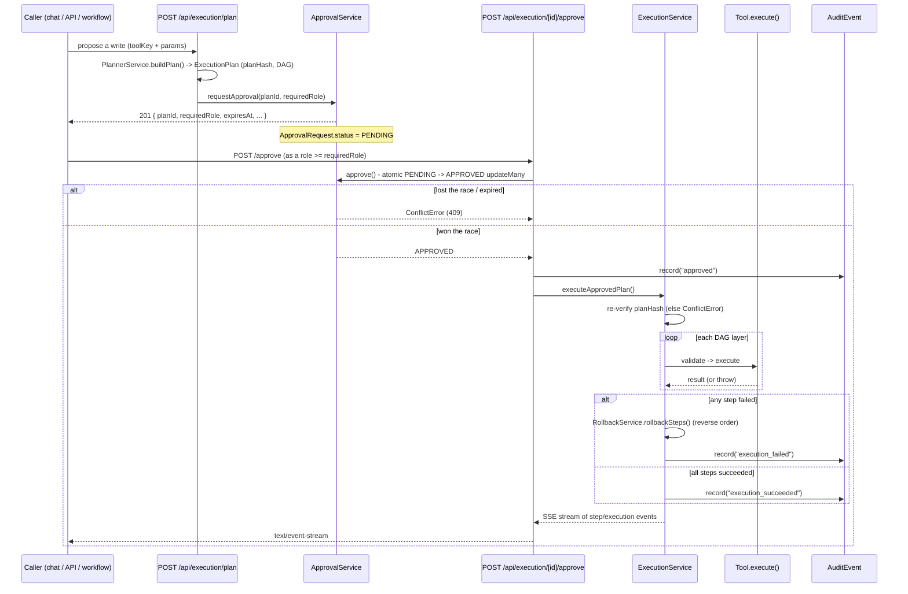

# Tools & Execution API

API reference for **Tool Discovery** (`/api/tools`) and the **Tool Execution Framework**
(`/api/execution/**`) — Phase 6. This is the only door through which BOND OS ever writes to a
domain table on a user's behalf: Mr. Bond, the multi-agent pipeline, the standalone
`POST /api/execution/plan` route, and every Workflow `INVOKE_TOOL` step all end up calling the
same `proposeAction()` → `ApprovalService` → `ExecutionService` chain documented here. For the
underlying design (the Tool SDK, the Planner's DAG, the approval gate's atomicity, rollback
mechanics), see [Approvals](../security/approvals.md), [Audit](../security/audit.md), and the
phase-era docs [tool-execution.md](../tool-execution.md), [planner.md](../planner.md),
[approvals.md](../approvals.md), and [rollback.md](../rollback.md) — Phase 6 (Tool Execution)
predates the `docs/workflows/` reorganization and has no dedicated subsystem directory of its own;
see [Workflow Engine](../workflows/workflow-engine.md) specifically for how Phase 8 workflows reuse
this chain via `INVOKE_TOOL`.

**7 endpoints total**: 1 under `/api/tools`, 6 under `/api/execution`.

## Conventions

Every route in this document is wrapped in `apiHandler()` (`apps/web/lib/api-handler.ts`), so:

- Success responses are `{ "success": true, "data": <T> }`.
- Error responses are `{ "success": false, "error": { "code": string, "message": string, "details"?: unknown } }`
  with the HTTP status set from the thrown error type: `ValidationError` → 422,
  `AuthError` → 401, `ForbiddenError` → 403, `NotFoundError` → 404, `ConflictError` → 409,
  `RateLimitError` → 429, anything unexpected → 500 `INTERNAL_ERROR` (stack trace logged
  server-side only, never returned to the client).
- List endpoints return `PaginatedResult<T>` = `{ items, page, pageSize, total, totalPages }`.
  Every list query schema in this surface accepts `page` (default 1) and `pageSize`
  (default 20, max 100).
- **Auth floor**: every route calls `requireActiveOrganizationId()` — it resolves the caller's
  session and their active organization (from the `bondos_active_org` cookie, matched only
  against the caller's own real memberships) and throws `AuthError` (401) if either is missing.
  See [Authentication](../security/authentication.md) and
  [Organization Isolation](../security/organization-isolation.md).
- **Mutating routes** additionally call `assertSameOrigin(request)` (throws `ForbiddenError` if
  the `Origin` header is missing or doesn't match `APP_URL`) — see [CSRF](../security/threat-model.md).
- Two routes in this surface are rate-limited (fixed-window, in-memory, single-process only —
  see [Rate Limiting](../security/threat-model.md)): `POST /api/execution/[id]/approve` at
  20 requests/60s. Every other route here has **no** rate limit.
- **No automated tests exist for this surface.** A repo-wide search for `*.test.ts`/`*.spec.ts`
  under `apps/web` returns zero results, and neither `package.json` defines a `test` script.
  Nothing below implies regression coverage — it describes what the code does today, verified by
  direct reading, not by a passing test suite.

---

## `GET /api/tools` — Tool Discovery

**Method / Path**: `GET /api/tools`
**File**: `apps/web/app/api/tools/route.ts`
**Auth**: `requireActiveOrganizationId()` (route) → `listToolsService` internally calls
`requireRole(organizationId, ROLES.MEMBER)` (`apps/web/features/tools/services/tool-discovery.service.ts:32`).
**Rate limit**: none.

This is the spec-mandated discovery endpoint — the mechanism that makes "AI must never hardcode
tool names" literally true. It's the only place the Planner (and, transitively, Mr. Bond and every
agent) is meant to learn what tools exist, by mapping the live in-memory
`ToolRegistryService` (built once, at process start, in `apps/web/features/tools/registry.ts` —
the **only** file in the codebase that imports a concrete `*.tool.ts` module) to a plain,
serializable shape. A tool's Zod schemas and SDK methods (`validate`/`execute`/`rollback`/…)
aren't JSON-serializable — only its declared metadata is.

### Params

None (no query string, no body).

### Response — `200`

`data: AvailableTool[]`, one entry per registered tool @ version:

```ts
interface AvailableTool {
  toolKey: string;
  version: string;
  name: string;
  displayName: string;
  description: string;
  category: string; // one ToolCategory value
  icon: string; // a lucide-react icon name
  minimumRole: string; // Role — the role required to APPROVE a plan using this tool
  rollbackSupport: string; // AUTOMATIC | MANUAL | NOT_SUPPORTED
  supportsPreview: boolean;
  supportsDryRun: boolean;
  supportsTransactions: boolean;
  requiresApproval: boolean;
  estimatedExecutionMs: number;
}
```

### Example response

Exactly 5 tools are registered today (`apps/web/features/tools/registry.ts:18-24`), covering only
3 of `ToolCategory`'s 12 declared values (`PROJECTS`, `TASKS`, `MEETINGS` — `CUSTOMERS`,
`DOCUMENTS`, `NOTES`, `EMAILS`, `KNOWLEDGE_GRAPH`, `CRM`, `FILES`, `ANALYTICS`, `SYSTEM` have zero
registered tools). All five report `rollbackSupport: "AUTOMATIC"` — there is no reference tool
demonstrating `MANUAL` or `NOT_SUPPORTED` rollback, and no non-reversible write tool
(e.g. `send_email`) exists anywhere in this codebase.

```json
{
  "success": true,
  "data": [
    {
      "toolKey": "create_project",
      "version": "1",
      "name": "create_project",
      "displayName": "Create Project",
      "description": "Creates a new project in the company database.",
      "category": "PROJECTS",
      "icon": "FolderKanban",
      "minimumRole": "MEMBER",
      "rollbackSupport": "AUTOMATIC",
      "supportsPreview": true,
      "supportsDryRun": true,
      "supportsTransactions": true,
      "requiresApproval": true,
      "estimatedExecutionMs": 1500
    },
    {
      "toolKey": "update_project",
      "version": "1",
      "name": "update_project",
      "displayName": "Update Project",
      "description": "Updates an existing project, found by its exact title.",
      "category": "PROJECTS",
      "icon": "FolderKanban",
      "minimumRole": "MEMBER",
      "rollbackSupport": "AUTOMATIC",
      "supportsPreview": true,
      "supportsDryRun": true,
      "supportsTransactions": true,
      "requiresApproval": true,
      "estimatedExecutionMs": 1200
    },
    {
      "toolKey": "create_task",
      "version": "1",
      "name": "create_task",
      "displayName": "Create Task",
      "description": "Creates a new task under a project.",
      "category": "TASKS",
      "icon": "ListTodo",
      "minimumRole": "MEMBER",
      "rollbackSupport": "AUTOMATIC",
      "supportsPreview": true,
      "supportsDryRun": true,
      "supportsTransactions": true,
      "requiresApproval": true,
      "estimatedExecutionMs": 1200
    },
    {
      "toolKey": "create_meeting",
      "version": "1",
      "name": "create_meeting",
      "displayName": "Create Meeting",
      "description": "Schedules a new meeting under a project.",
      "category": "MEETINGS",
      "icon": "Video",
      "minimumRole": "MEMBER",
      "rollbackSupport": "AUTOMATIC",
      "supportsPreview": true,
      "supportsDryRun": true,
      "supportsTransactions": true,
      "requiresApproval": true,
      "estimatedExecutionMs": 1200
    },
    {
      "toolKey": "archive_project",
      "version": "1",
      "name": "archive_project",
      "displayName": "Archive Project",
      "description": "Archives an existing project, found by its exact title.",
      "category": "PROJECTS",
      "icon": "Archive",
      "minimumRole": "ADMIN",
      "rollbackSupport": "AUTOMATIC",
      "supportsPreview": true,
      "supportsDryRun": true,
      "supportsTransactions": true,
      "requiresApproval": true,
      "estimatedExecutionMs": 1000
    }
  ]
}
```

### Errors

| Status | Code | When |
|---|---|---|
| 401 | `AUTH_ERROR` | No session, or the caller has no active organization. |
| 403 | `FORBIDDEN` | Caller is authenticated but not a member of the active org (MEMBER is the floor — this fires only for a genuinely non-member caller). |

### Notes

- `archive_project` is the one `ADMIN`-tier reference tool. A plan that mixes it with any
  `MEMBER`-tier tool raises the *whole plan's* `requiredRole` to `ADMIN` — see
  `PermissionService.requiredRoleForTools` under `POST /api/execution/plan` below.
- Adding a tool is a source-code change (`ALL_TOOLS` in `registry.ts` is a literal array,
  populated once at module load) — there is no dynamic/plugin tool loading.

---

## `GET /api/execution` — Execution History

**Method / Path**: `GET /api/execution`
**File**: `apps/web/app/api/execution/route.ts`
**Auth**: `requireActiveOrganizationId()` (route) → `listExecutionsService` internally calls
`requireRole(organizationId, ROLES.MEMBER)` (`apps/web/features/execution/services/execution-history.service.ts:14`).
**Rate limit**: none.

Admin/debug listing of past `ToolExecution` rows — lets an org member see what's actually run
(and its outcome) outside the chat UI, for accountability and debugging.

### Query params — `executionListQuerySchema`

| Field | Type | Default | Notes |
|---|---|---|---|
| `page` | number | `1` | |
| `pageSize` | number | `20` | max `100` |
| `status` | enum | — | optional; one of `DRAFT, AWAITING_APPROVAL, APPROVED, REJECTED, EXPIRED, EXECUTING, SUCCEEDED, FAILED, ROLLING_BACK, ROLLED_BACK, CANCELLED` (`ExecutionStatus`) |

### Response — `200`

`data: PaginatedResult<ToolExecutionData>`. `ToolExecutionData` mirrors the `ToolExecution` Prisma
model: `id, planId, toolId, organizationId, conversationId, status, startedAt, completedAt,
duration, createdById, rollbackStatus, error, workflowRunStepId, createdAt`.

```json
{
  "success": true,
  "data": {
    "items": [
      {
        "id": "exec_9f2c...",
        "planId": "plan_7ab1...",
        "toolId": null,
        "organizationId": "org_1a2b...",
        "conversationId": "conv_44d1...",
        "status": "SUCCEEDED",
        "startedAt": "2026-07-18T14:02:10.000Z",
        "completedAt": "2026-07-18T14:02:12.400Z",
        "duration": 2400,
        "createdById": "user_88ee...",
        "rollbackStatus": "PENDING",
        "error": null,
        "workflowRunStepId": null,
        "createdAt": "2026-07-18T14:02:09.500Z"
      }
    ],
    "page": 1,
    "pageSize": 20,
    "total": 1,
    "totalPages": 1
  }
}
```

### Errors

| Status | Code | When |
|---|---|---|
| 401 | `AUTH_ERROR` | No session / no active organization. |
| 403 | `FORBIDDEN` | Not a member of the active org. |
| 422 | `VALIDATION_ERROR` | Invalid `status`/`page`/`pageSize`. |

### Notes

- `workflowRunStepId` is non-null only for an execution submitted by a Workflow's `INVOKE_TOOL`
  step — see the `GET /api/workflows/approvals` section of the [Workflows API](./workflows.md).
- This same service (`listExecutionsService`) is reused, unmodified, by
  `GET /api/workflows/approvals` (forcing `status=AWAITING_APPROVAL`) — see the
  [Workflows API](./workflows.md) reference.

---

## `POST /api/execution/plan` — Build a Plan & Request Approval

**Method / Path**: `POST /api/execution/plan`
**File**: `apps/web/app/api/execution/plan/route.ts`
**Auth**: `assertSameOrigin` → `requireAuth()` → `requireActiveOrganizationId()`. **No explicit
`requireRole` anywhere in this call chain** — `proposeAction` → `PlannerService.buildPlan` performs
no role check, and `PermissionService.requiredRoleForTools` only *computes* the role that will
later be needed to approve the plan; it does not gate who may propose one. This is a deliberate
design, not a gap: any authenticated org member (the `requireAuth()` floor) may build a plan for
*any* tool, including `archive_project` (`ADMIN`-tier) — the role check fires only when someone
calls `/approve` on it. See the Notes at the end of this section below.
**Rate limit**: none (unlike `/approve`, this route builds a plan but never writes anything).

The standalone, non-chat entry point into the shared `proposeAction()` composition
(`apps/web/features/planner/services/plan-proposal.service.ts`) — the same function Mr. Bond's
in-pipeline `<<ACTION:...>>` marker handling and every Workflow `INVOKE_TOOL` step call. It builds
a validated, hashed `ExecutionPlan` (`PlannerService.buildPlan`) and immediately opens a
corresponding `ApprovalRequest` (`ApprovalService.requestApproval`) — it never executes anything
itself. Because this route has no `conversationId` context (it isn't a chat turn), the resulting
plan's outcome message is never posted back into any conversation.

### Body — `planRequestSchema` (discriminated union on `kind`)

**Single-tool plan:**

```ts
{ kind: 'single'; toolKey: string; version?: string; params: Record<string, unknown> }
```

**Compound (multi-step DAG) plan:**

```ts
{
  kind: 'compound';
  summary: string;
  steps: Array<{
    key: string;
    toolKey: string;
    version?: string;
    params: Record<string, unknown>;
    dependsOn?: string[]; // default []
    retry?: { maxAttempts: number; backoffMs: number }; // 1-5 attempts, 0-60000ms backoff
  }>; // min 1 step
}
```

### Example request (single)

```json
{
  "kind": "single",
  "toolKey": "create_project",
  "params": {
    "title": "Q3 Onboarding Revamp",
    "status": "ACTIVE",
    "priority": "MEDIUM",
    "memberIds": []
  }
}
```

### Response — `201`

```ts
{
  planId: string;
  summary: string;
  steps: Array<{ key: string; toolKey: string; displayName: string; summary: string }>;
  requiredRole: string; // Role — max severity across every step's tool
  estimatedTimeMs: number;
  rollbackStrategy: string; // AUTOMATIC | MANUAL | NOT_SUPPORTED — weakest-link across steps
  expiresAt: string; // ISO — createdAt + APPROVAL_EXPIRY_MINUTES (default 15)
}
```

```json
{
  "success": true,
  "data": {
    "planId": "plan_7ab1c2d3",
    "summary": "Create project \"Q3 Onboarding Revamp\"",
    "steps": [
      {
        "key": "step_1",
        "toolKey": "create_project",
        "displayName": "Create Project",
        "summary": "Create project \"Q3 Onboarding Revamp\""
      }
    ],
    "requiredRole": "MEMBER",
    "estimatedTimeMs": 1500,
    "rollbackStrategy": "AUTOMATIC",
    "expiresAt": "2026-07-20T14:17:00.000Z"
  }
}
```

### Errors

| Status | Code | When |
|---|---|---|
| 401 | `AUTH_ERROR` | No session / no active organization. |
| 403 | `FORBIDDEN` | Missing/mismatched `Origin` header (CSRF). |
| 422 | `VALIDATION_ERROR` | Malformed body, an empty `steps` array, or a `toolKey` whose params don't match its Zod schema at build time. |
| 404 | `NOT_FOUND` | `toolKey`/`version` isn't registered. |

### Notes

- `proposeAction` is the shared build-and-request-approval composition used by **three**
  originators: Mr. Bond's `<<ACTION:...>>` handling (`rag-pipeline.service.ts`), this route, and
  every Workflow `INVOKE_TOOL` step handler (`invoke-tool.handler.ts`) — see
  [Workflow Engine](../workflows/workflow-engine.md). All three describe a proposed plan
  identically instead of three slightly different implementations drifting apart.
- `requiredRole` is computed server-side by `PermissionService.requiredRoleForTools` — the max
  `ROLE_HIERARCHY` severity across every step's tool — and is **never** client-supplied or
  overridable in the request body.
- `planHash` (not returned in this response, but stored on the `ExecutionPlan` row) is a SHA-256
  of the canonicalized steps/params, re-verified byte-for-byte at execution time
  (`POST /api/execution/[id]/approve`) — a plan edited or replayed after this call will hard-fail
  rather than silently execute a changed plan. See [Approvals](../security/approvals.md).

---

## `GET /api/execution/[id]` — Plan Status

**Method / Path**: `GET /api/execution/{id}`
**File**: `apps/web/app/api/execution/[id]/route.ts`
**Auth**: `requireActiveOrganizationId()` **only** — there is no `requireRole` call anywhere in
this route's call chain (`getExecutionPlanById`/`getApprovalRequestByPlanId`/
`getToolExecutionByPlanId`/`listExecutionSteps` are plain org-scoped repository reads with no
service-layer role gate). Functionally near-identical to every other read here (`MEMBER` is the
floor anyway), but worth stating precisely rather than "every read requires MEMBER."
**Rate limit**: none.

Read-only, combined status view of one plan across its whole lifecycle — plan → approval →
execution → per-step results. `{id}` is the `ExecutionPlan.id` (the "planId" returned by
`POST /api/execution/plan`), **not** a `ToolExecution` id.

### Path params

| Param | Meaning |
|---|---|
| `id` | `ExecutionPlan.id` |

### Response — `200`

```ts
{
  plan: ExecutionPlanData;              // always present
  approval: ApprovalRequestData | null; // null only if requestApproval somehow never ran
  execution: ToolExecutionData | null;  // null until the plan has been approved & executed
  steps: ExecutionStepData[];           // [] until execution exists
}
```

`execution: null` / `steps: []` is a **normal, expected state** for a plan still
`AWAITING_APPROVAL` — it is not treated as an error.

```json
{
  "success": true,
  "data": {
    "plan": {
      "id": "plan_7ab1c2d3",
      "organizationId": "org_1a2b...",
      "conversationId": "conv_44d1...",
      "createdById": "user_88ee...",
      "summary": "Create project \"Q3 Onboarding Revamp\"",
      "steps": [{ "key": "step_1", "toolKey": "create_project", "params": { "title": "Q3 Onboarding Revamp" }, "dependsOn": [] }],
      "graph": { "layers": [["step_1"]] },
      "planHash": "e3b0c44298fc1c149afbf4c8996fb92427ae41e4649b934ca495991b7852b855",
      "estimatedTimeMs": 1500,
      "rollbackStrategy": "AUTOMATIC",
      "createdAt": "2026-07-20T14:02:00.000Z"
    },
    "approval": {
      "id": "appr_5f0a...",
      "planId": "plan_7ab1c2d3",
      "organizationId": "org_1a2b...",
      "requiredRole": "MEMBER",
      "status": "PENDING",
      "approvedById": null,
      "approvedAt": null,
      "expiresAt": "2026-07-20T14:17:00.000Z",
      "createdAt": "2026-07-20T14:02:00.000Z"
    },
    "execution": null,
    "steps": []
  }
}
```

### Errors

| Status | Code | When |
|---|---|---|
| 401 | `AUTH_ERROR` | No session / no active organization. |
| 404 | `NOT_FOUND` | No `ExecutionPlan` with this `id` in this organization. |

### Notes

- Once approved and executed, `execution.status` moves through
  `EXECUTING → SUCCEEDED | FAILED | ROLLING_BACK | ROLLED_BACK`, and `steps` is populated with one
  `ExecutionStepData` (`status, duration, result, rollback`) per DAG step, in `order`.

---

## `POST /api/execution/[id]/approve` — Approve & Execute (SSE)

**Method / Path**: `POST /api/execution/{id}/approve`
**File**: `apps/web/app/api/execution/[id]/approve/route.ts`
**Auth**: `assertSameOrigin` → `requireAuth()` → `requireActiveOrganizationId()` →
`requireRole(organizationId, ROLES.MEMBER)` — explicitly commented as just "the floor needed to
attempt approval," not the real check. The real, plan-specific authorization is
`ApprovalService.approve()` comparing the caller's role against the plan's own computed
`requiredRole` and throwing `ForbiddenError` if it doesn't satisfy it. See
[Approvals](../security/approvals.md).
**Rate limit**: **20 requests / 60 seconds**, keyed by `pathname:clientIp` — the only execution
route with one, since a successful call here triggers real writes.

This is **the** gate — the sole HTTP entry point through which an approved plan actually executes.
`ExecutionService.executeApprovedPlan`'s literal first statement is
`await this.approvalService.approve(...)`; nothing past that line runs until the atomic
`PENDING → APPROVED` transition has already succeeded. The response is a Server-Sent Events
stream, not a JSON envelope — structurally identical to `POST /api/bond/chat` and
`POST /api/agents/chat` (same `createSseStream` helper).

### Path params

| Param | Meaning |
|---|---|
| `id` | `ExecutionPlan.id` |

### Request body

None.

### Response — SSE stream (`Content-Type: text/event-stream`)

Each event is `data: <json>\n\n`, never wrapped in the `{success,data}` envelope. Event union
(`apps/web/features/execution/lib/execution-stream-events.ts`):

```ts
type ExecutionStreamEvent =
  | { type: 'execution_started'; executionId: string; totalSteps: number }
  | { type: 'step_started'; step: { stepKey: string; toolKey: string; displayName: string } }
  | { type: 'step_skipped'; step: StepInfo; reason: string }
  | { type: 'step_succeeded'; step: StepInfo; durationMs: number }
  | { type: 'step_failed'; step: StepInfo; error: string }
  | { type: 'rollback_started' }
  | { type: 'rollback_succeeded' }
  | { type: 'rollback_failed'; error: string }
  | { type: 'execution_done'; executionId: string; messageId: string | null; summary: string }
  | { type: 'execution_failed'; executionId: string; messageId: string | null; error: string }
  | { type: 'error'; message: string };
```

Typical successful sequence for a single-step plan:

```
data: {"type":"execution_started","executionId":"exec_9f2c...","totalSteps":1}

data: {"type":"step_started","step":{"stepKey":"step_1","toolKey":"create_project","displayName":"Create Project"}}

data: {"type":"step_succeeded","step":{"stepKey":"step_1","toolKey":"create_project","displayName":"Create Project"},"durationMs":812}

data: {"type":"execution_done","executionId":"exec_9f2c...","messageId":"msg_a01e...","summary":"Create project \"Q3 Onboarding Revamp\""}
```

Failure sequence (with an automatic rollback of every already-succeeded step):

```
data: {"type":"execution_started","executionId":"exec_9f2c...","totalSteps":2}

data: {"type":"step_started","step":{"stepKey":"step_1", ...}}
data: {"type":"step_succeeded","step":{"stepKey":"step_1", ...},"durationMs":740}
data: {"type":"step_started","step":{"stepKey":"step_2", ...}}
data: {"type":"step_failed","step":{"stepKey":"step_2", ...},"error":"Invalid parameters: ..."}

data: {"type":"rollback_started"}
data: {"type":"rollback_succeeded"}

data: {"type":"execution_failed","executionId":"exec_9f2c...","messageId":"msg_b12f...","error":"Invalid parameters: ..."}
```

A **pre-stream** failure (lost approval race, expired plan, missing role) is primed inside
`apiHandler`'s try/catch *before* the SSE response begins, so it comes back as a normal
`{success:false,...}` JSON error with the correct HTTP status — never as a `200` whose body
happens to start with an `error` event. Only a failure occurring *after* the first successful
event becomes a terminal `{"type":"error","message":...}` SSE event, since the HTTP status can no
longer change once bytes are flowing.

### Errors (pre-stream, normal JSON)

| Status | Code | When |
|---|---|---|
| 401 | `AUTH_ERROR` | No session / no active organization. |
| 403 | `FORBIDDEN` | CSRF (missing/mismatched `Origin`), not a member of the org, **or** the caller's role doesn't satisfy the plan's `requiredRole`. |
| 404 | `NOT_FOUND` | No `ApprovalRequest` for this plan, or (mid-execution) a step's tool is no longer registered. |
| 409 | `CONFLICT` | The approval was already resolved/expired (lost the atomic race), or the plan's `planHash` no longer matches (the plan changed since it was proposed). |
| 429 | `RATE_LIMITED` | More than 20 approve attempts in 60s from this client IP. |

### Notes

- **Single-use, not signature-based.** Replay/double-approval protection is an atomic, org-scoped
  conditional `updateMany` (`status = PENDING AND expiresAt > now()` → `status = APPROVED`) —
  whichever concurrent caller the database commits first wins; the loser's `where` clause no
  longer matches, so its `count` is `0` and it throws `ConflictError`, never a duplicate
  execution. See [Approvals](../security/approvals.md) for why a signed token was considered and
  dropped in favor of this.
- **Retries never re-execute a completed write.** A step's own retry loop
  (`step.retry.maxAttempts`/`backoffMs`) is only eligible *before* `tool.execute()` has returned —
  once a write actually happens, the loop is never re-entered, even if the immediately-following
  bookkeeping write (persisting the `ExecutionStep` row) itself fails. That bookkeeping failure is
  logged as a `step_bookkeeping_write_failed` audit event, not treated as a step failure.
- **Phase 8 awareness lives in the route, not the service.** After the SSE stream finishes, a
  route-layer `finally` hook (`withWorkflowResumeHook`) best-effort calls
  `resumeWorkflowRunByPlanId(planId, organizationId)`, so a Workflow whose `INVOKE_TOOL` step was
  waiting on this approval can resume. Failures here are logged and swallowed — never surfaced
  into the SSE stream. `ExecutionService` itself has zero imports from anything workflow-related.
  See [Workflow Engine](../workflows/workflow-engine.md).
- The outcome (success or failure, including whether rollback itself succeeded) is persisted as an
  `ASSISTANT` chat message if the originating plan had a `conversationId` — this is how a chat-
  proposed action's result shows up back in the conversation.

---

## `POST /api/execution/[id]/reject` — Reject a Plan

**Method / Path**: `POST /api/execution/{id}/reject`
**File**: `apps/web/app/api/execution/[id]/reject/route.ts`
**Auth**: `assertSameOrigin` → `requireActiveOrganizationId()`. **Deliberately asymmetric with
`/approve`**: no `requireRole` call at all beyond org membership — rejecting can only block a
write, never cause one, so the codebase's own comment states any org member may decline it.
**Rate limit**: none — also asymmetric with `/approve`; confirmed by the absence of a
`withRateLimit` wrapper in this file.

### Path params

| Param | Meaning |
|---|---|
| `id` | `ExecutionPlan.id` |

### Response — `200`

`data: null`.

```json
{ "success": true, "data": null }
```

### Errors

| Status | Code | When |
|---|---|---|
| 401 | `AUTH_ERROR` | No session / no active organization. |
| 403 | `FORBIDDEN` | Missing/mismatched `Origin` header. |
| 404 | `NOT_FOUND` | No `ApprovalRequest` for this plan. |
| 409 | `CONFLICT` | The approval was already resolved (approved/rejected/expired) — lost the same atomic race `/approve` uses. |

### Notes

- Uses the same atomic `transitionApprovalRequest(..., 'REJECTED')` conditional `updateMany` as
  `/approve` uses for `'APPROVED'` — a rejected plan permanently blocks `/approve` from ever
  succeeding for it afterward.
- Publishes an `approval.rejected` [Event](../workflows/event-bus.md).

---

## `GET /api/execution/[id]/audit` — Audit Trail

**Method / Path**: `GET /api/execution/{id}/audit`
**File**: `apps/web/app/api/execution/[id]/audit/route.ts`
**Auth**: `requireActiveOrganizationId()` (route) → `AuditService.listForExecution` internally
calls `requireRole(organizationId, ROLES.MEMBER)` (`apps/web/features/audit/services/audit.service.ts:30`).
**Rate limit**: none.

Read-only, immutable compliance trail for one plan's execution lifecycle. `{id}` is the
`ExecutionPlan.id`, same as every other `/api/execution/[id]/*` route.

### Path params

| Param | Meaning |
|---|---|
| `id` | `ExecutionPlan.id` |

### Query params — `executionAuditQuerySchema`

| Field | Type | Default |
|---|---|---|
| `page` | number | `1` |
| `pageSize` | number | `20` (max `100`) |

### Response — `200`

`data: PaginatedResult<AuditEventItem>`. If no `ToolExecution` exists yet for this plan (it hasn't
been approved/executed), the route returns an **empty** paginated result directly — `{items: [],
total: 0, totalPages: 1, ...}` — rather than a 404; this is a normal empty state, not an error.

```json
{
  "success": true,
  "data": {
    "items": [
      {
        "id": "audit_1",
        "organizationId": "org_1a2b...",
        "executionId": "exec_9f2c...",
        "userId": "user_88ee...",
        "action": "approved",
        "metadata": { "planId": "plan_7ab1c2d3" },
        "createdAt": "2026-07-20T14:05:00.000Z"
      },
      {
        "id": "audit_2",
        "organizationId": "org_1a2b...",
        "executionId": "exec_9f2c...",
        "userId": "user_88ee...",
        "action": "execution_succeeded",
        "metadata": null,
        "createdAt": "2026-07-20T14:05:02.400Z"
      }
    ],
    "page": 1,
    "pageSize": 20,
    "total": 2,
    "totalPages": 1
  }
}
```

### Errors

| Status | Code | When |
|---|---|---|
| 401 | `AUTH_ERROR` | No session / no active organization. |
| 403 | `FORBIDDEN` | Not a member of the active org. |
| 422 | `VALIDATION_ERROR` | Invalid `page`/`pageSize`. |

### Notes — the real, implemented action vocabulary

`AuditEvent` is append-only (`appendAuditEvent` — no update/delete function exists for it). Its
Prisma model doc comment lists an *illustrative* action set — `plan_created, approved, rejected,
step_started, step_succeeded, step_failed, rolled_back` — but grepping every `.record(` call site
against `AuditService`/`RollbackService` in `apps/web` turns up exactly **5 actions actually
written**, from exactly 2 call sites:

| Action | Written by | When |
|---|---|---|
| `approved` | `execution.service.ts` | Immediately after `approvalService.approve()` succeeds. |
| `execution_succeeded` | `execution.service.ts` | The whole plan finished with no step failures. |
| `execution_failed` | `execution.service.ts` | Any step failed; includes `{ stepKey, error }`. |
| `step_bookkeeping_write_failed` | `execution.service.ts` | A step's own write succeeded but persisting its `ExecutionStep` row afterward failed — logged, not treated as a step failure (see the retry note under `/approve` above). |
| `rolled_back` | `rollback.service.ts` | After a rollback attempt, with `{ succeeded, details }`. |

There is **no** `plan_created` or `rejected` audit event, and **no** per-step
`step_started`/`step_succeeded`/`step_failed` audit row — those exist only as
`ExecutionStreamEvent`s on the `/approve` SSE stream and as `ExecutionStep.status` updates, never
as `AuditEvent` rows. Document this endpoint by its 5 real actions, not the model comment's
broader illustrative list. `AuditEvent` is distinct from Phase 4's `AiAuditLog` (fire-and-forget
AI usage/cost logging) — this is specifically the write-lifecycle compliance trail.

---

## Sequence: propose → approve → execute → audit



## Cross-cutting notes

- **Role check asymmetry.** `POST /api/execution/plan` performs no role check beyond
  `requireAuth()` — building a plan for an `ADMIN`-tier tool is allowed for any org member; only
  `POST /api/execution/[id]/approve` enforces the plan's `requiredRole`. This is deliberate (a
  proposal is inert until approved), but easy to misdocument as "the tool's role gates plan
  creation" — it does not.
- **Two reads have no service-layer `requireRole`**: `GET /api/execution/[id]` and (in the
  Workflows surface) `GET /api/workflows/events` rely solely on
  `requireActiveOrganizationId()`'s org-membership check, unlike every other list/read endpoint in
  this document, which independently re-checks `ROLES.MEMBER` inside its service function.
  Functionally near-identical since `MEMBER` is the floor everywhere, but not literally the same
  code path.
- **In-memory rate limiting only.** `withRateLimit`'s backing store (`InMemoryRateLimiter`) is a
  `Map` scoped to one process — the interface is written to support a Redis-backed swap, but no
  such implementation exists yet. Do not describe this as distributed rate limiting.
- **Only 5 tools, 3 of 12 categories, 100% `AUTOMATIC` rollback.** See the notes under
  `GET /api/tools` above — there is no tool in this codebase that demonstrates `MANUAL` or
  `NOT_SUPPORTED` rollback, and no non-reversible write tool.
- **No multi-approver / quorum / delegated approval, no per-plan configurable expiry, no
  partial/step-level approval.** A single `ApprovalService.approve()` call is the only success
  condition for an entire plan; `APPROVAL_EXPIRY_MINUTES` (default `15`) is one global value for
  every org and every plan.

## Related docs

- [Approvals](../security/approvals.md) — the atomic single-use gate, `planHash`, why a signature
  was considered and rejected.
- [Workflow Engine](../workflows/workflow-engine.md) — how a Workflow's `INVOKE_TOOL` step reaches
  this exact same chain.
- [Audit](../security/audit.md) — the compliance-trail model in full, including what's out of
  scope.
- [Rollback](../rollback.md) — `RollbackService`, and why rollback authorization piggybacks on the
  plan's original approval rather than re-checking a role.
- [Planner](../planner.md) — the DAG/`planHash`/rollback-strategy computation this whole surface
  depends on.
- [Workflows API](./workflows.md) — `GET /api/workflows/approvals` reuses this document's
  `listExecutionsService`.
- [Agents API](./agents.md) — `action_proposed` SSE events on `POST /api/agents/chat` carry the
  exact same plan shape `POST /api/execution/plan` returns.
