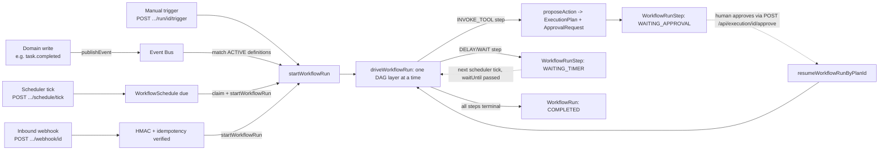

# Workflows API

API reference for `/api/workflows/**` — Phase 8, the Workflow Automation Platform. Workflows are
org-authored automations (`trigger`/`conditions`/`graph` are all `Json`, edited through a visual
builder, not developer code) that react to something that already happened — a domain write, a
schedule, an inbound webhook, or a manual "Run Now" click — and walk a DAG of steps, exactly one
type of which (`INVOKE_TOOL`, and indirectly `INVOKE_AGENT`) can ever reach a write, and it does so
through the unmodified [Tools & Execution API](./tools.md) chain. For the underlying design (the
Event Bus, the step-handler registry, the re-entrant run driver, scheduling, retries), see
[Overview](../workflows/overview.md), [Event Bus](../workflows/event-bus.md),
[Workflow Engine](../workflows/workflow-engine.md), [Builder](../workflows/builder.md),
[Scheduler](../workflows/scheduler.md), [Templates](../workflows/templates.md),
[Retries](../workflows/retries.md), and [Approvals](../workflows/approvals.md), plus the
phase-era doc [workflows.md](../workflows.md).

**15 endpoints total**, including 2 literal route aliases (documented as aliases, not distinct
implementations) and 2 non-session, externally-called endpoints.

## Conventions

Same envelope, pagination, and error-mapping conventions as [Tools & Execution API](./tools.md#conventions)
apply throughout. Two things specific to this surface:

- Every mutating route calls `assertSameOrigin(request)` **except** `POST /api/workflows/schedule/tick`
  and `POST /api/workflows/webhook/[id]` — both are meant to be called by non-browser, non-session
  callers (a cron scheduler, an external webhook sender), so there is no cookie/session to protect.
- Rate limiting (in-memory, single-process, fixed-window) applies to exactly 2 routes in this
  surface: `POST /api/workflows/schedule/tick` (6/60s) and `POST /api/workflows/webhook/[id]`
  (30/60s). Every other workflow route is unlimited.
- **No automated tests exist for this surface** — see [Tools & Execution API](./tools.md#conventions).
  Nothing below implies regression coverage.
- **No background worker exists anywhere in this codebase.** This is stated explicitly in code
  comments in both `workflow-tick.service.ts` and `goal.service.ts`, and it's load-bearing for how
  this whole surface works: all time-based execution (`SCHEDULED` triggers, `DELAY`/`WAIT` step
  resumption) is driven entirely by an *external* caller hitting
  `POST /api/workflows/schedule/tick` — nothing in-process polls for due work.

---

## `GET /api/workflows` — List Workflow Definitions

**Method / Path**: `GET /api/workflows`
**File**: `apps/web/app/api/workflows/route.ts`
**Auth**: `requireActiveOrganizationId()` (route) → `WorkflowDefinitionService.list` →
`requireRole(organizationId, ROLES.MEMBER)`.

### Query params — `workflowDefinitionListQuerySchema`

| Field | Type | Default | Notes |
|---|---|---|---|
| `page` | number | `1` | |
| `pageSize` | number | `20` | max `100` |
| `status` | enum | — | optional: `DRAFT \| ACTIVE \| DISABLED` |
| `triggerType` | enum | — | optional: one of the 10 `TRIGGER_TYPES` below |

### Response — `200`

`data: PaginatedResult<WorkflowDefinitionData>`.

```json
{
  "success": true,
  "data": {
    "items": [
      {
        "id": "wfd_1a2b...",
        "organizationId": "org_1a2b...",
        "workflowKey": "weekly-project-report",
        "version": "1",
        "name": "Weekly Project Report",
        "description": "Reads a project, assembles a status report, and emails it out on a schedule.",
        "status": "DRAFT",
        "ownerId": null,
        "triggerType": "SCHEDULED",
        "trigger": { "type": "SCHEDULED", "config": {} },
        "conditions": null,
        "graph": { "steps": [ { "key": "read_project", "stepType": "READ_DATA", "params": { "id": "REPLACE_WITH_PROJECT_ID" }, "dependsOn": [] } ] },
        "retryPolicy": null,
        "timeoutMs": null,
        "rollbackPolicy": null,
        "webhookSecret": null,
        "createdAt": "2026-07-18T09:00:00.000Z",
        "updatedAt": "2026-07-18T09:00:00.000Z"
      }
    ],
    "page": 1,
    "pageSize": 20,
    "total": 1,
    "totalPages": 1
  }
}
```

### Errors

| Status | Code | When |
|---|---|---|
| 401 | `AUTH_ERROR` | No session / no active organization. |
| 403 | `FORBIDDEN` | Not a member of the active org. |
| 422 | `VALIDATION_ERROR` | Invalid `status`/`triggerType`/`page`/`pageSize`. |

---

## `POST /api/workflows` — Create a Workflow Definition (as `DRAFT`)

**Method / Path**: `POST /api/workflows`
**File**: `apps/web/app/api/workflows/route.ts`
**Auth**: `assertSameOrigin` → `requireAuth()` → `requireActiveOrganizationId()` →
`WorkflowDefinitionService.create` → `requireRole(organizationId, ROLES.MEMBER)`.

### Body — `createWorkflowDefinitionSchema`

| Field | Type | Default | Notes |
|---|---|---|---|
| `workflowKey` | string (1-100) | — | required |
| `version` | string (1-20) | `'1'` | |
| `name` | string (1-200) | — | required |
| `description` | string (max 2000) | `''` | |
| `ownerId` | string | — | optional; required before `publish` if the graph has any write step |
| `triggerType` | enum | — | one of the 10 `TRIGGER_TYPES` below |
| `trigger` | object | — | free-form `Record<string, unknown>` — shape depends on `triggerType` |
| `conditions` | object | — | optional `WorkflowConditionNode` tree |
| `graph` | `{ steps: [...] }` | — | min 1 step |
| `retryPolicy` | object | — | optional |
| `timeoutMs` | number | — | optional, positive |
| `rollbackPolicy` | object | — | optional, e.g. `{ enabled: false }` |

**`TRIGGER_TYPES`**: `ENTITY_CREATED, ENTITY_UPDATED, ENTITY_DELETED, FILE_UPLOADED, MANUAL,
SCHEDULED, WEBHOOK, API, AGENT_EVENT, AI_INSIGHT`.

**Each `graph.steps[]` entry**:

```ts
{
  key: string;
  stepType: 'READ_DATA' | 'SEARCH_KNOWLEDGE' | 'INVOKE_AGENT' | 'INVOKE_TOOL' | 'WAIT'
          | 'BRANCH' | 'DELAY' | 'LOOP' | 'NOTIFICATION' | 'GENERATE_REPORT';
  params: Record<string, unknown>;
  dependsOn?: string[]; // default []
  condition?: { predicate: string; args: Record<string, unknown>; negate?: boolean };
  retry?: { maxAttempts: number; backoffMs: number }; // 1-5 attempts, 0-60000ms
}
```

### Example request

```json
{
  "workflowKey": "meeting-followup",
  "name": "Meeting Follow-up Task",
  "triggerType": "ENTITY_CREATED",
  "trigger": { "type": "ENTITY_CREATED", "config": { "source": "MEETING" } },
  "graph": {
    "steps": [
      { "key": "create_followup", "stepType": "INVOKE_TOOL", "params": { "toolKey": "create_task", "title": "Follow up on meeting" }, "dependsOn": [] }
    ]
  }
}
```

### Response — `201`

`data: WorkflowDefinitionData` (same shape as list items above), `status: "DRAFT"`.

### Errors

| Status | Code | When |
|---|---|---|
| 401 | `AUTH_ERROR` | No session / no active organization. |
| 403 | `FORBIDDEN` | Missing/mismatched `Origin` header. |
| 422 | `VALIDATION_ERROR` | Malformed body, an empty `graph.steps`, the graph isn't a well-formed DAG (cycle, duplicate key, or a `dependsOn` referencing an unknown step — `validatePlanSteps`, reused from Phase 6's `dag.ts`), or a `stepType` names no registered handler. |

### Notes

- `ownerId` defaults to the creating user (`input.ownerId ?? userId`) if omitted.
- The graph is validated as a well-formed DAG and every `stepType` checked against the live
  step-handler registry **at creation time**, not discovered mid-run — see
  [Builder](../workflows/builder.md).
- A `WorkflowDefinition` row **is** the workflow (data authored by the org through a visual
  builder), unlike `Tool`/`Agent` rows, which are metadata snapshots of code a developer shipped.
  See [Overview](../workflows/overview.md).

---

## `GET /api/workflows/[id]` — Get a Workflow Definition

**Method / Path**: `GET /api/workflows/{id}`
**File**: `apps/web/app/api/workflows/[id]/route.ts`
**Auth**: `requireActiveOrganizationId()` → `WorkflowDefinitionService.get` →
`requireRole(organizationId, ROLES.MEMBER)`.

### Path params

| Param | Meaning |
|---|---|
| `id` | `WorkflowDefinition.id` |

### Response — `200`

`data: WorkflowDefinitionData` (full shape, same as the list endpoint's items — includes the full
`graph`, unlike the lightweight templates listing).

### Errors

| Status | Code | When |
|---|---|---|
| 401 | `AUTH_ERROR` | No session / no active organization. |
| 403 | `FORBIDDEN` | Not a member of the active org. |
| 404 | `NOT_FOUND` | No `WorkflowDefinition` with this `id` in this organization. |

---

## `PATCH /api/workflows/[id]` — Edit a Draft

**Method / Path**: `PATCH /api/workflows/{id}`
**File**: `apps/web/app/api/workflows/[id]/route.ts`
**Auth**: `assertSameOrigin` → `requireActiveOrganizationId()` (no `requireAuth()` here — a PATCH
doesn't need a `createdById`) → `WorkflowDefinitionService.updateDraft` →
`requireRole(organizationId, ROLES.MEMBER)`.

**Only ever touches a `DRAFT` row.** If the definition is already `ACTIVE` or `DISABLED`, this
throws `NotFoundError` — publishing freezes a definition precisely so an in-flight `WorkflowRun`
(possibly waiting days on a `DELAY` step) always resumes against the exact graph it started with.

### Path params

| Param | Meaning |
|---|---|
| `id` | `WorkflowDefinition.id` — must currently be `DRAFT` |

### Body — `updateDraftWorkflowDefinitionSchema`

Every field of `createWorkflowDefinitionSchema` except `workflowKey`/`version`, all optional:
`name?, description?, triggerType?, trigger?, conditions?, graph?, retryPolicy?, timeoutMs?
(nullable), rollbackPolicy?`. If `graph` is included, it's re-validated exactly as it is on
create.

### Response — `200`

`data: WorkflowDefinitionData` (updated).

### Errors

| Status | Code | When |
|---|---|---|
| 401 | `AUTH_ERROR` | No active organization. |
| 403 | `FORBIDDEN` | Missing/mismatched `Origin`, or not a member. |
| 404 | `NOT_FOUND` | No `DRAFT` row with this `id` (it may already be published). |
| 422 | `VALIDATION_ERROR` | Malformed body or an invalid `graph`. |

---

## `POST /api/workflows/[id]/publish` — Publish (DRAFT → ACTIVE)

**Method / Path**: `POST /api/workflows/{id}/publish`
**File**: `apps/web/app/api/workflows/[id]/publish/route.ts`
**Auth**: `assertSameOrigin` → `requireActiveOrganizationId()` →
`WorkflowDefinitionService.publish` → `requireRole(organizationId, ROLES.MEMBER)`.

Freezes a `DRAFT` into an immutable, versioned `ACTIVE` row — the one-way transition that makes a
workflow live and matchable by the [Event Bus](../workflows/event-bus.md).

### Path params

| Param | Meaning |
|---|---|
| `id` | `WorkflowDefinition.id` — must currently be `DRAFT` |

### Response — `200`

`data: WorkflowDefinitionData`, `status: "ACTIVE"`.

### Errors

| Status | Code | When |
|---|---|---|
| 401 / 403 | `AUTH_ERROR` / `FORBIDDEN` | Auth/CSRF/role failures as above. |
| 404 | `NOT_FOUND` | No `WorkflowDefinition` with this `id`. |
| 422 | `VALIDATION_ERROR` | `status !== 'DRAFT'` (already published), **or** the graph contains a write step (`INVOKE_TOOL`/`INVOKE_AGENT`) but `ownerId` is still unset — a write-capable workflow needs an accountable party for the `proposeAction()` chain before it can go live. |

### Notes

- This is a one-way transition — there is no `unpublish`; use `POST /api/workflows/[id]/disable`
  to stop future triggering of an `ACTIVE` workflow.

---

## `POST /api/workflows/[id]/disable` — Disable an Active Workflow

**Method / Path**: `POST /api/workflows/{id}/disable`
**File**: `apps/web/app/api/workflows/[id]/disable/route.ts`
**Auth**: `assertSameOrigin` → `requireActiveOrganizationId()` →
`WorkflowDefinitionService.disable` → `requireRole(organizationId, ROLES.MEMBER)`.

### Path params

| Param | Meaning |
|---|---|
| `id` | `WorkflowDefinition.id` — must currently be `ACTIVE` |

### Response — `200`

```json
{ "success": true, "data": { "success": true } }
```

### Errors

| Status | Code | When |
|---|---|---|
| 401 / 403 | `AUTH_ERROR` / `FORBIDDEN` | Auth/CSRF/role failures. |
| 404 | `NOT_FOUND` | No `ACTIVE` `WorkflowDefinition` with this `id`. |

### Notes

- Stops the Event Bus from matching this workflow going forward. It does **not** cancel any
  in-flight `WorkflowRun` already started from it — use
  `POST /api/workflows/run/[id]/cancel` for that.

---

## `GET /api/workflows/approvals` — Pending Approvals (Workaround)

**Method / Path**: `GET /api/workflows/approvals`
**File**: `apps/web/app/api/workflows/approvals/route.ts`
**Auth**: `requireActiveOrganizationId()` (route) → `listExecutionsService` (the same service
`GET /api/execution` uses) internally requires `MEMBER`.

**This is a documented workaround, not a first-class query.** `ApprovalService` only exposes
single-plan lookups (`getForPlan`/`approve`/`reject`) — there is no "list all pending approvals
for an org" method, and the `ApprovalRequest` repository has no listing query either. This route
reuses `listExecutionsService` — the exact listing `GET /api/execution?status=AWAITING_APPROVAL`
already provides — forcing `status` to `AWAITING_APPROVAL` regardless of any query input.
**Workflow-specific filtering is explicitly not implemented**: it cannot distinguish a
workflow-originated pending approval from any other org-wide pending approval by matching a
`WorkflowRunStep.planId`. Do not document this as "list approvals for this workflow" — it is
org-wide pending approvals, coincidentally surfaced under the workflows path because that's where
the Workflow Automation dashboard needs it.

### Query params

Same `executionListQuerySchema` as `GET /api/execution` (`page`, `pageSize`; `status` is accepted
but always overwritten to `AWAITING_APPROVAL`).

### Response — `200`

`data: PaginatedResult<ToolExecutionData>` — see the `GET /api/execution` section of the
[Tools & Execution API](./tools.md).

### Errors

Same as `GET /api/execution`.

---

## `GET /api/workflows/events` — Event Monitor

**Method / Path**: `GET /api/workflows/events`
**File**: `apps/web/app/api/workflows/events/route.ts`
**Auth**: `requireActiveOrganizationId()` **only** — no `requireRole` anywhere in this route's
call chain. `listEvents` is a plain, already org-scoped repository function with no business logic
and no role check of its own; the route calls `requireActiveOrganizationId()` itself rather than
adding a one-line service wrapper just to hold a `requireRole` call.

A pure read over the [Event Bus](../workflows/event-bus.md)'s append-only `Event` log.

### Query params — `workflowEventListQuerySchema`

| Field | Type | Default | Notes |
|---|---|---|---|
| `page` | number | `1` | |
| `pageSize` | number | `20` | max `100` |
| `eventType` | string | — | optional; free-form dotted string (e.g. `"task.completed"`) — not a Prisma enum, since the event taxonomy is meant to grow additively |
| `source` | string | — | optional; one of `EventSource`: `DOCUMENT, PROJECT, TASK, MEETING, CUSTOMER, EMAIL, KNOWLEDGE_GRAPH, AI_COPILOT, AGENT, SYSTEM, COLLABORATION` |

### Response — `200`

`data: PaginatedResult<Event>` — `id, organizationId, eventType, source, payload, correlationId,
causationId, metadata, entityType, entityId, createdAt`.

```json
{
  "success": true,
  "data": {
    "items": [
      {
        "id": "evt_9c1a...",
        "organizationId": "org_1a2b...",
        "eventType": "task.completed",
        "source": "TASK",
        "payload": { "taskId": "task_44f1...", "projectId": "proj_11ee..." },
        "correlationId": "corr_7a2b...",
        "causationId": null,
        "metadata": null,
        "entityType": "TASK",
        "entityId": "task_44f1...",
        "createdAt": "2026-07-20T13:58:02.100Z"
      }
    ],
    "page": 1,
    "pageSize": 20,
    "total": 1,
    "totalPages": 1
  }
}
```

### Errors

| Status | Code | When |
|---|---|---|
| 401 | `AUTH_ERROR` | No session / no active organization. |
| 422 | `VALIDATION_ERROR` | Invalid `page`/`pageSize`. |

---

## `GET /api/workflows/history` — Alias of `GET /api/workflows/run`

**Method / Path**: `GET /api/workflows/history`
**File**: `apps/web/app/api/workflows/history/route.ts` — the entire file body is:

```ts
export { GET } from '../run/route';
```

This is a **literal re-export**, not a separate implementation. Its auth, query params, response
shape, and errors are identical in every respect to `GET /api/workflows/run`, documented next.

---

## `GET /api/workflows/run` — List Workflow Runs

**Method / Path**: `GET /api/workflows/run` (also reachable as `GET /api/workflows/history`)
**File**: `apps/web/app/api/workflows/run/route.ts`
**Auth**: `requireActiveOrganizationId()` (route) → `WorkflowRunService.list` →
`requireRole(organizationId, ROLES.MEMBER)`.

### Query params — `workflowRunListQuerySchema`

| Field | Type | Default | Notes |
|---|---|---|---|
| `page` | number | `1` | |
| `pageSize` | number | `20` | max `100` |
| `status` | enum | — | optional: `PENDING, RUNNING, WAITING_APPROVAL, WAITING_TIMER, COMPLETED, FAILED, CANCELLED, ROLLED_BACK` |
| `workflowDefinitionId` | string | — | optional; filter to one definition |

### Response — `200`

`data: PaginatedResult<WorkflowRunData>` — `id, organizationId, workflowDefinitionId,
triggerEventId, status, correlationId, causationId, error, startedAt, completedAt, createdAt,
updatedAt`.

```json
{
  "success": true,
  "data": {
    "items": [
      {
        "id": "run_2b3c...",
        "organizationId": "org_1a2b...",
        "workflowDefinitionId": "wfd_1a2b...",
        "triggerEventId": "evt_9c1a...",
        "status": "WAITING_APPROVAL",
        "correlationId": "corr_7a2b...",
        "causationId": null,
        "error": null,
        "startedAt": "2026-07-20T13:58:02.500Z",
        "completedAt": null,
        "createdAt": "2026-07-20T13:58:02.500Z",
        "updatedAt": "2026-07-20T13:58:03.100Z"
      }
    ],
    "page": 1,
    "pageSize": 20,
    "total": 1,
    "totalPages": 1
  }
}
```

### Errors

Same as `GET /api/workflows` above.

---

## `GET /api/workflows/run/[id]` — Run Detail

**Method / Path**: `GET /api/workflows/run/{id}`
**File**: `apps/web/app/api/workflows/run/[id]/route.ts`
**Auth**: `requireActiveOrganizationId()` → `WorkflowRunService.get` →
`requireRole(organizationId, ROLES.MEMBER)`.

### Path params

| Param | Meaning |
|---|---|
| `id` | `WorkflowRun.id` |

### Response — `200`

```ts
{ run: WorkflowRunData; steps: WorkflowRunStepData[] }
```

`WorkflowRunStepData`: `id, runId, key, stepType, status, input, output, error, attempt,
loopIndex, waitUntil, planId, startedAt, completedAt, createdAt`. `status` is one of `PENDING,
RUNNING, WAITING_APPROVAL, WAITING_TIMER, SUCCEEDED, FAILED, SKIPPED, ROLLED_BACK`.

```json
{
  "success": true,
  "data": {
    "run": {
      "id": "run_2b3c...",
      "organizationId": "org_1a2b...",
      "workflowDefinitionId": "wfd_1a2b...",
      "status": "WAITING_APPROVAL",
      "correlationId": "corr_7a2b...",
      "startedAt": "2026-07-20T13:58:02.500Z",
      "completedAt": null
    },
    "steps": [
      {
        "id": "wrs_1",
        "runId": "run_2b3c...",
        "key": "create_followup",
        "stepType": "INVOKE_TOOL",
        "status": "WAITING_APPROVAL",
        "input": { "toolKey": "create_task", "title": "Follow up on meeting" },
        "output": null,
        "error": null,
        "attempt": 1,
        "loopIndex": null,
        "waitUntil": null,
        "planId": "plan_7ab1c2d3",
        "startedAt": "2026-07-20T13:58:02.600Z",
        "completedAt": null,
        "createdAt": "2026-07-20T13:58:02.550Z"
      }
    ]
  }
}
```

### Errors

| Status | Code | When |
|---|---|---|
| 401 / 403 | `AUTH_ERROR` / `FORBIDDEN` | Auth/role failures. |
| 404 | `NOT_FOUND` | No `WorkflowRun` with this `id` in this organization. |

### Notes

- A step's `planId` (present only for `INVOKE_TOOL`) is how the run driver resolves whether a
  `WAITING_APPROVAL` step can proceed — look it up via `GET /api/execution/[id]` (see the
  [Tools & Execution API](./tools.md)) for the plan's own approval/execution detail.

---

## `POST /api/workflows/run/[id]/cancel` — Cancel an In-Flight Run

**Method / Path**: `POST /api/workflows/run/{id}/cancel`
**File**: `apps/web/app/api/workflows/run/[id]/cancel/route.ts`
**Auth**: `assertSameOrigin` → `requireActiveOrganizationId()` → `WorkflowRunService.cancel` →
`requireRole(organizationId, ROLES.MEMBER)`.

### Path params

| Param | Meaning |
|---|---|
| `id` | `WorkflowRun.id` |

### Response — `200`

`data: null`.

### Errors

| Status | Code | When |
|---|---|---|
| 401 / 403 | `AUTH_ERROR` / `FORBIDDEN` | Auth/CSRF/role failures. |
| 404 | `NOT_FOUND` | No `WorkflowRun` with this `id`. |
| 422 | `VALIDATION_ERROR` | The run is already terminal (`COMPLETED`, `FAILED`, `CANCELLED`, or `ROLLED_BACK`) — message names the current status. |

### Notes

- Cancels an in-flight run only. It does **not** roll back steps that already succeeded — for
  that, a run must reach `FAILED` on its own (triggering `failRun`'s automatic rollback of
  `INVOKE_TOOL` steps, if `rollbackPolicy.enabled !== false` and the definition has an `ownerId`).

---

## `POST /api/workflows/run/[id]/trigger` — Manual Trigger ("Run Now")

**Method / Path**: `POST /api/workflows/run/{id}/trigger`
**File**: `apps/web/app/api/workflows/run/[id]/trigger/route.ts`
**Auth**: `assertSameOrigin` → `requireAuth()` → `requireActiveOrganizationId()` →
`WorkflowRunService.triggerManual` → `requireRole(organizationId, ROLES.MEMBER)`.

**Naming trap, called out directly in the route file's own comment**: despite living under the
`run/` path segment, `{id}` here is a **`WorkflowDefinition.id`**, not a `WorkflowRun` id — this
endpoint *starts a brand-new run* against that definition (the "Run Now" button), bypassing the
Event Bus's trigger-matching entirely since the caller already picked the target definition
directly.

### Path params

| Param | Meaning |
|---|---|
| `id` | `WorkflowDefinition.id` — must currently be `ACTIVE` |

### Body — `triggerManualWorkflowSchema`

```ts
{ payload: Record<string, unknown> } // default {}
```

### Response — `201`

`data: WorkflowRunData` — the newly created run, `status` reflecting how far the synchronous
dispatch got before returning (`RUNNING`, `WAITING_APPROVAL`, `WAITING_TIMER`, or terminal if the
whole graph finished within the dispatch budget).

### Errors

| Status | Code | When |
|---|---|---|
| 401 | `AUTH_ERROR` | No session / no active organization. |
| 403 | `FORBIDDEN` | Missing/mismatched `Origin`, or not a member. |
| 404 | `NOT_FOUND` | No `WorkflowDefinition` with this `id`. |
| 422 | `VALIDATION_ERROR` | `status !== 'ACTIVE'` — only an `ACTIVE` workflow can be run. |
| 500 | `INTERNAL_ERROR` | `WorkflowRunLimitExceededError` is thrown as a plain `Error` (not an `AppError` subclass), so `apiHandler` maps it to a generic 500, not a typed 4xx — see Notes. |

### Notes

- Creates a `workflow.manual_trigger` `Event` first, then calls `startWorkflowRun`, which caps
  **concurrent non-terminal runs per `WorkflowDefinition` at 5** (`WorkflowRunLimitExceededError`,
  `apps/web/features/workflows/services/workflow-run.service.ts:52-61`) — a bounded mitigation
  against a workflow whose own approved write re-triggers its own event, since the in-memory
  dispatch-budget cycle guard cannot see across an approval gap (approvals can be hours or days
  later, long after the original synchronous dispatch call returned).
- Each dispatch gets a fresh `WorkflowDispatchBudget` (`WORKFLOW_MAX_SYNC_STEPS`, default `20`;
  `WORKFLOW_MAX_SYNC_MS`, default `5000`) — a run that exceeds either bound mid-dispatch fails that
  step and the run, rather than blocking the HTTP request indefinitely.

---

## `POST /api/workflows/schedule/tick` — Scheduler Tick (Cron)

**Method / Path**: `POST /api/workflows/schedule/tick`
**File**: `apps/web/app/api/workflows/schedule/tick/route.ts`
**Auth**: **no session-based auth at all.** A bearer-token check against `CRON_SECRET`, compared
via `secureCompare` (constant-time, length-checked first to avoid both a `===` timing side-channel
and a raw `timingSafeEqual` length-mismatch exception). **Fails closed as `404 NOT_FOUND`** — never
401/403 — both when `CRON_SECRET` is unset in the environment and when the provided secret doesn't
match, so an unauthenticated prober cannot even learn the endpoint exists. No `assertSameOrigin`
and no `requireAuth` — there is no browser session to protect.
**Rate limit**: 6 requests / 60 seconds.

The **sole entry point** into all time-based workflow execution in this codebase. Meant to be
invoked periodically by an external scheduler (Vercel Cron, a GitHub Actions scheduled workflow,
an OS-level Task Scheduler entry — BOND OS ships no scheduler of its own). See
[Scheduler](../workflows/scheduler.md).

### Request headers

| Header | Required | Value |
|---|---|---|
| `Authorization` | yes | `Bearer <CRON_SECRET>` |

### Body

None.

### Response — `200`

```ts
{ schedulesDispatched: number; timersResumed: number; errors: number }
```

```json
{
  "success": true,
  "data": { "schedulesDispatched": 2, "timersResumed": 1, "errors": 0 }
}
```

### Errors

| Status | Code | When |
|---|---|---|
| 404 | `NOT_FOUND` | `CRON_SECRET` is unset, **or** the `Authorization` header is missing/doesn't match — identical response either way, by design. |
| 429 | `RATE_LIMITED` | More than 6 calls in 60s from the same client IP. |

### Notes

- Two independent, deliberately cross-organization sweeps run every call (there is no session to
  scope by):
  1. **Due schedules** — `listDueWorkflowSchedules` finds every `WorkflowSchedule` whose
     `nextRunAt` has passed, atomically claims each one via a conditional `updateMany`
     (`claimWorkflowSchedule` — the same idiom `ApprovalRequest`'s single-use transition uses, so
     two overlapping tick invocations can never double-fire the same schedule), computes the next
     `nextRunAt` from the cron expression + timezone, and starts a new run if the definition is
     still `ACTIVE`.
  2. **Due timers** — `listDueWaitingSteps` finds every `WorkflowRunStep` in `WAITING_TIMER` whose
     `waitUntil` has passed, and calls `resumeWorkflowRunById` for each distinct run.
- One workflow's failure is caught per-item and counted in `errors` — it never aborts the sweep for
  any other organization's due work.
- This is the **only** deliberate exception (alongside the webhook route below) to this codebase's
  "every workflow repository function takes `organizationId`" convention — `WorkflowSchedule`/
  waiting-step lookups here are genuinely unscoped, by necessity.

---

## `GET /api/workflows/templates` — List Built-in Templates

**Method / Path**: `GET /api/workflows/templates`
**File**: `apps/web/app/api/workflows/templates/route.ts`
**Auth**: `requireActiveOrganizationId()` only — no `requireRole`, since templates are static,
developer-owned data (mirrors the fixed `Tool`/`Agent` catalogs), not org data.

### Response — `200`

Lightweight metadata only — **no `graph`** in this listing (fetch the full template via
`POST .../instantiate` to get it as an editable draft). `data: Array<{ templateKey, name,
description, triggerType }>`.

Exactly **5 built-in templates** exist (`apps/web/features/workflows/templates/registry.ts`):

```json
{
  "success": true,
  "data": [
    { "templateKey": "weekly-project-report", "name": "Weekly Project Report", "description": "Reads a project, assembles a status report, and emails it out on a schedule. After instantiating, set the project id, recipient email, and attach a cron schedule to activate.", "triggerType": "SCHEDULED" },
    { "templateKey": "new-employee-onboarding", "name": "New Employee Onboarding", "description": "...", "triggerType": "MANUAL" },
    { "templateKey": "customer-follow-up-reminder", "name": "Customer Follow-up Reminder", "description": "...", "triggerType": "ENTITY_UPDATED" },
    { "templateKey": "meeting-action-item-generator", "name": "Meeting Action Item Generator", "description": "...", "triggerType": "ENTITY_CREATED" },
    { "templateKey": "document-approval-flow", "name": "Document Approval Flow", "description": "...", "triggerType": "ENTITY_CREATED" }
  ]
}
```

### Errors

| Status | Code | When |
|---|---|---|
| 401 | `AUTH_ERROR` | No session / no active organization. |

### Notes

- Every template graph deliberately contains literal `REPLACE_WITH_*` placeholders (e.g. a
  `READ_DATA` step's target `id`) — there is no `$trigger.*` reference syntax to pull a concrete
  id out of the triggering event, only `$steps.<key>.output.<path>` references to a **prior
  step's** output, so a template can never fully wire itself; the instantiating org must edit the
  draft before publishing. See [Templates](../workflows/templates.md).

---

## `POST /api/workflows/templates/[key]/instantiate` — Instantiate a Template

**Method / Path**: `POST /api/workflows/templates/{key}/instantiate`
**File**: `apps/web/app/api/workflows/templates/[key]/instantiate/route.ts`
**Auth**: `assertSameOrigin` → `requireAuth()` → `requireActiveOrganizationId()` → (via
`WorkflowDefinitionService.create()`) `requireRole(organizationId, ROLES.MEMBER)`.

### Path params

| Param | Meaning |
|---|---|
| `key` | The template's `templateKey` (e.g. `weekly-project-report`) — comes from the URL, **not** the body. |

### Body — `instantiateWorkflowTemplateSchema.omit({ templateKey: true })`

```ts
{ workflowKey: string; name?: string } // name defaults to the template's own name
```

### Example request

`POST /api/workflows/templates/weekly-project-report/instantiate`

```json
{ "workflowKey": "acme-weekly-report" }
```

### Response — `201`

`data: WorkflowDefinitionData`, always `status: "DRAFT"` — **never auto-published**, regardless of
the template.

### Errors

| Status | Code | When |
|---|---|---|
| 401 | `AUTH_ERROR` | No session / no active organization. |
| 403 | `FORBIDDEN` | Missing/mismatched `Origin`. |
| 404 | `NOT_FOUND` | `key` doesn't match any `WORKFLOW_TEMPLATES` entry. |
| 422 | `VALIDATION_ERROR` | Malformed body. |

### Notes

- This is the one place `WORKFLOW_TEMPLATES` (plain developer data) meets
  `WorkflowDefinitionService.create()` (the per-org write path, which independently re-runs
  `requireRole` and `validateGraph`). The org reviews/edits the resulting draft — filling in
  `REPLACE_WITH_*` placeholders, setting an `ownerId` — and calls
  `POST /api/workflows/[id]/publish` themselves when ready.

---

## `POST /api/workflows/webhook/[id]` — Inbound Webhook Trigger

**Method / Path**: `POST /api/workflows/webhook/{id}`
**File**: `apps/web/app/api/workflows/webhook/[id]/route.ts`
**Auth**: **no session/cookie/CSRF at all.** `{id}` is deliberately the non-guessable
`WorkflowDefinition.id` (a cuid) rather than the org-scoped `workflowKey`, since this route has no
session to resolve which organization a bare key would belong to. Real authentication is an
**HMAC-SHA256 signature** over the raw request body, compared via `secureCompare` (never `===`).
**Rate limit**: 30 requests / 60 seconds.

The one door a caller with no BOND OS session can use to start a workflow.

### Path params

| Param | Meaning |
|---|---|
| `id` | `WorkflowDefinition.id` — must be `ACTIVE`, `triggerType: WEBHOOK`, and have a `webhookSecret` configured |

### Request headers

| Header | Required | Notes |
|---|---|---|
| `x-workflow-signature` | yes | `hex(hmac_sha256(webhookSecret, rawBody))` |
| `x-idempotency-key` **or** `idempotency-key` | yes | either name is accepted |

### Body

Any raw payload. Parsed as JSON if possible; on parse failure it's wrapped as `{ raw: rawBody }`
rather than rejected.

### Response

`202 { "status": "accepted" }` on a genuinely new delivery, `200 { "status": "duplicate" }` if this
exact `(workflowDefinitionId, idempotencyKey)` pair has already been recorded.

### Errors

Every acceptance requires, **in order**, all of the following — anything else fails closed as
`404 NOT_FOUND` without revealing which check failed:

| Status | Code | When |
|---|---|---|
| 404 | `NOT_FOUND` | The `WorkflowDefinition` doesn't exist, isn't `ACTIVE`, isn't `triggerType: WEBHOOK`, or has no `webhookSecret` set — all four collapse to the identical 404. |
| 422 | `VALIDATION_ERROR` | Missing `x-workflow-signature` or missing idempotency key header. |
| 403 | `FORBIDDEN` | Signature present but doesn't match (`secureCompare` fails). |
| 429 | `RATE_LIMITED` | More than 30 calls in 60s from the same client IP. |

### Notes

- **Replay protection is a real database constraint, not application logic.** A duplicate
  `(workflowDefinitionId, idempotencyKey)` pair fails a genuine unique-constraint insert
  (`WorkflowWebhookDelivery.@@unique([workflowDefinitionId, idempotencyKey])`) — atomic, not a
  check-then-insert race.
- "Unverified external webhooks" is explicitly on this codebase's Do-NOT-Build list; there is no
  code path here that starts a run without the definition/signature/idempotency checks all
  passing.
- On success, the raw body (parsed as JSON, or wrapped `{ raw }`) becomes a `webhook.received`
  [Event](../workflows/event-bus.md), and a new `WorkflowRun` starts exactly as any other trigger
  would.

---

## Diagrams

### The end-to-end chain



### Trigger-type → endpoint map

| `triggerType` | How a run actually starts |
|---|---|
| `SCHEDULED` | `POST /api/workflows/schedule/tick` claims a due `WorkflowSchedule`. |
| `MANUAL` | `POST /api/workflows/run/[id]/trigger` ("Run Now"). |
| `WEBHOOK` | `POST /api/workflows/webhook/[id]`, HMAC-verified. |
| `ENTITY_CREATED` / `ENTITY_UPDATED` / `ENTITY_DELETED` / `FILE_UPLOADED` / `AGENT_EVENT` / `AI_INSIGHT` / `API` | A curated domain-service `publishEvent()` call site whose `eventType`/`source` matches this definition's `trigger.config` — see [Event Bus](../workflows/event-bus.md). No dedicated HTTP endpoint; these are matched automatically. |

## Cross-cutting notes

- **Two literal route aliases**: `GET /api/workflows/history` (`export { GET } from '../run/route'`)
  and, in the [Agents API](./agents.md), `GET /api/agents/list`. Document them as aliases with
  identical behavior, not as separate implementations.
- **`GET /api/workflows/approvals` is a workaround**, not a first-class per-workflow query — see
  its section above.
- **`GET /api/workflows/events` has no service-layer `requireRole`** — see its section above and
  the equivalent note in [Tools & Execution API](./tools.md#cross-cutting-notes).
- **Two non-session, externally-called endpoints**: the scheduler tick (cron-secret bearer token,
  fails closed as 404) and the inbound webhook (HMAC signature + a real unique-constraint replay
  guard). Both intentionally skip `assertSameOrigin`/`requireAuth`.
- **In-memory rate limiting only** — see [Tools & Execution API](./tools.md#conventions).
- **No workflow ever bypasses the Phase 6 approval gate.** The one step type that writes,
  `INVOKE_TOOL`, always returns `waiting_approval` and stops — there is no configuration flag, no
  "auto-approve," no privileged workflow that skips human review. This is the same "propose, never
  execute" invariant the [Agents API](./agents.md) upholds for agent-proposed actions.

## Related docs

- [Tools & Execution API](./tools.md) — the unmodified Phase 6 chain every `INVOKE_TOOL` step
  flows through.
- [Agents API](./agents.md) — the unmodified Phase 7 agent registry an `INVOKE_AGENT` step calls
  into.
- [Event Bus](../workflows/event-bus.md), [Workflow Engine](../workflows/workflow-engine.md),
  [Builder](../workflows/builder.md), [Scheduler](../workflows/scheduler.md),
  [Templates](../workflows/templates.md), [Retries](../workflows/retries.md),
  [Approvals](../workflows/approvals.md) — subsystem-level design docs.
- [Organization Isolation](../security/organization-isolation.md) — why the tick and webhook
  routes are the two deliberate exceptions to per-request org scoping.
