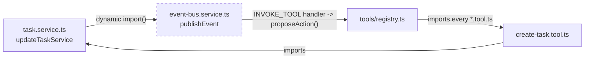

# Design Principles

The recurring conventions that hold this codebase together, each grounded in a real file and line
range — not a stated ideal, but a pattern actually repeated across the code every time the same problem
comes up. See [docs/development/coding-standards.md](../development/coding-standards.md) for the
narrower, mechanical "how do I follow this convention" version of several of these.

## Composition roots: lazy-singleton dependency injection

Every class-based service (used where a service genuinely depends on several collaborators — `execution`,
`agents`, `workflows`, and a handful of others) is wired up in exactly **one** place per feature: that
feature's `lib/container.ts`. `apps/web/features/execution/lib/container.ts:12-19` states the invariant
directly, in its own doc comment:

```ts
/**
 * The composition root (Phase 6) — every new service is a class with
 * constructor-injected dependencies, wired up exactly once here, mirroring
 * the getAIProvider()/getEmbeddingProvider()/getCache()/getQueue() lazy-
 * singleton pattern already used throughout this codebase. No call site
 * anywhere writes `new ExecutionService(...)` directly. See docs/tool-execution.md.
 */
```

The shape, `execution/lib/container.ts:52-79`:

```ts
let approvalService: ApprovalService | undefined;
// ...
export function getApprovalService(): ApprovalService {
  if (!approvalService) approvalService = new ApprovalService();
  return approvalService;
}
// ...
export function getExecutionService(): ExecutionService {
  if (!executionService) {
    executionService = new ExecutionService(
      getToolRegistryService(), getValidationService(), getApprovalService(),
      getAuditService(), getRollbackService(), getPlannerService(),
    );
  }
  return executionService;
}
```

Module-scope `let cached: T | undefined`, constructed on first call, never reconstructed — a lazy
singleton per process. `getExecutionService()` wires together six other services purely by calling their
own `getX()` accessors, so the dependency graph is legible by reading one file top to bottom. The same
idiom predates `container.ts` and backs every infrastructure singleton in the codebase too: `getCache()`
(`packages/shared/src/cache.ts:86-98`), `getEmbeddingProvider()`
(`apps/web/features/embeddings/services/embedding-provider.service.ts`), and `getAIProviderById()`
(`apps/web/features/ai/services/ai-provider.service.ts:38-56`). `features/agents/lib/container.ts` and
`features/workflows/lib/container.ts` each carry their own doc comment stating they "mirror
`execution/lib/container.ts`'s ... pattern exactly" — this is a deliberately, explicitly repeated
convention, not three independently-invented ones that happen to look similar.

## Registries: the single source of truth for pluggable implementations

Three files share an identical shape and an almost copy-pasted doc comment, each stating it is "the ONLY
file in this codebase that imports every concrete [X] implementation":

**`apps/web/features/tools/registry.ts:9-24`:**

```ts
/**
 * The ONLY file in this codebase that imports every concrete tool
 * definition. `apps/web/features/planner/` and `apps/web/features/execution/`
 * never import a `*.tool.ts` file directly — they only ever call
 * `registry.get(toolKey, version)` / `registry.list()` on the
 * `ToolRegistryService` instance built here, which is what makes "the
 * execution engine knows nothing about Projects/Tasks/Customers/Documents"
 * literally true. See docs/tool-execution.md.
 */
const ALL_TOOLS: AnyToolDefinition[] = [
  createProjectTool, updateProjectTool, createTaskTool, createMeetingTool, archiveProjectTool,
];
```

**`apps/web/features/agents/registry.ts:10-20`** — the same shape, with an extra clause naming the
specific consumers that deliberately avoid importing it:

```ts
/**
 * The ONLY file in this codebase that imports every concrete agent
 * definition — mirrors apps/web/features/tools/registry.ts exactly.
 * agents/lib/base-agent.ts and agents/services/agent-pipeline.service.ts
 * never import this file (that would be the circular dependency documented
 * in delegation-budget.ts); only top-level callers (API routes, GoalService)
 * that already need the full agent list import it, then thread
 * resolveAgent/availableAgents down as plain data. See docs/agent-registry.md.
 */
const ALL_AGENTS: AgentDefinition[] = [
  bondCoordinatorAgent, projectAgent, salesAgent, operationsAgent, knowledgeAgent, financeAgent,
];
```

**`apps/web/features/workflows/registry.ts:15-34`** — the third instance, for the ~10 workflow
step-type handlers:

```ts
/**
 * The ONLY file in this codebase that imports every concrete step-handler
 * implementation — mirrors apps/web/features/tools/registry.ts/
 * apps/web/features/agents/registry.ts exactly. event-bus.service.ts and
 * workflow-run.service.ts only ever call registry.get(stepType), never
 * import a concrete *.handler.ts file directly. See docs/workflow-builder.md.
 */
const ALL_HANDLERS: WorkflowStepHandler[] = [
  readDataHandler, searchKnowledgeHandler, invokeAgentHandler, invokeToolHandler, waitHandler,
  branchHandler, delayHandler, loopHandler, notificationHandler, generateReportHandler,
];
```

The point of the pattern: everywhere *else* in the codebase asks the registry for an implementation by
key — `registry.get(toolKey, version)`, `registry.get(stepType)` — rather than importing a concrete file
directly. This is not just an organizational nicety; it is what makes the dynamic-import
cycle-breaking pattern below *necessary*, since a domain service's own tool (e.g. `create-task.tool.ts`)
is reachable from the registry, which is reachable from the execution engine, which is reachable from
the Event Bus, which a domain service would otherwise import statically. **If you add a new tool, agent,
or step handler, register it in the matching `registry.ts`'s `ALL_*` array — nothing else should import
your new file directly.**

## Repositories return signals, services throw

The load-bearing convention that makes the four-layer request path predictable: a repository function
never throws a domain error for "this row doesn't exist" or "nothing matched" — it returns `null`,
`false`, or an empty result, and the calling service is the one place that turns that signal into a
thrown `AppError`.

`packages/database/src/repositories/tasks.ts:207-210` — the repository side, a clean boolean signal:

```ts
export async function deleteTask(id: string, organizationId: string): Promise<boolean> {
  const result = await prisma.task.deleteMany({ where: { id, organizationId } });
  return result.count > 0;
}
```

`apps/web/features/tasks/services/task.service.ts:113-118` — the service side, converting that signal
into a thrown, HTTP-status-bearing error:

```ts
export async function deleteTaskService(organizationId: string, id: string): Promise<void> {
  await requireRole(organizationId, ROLES.ADMIN);
  const deleted = await deleteTaskRow(id, organizationId);
  if (!deleted) throw new NotFoundError('Task not found.');
  await deleteCommentsForEntity(organizationId, 'TASK', id);
}
```

The same split appears for `updateTask`/`updateTaskRow` (returns `TaskDetail | null`, thrown as
`NotFoundError` at `task.service.ts:88`) and for `updateProject` (`packages/database/src/repositories/projects.ts:200-250`),
which additionally throws `ConflictError` **inside the repository itself** — the one place in this
codebase a repository throws a domain error directly, because the property being enforced (optimistic-
locking version conflict) is fundamentally a database-transaction-level race, not something the service
layer could check any other way:

```ts
if (expectedVersion !== undefined && current.version !== expectedVersion) {
  throw new ConflictError('This project was edited by someone else. Refresh and try again.');
}
```

The one other exception is `createTask` (`packages/database/src/repositories/tasks.ts:146-159`), which
throws a plain `Error` (not an `AppError`) if it can't re-read the row it just inserted — a genuine
invariant violation with no sensible caller-facing meaning, not a user-facing condition. Every
`AppError` subclass — `ValidationError`, `AuthError`, `ForbiddenError`, `NotFoundError`, `ConflictError`,
`RateLimitError` — lives in one file, `packages/shared/src/errors.ts`, and routes never construct one by
hand; they just let whatever the service throws propagate up to `apiHandler()`.

## Additive-only schema evolution

`packages/database/prisma/schema.prisma` has 8 phase-section dividers (Phase 1 has none — it's described
only in the top-of-file header), each with its own explanatory comment block. The convention itself is
stated explicitly in `docs/development/coding-standards.md:199-221` ("Migrations: additive-only") and
demonstrated repeatedly at the field level. The clearest single example, `schema.prisma:408-412`:

```prisma
model Project {
  // ...
  /// Phase 9, additive — optimistic-locking version for Shared Editing. Every
  /// versioned update increments this and snapshots the prior state to
  /// EntityVersionSnapshot; a caller-supplied stale version fails with
  /// ConflictError rather than silently overwriting a concurrent edit.
  version        Int           @default(1)
```

`version` is a plain `Int @default(1)` — every row that existed before Phase 9 got a valid default with
no backfill migration required — and the repository parameter that reads it, `UpdateProjectData.expectedVersion`,
is **optional** specifically so every pre-Phase-9 caller (including the Tool Execution Framework's direct
`updateProject` calls) keeps its exact prior last-write-wins behavior unchanged:

```ts
/** Optimistic-locking guard (Phase 9 Shared Editing) — omitted by every
 * pre-Phase-9 caller, including the Tool Execution Framework's direct
 * updateProject calls, preserving last-write-wins for them; only adds a
 * version predicate to the update when provided. */
expectedVersion?: number;
```

The same "Phase N, additive" comment marker recurs verbatim on `Entity.version` (`schema.prisma:625-629`)
and two other models' `version` fields, and `Event.entityType`/`entityId` (`schema.prisma:1933-1941`,
quoted below) — a searchable convention for "this field was added after the model already had rows," not
just a one-off. As of this writing there is exactly one migration on disk
(`packages/database/prisma/migrations/20260718000000_init/`), generated offline via
`prisma migrate diff --from-empty` because the project was built with no live Postgres available (see
[architecture-decisions.md](./architecture-decisions.md#adr-006-offline-generated-initial-migration-no-live-dev-database) —
so there isn't yet a multi-migration history to point to as evidence in migration-file form, but the
per-field discipline above is what any new migration is expected to follow: new columns optional/defaulted,
new tables added alongside existing ones rather than replacing them (e.g. Phase 2's `KnowledgeDocument`
staying deliberately separate from Phase 1's `Document`), and new enum values appended, never reordered.

## Code owns behavior, the database stores metadata

`Tool` and `Agent` rows are never the execution path — they are queryable *snapshots* of code a developer
already wrote and shipped. `schema.prisma:1218-1222`, from the Phase 6 section header:

```
// A Tool's actual BEHAVIOR (validate/preview/execute/rollback) lives in code
// (apps/web/features/tools/), never in the DB — functions aren't storable —
// the `Tool` model below is a queryable metadata snapshot synced from the
// in-memory registry, not the execution hot path.
```

`schema.prisma:1488-1490` states the identical split for Phase 7's `Agent` model: "Agent behavior (the 9
SDK methods) lives in code ..., never in the DB — the `Agent` model below is a queryable metadata
snapshot, same 'code owns behavior, DB stores metadata' split as `Tool`." Phase 8 draws the same line one
level down: a `WorkflowDefinition` row **is** the workflow (its `trigger`/`conditions`/`graph` columns
are genuinely org-authored `Json` data), but the ~10 step-*type* handlers that interpret that graph are
fixed, developer-owned code, registered through the identical registry pattern described above
(`schema.prisma:1699-1706`). In every case, the registry (`ToolRegistryService`/`AgentRegistryService`/
`WorkflowStepHandlerRegistry`) is what upserts a DB row's metadata from the in-memory definition at
startup — never the reverse, and there is no admin surface anywhere that lets an organization define new
tool/agent *behavior* through the UI.

## The dynamic-import event publisher

A curated set of domain services publish to the in-process Event Bus (`publishEvent()`,
`apps/web/features/workflows/services/event-bus.service.ts`) after their own write already committed —
but every one of them imports `publishEvent` dynamically, inside the function that needs it, never as a
static top-level import. `apps/web/features/tasks/services/task.service.ts:24-38`, quoted in full:

```ts
/**
 * Dynamically imported at each call site below, not statically at the top
 * of this file — publishEvent() transitively reaches the Tool Registry
 * (via proposeAction, for an INVOKE_TOOL workflow step), which imports
 * every concrete *.tool.ts file, including create-task.tool.ts, which
 * imports THIS file's createTaskService. A static top-level import here
 * would be a real circular import; a dynamic one defers module loading past
 * both modules' initial evaluation, breaking the cycle while keeping
 * identical synchronous runtime behavior — the same pattern already used by
 * apps/web/features/agents/lib/base-agent.ts's health().
 */
async function getPublishEvent() {
  const { publishEvent } = await import('@/features/workflows/services/event-bus.service');
  return publishEvent;
}
```

The cycle this breaks is real, traced end to end in [Event Bus](../workflows/event-bus.md):
`task.service.ts` exports `updateTaskService`, which `create-task.tool.ts` imports to implement its own
`execute()`. `apps/web/features/tools/registry.ts` imports every `*.tool.ts` file, including
`create-task.tool.ts`, to build the Tool Registry. `publishEvent()`'s own `INVOKE_TOOL` step handler
calls `proposeAction()`, which resolves tools through that same registry. A static
`import { publishEvent } from '.../event-bus.service'` at the top of `task.service.ts` would therefore
close a genuine circular module graph:



The dashed edge is the one that would be a static import; deferring it to a dynamic `import()` inside the
function body means both modules finish their own top-level evaluation before the cycle is ever
traversed, so it never blocks module loading — the runtime call sequence is otherwise identical to a
static import, just resolved one tick later. The pattern is applied even at call sites that don't
currently sit on the Tool Registry's import chain — `customer.service.ts` and `insight.service.ts` both
use the identical `getPublishEvent()` helper despite neither being imported by a `*.tool.ts` file today —
specifically so a future tool added for either domain doesn't silently reintroduce the cycle a static
import would create. **If your new service needs to publish an event, copy this helper rather than
importing `publishEvent` at the top of the file.**

## Further reading

- [system-architecture.md](./system-architecture.md) — where these patterns sit in the overall layered
  architecture.
- [Event Bus](../workflows/event-bus.md) — the full mechanics of `publishEvent()`, the curated call-site
  table, and the `workflow.*` denylist.
- [docs/development/coding-standards.md](../development/coding-standards.md) — the mechanical,
  day-to-day version of several of these conventions (naming, import ordering, Zod schema shape).
- [docs/development/adding-features.md](../development/adding-features.md) — all of the above, applied
  end to end to one worked example.
