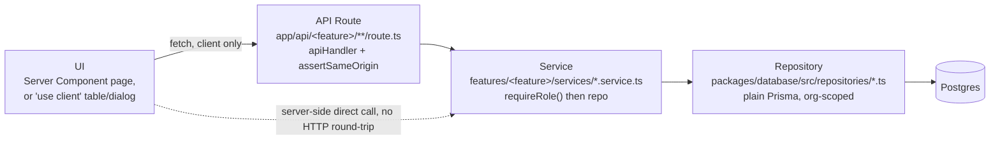

# Architecture Overview

## What BOND OS is

BOND OS is a company-memory platform: it holds an organization's operational data — Projects, Tasks,
Documents, Meetings, Customers, Emails — and turns it into a single, queryable knowledge graph. An AI
copilot ("Mr. Bond") retrieves from and reasons over that graph; a multi-agent workforce extends the
same reasoning across five specialist domains; an approval-gated tool-execution framework lets Mr. Bond
and the agents *act* on the graph, but only after an explicit human approval; and an event-driven
workflow platform automates the whole thing. All of it runs inside one multi-tenant, role-scoped
monorepo — `apps/web` (a Next.js 15 App Router application) plus ten `packages/*` libraries it depends
on.

It was built phase by phase, P0 through P9, each phase documented as it shipped in the 49 phase-era
files under `docs/*.md`. This is not a demo with placeholder logic behind a polished UI — every
capability described below is implemented and traceable to real source, and where a piece is
deliberately unfinished (no live OAuth connector sync, no background worker, no automated test suite),
that is stated plainly in the relevant doc rather than glossed over. See the project root
**[README.md](../../README.md)** for the user-facing feature tour and **[docs/README.md](../README.md)**
for the full documentation index.

## Phase history

Each phase added one layer without modifying the layers below it — a Phase 8 workflow step still
executes a write through the exact, unmodified Phase 6 approval chain; a Phase 7 agent still calls the
exact, unmodified Phase 6 `proposeAction()`. This additive discipline is why the codebase can be read
phase-by-phase and still make sense as a whole.

**P0 — Core Platform.** No AI logic at all — the goal was a production-ready foundation every later
phase could build on without re-litigating auth, multi-tenancy, database access, error handling, or the
component kit. It shipped Better Auth-backed sign-up/login/session handling, the
`User ──< Membership >── Organization ──1:1── Workspace` multi-tenancy shape (a user can own multiple
organizations; role — `OWNER`/`ADMIN`/`MEMBER` — is evaluated per organization via
`requireRole(organizationId, role)`), the `AppError` hierarchy and `apiHandler()` JSON envelope, the
`Cache`/`RateLimiter` interfaces (in-memory by default, Redis-backed once `REDIS_URL` is set), and the
hand-authored `packages/ui` component library. See `docs/Architecture.md`.

**P1 — Company Data.** The first real product data: Project, Task, Document, Meeting, Customer, and
Email, each carrying `organizationId` directly and each going through the same CRUD services described
in [system-architecture.md](./system-architecture.md). Projects/Documents/Meetings would later gain an
optimistic-locking `version` column in P9 — Task never did, a real, unexplained coverage gap rather than
a documented exclusion (see [Roadmap in the root README](../../README.md#roadmap)).

**P2 — Data Layer.** A universal `Entity` system (`Document`/`Meeting`/`Note`/`Customer`/`Email`/
`Contact`/`Website`/`File`, deliberately a separate model from P1's project/meeting-scoped `Document`),
the Knowledge Library (folders, tags, non-AI document parsing and heuristic chunking via
`@bond-os/parsers`), and a connector/sync-job scaffold (`@bond-os/connectors`) that remains
architecture-only — no live OAuth flow exists for any of its seven providers (Gmail, Slack, GitHub,
Google Calendar, Google Drive, Notion, OneDrive) today; every `connect()`/`sync()` call throws
`ConnectorNotImplementedError`. See `docs/data-layer.md`, `docs/connectors.md`.

**P3 — Knowledge Graph.** Typed, confidence-scored entity relationships (`RelationshipType`) built by
reusing `Entity` as the graph's node table rather than introducing a parallel node model, plus rule-based
(regex/heuristic, explicitly no AI/ML) entity-candidate extraction via `@bond-os/extraction` and a
deterministic resolution/dedup pass. Every entity gets a per-entity activity timeline assembled from its
own history. See `docs/knowledge-graph.md`, [docs/knowledge/graph.md](../knowledge/graph.md).

**P4 — AI Memory & Retrieval.** Pluggable embedding providers (OpenAI, Gemini, Voyage AI, Ollama, and a
zero-config local FNV-1a hash fallback with no network call and no API key), pgvector-backed similarity
search (`Embedding.vector`, `Unsupported("vector(1536)")` since Prisma has no native vector type — reads
and writes go through raw SQL), and a Citation Engine so every retrieved result carries a
document/page/chunk/entity/confidence reference. No chat, no generation — this phase is retrieval only.
See `docs/vector-search.md`, [docs/ai/embeddings.md](../ai/embeddings.md).

**P5 — Mr. Bond.** A read-only RAG chat pipeline: retrieve → build a token-budgeted context → build a
prompt → stream a response, with conversation memory and query rewriting for follow-up questions. No
writes, no tool execution, no agents in this layer — see the full trace in
[request-flow.md](./request-flow.md). See `docs/mr-bond.md`, `docs/rag.md`.

**P6 — Tool Execution Framework.** The write path every later phase (agents, workflows) reuses
unmodified: Plan → Preview → **Approval** → Execute → Audit → optional Rollback. A `Tool`'s actual
behavior lives in code (`*.tool.ts`, discovered through one Tool Registry — 5 tools registered today),
never in the database; the `Tool` row is a queryable metadata snapshot, not the execution path. Approval
is an atomic, single-use, replay-safe `PENDING → APPROVED` status transition via a conditionally-scoped
`updateMany`, not a signed or bearer token — see [architecture-decisions.md](./architecture-decisions.md).
See `docs/tool-execution.md`, [docs/security/approvals.md](../security/approvals.md).

**P7 — Multi-Agent Architecture.** Mr. Bond becomes a Coordinator over five specialist agents (Project,
Sales, Operations, Knowledge, Finance), all sharing one 9-method Agent SDK (`BaseAgent`) and one Agent
Registry (6 agents registered, including the Coordinator). Every agent write still flows through the
unmodified P6 chain via `proposeAction()` — no agent ever calls a tool's `execute()` directly. Long-running
Goals follow an explicit Plan/Observe/Suggest/Wait/Continue lifecycle with no timer-driven advancement —
nothing in this codebase progresses a Goal on its own. See `docs/multi-agent.md`,
[docs/agents/overview.md](../agents/overview.md).

**P8 — Workflow Automation Platform.** A third way work gets triggered — not a human typing a request,
but the system reacting to something that already happened. A synchronous, in-process Event Bus
(`publishEvent()`) that ~10 curated domain-service call sites invoke after their own write already
committed, dispatching to a visual, org-authored workflow builder (10 step-handler types, a flat DAG
graph reusing P6's own layer-computation logic) with condition trees, retry-policy schema, and
replay-protected webhooks — all resumed through one externally-triggered tick endpoint, since no
background worker process exists anywhere in this codebase. A `WorkflowDefinition` is genuinely
org-authored *data* (its `trigger`/`conditions`/`graph` columns are `Json`); only the fixed catalog of
step-type handlers is developer code — the same "code owns behavior, data describes configuration" split
P6/P7 already established for `Tool`/`Agent`. See `docs/workflows.md`,
[docs/workflows/overview.md](../workflows/overview.md).

**P9 — Enterprise Collaboration.** Presence and live dashboards over a reconnecting Server-Sent-Events
primitive with `Cache`-backed snapshot deduplication (deliberately not WebSockets, deliberately not a new
`Presence` database table); threaded comments with structured `@mentions` across six entity types; a
unified notification inbox fanned out from the Event Bus; an organization Activity Feed built by querying
the existing `Event` table rather than a new one; Team Spaces (pure content curation, explicitly not an
access-control layer); shared, per-conversation-permissioned AI conversations; and optimistic-locking
`version` conflicts (`ConflictError` on a stale write, no CRDT, no merge algorithm) for Project/Document/
Meeting. See `docs/collaboration.md`, `docs/presence.md`.

## Tech stack

| Layer | Technology | Version (as pinned in `package.json`) |
| --- | --- | --- |
| Monorepo orchestration | pnpm workspaces + Turborepo | pnpm `9.15.0`, `turbo ^2.3.3` |
| Application framework | Next.js App Router | `^15.1.3` |
| UI runtime | React | `^19.0.0` |
| Language | TypeScript, `strict: true` + `noUncheckedIndexedAccess` | `^5.7.2` |
| Database | PostgreSQL + `pgvector` extension, via Prisma | `@prisma/client ^6.1.0` |
| Styling | Tailwind CSS, `class-variance-authority` + Radix UI primitives (`packages/ui`) | `tailwindcss ^3.4.17` |
| Auth | Better Auth (email/password, session cookies) | `better-auth ^1.1.0` |
| Validation | Zod, one schema module per feature | `zod ^3.24.1` |
| Client-only state | Zustand (sidebar collapse, active-org mirror — never a source of truth) | `zustand ^5.0.2` |
| Workflow builder canvas | React Flow (`@xyflow/react`) | `^12.3.0` |
| Cache / rate-limit backing | In-memory by default; Redis (`ioredis`) when `REDIS_URL` is set | — |

`packages/*` are consumed as TypeScript **source**, not pre-built artifacts — each package's
`package.json` points `main`/`exports` at `src/*.ts`, and `apps/web/next.config.ts` lists them under
`transpilePackages` so Next.js's own compiler transpiles workspace source directly. There is no
per-package build step or TypeScript project-references graph to keep in sync. The one exception is
`@bond-os/database`, where `prisma generate` emits the Prisma Client into `packages/database/src/generated`
(gitignored) — the only generated-artifact step in the repo. Full detail on this and the monorepo's ten
packages is in [folder-structure.md](./folder-structure.md).

## The one request pattern every feature follows

Every write in BOND OS — Task, Project, WorkflowRun, all of them — flows through the same four layers,
in the same order:

A Server Component page calls its feature's service directly — no HTTP hop, no `fetch()` — because it
runs on the server already; a `'use client'` component instead calls the API route, because client
components can't import server-only code. Both paths converge on the same service and the same
repository, so authorization and business logic are never duplicated between them. The full trace of
this path for a real endpoint (`POST /api/tasks`), plus a second trace of Mr. Bond's RAG pipeline, is in
[request-flow.md](./request-flow.md). The monorepo layout this sits inside, the C4-model diagrams, and
the composition-root/registry/event-bus patterns that hold the codebase together are in
[system-architecture.md](./system-architecture.md) and [design-principles.md](./design-principles.md).

## Where to go next

- **[system-architecture.md](./system-architecture.md)** — the layered architecture in depth, the
  monorepo structure, module boundaries, and four C4-model diagrams (Context/Container/Component/Code).
- **[request-flow.md](./request-flow.md)** — two full request traces: `POST /api/tasks` and Mr. Bond's
  RAG chat pipeline.
- **[folder-structure.md](./folder-structure.md)** — an annotated tour of every package and feature
  directory.
- **[design-principles.md](./design-principles.md)** — the recurring conventions (composition roots,
  registries, repos-return-signals/services-throw, the dynamic-import event publisher) with real
  file:line citations.
- **[architecture-decisions.md](./architecture-decisions.md)** — the biggest architecture decisions,
  written as ADRs.
- **[scalability.md](./scalability.md)** — an honest assessment of current scaling limits.
- **[docs/development/setup.md](../development/setup.md)** — get it running locally.
