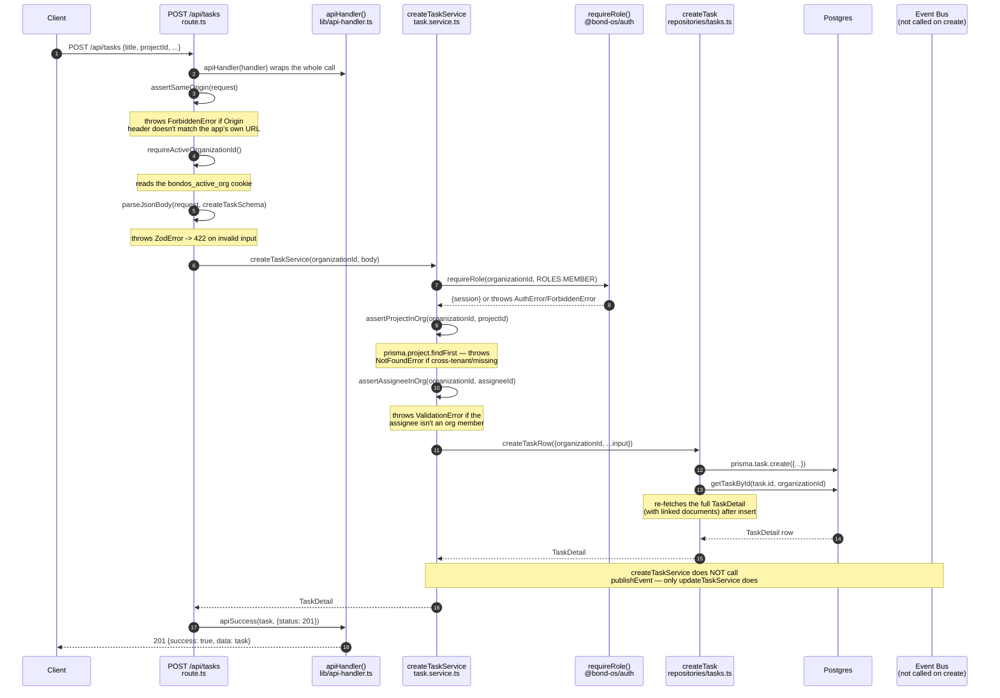

# Request Flow

Two full traces, read directly from source, not reconstructed from behavior: a plain CRUD write
(`POST /api/tasks`) and Mr. Bond's RAG chat pipeline (`POST /api/bond/chat`). The first is the shape
every one of the 29 feature directories' simple CRUD routes follows; the second is the shape every
AI-facing route follows (streamed via SSE, an async generator instead of a single JSON response).

## Trace 1: `POST /api/tasks`

### The route

`apps/web/app/api/tasks/route.ts` — the entire `POST` handler, four steps and nothing else:

```ts
export const POST = apiHandler(async (request) => {
  assertSameOrigin(request);
  const organizationId = await requireActiveOrganizationId();
  const body = await parseJsonBody(request, createTaskSchema);
  const task = await createTaskService(organizationId, body);
  return apiSuccess(task, { status: 201 });
});
```

### Sequence



### What happens on failure, and where events actually fire

`createTaskService` never publishes an event — only `updateTaskService` does, and only after the
repository write succeeds:

```ts
export async function updateTaskService(
  organizationId: string, id: string, input: UpdateTaskInput,
): Promise<TaskDetail> {
  await requireRole(organizationId, ROLES.MEMBER);
  // ...validation...
  const updated = await updateTaskRow(id, organizationId, input);
  if (!updated) throw new NotFoundError('Task not found.');   // repo signal -> service throw

  const publishEvent = await getPublishEvent();               // dynamic import — see design-principles.md
  await publishEvent({ organizationId, eventType: 'task.updated', source: 'TASK', /* ... */ });
  if (updated.status === 'DONE') {
    await publishEvent({ organizationId, eventType: 'task.completed', source: 'TASK', /* ... */ });
  }
  return updated;
}
```

`updateTaskRow` (`packages/database/src/repositories/tasks.ts`) returns `TaskDetail | null` — `null`
when the scoped `updateMany` matched zero rows (wrong `id`, or an `id` belonging to another
organization). The service converts that `null` into a thrown `NotFoundError`, which `apiHandler()`
turns into `404 { success: false, error: { code: 'NOT_FOUND', ... } }` — the route layer itself never
constructs an error response by hand. This repo-signals/service-throws split is documented in full, with
more examples, in [design-principles.md](./design-principles.md#repositories-return-signals-services-throw).

Every layer in this trace is synchronous and in-process — there is no queue between the route and the
database write, and (for `create`) no event publication at all. The one asynchronous branch,
`publishEvent()`'s workflow dispatch on `updateTaskService`, is itself wrapped in its own try/catch
inside `publishEvent` so a slow or broken workflow can never turn this write into a failed HTTP request —
see [Event Bus](../workflows/event-bus.md).

## Trace 2: `POST /api/bond/chat` — the RAG pipeline

This is a materially different shape: an SSE stream, not a JSON envelope, and the handler body is a
single call into an async generator (`runBondChatPipeline`) that itself yields every intermediate stage.

### The route

`apps/web/app/api/bond/chat/route.ts`:

```ts
export const POST = apiHandler(
  withRateLimit(async (request) => {
    assertSameOrigin(request);
    const { user } = await requireAuth();
    const organizationId = await requireActiveOrganizationId();
    const body = await parseJsonBody(request, sendBondMessageSchema);

    const generator = runBondChatPipeline(organizationId, user.id, body);
    // Primed here, inside apiHandler's try/catch, so auth/validation/not-found
    // errors before the first event still return as a normal JSON error.
    const first = await generator.next();

    return createSseStream(generator, first);
  }, { limit: 20, windowSeconds: 60 }),
);
```

The rate limit (20 requests/60s) is tighter than the shared default because one turn can involve several
LLM round-trips (planning + tool calls + the final stream) — the most expensive request shape in this
codebase. The "priming trick" — calling `generator.next()` once *inside* `apiHandler`'s try/catch before
handing the generator to `createSseStream` — is what lets an auth failure or a `NotFoundError` on a bad
`conversationId` still surface as an ordinary JSON error response instead of a malformed, half-open SSE
stream; only errors thrown *after* the first `yield` get turned into a final `{ type: 'error' }` SSE
frame instead, since the HTTP status can no longer change once bytes are flowing.

### `runBondChatPipeline`'s own doc comment

`apps/web/features/bond/services/rag-pipeline.service.ts`, quoted in full — this is the pipeline's own
statement of intent, and the trace below follows it exactly:

```
/**
 * The RAG Pipeline (spec §3): User Question -> Query Rewrite -> Hybrid
 * Search -> Knowledge Graph Expansion -> Context Builder -> Prompt Builder
 * -> LLM -> Streaming Response -> Citations. "No shortcuts. Never bypass
 * retrieval." — every branch below runs through `buildContext` (which
 * itself calls `retrieve()`/`hybridSearch` and does KG expansion
 * internally), there is no code path that calls the AI provider without
 * first assembling context from it.
 */
```

### Sequence

```mermaid
sequenceDiagram
    autonumber
    participant Client
    participant Route as POST /api/bond/chat
    participant Pipeline as runBondChatPipeline()<br/>rag-pipeline.service.ts
    participant Retrieval as hybridSearch()<br/>hybrid-search.service.ts
    participant Context as buildContext()<br/>context-builder.service.ts
    participant Prompt as buildPrompt()<br/>prompt-builder.service.ts
    participant Provider as AIProvider<br/>(OpenAI/Anthropic/Gemini/Ollama)
    participant Citations as validateCitations()<br/>citation-validation.service.ts
    participant DB as Postgres

    Client->>Route: POST {conversationId?, content, model?}
    Route->>Pipeline: runBondChatPipeline(orgId, userId, input)
    Pipeline->>DB: createMessage({role: 'USER', content})
    Pipeline-->>Client: yield {type:'status', stage:'retrieving'}
    Pipeline->>Pipeline: rewriteQuery(content, history)
    Note over Pipeline: deterministic pronoun/short-question<br/>heuristic — not a second LLM call
    Pipeline->>Context: buildContext(orgId, rewrittenQuery, tokenBudget)
    Context->>Retrieval: retrieve() -> hybridSearch(orgId, query, {limit:30})
    Note over Retrieval: parallel: full-text search + pgvector<br/>similarity; weighted 0.35 text /<br/>0.35 semantic / 0.2 relationship / 0.1 recency
    Retrieval-->>Context: ranked HybridSearchResult[]
    Context->>Context: greedy token-budget loop<br/>(stops at first item that would<br/>exceed the budget)
    Context->>DB: 1-hop KG expansion + timeline,<br/>top 5 ranked items only
    Context-->>Pipeline: AssembledContext (items, rawResults)
    Pipeline->>Prompt: buildPrompt(context, rawResults, org, tokenLimit, {history, memoryFacts})
    Note over Prompt: skip-and-continue greedy pass —<br/>different truncation semantics than<br/>buildContext's stop-on-first-miss
    Prompt-->>Pipeline: {messages, citations, truncated}

    loop tool-calling / planning, up to BOND_MAX_TOOL_CALLS (default 3)
        Pipeline-->>Client: yield {type:'status', stage:'planning'}
        Pipeline->>Provider: provider.generate({messages, temperature:0})
        Provider-->>Pipeline: plan.content
        alt write-action marker (<<ACTION:...>>)
            Pipeline->>Pipeline: proposeWriteAction() -> proposeAction()
            Pipeline-->>Client: yield {type:'action_proposed', planId}
            Note over Pipeline,Client: turn ends here — no stream() call,<br/>no token/citations/done events
        else read-tool marker (<<TOOL:...>>)
            Pipeline-->>Client: yield {type:'status', stage:'tool_call'}
            Pipeline->>Pipeline: executeToolCall() — 9 read-only tools
            Note over Pipeline: appends result as a synthetic<br/>user turn, loops again
        else no marker
            Note over Pipeline: break — fall through to final generation
        end
    end

    Pipeline-->>Client: yield {type:'status', stage:'generating'}
    loop stream chunks
        Pipeline->>Provider: provider.stream({messages, temperature, maxTokens, topP})
        Provider-->>Pipeline: text chunk
        Pipeline-->>Client: yield {type:'token', text: chunk}
    end
    Pipeline->>Citations: validateCitations(orgId, finalContent, built.citations)
    Note over Citations: membership check (was this ref<br/>actually offered?) then re-resolve<br/>via DB — hallucinated refs dropped
    Citations-->>Pipeline: Citation[]
    Pipeline->>DB: createMessage({role:'ASSISTANT', content, citations, tokenUsage})
    Pipeline-->>Client: yield {type:'citations', citations}
    Pipeline-->>Client: yield {type:'suggestions', questions}
    Pipeline-->>Client: yield {type:'done', conversationId, messageId, tokenUsage}
    Pipeline->>DB: logAiRequest({action:'bond.chat', provider, metadata})
```

### Notable, code-verified details

- **Retrieval, context, and prompt assembly happen exactly once per turn**, before the tool-calling loop
  starts. The loop only re-invokes `provider.generate()` with appended tool-result turns — it never
  re-runs `buildContext`/`retrieve`, even across several tool-call iterations.
- **A write action short-circuits the whole turn.** If the model's response contains an
  `<<ACTION:...>>` marker, the pipeline calls `proposeAction()` (the same function every workflow
  `INVOKE_TOOL` step and every Phase 7 agent action-marker also calls — see
  [system-architecture.md](./system-architecture.md#4-code--the-workflow-engine)), yields
  `action_proposed`, and `return`s — no final `stream()` call ever happens for that turn.
  `runBondChatPipeline` never executes a tool itself; it only ever proposes one, gated by the same
  approval chain everything else in this codebase uses.
- **Citations are computed once, after the full stream is consumed** — not incrementally per token. The
  confidence value ultimately persisted comes from `resolveCitationService`'s DB re-resolution (always
  `1`), not the original hybrid-search ranking score; the ranking score only gates *which* citations were
  offered to the model as `[ref]` markers in the first place.
- **Which AI provider actually gets called is resolved per-request**, in priority order: a per-message
  `model` override → the organization's own `OrganizationAiSettings` row → environment defaults
  (`AI_PROVIDER`/`AI_MODEL`). `getAIProviderById` throws immediately if the resolved provider has no
  configured API key — there is no silent fallback to a different provider for text generation (unlike
  embeddings, which do have a local, keyless fallback). Some in-repo comments — `packages/ai/src/types.ts`'s
  own `AIProvider` doc comment, and this package's `package.json` description — still say nothing calls
  `generate()`/`stream()` yet. That was accurate when `@bond-os/ai` first shipped with no caller; it is no
  longer true — `rag-pipeline.service.ts` is exactly that caller today, as this trace shows directly. See
  [docs/ai/providers.md](../ai/providers.md) for the same correction made in more depth.

## Further reading

- [system-architecture.md](./system-architecture.md) — the layered architecture these two traces are
  instances of, plus the C4 diagrams.
- [design-principles.md](./design-principles.md) — the repos-return-signals/services-throw convention and
  the dynamic-import event publisher, in depth.
- [docs/ai/rag.md](../ai/rag.md) — the RAG pipeline documented on its own terms.
- [docs/ai/retrieval.md](../ai/retrieval.md), [docs/ai/citations.md](../ai/citations.md) — the retrieval
  and citation subsystems this trace calls into.
- [Approvals](../security/approvals.md) — what happens after `proposeAction()` returns a pending plan.
