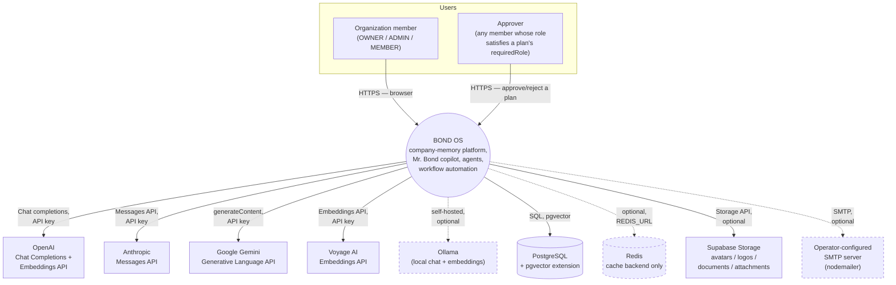
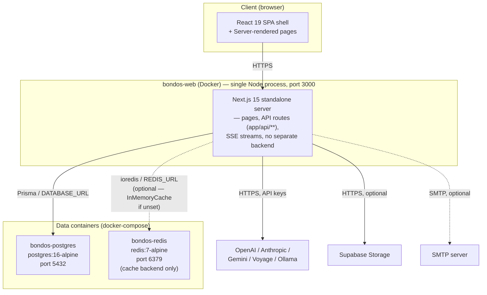
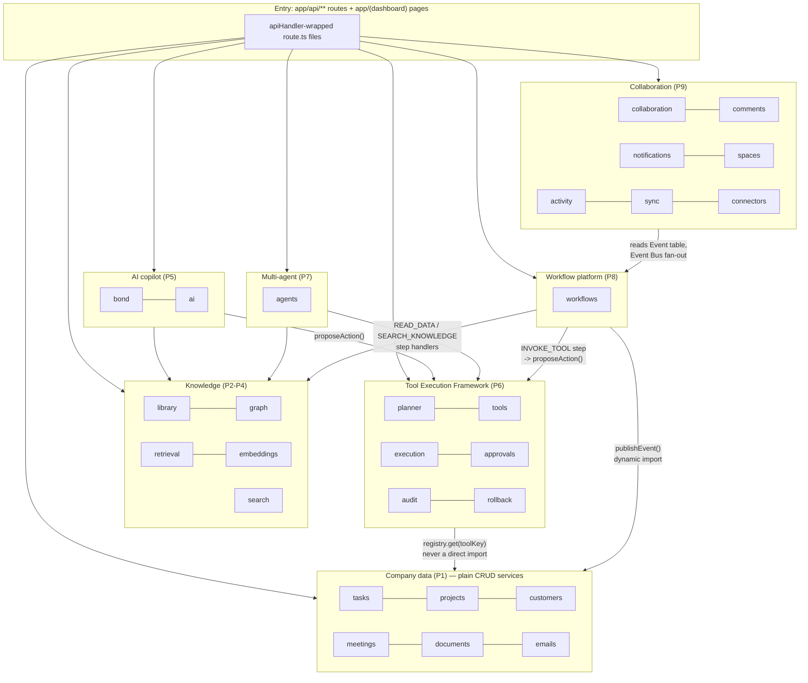
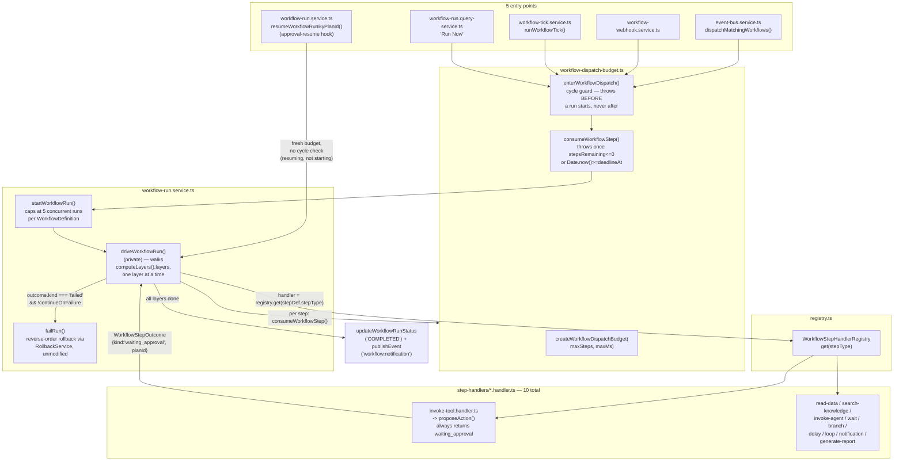

# System Architecture

This document covers how BOND OS's pieces fit together: the layered request path (grounded in two real
features read end to end), the monorepo structure, module/service boundaries, and four C4-model diagrams
(System Context, Container, Component, Code). See [overview.md](./overview.md) first if you haven't —
this doc assumes you already know the phase history and the four-layer shape at a glance.

## The layered architecture, traced through two real features

Every write in BOND OS goes through **Repository → Service → Route → UI**, in that order, never
skipping a layer and never reversing it. This isn't a description inferred from folder names — it's
read directly off `apps/web/features/tasks/` and `apps/web/features/projects/`, two independently
implemented CRUD features that turn out to share an identical shape.

### Route layer: parse input, call one service method, wrap the response

`apps/web/app/api/tasks/route.ts` (22 lines, the whole file):

```ts
export const GET = apiHandler(async (request) => {
  const organizationId = await requireActiveOrganizationId();
  const query = parseQueryParams(request, taskQuerySchema);
  const result = await listTasksService(organizationId, query);
  return apiSuccess(result);
});

export const POST = apiHandler(async (request) => {
  assertSameOrigin(request);
  const organizationId = await requireActiveOrganizationId();
  const body = await parseJsonBody(request, createTaskSchema);
  const task = await createTaskService(organizationId, body);
  return apiSuccess(task, { status: 201 });
});
```

`apps/web/app/api/projects/route.ts` is structurally identical, method for method, down to the same
four-step shape: CSRF guard on mutations (`assertSameOrigin`) → resolve the active organization → parse
the body against a Zod schema → call exactly one service function → `apiSuccess(...)`. The route **never
calls `requireRole` itself** — authorization is delegated entirely to the service. Every thrown error,
anywhere in the chain below, is caught once by `apiHandler()` (`apps/web/lib/api-handler.ts`) and
translated into a consistent `{ success, data } | { success: false, error }` JSON envelope with the
right HTTP status — a `ZodError` becomes `422 VALIDATION_ERROR`, an `AppError` subclass keeps its own
`statusCode`/`code`, anything else becomes a generic, logged `500 INTERNAL_ERROR`.

### Service layer: `requireRole` first, then business rules, then the repository

`apps/web/features/tasks/services/task.service.ts` — `createTaskService` and `deleteTaskService`:

```ts
export async function createTaskService(organizationId: string, input: CreateTaskInput): Promise<TaskDetail> {
  await requireRole(organizationId, ROLES.MEMBER);
  await assertProjectInOrg(organizationId, input.projectId);
  await assertAssigneeInOrg(organizationId, input.assigneeId);

  return createTaskRow({ organizationId, ...input });
}

export async function deleteTaskService(organizationId: string, id: string): Promise<void> {
  await requireRole(organizationId, ROLES.ADMIN);
  const deleted = await deleteTaskRow(id, organizationId);
  if (!deleted) throw new NotFoundError('Task not found.');
  await deleteCommentsForEntity(organizationId, 'TASK', id);
}
```

`requireRole(organizationId, role)` is the first line of every service function, not a route-level
middleware — `createTaskService`/`updateTaskService`/`listTasksService`/`getTaskService` require
`ROLES.MEMBER`; `deleteTaskService` requires the stricter `ROLES.ADMIN`. Cross-entity invariants the
database can't express as a constraint (`assertProjectInOrg`, `assertAssigneeInOrg` — "the assignee must
belong to this organization") are checked here, throwing `ValidationError`/`NotFoundError` before the
repository is ever called. `apps/web/features/projects/services/project.service.ts`'s
`updateProjectService` follows the identical shape, additionally destructuring `session` off
`requireRole`'s own return value to attribute `editedById` on the optimistic-locking write — see
[architecture-decisions.md](./architecture-decisions.md) for that mechanism.

### Repository layer: plain Prisma, org-scoped, returns signals

`packages/database/src/repositories/tasks.ts` — `deleteTask`, the clean signal-returning contrast to the
service's throw:

```ts
export async function deleteTask(id: string, organizationId: string): Promise<boolean> {
  const result = await prisma.task.deleteMany({ where: { id, organizationId } });
  return result.count > 0;
}
```

No exception, no `null` — a plain `boolean`. Every scoped mutation in this codebase uses
`updateMany`/`deleteMany` rather than a unique `update`/`delete`, because Prisma's unique-row operations
can't combine a unique `id` with a non-unique `organizationId` filter — this `where` clause is the only
thing standing between a cross-tenant `id` guess and someone else's row. See
[design-principles.md](./design-principles.md#repositories-return-signals-services-throw) for the full
signals-vs-throws convention and [docs/security/organization-isolation.md](../security/organization-isolation.md)
for the tenancy framing.

### UI layer: two paths, one destination

A Server Component page (`apps/web/app/(dashboard)/tasks/page.tsx`) calls `listTasksService` **directly**
— in-process, no HTTP round trip, because it already runs on the server. A `'use client'` table or dialog
component instead `fetch()`s `GET`/`POST /api/tasks`, because client components can't import server-only
code (`requireRole`, Prisma). Both paths converge on the identical service and repository — there is no
second, UI-specific business-logic path to keep in sync with the API one.

## Monorepo structure

pnpm workspaces (`apps/*`, `packages/*`, declared in `pnpm-workspace.yaml`) orchestrated by Turborepo
(`turbo.json`), which caches and parallelizes `build`/`lint`/`typecheck`/`dev` across packages based on
their dependency graph. One application, ten internal packages:

```
apps/
  web/                 Next.js 15 App Router application — the only deployable app in this monorepo
packages/
  config/               Shared TS/ESLint/Tailwind presets — build-time only, no runtime code
  shared/               Env validation, logging, error types, cache, rate-limit, queue, zod schemas
  database/              Prisma schema, generated client, 50 repository files, seed script
  auth/                 Better Auth server/client config, requireAuth/requireRole
  ui/                   Radix-primitive + cva component library, copied-in shadcn/ui-style
  ai/                   Text-generation provider abstraction — OpenAI/Anthropic/Gemini/Ollama
  embeddings/            Embedding-provider abstraction — OpenAI/Gemini/Voyage/Ollama/local hash
  connectors/            Connector framework — architecture only, no live OAuth flow
  extraction/            Rule-based (regex/heuristic) entity-candidate extraction — no AI
  parsers/               Non-AI document parsing + heuristic chunking
```

`packages/*` are consumed as **TypeScript source**, not pre-built artifacts: each package's
`package.json` points `main`/`exports` at `src/*.ts`, and `apps/web/next.config.ts` lists them under
`transpilePackages`, so Next.js's own compiler transpiles workspace source directly — no per-package
build step, no TypeScript project-references graph to keep in sync. The one exception is
`@bond-os/database`: `prisma generate` emits the Prisma Client into `packages/database/src/generated`
(gitignored), the only generated-artifact step anywhere in the repo. Full one-line-per-directory detail
is in [folder-structure.md](./folder-structure.md).

Each package owns **a concern, not a layer** — `@bond-os/auth` is the entire auth concern (server config,
client hooks, session helpers, password-reset email), not "backend code that happens to relate to auth."
`apps/web/features/<name>/` is where everything specific to one vertical slice lives instead:
`services/` (business logic), `components/` (feature-local UI), and — for the class-based subsystems —
`lib/container.ts`, `registry.ts`, `definitions/`. There are 29 feature directories today.

## Module and service boundaries

Three patterns, detailed fully in [design-principles.md](./design-principles.md), are what keep 29
feature directories from becoming an unmanageable web of cross-imports:

- **Composition roots.** Every class-based service (used by `execution`, `agents`, `workflows`, and a
  handful of others) is wired up in exactly one place, that feature's `lib/container.ts`, as a lazy
  singleton. No call site anywhere constructs one with `new` outside its container.
- **Registries.** `apps/web/features/{tools,agents,workflows}/registry.ts` are each "the ONLY file in
  this codebase that imports every concrete [tool/agent/step-handler] implementation" (the tools
  registry's own doc comment, verbatim). Everywhere else asks the registry for an implementation by key
  instead of importing a concrete file — this is what makes "the execution engine knows nothing about
  Projects/Tasks/Customers/Documents" literally true.
- **The dynamic-import event publisher.** A curated set of domain services publish to the in-process
  Event Bus after their own write commits, importing `publishEvent` via a dynamic `import()` inside the
  function body rather than a static top-level import — because a static import would close a real
  circular-module cycle back through the Tool Registry. See
  [Event Bus](../workflows/event-bus.md) for the mechanism this protects.

## C4 diagrams

### 1. System Context

Who and what BOND OS talks to. Every external system below is a **real, conditionally-active**
integration verified in code — nothing here is aspirational. AI/embedding providers activate when their
API key env var is set; Supabase Storage and SMTP activate when their own env vars are set; Redis is
optional. The seven connector providers (Gmail, Slack, GitHub, Google Calendar, Google Drive, Notion,
OneDrive) are deliberately **excluded** from this diagram — every one of them is a stub whose
`connect()`/`sync()` throws `ConnectorNotImplementedError`; see [folder-structure.md](./folder-structure.md#connectors-p2-scaffold-still-architecture-only)
and `docs/connectors.md`.



Dashed edges mark integrations with a working, no-op-safe fallback when unconfigured: Ollama is one of
four interchangeable AI/embedding providers (not a required one), Redis falls back to an in-process
cache, and SMTP falls back to console-logging the email instead of sending it. Solid edges (OpenAI,
Anthropic, Gemini, Voyage, Postgres, Supabase) still degrade gracefully at the provider-selection level
(an unconfigured AI provider throws a clear `ValidationError` rather than silently picking one), but
Postgres itself is a hard dependency — there is no database fallback.

### 2. Container

The real deployable units, read directly from `Dockerfile` and `docker-compose.yml`. There is exactly
**one** application container — `apps/web` builds to a single Next.js standalone server
(`node apps/web/server.js`) that serves the UI, every API route, and the SSE streaming endpoints from one
process. `docker-compose.yml`'s `web` service is gated behind `profiles: [full]` — the default local-dev
path runs Postgres and Redis in Docker and `pnpm dev` on the host, not three containers.



The `Dockerfile` is a 3-stage build (`deps` → `builder` → `runner`): `deps` installs the workspace with
`pnpm install --frozen-lockfile`, `builder` runs `db:generate` (Prisma Client) then `next build` for the
`web` filter, and `runner` copies only `apps/web/.next/standalone` + `.next/static` + `public` into a
minimal `node:20-alpine` image running as a non-root `nextjs` user. There is no separate worker
container, no queue-consumer container, no reverse proxy defined in `docker-compose.yml` — the same
process that serves a page also serves every SSE stream and every API route. The README also documents
this container as Vercel-compatible (`next build`'s standard output), which is the second real target —
this app deliberately runs as either one always-on container or a serverless deployment, never assuming
one exclusively (see [architecture-decisions.md](./architecture-decisions.md) for why that constrained
the realtime-transport decision).

### 3. Component

The real module boundaries inside the one `apps/web` container — its 29 `features/*` directories,
grouped by what they actually do (grouping is descriptive, not a folder that exists on disk).



`ToolExec` is deliberately drawn with no outbound arrow to `Agents`/`Workflows`/`AI` — the whole point of
the Tool Registry is that the execution engine never imports a concrete feature; it only ever resolves
one by key at runtime. `CompanyData` publishes events *into* the Workflow Bus (`publishEvent()`) but the
Workflow Engine never imports a company-data service directly for the same reason — see
[design-principles.md](./design-principles.md#the-dynamic-import-event-publisher).

### 4. Code — the Workflow Engine

One representative subsystem's internals, in useful detail: `apps/web/features/workflows/services/workflow-run.service.ts`
and the classes/functions immediately around it. Five independent entry points all converge on
`driveWorkflowRun`, which is the only function that actually walks a workflow's step graph.



Two design details worth calling out at the code level:

- `driveWorkflowRun` is **re-entrant by construction**, not by accident — it looks up each step's
  already-persisted `WorkflowRunStep` row before creating a new one, and `isTerminalStepStatus` skips
  anything already finished. This is what lets a run pause at `WAITING_APPROVAL` for hours or days and
  resume exactly where it left off when `resumeWorkflowRunByPlanId` is called later, potentially from a
  different request entirely.
- `enterWorkflowDispatch`'s cycle guard only protects **one synchronous dispatch chain** — it cannot see
  across an approval gap, since a resume gets a brand-new, in-memory `WorkflowDispatchBudget`. The
  `MAX_ACTIVE_RUNS_PER_DEFINITION = 5` cap in `workflow-run.service.ts` is the acknowledged, honest
  mitigation for that gap, not a full fix — see the module's own design-review comment, quoted in full in
  [scalability.md](./scalability.md).

## Further reading

- [request-flow.md](./request-flow.md) — full sequence-diagram traces of `POST /api/tasks` and Mr.
  Bond's RAG pipeline.
- [folder-structure.md](./folder-structure.md) — every package and feature directory, one line each.
- [design-principles.md](./design-principles.md) — composition roots, registries, and the event
  publisher, in depth.
- [architecture-decisions.md](./architecture-decisions.md) — the reasoning behind the biggest structural
  choices.
- [scalability.md](./scalability.md) — honest current scaling limits.
- [Workflow Engine](../workflows/workflow-engine.md) — full detail on everything in the Code diagram
  above.
- [docs/development/architecture.md](../development/architecture.md) — the same material from a
  contributor's "where do I put this?" angle.
