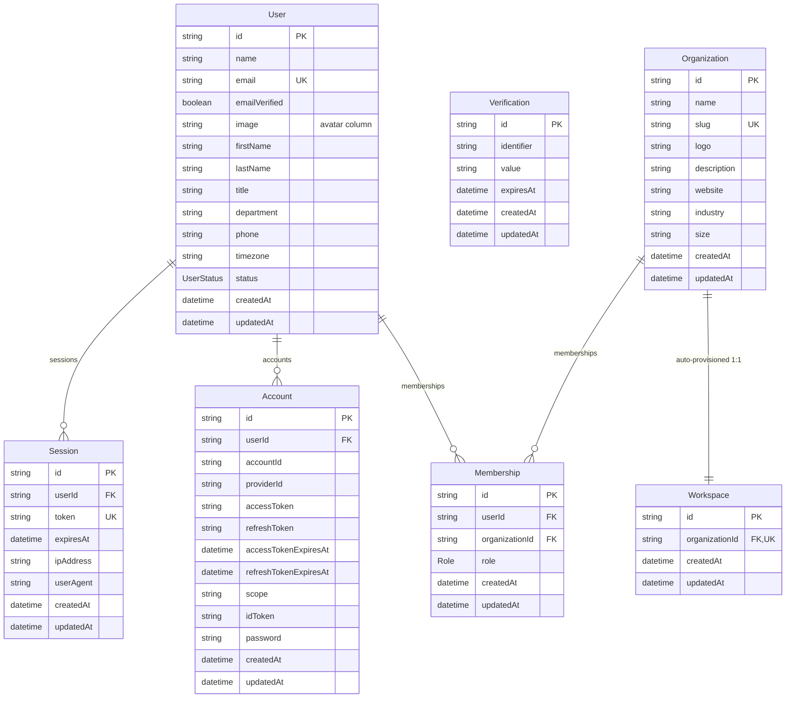
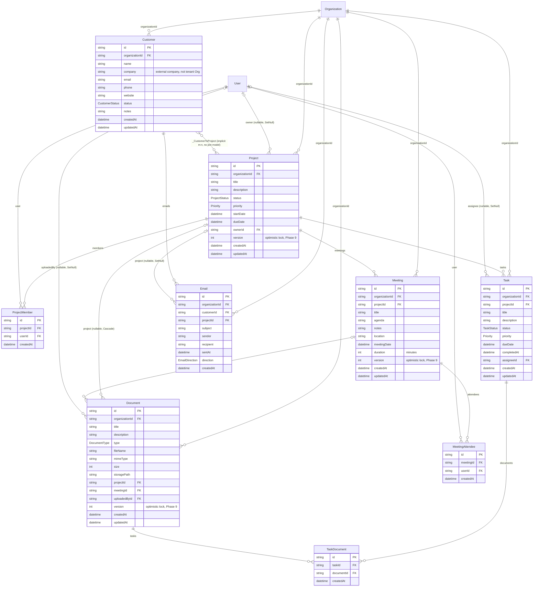
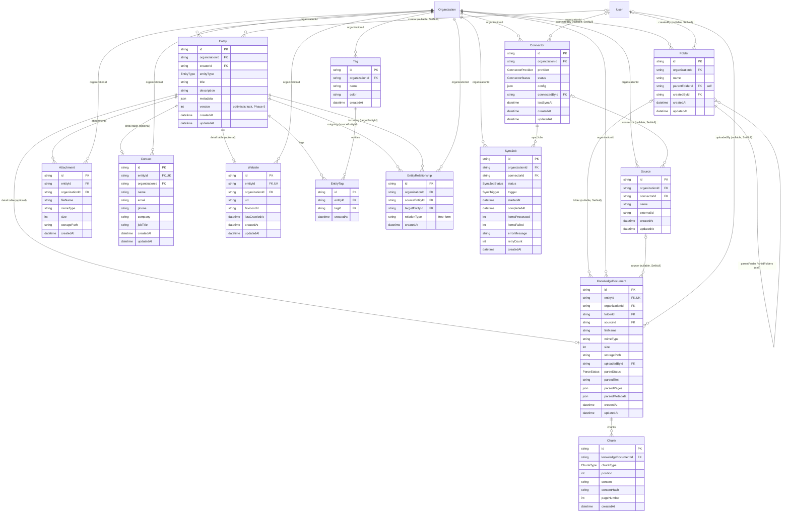
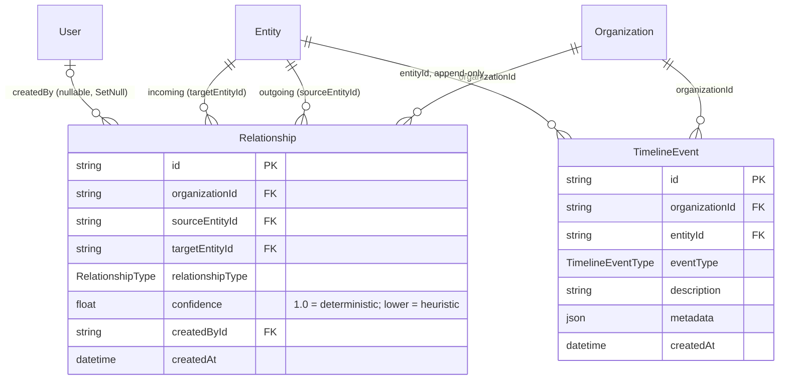
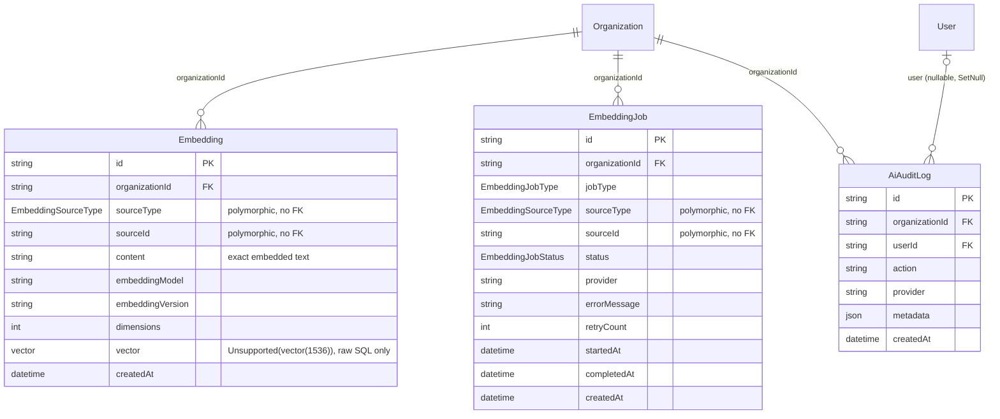
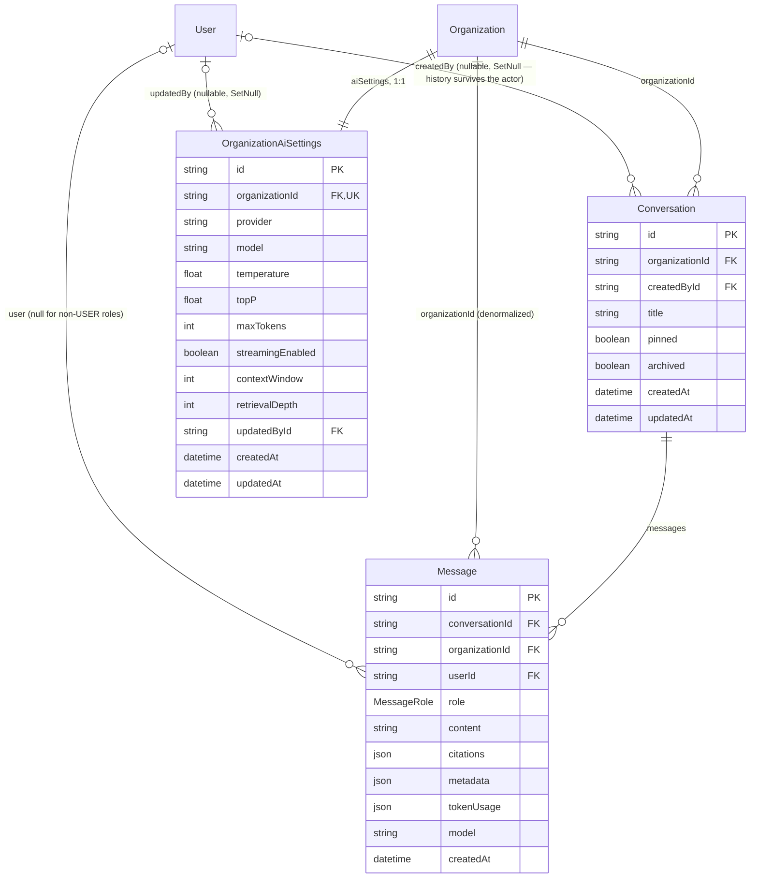
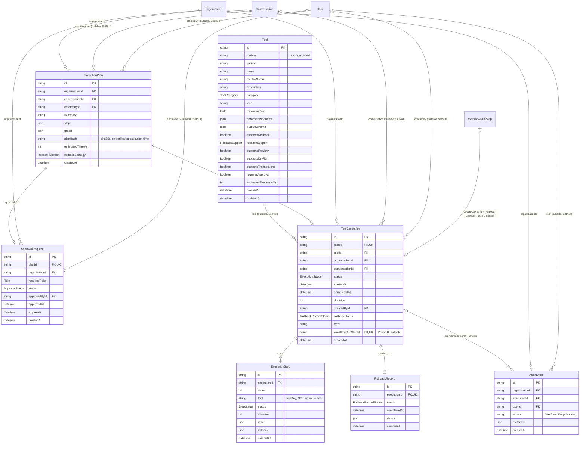
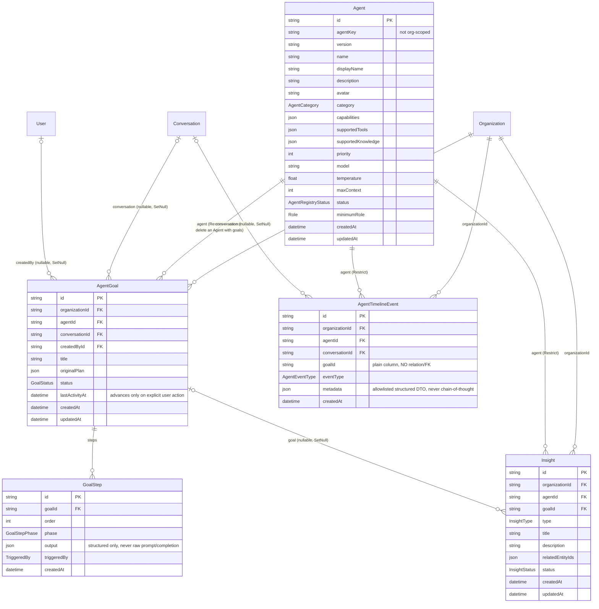
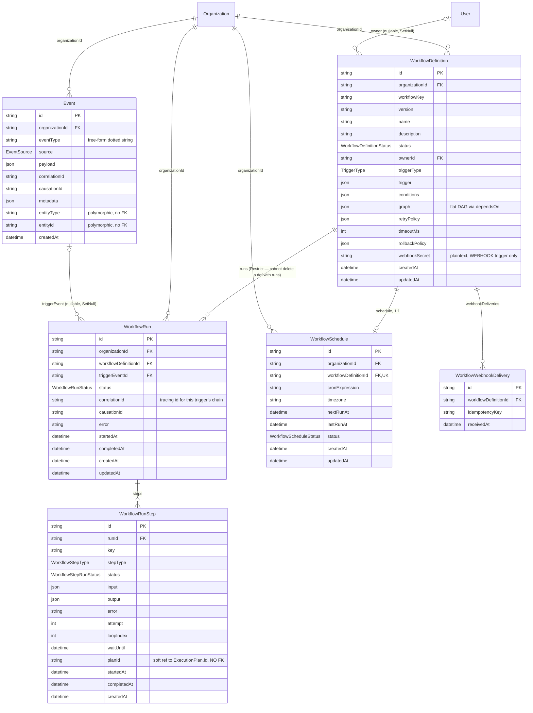

# Entity-Relationship Diagrams

Ten Mermaid `erDiagram` blocks, one per domain, covering all 67 models in
[`packages/database/prisma/schema.prisma`](../../packages/database/prisma/schema.prisma). Every model's
**full attribute list** appears in exactly one diagram (its "home" domain, matching
[schema.md](./schema.md)'s grouping). Field-level detail, doc comments, indexes, and unique constraints
live in [schema.md](./schema.md); cascade/delete semantics and the polymorphic no-FK patterns are in
[relationships.md](./relationships.md).

## Conventions used below

**Cross-domain references.** Several relations cross a domain boundary (e.g. `Task.assigneeId -> User`,
where `User` lives in domain 1 but `Task` lives in domain 2). Each relationship line is drawn **once**, in
the diagram owned by the model holding the foreign key column. In that diagram, the *other* side of the
relation appears as a bare box with no attributes (Mermaid auto-creates it from the relationship line) —
its full attribute list is in its own home diagram. This keeps every model's full definition in exactly
one place while still making every relation visible somewhere.

**Cardinality notation** (standard Mermaid crow's-foot tokens: `|` = exactly one, `o` = zero, `{` = many):

| Schema shape | Notation | Meaning |
|---|---|---|
| Required FK, `onDelete: Cascade`/`Restrict`/etc. | `Parent \|\|--o{ Child` | Exactly one parent per child; zero-or-many children per parent |
| Optional (nullable) FK, `onDelete: SetNull` | `Parent \|o--o{ Child` | Zero-or-one parent per child; zero-or-many children per parent |
| Required, unique FK (1:1 detail table) | `Parent \|\|--o\| Child` | Exactly one parent per child; zero-or-one child per parent |
| True 1:1 (both required+unique, e.g. Organization/Workspace) | `A \|\|--\|\| B` | Exactly one on both sides |
| Implicit many-to-many (Prisma-generated join table, no explicit model) | `A }o--o{ B` | Zero-or-many on both sides |

**Polymorphic / soft references are never drawn as relationship lines.** Fields like
`Embedding.sourceType`/`sourceId`, `Comment.entityType`/`entityId`, `Event.entityType`/`entityId`,
`Mention.mentionedAgentKey`, `EntityVersionSnapshot.entityType`/`entityId`, and the four `Space*` link
tables' soft `xxxId` columns are **not** Prisma relations — they're plain typed columns with no FK
constraint, spanning multiple unrelated target tables (or deliberately left unenforced). They're listed
as ordinary attributes in the entity box, with a comment, but no relationship line is drawn to a "target"
entity because there isn't a single one. See [relationships.md](./relationships.md) for the full
explanation of every instance.

---

## 1. Auth & Organization (Phase 0)

`User`, `Session`, `Account`, `Verification`, `Organization`, `Membership`, `Workspace`. See
[schema.md#1-auth--organization-phase-0](./schema.md#1-auth--organization-phase-0).

`Verification` has no FK at all — it is looked up directly by `identifier`/`value` (email verification
and password-reset tokens), so it draws no relationship line.

---

## 2. Company Data (Phase 1)

`Project`, `ProjectMember`, `Task`, `TaskDocument`, `Document`, `Meeting`, `MeetingAttendee`, `Customer`,
`Email`. See [schema.md#2-company-data-phase-1](./schema.md#2-company-data-phase-1).

`Customer.projects` / `Project.customers` is an **implicit** Prisma many-to-many (no `CustomerProject`
join model was declared) — Prisma auto-generates a hidden `_CustomerToProject` join table. See
[relationships.md](./relationships.md).

---

## 3. Data Layer / Ingestion (Phase 2)

`Entity`, `Folder`, `Source`, `KnowledgeDocument`, `Chunk`, `Attachment`, `Contact`, `Website`, `Tag`,
`EntityTag`, `EntityRelationship`, `Connector`, `SyncJob`. See
[schema.md#3-data-layer--ingestion-phase-2](./schema.md#3-data-layer--ingestion-phase-2) and
[../data-layer.md](../data-layer.md).

---

## 4. Knowledge Graph (Phase 3)

`Relationship`, `TimelineEvent` — reusing `Entity` (domain 3) as the graph's node table. See
[schema.md#4-knowledge-graph-phase-3](./schema.md#4-knowledge-graph-phase-3),
[../knowledge-graph.md](../knowledge-graph.md), [../knowledge/graph.md](../knowledge/graph.md).

`Relationship` (typed, confidence-scored graph edges) is deliberately a separate model from Phase 2's
`EntityRelationship` (domain 3) rather than a retrofit — see [relationships.md](./relationships.md).

---

## 5. AI Memory & Retrieval (Phase 4)

`Embedding`, `EmbeddingJob`, `AiAuditLog`. See
[schema.md#5-ai-memory--retrieval-phase-4](./schema.md#5-ai-memory--retrieval-phase-4),
[../embeddings.md](../embeddings.md), [../vector-search.md](../vector-search.md).

`Embedding.sourceType`/`sourceId` and `EmbeddingJob.sourceType`/`sourceId` are the schema's canonical
polymorphic pattern — they span four unrelated tables (`Chunk`, `Entity`-as-NOTE, `Email`, `Meeting`) and
so draw **no** relationship line to any of them. See [relationships.md](./relationships.md).

---

## 6. Mr. Bond — Chat & RAG (Phase 5)

`Conversation`, `Message`, `OrganizationAiSettings`. See
[schema.md#6-mr-bond--chat--rag-phase-5](./schema.md#6-mr-bond--chat--rag-phase-5), [../mr-bond.md](../mr-bond.md),
[../rag.md](../rag.md).

---

## 7. Execution & Approvals — Tool Execution Framework (Phase 6)

`Tool`, `ExecutionPlan`, `ApprovalRequest`, `ToolExecution`, `ExecutionStep`, `RollbackRecord`, `AuditEvent`.
See [schema.md#7-execution--approvals--tool-execution-framework-phase-6](./schema.md#7-execution--approvals--tool-execution-framework-phase-6),
[../approvals.md](../approvals.md), [../tool-execution.md](../tool-execution.md), [../rollback.md](../rollback.md).

`ExecutionStep.tool` stores the `toolKey` string, not an FK to `Tool` — resolved at plan-build time and
re-validated against the live `ToolRegistry` before running. `AuditEvent` has a real, nullable hard FK to
`ToolExecution` (not a polymorphic entityType/entityId pair) — see [relationships.md](./relationships.md).

---

## 8. Agent Framework — AI Workforce (Phase 7)

`Agent`, `AgentGoal`, `GoalStep`, `Insight`, `AgentTimelineEvent`. See
[schema.md#8-agent-framework--ai-workforce-phase-7](./schema.md#8-agent-framework--ai-workforce-phase-7),
[../agents.md](../agents.md), [../multi-agent.md](../multi-agent.md), [../goals.md](../goals.md),
[../insights.md](../insights.md).

`AgentTimelineEvent.goalId` is deliberately **not** wired as a Prisma relation (no `@relation`, no FK) —
it is a plain optional string column, so no relationship line is drawn to `AgentGoal` for it. All three
`agent` relations here use `onDelete: Restrict` (the schema's only three `Restrict` FKs besides
`WorkflowRun.workflowDefinition` and `Comment.author`) — see [relationships.md](./relationships.md).

---

## 9. Workflow Automation Platform (Phase 8)

`WorkflowDefinition`, `WorkflowRun`, `WorkflowRunStep`, `Event`, `WorkflowSchedule`,
`WorkflowWebhookDelivery`. See
[schema.md#9-workflow-automation-platform-phase-8](./schema.md#9-workflow-automation-platform-phase-8),
[../workflows.md](../workflows.md), [../event-bus.md](../event-bus.md), [../scheduling.md](../scheduling.md).

`WorkflowRunStep.planId` is a soft reference to `ExecutionPlan.id` (domain 7) with no FK — resolved at
runtime, matching `ExecutionStep.tool`'s precedent. `ToolExecution.workflowRunStepId` (domain 7) is the
actual hard FK bridging Phase 8 back into Phase 6; see that diagram (§7) for the line.

---

## 10. Enterprise Collaboration (Phase 9)

`Comment`, `CommentAttachment`, `Mention`, `Notification`, `Space`, `SpaceMember`, `SpaceProject`,
`SpaceKnowledgeDocument`, `SpaceWorkflow`, `SpaceAgent`, `ConversationShare`, `EntityVersionSnapshot`.
See [schema.md#10-enterprise-collaboration-phase-9](./schema.md#10-enterprise-collaboration-phase-9),
[../collaboration.md](../collaboration.md), [../comments.md](../comments.md),
[../notifications.md](../notifications.md), [../spaces.md](../spaces.md).

```mermaid
erDiagram
  Comment {
    string id PK
    string organizationId FK
    CommentableEntityType entityType "polymorphic, no FK"
    string entityId "polymorphic, no FK"
    string authorId FK
    string parentCommentId FK "self"
    string content
    boolean resolved
    string resolvedById FK
    datetime resolvedAt
    datetime createdAt
    datetime updatedAt
  }
  CommentAttachment {
    string id PK
    string commentId FK
    string fileName
    string mimeType
    int size
    string storagePath
    datetime createdAt
  }
  Mention {
    string id PK
    string organizationId FK
    string commentId FK
    MentionType mentionedType "discriminator: USER/SPACE/AGENT"
    string mentionedUserId FK "used if USER"
    string mentionedSpaceId FK "used if SPACE"
    string mentionedAgentKey "soft ref to Agent.agentKey, NO FK; used if AGENT"
    datetime createdAt
  }
  Notification {
    string id PK
    string organizationId FK
    string userId FK
    NotificationType type
    string title
    string body
    string entityType "polymorphic, no FK"
    string entityId "polymorphic, no FK"
    string sourceEventId "soft ref to Event.id, NO FK"
    boolean read
    datetime readAt
    boolean archived
    datetime snoozedUntil
    datetime createdAt
  }
  Space {
    string id PK
    string organizationId FK
    string name
    string description
    string createdById FK
    datetime createdAt
    datetime updatedAt
  }
  SpaceMember {
    string id PK
    string spaceId FK
    string userId FK
    datetime joinedAt
  }
  SpaceProject {
    string id PK
    string spaceId FK
    string projectId "soft ref to Project.id, NO FK"
    datetime createdAt
  }
  SpaceKnowledgeDocument {
    string id PK
    string spaceId FK
    string knowledgeDocumentId "soft ref, NO FK"
    datetime createdAt
  }
  SpaceWorkflow {
    string id PK
    string spaceId FK
    string workflowDefinitionId "soft ref, NO FK"
    datetime createdAt
  }
  SpaceAgent {
    string id PK
    string spaceId FK
    string agentKey "soft ref to Agent.agentKey, NO FK"
    datetime createdAt
  }
  ConversationShare {
    string id PK
    string organizationId FK
    string conversationId FK
    string sharedWithUserId FK
    SharePermission permission
    string sharedById FK
    datetime createdAt
  }
  EntityVersionSnapshot {
    string id PK
    string organizationId FK
    string entityType "polymorphic, no FK, plain String not enum"
    string entityId "polymorphic, no FK"
    int version
    json snapshot "full prior row state"
    string editedById FK
    datetime createdAt
  }

  Organization ||--o{ Comment : "organizationId"
  User ||--o{ Comment : "author (Restrict — cannot delete a user with comments)"
  User |o--o{ Comment : "resolvedBy (nullable, SetNull)"
  Comment ||--o{ Comment : "parentComment / replies (self)"
  Comment ||--o{ CommentAttachment : "attachments"
  Comment ||--o{ Mention : "mentions"
  Organization ||--o{ Mention : "organizationId"
  User |o--o{ Mention : "mentionedUser (nullable, Cascade)"
  Space |o--o{ Mention : "mentionedSpace (nullable, Cascade)"
  Organization ||--o{ Notification : "organizationId"
  User ||--o{ Notification : "user"
  Organization ||--o{ Space : "organizationId"
  User |o--o{ Space : "createdBy (nullable, SetNull)"
  Space ||--o{ SpaceMember : "members"
  User ||--o{ SpaceMember : "user"
  Space ||--o{ SpaceProject : "projects"
  Space ||--o{ SpaceKnowledgeDocument : "documents"
  Space ||--o{ SpaceWorkflow : "workflows"
  Space ||--o{ SpaceAgent : "agents"
  Organization ||--o{ ConversationShare : "organizationId"
  Conversation ||--o{ ConversationShare : "shares"
  User ||--o{ ConversationShare : "sharedWith (Cascade)"
  User |o--o{ ConversationShare : "sharedBy (nullable, SetNull)"
  Organization ||--o{ EntityVersionSnapshot : "organizationId"
  User |o--o{ EntityVersionSnapshot : "editedBy (nullable, SetNull)"
```

The four `Space*` link models (`SpaceProject`, `SpaceKnowledgeDocument`, `SpaceWorkflow`, `SpaceAgent`)
each carry only `spaceId` as a real FK — their other id column (`projectId`, `knowledgeDocumentId`,
`workflowDefinitionId`, `agentKey`) is a plain, unconstrained string, so no relationship line is drawn
from them to `Project`/`KnowledgeDocument`/`WorkflowDefinition`/`Agent`. See
[relationships.md](./relationships.md).

---

## Full model coverage checklist

All 67 models, cross-referenced against `schema.prisma`:

**Domain 1 (7):** User, Session, Account, Verification, Organization, Membership, Workspace
**Domain 2 (9):** Project, ProjectMember, Task, TaskDocument, Document, Meeting, MeetingAttendee, Customer, Email
**Domain 3 (13):** Entity, Folder, Source, KnowledgeDocument, Chunk, Attachment, Contact, Website, Tag, EntityTag, EntityRelationship, Connector, SyncJob
**Domain 4 (2):** Relationship, TimelineEvent
**Domain 5 (3):** Embedding, EmbeddingJob, AiAuditLog
**Domain 6 (3):** Conversation, Message, OrganizationAiSettings
**Domain 7 (7):** Tool, ExecutionPlan, ApprovalRequest, ToolExecution, ExecutionStep, RollbackRecord, AuditEvent
**Domain 8 (5):** Agent, AgentGoal, GoalStep, Insight, AgentTimelineEvent
**Domain 9 (6):** WorkflowDefinition, WorkflowRun, WorkflowRunStep, Event, WorkflowSchedule, WorkflowWebhookDelivery
**Domain 10 (12):** Comment, CommentAttachment, Mention, Notification, Space, SpaceMember, SpaceProject, SpaceKnowledgeDocument, SpaceWorkflow, SpaceAgent, ConversationShare, EntityVersionSnapshot

7 + 9 + 13 + 2 + 3 + 3 + 7 + 5 + 6 + 12 = **67**.
