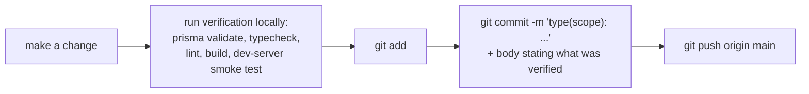

# GitHub & the Actual Git Workflow

## Scope

What this repository's actual relationship with GitHub is today: the real remote, the real branch
topology, the real commit history shape, and — stated as plainly as this project states every other
gap — the fact that **no CI/CD is configured**. This document describes the workflow this project
actually uses, not an idealized GitHub Flow or GitFlow diagram that doesn't match the repo's own
history.

## Repository facts

```bash
$ git remote -v
origin  https://github.com/BOND-OS-BUILD/BONDDOS.git (fetch)
origin  https://github.com/BOND-OS-BUILD/BONDDOS.git (push)

$ git branch -a
* main
  remotes/origin/HEAD -> origin/main
  remotes/origin/main
```

- **Remote**: `origin` → `https://github.com/BOND-OS-BUILD/BONDDOS.git`, a single GitHub organization/
  repository. There is no second remote (no `upstream`, no fork remote configured in this checkout).
- **Branches**: `main` only, both locally and on the remote (`origin/HEAD` points at `origin/main`).
  No `develop` branch, no long-lived release branches, no other branch visible in this checkout's
  remote-tracking refs.
- **History shape**: a short, linear, direct-to-main history —

  ```
  09fbfa8 feat(collaboration): add live notification bell to the topbar
  0a70630 fix(collaboration): adversarial security review findings
  54049c9 feat(collaboration): wire comment threads and live presence into entity pages
  87de897 feat(collaboration): add Inbox, Activity Feed, Spaces, Team Dashboard, and Shared Conversations UI
  8423829 feat(inbox): add notification inbox, activity feed, and live dashboard channel
  880bf15 feat(shared-ai): add conversation sharing and ownership transfer
  f28f934 feat(spaces): add Team Spaces with content curation, not access control
  2fc10e2 feat(comments): add threaded comments with mentions
  412ddfb feat(collaboration): add optimistic-locking version conflicts for Document/Project/Meeting
  51cc3d7 Merge remote initial README with local BOND OS history
  2b8b34c Initial commit
  6695fd3 Initial BOND OS Platform
  ```

  Aside from one early merge reconciling the initial README (`51cc3d7`), there is no merge-commit
  history — every other commit is a single, direct, descriptive commit on `main`. This matches
  `CONTRIBUTING.md`'s own description exactly: "developed direct-to-main with descriptive,
  single-purpose commits."

## No CI/CD configured — confirmed on disk

There is no `.github/workflows` directory anywhere in this repository — confirmed directly against the
repository root, which contains only `.dockerignore`, `.env.example`, `.gitignore`, `.prettierignore`,
`.prettierrc.json`, `Dockerfile`, `README.md`, `apps/`, `docker-compose.yml`, `docs/`, `package.json`,
`packages/`, `pnpm-lock.yaml`, `pnpm-workspace.yaml`, and `turbo.json` — no `.github` directory at all.
Consequently:

- **No automated build, lint, typecheck, or test run on push or pull request.**
- **No automated deploy pipeline** — no GitHub Actions workflow builds the Docker image, pushes it to
  a registry, or deploys it anywhere.
- **No branch protection enforceable by a status check**, since there is no status check to require
  (branch protection *rules themselves* are a GitHub repository setting, not a file in the repo, so
  their presence or absence isn't verifiable from repository contents alone — but there is nothing for
  such a rule to gate even if one exists, since no workflow produces a check run).
- **No Dependabot/Renovate config** (`.github/dependabot.yml` does not exist) — dependency updates are
  manual.

This is stated identically in three places in this repository already, worth citing because it's the
same fact confirmed three separate times, not three different claims: the README's Roadmap
("No automated test suite yet ... no CI configuration (no `.github/workflows`) anywhere in this
repository"), `CONTRIBUTING.md`'s Testing Requirements section ("no CI configuration (no
`.github/workflows` directory) anywhere in the repo as of this writing"), and `docs/README.md`'s own
deployment index entry for this very page.

## The workflow actually used: direct-to-main

Every commit in this repository's real history was made directly to `main`, following this sequence
(reconstructed from `CONTRIBUTING.md`'s own description of its practice, which the commit history
above matches):



No CI ever runs after that push — the verification in step B is the *only* verification this project's
history has ever had. `CONTRIBUTING.md`'s Review Checklist (schema validity, type-check, lint, build,
dev-server smoke test, regression spot-check, org-isolation check, docs updated) is a manual checklist
run and self-reported by whoever made the change, not something GitHub enforces.

## Commit convention

Conventional Commits: `type(scope): short, specific, present-tense description`. Drawn from this
repository's own real history (see above):

- `type` ∈ `feat`, `fix`, `docs`, `refactor`, `chore` — matching what the change actually is.
- `scope` is a feature/domain name, usually matching a directory under `apps/web/features/`
  (`collaboration`, `spaces`, `comments`, `inbox`, `shared-ai`, `workflows`, `agents`, ...).
- The commit **body** states *why* and — this project's own stated standard — **what verification was
  actually run**. Real example (`54049c9`): *"Verified: typecheck, lint, and a dev-server smoke test
  against all 4 updated detail pages plus `/api/presence` and the SSE stream route."*
- Every commit ends with a `Co-Authored-By:` trailer identifying the agent that helped produce it.

## The documented, not-yet-exercised PR flow for external contributors

`CONTRIBUTING.md` is explicit that this differs from the internal practice above, and says so instead
of pretending the internal practice is what everyone should follow:

> If you are an external contributor, do not push directly to `main`. Follow the Pull Requests process
> instead — branch from `main`, open a PR, and let a maintainer merge it.

That process, as documented (not yet exercised in this repository's own history):

1. Branch from `main` with a short, descriptive name (e.g. `feat/workflow-retry-backoff`).
2. Keep the PR scoped to one concern, mirroring the granularity of the real commit history above.
3. Write the PR description like this project's own commit bodies — what changed, what was
   deliberately deferred, and what was run to verify it.
4. **Run the full local verification pass before opening the PR** — `CONTRIBUTING.md` states this
   explicitly: "Do not rely on CI to catch what you didn't check yourself; there is currently no CI
   configured for this repository."
5. Link or update the relevant doc(s) under `docs/` in the same PR.
6. A maintainer reviews using the same Review Checklist and merges once it passes — manually, since
   there is no automated merge gate.

## Deployment is not triggered from GitHub in any way

Because there is no GitHub Actions workflow, pushing to `main` does not build, publish, or deploy
anything by itself. Deployment (building the `Dockerfile`, running `docker compose --profile full up
-d --build`, or running the standalone Node build directly — see [Production](./production.md)) is a
manual step performed separately from `git push`, by whoever operates the target environment. There is
no GitHub-integrated hosting platform (no Vercel GitHub App connection, no Netlify/Render/Railway
auto-deploy hook) configured in this repository either — see [Production](./production.md#what-production-means-in-this-repository-today)
for what deployment paths *do* exist.

One place GitHub Actions is named, but only as a *hypothetical operator choice, not something
configured here*: `docs/scheduling.md`/[Scheduler](../workflows/scheduler.md) lists "a GitHub Actions
scheduled workflow (`on: schedule`) making an authenticated call to the deployed tick URL" as one of
three options an operator could use to drive `POST /api/workflows/schedule/tick` periodically. That is
a suggestion for wiring an *external* scheduled trigger against an already-deployed instance of the
app — it has nothing to do with this repository's own (nonexistent) CI/CD, and no such workflow file
exists in `.github/workflows` (because that directory doesn't exist).

## If CI is added later

Not implemented, not planned in any tracked issue in this repository — but if a first CI workflow is
ever added, the natural minimum bar is exactly `CONTRIBUTING.md`'s own Review Checklist, which already
names the four commands that would compose a first `.github/workflows/ci.yml`'s job steps:

```
pnpm --filter @bond-os/database run validate   # prisma validate — no DB connection required
pnpm typecheck
pnpm lint
pnpm build
```

This is offered here as an observation about what already exists to build on (real `package.json`
scripts, already used manually), not as a description of anything currently configured. Document that
decision in this file (and in `docs/testing/strategy.md` if it also adds automated tests) the moment it
actually exists, per `CONTRIBUTING.md`'s own documentation-requirements convention — don't let this
page drift out of sync with reality the way it's specifically trying not to.

## Related documents

- [CONTRIBUTING.md](../../CONTRIBUTING.md) — the full repository standards, branch strategy, commit conventions, and review checklist this page summarizes.
- [Production](./production.md) — how a build actually reaches a running deployment today, given there's no automated pipeline.
- [Testing Strategy](../testing/strategy.md) — the honest state of automated testing (none), which a future CI workflow would run.
- [Scheduler](../workflows/scheduler.md) — the one place "GitHub Actions" is named in this codebase's own docs, as an external-trigger option unrelated to this repo's own CI/CD.
