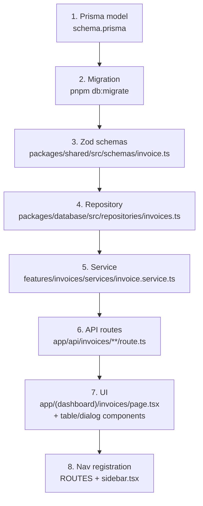

# Adding a Feature

A step-by-step walkthrough of adding a new CRUD feature to BOND OS, following the same
Repository → Service → Schema → Route → UI pattern every existing feature uses. Read
[architecture.md](architecture.md) first for the "where does this go" overview — this page is the
mechanical checklist, grounded in the real `Task` feature (`packages/database/src/repositories/tasks.ts`,
`apps/web/features/tasks/`, `apps/web/app/api/tasks/`) as the reference implementation, since it's the
simplest complete example of the plain-function service style in the codebase.

**Worked example**: adding a hypothetical `Invoice` entity — organization-scoped, belonging to a
`Customer`, with a title, amount, status, and due date. This entity does not exist in BOND OS today; it's
used here purely as a concrete, from-scratch illustration of the exact steps a new CRUD feature takes,
modeled directly on `Task`'s real shape.



## 1. Add the Prisma model

In `packages/database/prisma/schema.prisma`, add a model that mirrors `Task`'s shape: an
`organizationId` scalar (never a join-only relation for the tenant boundary itself), a relation to the
entity it belongs to, and standard timestamps.

```prisma
model Invoice {
  id             String        @id @default(cuid())
  organizationId String
  organization   Organization  @relation(fields: [organizationId], references: [id], onDelete: Cascade)
  customerId     String
  customer       Customer      @relation(fields: [customerId], references: [id], onDelete: Cascade)
  title          String
  amountCents    Int
  status         InvoiceStatus @default(DRAFT)
  dueDate        DateTime?
  createdAt      DateTime      @default(now())
  updatedAt      DateTime      @updatedAt

  @@index([organizationId])
}

enum InvoiceStatus {
  DRAFT
  SENT
  PAID
  CANCELLED
}
```

Add the reverse relation (`invoices Invoice[]`) on `Organization` and `Customer`. Every tenant-owned
model in this schema carries `organizationId` directly, even though it's technically derivable through
`customerId` — this is what lets the repository layer scope every query with a single flat `where`
clause instead of a join. See [`../database/schema.md`](../database/schema.md).

## 2. Generate and apply the migration

```bash
pnpm db:migrate
```

Name it something like `add_invoice`. This is an **additive** migration — a new table plus a new enum,
nothing altered on an existing table — which is the shape every migration in this codebase should take.
See [coding-standards.md](coding-standards.md#migrations-additive-only).

## 3. Add the zod schemas

New file: `packages/shared/src/schemas/invoice.ts`, following `schemas/task.ts` exactly:

```ts
import { z } from 'zod';

import { paginationQuerySchema } from './query';

export const INVOICE_STATUSES = ['DRAFT', 'SENT', 'PAID', 'CANCELLED'] as const;
export const invoiceStatusSchema = z.enum(INVOICE_STATUSES);

export const createInvoiceSchema = z.object({
  title: z.string().trim().min(1, 'Title is required.').max(200),
  amountCents: z.coerce.number().int().min(0),
  status: invoiceStatusSchema.default('DRAFT'),
  dueDate: z.coerce.date().nullable().optional(),
  customerId: z.string().min(1, 'A customer is required.'),
});
export type CreateInvoiceInput = z.infer<typeof createInvoiceSchema>;

export const updateInvoiceSchema = createInvoiceSchema.partial();
export type UpdateInvoiceInput = z.infer<typeof updateInvoiceSchema>;

export const invoiceQuerySchema = paginationQuerySchema.extend({
  status: invoiceStatusSchema.optional(),
  customerId: z.string().min(1).optional(),
  sortBy: z.enum(['title', 'amountCents', 'status', 'dueDate', 'createdAt']).default('createdAt'),
});
export type InvoiceQuery = z.infer<typeof invoiceQuerySchema>;
```

Add `export * from './invoice';` to `packages/shared/src/schemas/index.ts`.

## 4. Add the repository

New file: `packages/database/src/repositories/invoices.ts`, mirroring `tasks.ts`'s
list/get/create/update/delete shape:

```ts
import type { PaginatedResult } from '@bond-os/shared';

import { prisma } from '../client';
import type { InvoiceStatus, Prisma } from '../generated/index.js';

export interface InvoiceListFilters {
  organizationId: string;
  page: number;
  pageSize: number;
  search?: string;
  sortBy: 'title' | 'amountCents' | 'status' | 'dueDate' | 'createdAt';
  sortDir: 'asc' | 'desc';
  status?: InvoiceStatus;
  customerId?: string;
}

export interface InvoiceListItem {
  id: string;
  title: string;
  amountCents: number;
  status: InvoiceStatus;
  dueDate: Date | null;
  customer: { id: string; name: string };
  createdAt: Date;
  updatedAt: Date;
}

export async function listInvoices(filters: InvoiceListFilters): Promise<PaginatedResult<InvoiceListItem>> {
  const { organizationId, page, pageSize, search, sortBy, sortDir, status, customerId } = filters;

  const where: Prisma.InvoiceWhereInput = {
    organizationId,
    ...(status && { status }),
    ...(customerId && { customerId }),
    ...(search && { title: { contains: search, mode: 'insensitive' } }),
  };

  const [items, total] = await Promise.all([
    prisma.invoice.findMany({
      where,
      orderBy: { [sortBy]: sortDir },
      skip: (page - 1) * pageSize,
      take: pageSize,
      include: { customer: { select: { id: true, name: true } } },
    }),
    prisma.invoice.count({ where }),
  ]);

  return {
    items,
    page,
    pageSize,
    total,
    totalPages: Math.max(1, Math.ceil(total / pageSize)),
  };
}

export async function getInvoiceById(id: string, organizationId: string) {
  return prisma.invoice.findFirst({
    where: { id, organizationId },
    include: { customer: { select: { id: true, name: true } } },
  });
}

export interface CreateInvoiceData {
  organizationId: string;
  title: string;
  amountCents: number;
  status: InvoiceStatus;
  dueDate?: Date | null;
  customerId: string;
}

export async function createInvoice(data: CreateInvoiceData) {
  return prisma.invoice.create({
    data,
    include: { customer: { select: { id: true, name: true } } },
  });
}

export interface UpdateInvoiceData {
  title?: string;
  amountCents?: number;
  status?: InvoiceStatus;
  dueDate?: Date | null;
  customerId?: string;
}

// Scoped via updateMany, not update — id alone isn't unique-and-tenant-safe.
// See coding-standards.md's "Organization scoping" section for why.
export async function updateInvoice(id: string, organizationId: string, data: UpdateInvoiceData) {
  const result = await prisma.invoice.updateMany({ where: { id, organizationId }, data });
  if (result.count === 0) return null;
  return getInvoiceById(id, organizationId);
}

export async function deleteInvoice(id: string, organizationId: string): Promise<boolean> {
  const result = await prisma.invoice.deleteMany({ where: { id, organizationId } });
  return result.count > 0;
}
```

Add `export * from './repositories/invoices';` to `packages/database/src/index.ts`'s barrel — every
repository is exported this way, alphabetically slotted in with the other 50.

## 5. Add the service

New file: `apps/web/features/invoices/services/invoice.service.ts`, following `task.service.ts`'s shape.
`requireRole()` is the first line of every method; `NotFoundError`/`ValidationError` are thrown here, not
in the repository:

```ts
import { requireRole } from '@bond-os/auth';
import {
  createInvoice as createInvoiceRow,
  deleteInvoice as deleteInvoiceRow,
  getInvoiceById,
  listInvoices,
  prisma,
  updateInvoice as updateInvoiceRow,
} from '@bond-os/database';
import {
  NotFoundError,
  ROLES,
  ValidationError,
  type CreateInvoiceInput,
  type InvoiceQuery,
  type PaginatedResult,
  type UpdateInvoiceInput,
} from '@bond-os/shared';

async function assertCustomerInOrg(organizationId: string, customerId: string) {
  const customer = await prisma.customer.findFirst({ where: { id: customerId, organizationId } });
  if (!customer) throw new ValidationError('Customer must belong to your organization.');
}

export async function listInvoicesService(organizationId: string, query: InvoiceQuery) {
  await requireRole(organizationId, ROLES.MEMBER);
  return listInvoices({ organizationId, ...query });
}

export async function getInvoiceService(organizationId: string, id: string) {
  await requireRole(organizationId, ROLES.MEMBER);
  const invoice = await getInvoiceById(id, organizationId);
  if (!invoice) throw new NotFoundError('Invoice not found.');
  return invoice;
}

export async function createInvoiceService(organizationId: string, input: CreateInvoiceInput) {
  await requireRole(organizationId, ROLES.MEMBER);
  await assertCustomerInOrg(organizationId, input.customerId);
  return createInvoiceRow({ organizationId, ...input });
}

export async function updateInvoiceService(organizationId: string, id: string, input: UpdateInvoiceInput) {
  await requireRole(organizationId, ROLES.MEMBER);
  if (input.customerId) await assertCustomerInOrg(organizationId, input.customerId);

  const updated = await updateInvoiceRow(id, organizationId, input);
  if (!updated) throw new NotFoundError('Invoice not found.');
  return updated;
}

export async function deleteInvoiceService(organizationId: string, id: string): Promise<void> {
  await requireRole(organizationId, ROLES.ADMIN);
  const deleted = await deleteInvoiceRow(id, organizationId);
  if (!deleted) throw new NotFoundError('Invoice not found.');
}
```

Note the role split, matching every existing feature: list/get/create/update require `ROLES.MEMBER`,
delete requires `ROLES.ADMIN`.

**If this event should be visible to the Workflow Automation Platform** (e.g. an `invoice.created` trigger
for org-authored workflows), add it via the dynamic-import `getPublishEvent()` helper — copy it verbatim
from `task.service.ts` or `customer.service.ts`, and call `publishEvent({...})` after the row is written.
See [architecture.md's Event publishing section](architecture.md#event-publishing-the-dynamic-import-pattern)
and [`../workflows/event-bus.md`](../workflows/event-bus.md) for why this must be a dynamic import, not a
static one, and for the `eventType` naming convention (`<entity>.<verb>`, e.g. `invoice.created`) that
determines which `TriggerType` bucket it dispatches into.

## 6. Add the API routes

New files, mirroring `apps/web/app/api/tasks/route.ts` and `apps/web/app/api/tasks/[id]/route.ts`:

`apps/web/app/api/invoices/route.ts`:

```ts
import { createInvoiceSchema, invoiceQuerySchema } from '@bond-os/shared';

import { createInvoiceService, listInvoicesService } from '@/features/invoices/services/invoice.service';
import { apiHandler, apiSuccess, parseJsonBody, parseQueryParams } from '@/lib/api-handler';
import { assertSameOrigin } from '@/lib/csrf';
import { requireActiveOrganizationId } from '@/lib/organization';

export const GET = apiHandler(async (request) => {
  const organizationId = await requireActiveOrganizationId();
  const query = parseQueryParams(request, invoiceQuerySchema);
  const result = await listInvoicesService(organizationId, query);
  return apiSuccess(result);
});

export const POST = apiHandler(async (request) => {
  assertSameOrigin(request);
  const organizationId = await requireActiveOrganizationId();
  const body = await parseJsonBody(request, createInvoiceSchema);
  const invoice = await createInvoiceService(organizationId, body);
  return apiSuccess(invoice, { status: 201 });
});
```

`apps/web/app/api/invoices/[id]/route.ts`: same shape as `tasks/[id]/route.ts` — `PATCH` and `DELETE`,
both call `assertSameOrigin(request)` first, both destructure `{ id } = await params`.

Every mutating handler (`POST`/`PATCH`/`DELETE`) calls `assertSameOrigin(request)` before doing anything
else — this is not optional; it's the CSRF boundary for every non-Better-Auth mutation in the app. `GET`
handlers never call it.

## 7. Add the UI

`apps/web/app/(dashboard)/invoices/page.tsx` — a Server Component that calls
`listInvoicesService(organizationId, query)` **directly**, no `fetch()`, following `tasks/page.tsx`
exactly (parallel `Promise.all` for the list plus whatever reference data the form needs — here,
customers instead of tasks' projects/members/documents).

`apps/web/features/invoices/components/invoices-table.tsx` — `'use client'`, receives the already-fetched
list as props, and does its own `fetch('/api/invoices/${id}', { method: 'DELETE' })` +
`router.refresh()` for mutations, exactly like `tasks-table.tsx`'s `handleDelete`.

`apps/web/features/invoices/components/invoice-form-dialog.tsx` — `'use client'`, `react-hook-form` +
`zodResolver(createInvoiceSchema)`, `fetch()`s `POST`/`PATCH` to the API route depending on whether an
`invoice` prop was passed (create vs. edit), shows `toast.error(result.error.message)` on
`!result.success`, calls `router.refresh()` on success — following `task-form-dialog.tsx`'s exact
`onSubmit` shape.

## 8. Register navigation

Add the path to `ROUTES` in `packages/shared/src/constants.ts` (e.g. `invoices: '/invoices'`), and add a
`NavItem` entry to `NAV_ITEMS` in `apps/web/app/(dashboard)/sidebar.tsx`:

```ts
{ href: ROUTES.invoices, label: 'Invoices', icon: Receipt },
```

## Checklist

- [ ] Prisma model + enum added, with `organizationId` and an index on it
- [ ] Migration generated and applied (`pnpm db:migrate`), additive only
- [ ] Zod schemas: `createXSchema`, `updateXSchema = createXSchema.partial()`, `XQuerySchema` extending
      `paginationQuerySchema`, all with `z.infer` type exports, barrel-exported from `schemas/index.ts`
- [ ] Repository: list/get/create/update/delete, `updateMany`/`deleteMany` for org-scoped mutations,
      barrel-exported from `@bond-os/database`'s `index.ts`
- [ ] Service: `requireRole()` first in every method, `NotFoundError`/`ValidationError` thrown here,
      `ROLES.ADMIN` for delete, `ROLES.MEMBER` for everything else (adjust if your feature's real
      permission model differs)
- [ ] `getPublishEvent()` copied in and called, if this feature should be visible to the Event Bus
- [ ] API routes: `apiHandler`-wrapped, `assertSameOrigin` on every mutation, `parseJsonBody`/
      `parseQueryParams` against the zod schemas
- [ ] UI: Server Component page calling the service directly, `'use client'` table + form dialog calling
      the API routes
- [ ] `ROUTES` entry + sidebar `NAV_ITEMS` entry
- [ ] `pnpm typecheck && pnpm lint` clean, dev-server smoke test (see [debugging.md](debugging.md)) — this
      repository has no automated test suite yet, so this manual pass is the actual verification bar; see
      [`../testing/strategy.md`](../testing/strategy.md)

## Further reading

- [architecture.md](architecture.md) — the "where does this go" decision table this walkthrough follows.
- [coding-standards.md](coding-standards.md) — the conventions applied at each step above.
- [`../database/migrations.md`](../database/migrations.md) — migration mechanics in depth.
- [`../api/company-data.md`](../api/company-data.md) — the real Project/Task/Document/Meeting/Customer/
  Email endpoints this walkthrough's `Invoice` example is modeled on.
