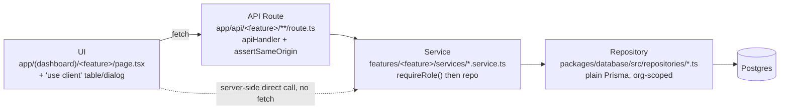

# Architecture — a Contributor's-Eye View

The [`../architecture/`](../architecture/) suite documents *what* BOND OS's architecture is and *why* it
took the shape it did. This page is narrower and more mechanical: **given a piece of work, where does the
code for it go?** Read [`../architecture/overview.md`](../architecture/overview.md) first if you haven't —
this page assumes you already know the four-layer request path and just need the day-to-day decision
rules for applying it.

## The one pattern, every feature

Every write in BOND OS — Task, Project, Customer, WorkflowRun, all of them — flows through the same four
layers, in the same order:



A Server Component page calls its feature's service **directly** (no HTTP round-trip — see
`apps/web/app/(dashboard)/tasks/page.tsx` calling `listTasksService` in-process); a `'use client'`
component instead `fetch()`s the API route, because client components can't import server-only code. Both
paths end up going through the same service and repository.

## "Where do I put this?" — the decision table

| I want to... | Put it in... |
| --- | --- |
| Add a field to an existing model | `packages/database/prisma/schema.prisma`, then `pnpm db:migrate` — see [database/migrations.md](../database/migrations.md) |
| Add a new query/mutation on an existing model | The matching file in `packages/database/src/repositories/*.ts` — one file per aggregate (50 files today: `tasks.ts`, `projects.ts`, `workflow-runs.ts`, …) |
| Add a brand-new CRUD entity end to end | Follow [adding-features.md](adding-features.md) — Prisma model → repository → service → route → UI, one new `apps/web/features/<name>/` directory |
| Add business logic / authorization around an existing repo call | The feature's `services/*.service.ts` — never in the repository (repos don't call `requireRole`) and never in the route (routes only parse input and call the service) |
| Add a new API endpoint | `apps/web/app/api/<feature>/**/route.ts`, wrapped in `apiHandler()` — see [coding-standards.md](coding-standards.md#layer-responsibilities-repos-return-signals-services-throw) |
| Add a new dashboard page | `apps/web/app/(dashboard)/<feature>/page.tsx` (Server Component) + register it in `NAV_ITEMS` in `apps/web/app/(dashboard)/sidebar.tsx` + add its path to `ROUTES` in `packages/shared/src/constants.ts` |
| Add a reusable UI primitive (button, table, modal) | `packages/ui/src/components/` — one file per component, shadcn/ui-style |
| Add a component only one feature needs | `apps/web/features/<feature>/components/` |
| Add cross-cutting infrastructure (env var, error type, cache, rate limit) | `packages/shared/src/` — see its barrel split in [Package boundaries](#package-boundaries) below |
| Add a new zod input schema | `packages/shared/src/schemas/<feature>.ts`, exported from `packages/shared/src/schemas/index.ts` |
| Add a new class-based service with dependencies on other services | Wire it through that feature's `lib/container.ts` — see [Composition roots](#composition-roots-lazy-singleton-di) below; never `new` it at the call site |
| Add a new tool the AI can call | A `*.tool.ts` file implementing `ToolDefinition`, registered in `apps/web/features/tools/registry.ts`'s `ALL_TOOLS` — see [`../ai/tool-calling.md`](../ai/tool-calling.md) |
| Add a new specialist agent | A `*.agent.ts` file in `apps/web/features/agents/definitions/`, registered in `apps/web/features/agents/registry.ts`'s `ALL_AGENTS` — see [`../agents/registry.md`](../agents/registry.md) |
| Add a new workflow step type | A handler file registered in `apps/web/features/workflows/registry.ts`'s `ALL_HANDLERS` — see [`../workflows/builder.md`](../workflows/builder.md) |
| Publish a new domain event | Add a `publishEvent()` call inside the relevant service via the dynamic-import `getPublishEvent()` helper — see [Event publishing](#event-publishing-the-dynamic-import-pattern) below and [`../workflows/event-bus.md`](../workflows/event-bus.md) |

## Package boundaries

`packages/*` are consumed as TypeScript source (Next.js's compiler transpiles them directly via
`transpilePackages` in `apps/web/next.config.ts` — there's no separate per-package build step or
project-references graph to keep in sync). Each package owns **a concern, not a layer** — `@bond-os/auth`
is the entire auth concern (server config, client hooks, session helpers, email), not "backend code that
happens to relate to auth."

| Package | Owns | Add here when... |
| --- | --- | --- |
| `@bond-os/config` | TS/ESLint/Tailwind presets. No runtime code. | You're changing a build-time rule for every package at once. |
| `@bond-os/shared` | Env validation, logging, error types, cache, rate limiting, zod schemas, shared types. Split into a client-safe barrel (`index.ts`: constants/errors/schemas/types) and a server-only barrel (`server.ts`, gated by the `server-only` package: env/logger/cache/queue/rate-limit/virus-scan). | The thing is genuinely cross-cutting and has no Prisma dependency. |
| `@bond-os/database` | Prisma schema, generated client, repositories, seed script, a few multi-model `queries/`. | You're touching the schema or adding/changing a repository function. |
| `@bond-os/auth` | Better Auth server/client config, `requireAuth`/`requireRole`, password-reset email. | You're changing how sessions or role checks work — should be rare. |
| `@bond-os/ui` | Radix-primitive + `cva`-variant component library, copied-in shadcn/ui-style (you own the code, not an installed dependency). | You're building a UI primitive reusable across features, not feature-specific. |
| `@bond-os/ai` | AI provider abstraction. **Infrastructure only** — its own `package.json` states nothing calls `generate()`/`stream()` yet. | Rare; Mr. Bond's real model calls live in `apps/web/features/bond/` and `features/planner/`, not here. |
| `@bond-os/embeddings` | Pluggable embedding provider architecture. | Adding a new embedding provider. |
| `@bond-os/connectors` | Connector framework. **Architecture only — no live OAuth flow.** | Rare; don't build a real OAuth sync here without re-reading this caveat. |
| `@bond-os/extraction` | Regex/heuristic entity-candidate extraction. **No AI.** | Adding a new extraction rule, not an AI-based one. |
| `@bond-os/parsers` | Non-AI document parsing + heuristic chunking. | Adding support for a new file type. |

`apps/web/features/<name>/` is where everything specific to one vertical slice lives: `services/`
(business logic), `components/` (feature-local UI), and — for the class-based subsystems only —
`lib/container.ts`, `registry.ts`, and `definitions/`. There are 29 feature directories today; see
[`../architecture/folder-structure.md`](../architecture/folder-structure.md) for the full one-line-each
tour.

## The two service-authoring styles

Both are correct in this codebase — pick based on which the rest of the feature already uses, or by the
rule of thumb below if you're starting a new feature:

**Plain exported async functions** — one function per operation, e.g.
`apps/web/features/tasks/services/task.service.ts`'s `listTasksService`/`createTaskService`/etc. This is
the shape used by the Phase 1/2 CRUD era (tasks, projects, customers, documents, meetings, emails,
folders). Use this for a straightforward CRUD feature with no dependencies on other services.

**Class-based services with constructor-injected dependencies**, wired through a `lib/container.ts` — used
by `execution`, `agents`, and `workflows` (Phase 6+), where one service genuinely depends on several
others (e.g. `ExecutionService` depends on the tool registry, validation, approval, audit, rollback, and
planner services). Use this once a service needs more than one collaborator injected, or needs to be
composed the same way from multiple call sites.

Both styles call `requireRole(organizationId, role)` as their first line, and both are reached only
through the route layer (or, for the class style, through a container `getX()` — see below).

## Composition roots: lazy-singleton DI

Every class-based service is wired up in exactly one place: that feature's `lib/container.ts`. The
pattern (identical in `features/execution/lib/container.ts`, `features/agents/lib/container.ts`, and
`features/workflows/lib/container.ts` — each one's own doc comment says it "mirrors
`execution/lib/container.ts`'s ... pattern exactly"):

```ts
let executionService: ExecutionService | undefined;

export function getExecutionService(): ExecutionService {
  if (!executionService) {
    executionService = new ExecutionService(
      getToolRegistryService(),
      getValidationService(),
      getApprovalService(),
      getAuditService(),
      getRollbackService(),
      getPlannerService(),
    );
  }
  return executionService;
}
```

Module-scope `let cached: T | undefined`, constructed on first call, never reconstructed. **No call site
anywhere in the codebase constructs a class-based service directly with `new` outside its container** —
this is a hard invariant, asserted in the container files' own doc comments, not just an informal habit.
The same idiom predates the `container.ts` files and is reused for infrastructure singletons:
`getCache()` (`packages/shared/src/cache.ts`), `getQueue()` (`packages/shared/src/queue.ts`),
`getAIProvider()` (`apps/web/features/ai/services/ai-provider.service.ts`), and `getEmbeddingProvider()`
(`apps/web/features/embeddings/services/embedding-provider.service.ts`).

If you're adding a new class-based service that depends on others, add its `getX()` to the relevant
`container.ts` rather than instantiating it inline anywhere else.

## Registries: the single source of truth for pluggable implementations

Three files in the codebase share an identical shape and an almost copy-pasted doc comment: each is "the
ONLY file in this codebase that imports every concrete X implementation."

| Registry | File | Backs |
| --- | --- | --- |
| Tool Registry | `apps/web/features/tools/registry.ts` | Every `*.tool.ts` the AI/agents can call — 5 tools today |
| Agent Registry | `apps/web/features/agents/registry.ts` | Every `*.agent.ts` — 6 agents today (a Coordinator + 5 specialists) |
| Workflow Step Handler Registry | `apps/web/features/workflows/registry.ts` | Every workflow step-handler implementation — 10 handlers today |

The point of the pattern: everywhere else in the codebase, code asks the registry for an implementation
by key (`registry.get(toolKey, version)`) rather than importing a concrete file directly — this is what
makes statements like "the execution engine knows nothing about Projects/Tasks/Customers/Documents"
literally true, not just aspirational. **If you add a new tool, agent, or step handler, register it in the
matching `registry.ts`'s `ALL_*` array — nothing else should import your new file directly.**

## Event publishing: the dynamic-import pattern

A curated set of domain services publish to the in-process Event Bus (`publishEvent()` in
`apps/web/features/workflows/services/event-bus.service.ts`) after their own write succeeds — see
[`../workflows/event-bus.md`](../workflows/event-bus.md) for the mechanism. The publisher is never
statically imported, because doing so closes a real import cycle:

```
task.service.ts → event-bus.service.ts → dispatchMatchingWorkflows
  → INVOKE_TOOL step handler → proposeAction → Tool Registry
  → imports every *.tool.ts, including create-task.tool.ts
  → which imports task.service.ts's createTaskService
```

Every call site instead defines the same tiny helper and awaits it right before publishing:

```ts
async function getPublishEvent() {
  const { publishEvent } = await import('@/features/workflows/services/event-bus.service');
  return publishEvent;
}
```

This is applied even in services where no `*.tool.ts` currently creates a cycle (e.g.
`customer.service.ts`'s own doc comment says as much) — so a future tool added later doesn't silently
reintroduce one. **If your new service needs to publish an event, copy this helper rather than importing
`publishEvent` at the top of the file.**

## State & session

- **Active organization**: the source of truth is a cookie (`bondos_active_org`), set by a Server Action
  and resolved server-side by `requireActiveOrganizationId()` (`apps/web/lib/organization.ts`). Zustand
  (`apps/web/store/org-store.ts`) only mirrors it client-side for instant UI feedback — it is never the
  source of truth, which avoids a hydration-order race between Server Components (which can't read
  Zustand) and Client Components.
- **UI-only state** (e.g. sidebar collapsed) uses Zustand narrowly (`apps/web/store/ui-store.ts`) —
  there's no client-side data cache for server data; Server Components and Route Handlers always fetch
  fresh.
- **Session**: Better Auth httpOnly cookies, checked two ways — `apps/web/middleware.ts` does a fast,
  Edge-safe presence check (no DB hit, UX-only) and every Server Component/Route Handler calls
  `requireAuth()`/`requireRole()` (`packages/auth/src/session.ts`) as the actual, DB-backed authorization
  boundary. See [`../security/authentication.md`](../security/authentication.md).

## Further reading

- [`../architecture/overview.md`](../architecture/overview.md) and
  [`../architecture/system-architecture.md`](../architecture/system-architecture.md) — the full narrative
  version of everything above.
- [`../architecture/request-flow.md`](../architecture/request-flow.md) — the four-layer path with real
  request/response examples.
- [`../architecture/folder-structure.md`](../architecture/folder-structure.md) — every `apps/web/features/*`
  and `packages/database/src/repositories/*` file, one line each.
- [`../architecture/design-principles.md`](../architecture/design-principles.md) — the composition-root,
  registry, and event-publisher patterns in more depth.
- [`../database/schema.md`](../database/schema.md) — the Prisma schema these repositories sit on top of.
- [coding-standards.md](coding-standards.md) — the conventions you should follow while writing any of this.
- [adding-features.md](adding-features.md) — all of the above, applied to one worked example.
