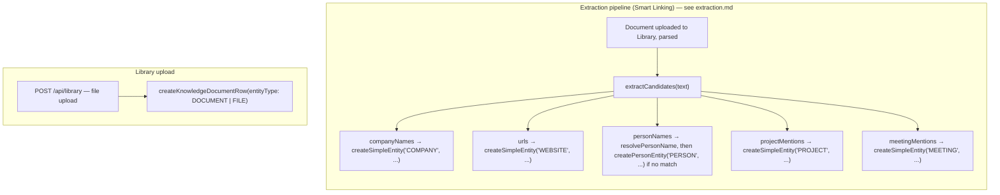

# Entities

`Entity` (`packages/database/prisma/schema.prisma`) is the universal row every knowledge-graph node
is built from — introduced in Phase 2 as the generic content type, extended in Phase 3 to also serve
as the graph's node table. This doc covers the `Entity` model's shape, the 14-value `EntityType`
enum, the two non-`Entity` node types (`FOLDER`/`TAG`), and — verified directly against the code, not
assumed from the enum's existence — exactly which entity types the running application actually has
a code path to create. See [graph.md](graph.md) for the graph model overview,
[relationships.md](relationships.md) for how entities connect to each other, and
[extraction.md](extraction.md) for the pipeline that creates most of them.

## The `Entity` model

```prisma
model Entity {
  id             String     @id @default(cuid())
  organizationId String
  creatorId      String?
  entityType     EntityType
  title          String
  description    String?
  metadata       Json?
  version        Int        @default(1)
  createdAt      DateTime   @default(now())
  updatedAt      DateTime   @updatedAt

  knowledgeDocument KnowledgeDocument?
  contact           Contact?
  website           Website?
  attachments       Attachment[]
  tags              EntityTag[]

  outgoingGraphRelationships Relationship[]
  incomingGraphRelationships Relationship[]
  timelineEvents             TimelineEvent[]

  @@index([organizationId])
  @@index([organizationId, entityType])
}
```

- **`title` / `description`** — the two fields every node type shares. For types with no dedicated
  detail table (`COMPANY`, `PRODUCT`, `EVENT`, and extraction's `PROJECT`/`TASK`/`MEETING` mentions),
  `title` is the only real content. For `NOTE`, `description` is the entity's actual body text — the
  schema comment on `EmbeddingSourceType` states this directly: "Phase 2 gave NOTE no dedicated
  table, so description is its only content."
- **`metadata` (`Json?`)** — free-form, type-specific data not worth a dedicated column. Its one
  concrete, code-verified use today is the extraction pipeline's soft-link:
  `{ linkedRecordType: 'PROJECT' | 'MEETING', linkedRecordId }`, written by
  `mergeEntityMetadata` (`packages/database/src/repositories/graph-nodes.ts`) when an extracted
  mention's title exactly matches a real Phase 1 `Project`/`Meeting`. See
  [extraction.md](extraction.md#the-pipeline-step-by-step).
- **`version` (`Int`, default `1`)** — a Phase 9, additive-only field for optimistic-concurrency /
  version tracking. Its own schema comment says it's "in practice only exercised for `entityType =
  NOTE` rows today (the only `Entity` content this codebase lets a user directly edit)." A related
  table, `EntityVersionSnapshot` (`packages/database/src/repositories/entity-version-snapshots.ts`,
  `createEntityVersionSnapshot`), exists in the schema and repository layer for capturing those
  versions — but a repo-wide search finds **zero callers** of `createEntityVersionSnapshot` anywhere
  in `apps/web`. As shipped, this is modeled infrastructure with no wiring into any feature yet, not
  a bug — worth knowing if you're about to build a NOTE-editing or entity-rollback feature and expect
  version history to already be captured.
- **`creatorId` (`String?`, nullable)** — who created the row, `SetNull` on user deletion.

## `EntityType` — 14 values, one enum

```prisma
enum EntityType {
  DOCUMENT MEETING NOTE CUSTOMER EMAIL CONTACT WEBSITE FILE   // Phase 2's original 8
  PERSON COMPANY PROJECT TASK PRODUCT EVENT                    // Phase 3 additions
}
```

`PERSON` and `CONTACT` are kept as two distinct values rather than collapsed into one, even though
both point at the same `Contact` detail table — `CONTACT` is described in the Phase 3 docs as "Phase
2's manually-added contact," `PERSON` is what the extraction engine creates automatically. The same
"two entity types, one detail table" pattern `KnowledgeDocument` already uses for `DOCUMENT`/`FILE`.

`PROJECT` and `TASK` as `Entity` rows are **not** Phase 1's real `Project`/`Task` tables — they
represent *mentions extracted from document text* ("the document says 'Project Phoenix'"). Phase 1's
tables are completely untouched by the graph; the two connect only through the soft-link mechanism
described below, never a foreign key.

### Which types have a detail table

| `EntityType` | Detail table | Notes |
| --- | --- | --- |
| `PERSON` | `Contact` | Shared with `CONTACT` — `name`/`email`/`phone`/`company`/`jobTitle`. |
| `CONTACT` | `Contact` | Same table as `PERSON`; distinguished only by `entityType`. |
| `DOCUMENT` | `KnowledgeDocument` | Shared with `FILE`. |
| `FILE` | `KnowledgeDocument` | Same table as `DOCUMENT`; a generic uploaded file vs. a parsed document are structurally identical. |
| `WEBSITE` | `Website` | `url`, `faviconUrl`, `lastCrawledAt`. |
| `COMPANY`, `PRODUCT`, `EVENT` | none | `title` + `metadata` is enough; a table with no populated columns beyond what `Entity` already has would be speculative. |
| `PROJECT`, `TASK`, `MEETING` (as extracted mentions) | none | `title` only, optionally soft-linked to a real Phase 1 record via `metadata`. |
| `NOTE` | none | `description` *is* the content. |
| `CUSTOMER`, `EMAIL` | none | See "Types with no current creation path" below. |

### `GraphNodeType`: two more node types that aren't `Entity` rows at all

```ts
// packages/database/src/repositories/graph.ts
export type GraphNodeType = EntityType | 'FOLDER' | 'TAG';
```

`FOLDER` and `TAG` are Phase 2's own standalone tables (`Folder`, `Tag`), exposed through the graph
read-only via `getNode('FOLDER', ...)` / `getNode('TAG', ...)` — reshaped into the same `GraphNode`
shape as an `Entity`-backed node, but never written back to as graph nodes. 12 of the spec's 14 node
types are `Entity` rows; these 2 complete the set to 16 total `GraphNodeType` values.

## Presentation: one style map for every node type

`apps/web/features/graph/lib/node-style.ts` is the single source of truth for how every
`GraphNodeType` renders — label, Lucide icon, and a hex color — shared by the React Flow canvas, the
Entity Viewer, Relationship Explorer, and Timeline pages so a `PERSON` node (for example) looks the
same everywhere:

| Type | Label | Color | Type | Label | Color |
| --- | --- | --- | --- | --- | --- |
| `DOCUMENT` | Document | `#3b82f6` | `PERSON` | Person | `#22c55e` |
| `MEETING` | Meeting | `#8b5cf6` | `COMPANY` | Company | `#f97316` |
| `NOTE` | Note | `#eab308` | `PROJECT` | Project | `#a855f7` |
| `CUSTOMER` | Customer | `#14b8a6` | `TASK` | Task | `#ec4899` |
| `EMAIL` | Email | `#0ea5e9` | `PRODUCT` | Product | `#f59e0b` |
| `CONTACT` | Contact | `#6366f1` | `EVENT` | Event | `#ef4444` |
| `WEBSITE` | Website | `#06b6d4` | `FOLDER` | Folder | `#78716c` |
| `FILE` | File | `#64748b` | `TAG` | Tag | `#84cc16` |

`getNodeStyle(type)` falls back to a generic `{ label: type, icon: File, color: '#94a3b8' }` for any
unrecognized string, so an unexpected value never throws in the UI. `nodeHref(type, id)` returns
`/graph/entity/${id}` for every type except `FOLDER`/`TAG` (which have no Entity Viewer page, since
they aren't `Entity` rows).

## How entities are actually created

This is the part worth being precise about: the `EntityType` enum has 14 values, all of them are
valid, queryable, and rendered correctly by the UI — but **not all 14 currently have a code path that
creates one**. Verified by tracing every caller of the two entity-creation primitives
(`createSimpleEntity`, `createPersonEntity` in `packages/database/src/repositories/graph-nodes.ts`)
and the one other place an `Entity` row gets written (`createKnowledgeDocumentRow` for Library
uploads):



| `EntityType` | Created by | Verified via |
| --- | --- | --- |
| `PERSON` | Extraction pipeline (`resolvePeople` → `resolvePersonName` dedup, then `createPersonEntity` if unmatched) | `extraction-pipeline.service.ts` |
| `COMPANY` | Extraction pipeline (`resolveOrCreateMany(..., 'COMPANY', ...)`) | `extraction-pipeline.service.ts` |
| `WEBSITE` | Extraction pipeline (`resolveOrCreateMany(..., 'WEBSITE', ...)`) | `extraction-pipeline.service.ts` |
| `PROJECT` | Extraction pipeline (`resolveOrCreateMentions(..., 'PROJECT', 'RELATED_TO', ...)`) — a *mention*, optionally soft-linked to a real `Project` | `extraction-pipeline.service.ts` |
| `MEETING` | Extraction pipeline (`resolveOrCreateMentions(..., 'MEETING', 'PART_OF', ...)`) — a *mention*, optionally soft-linked to a real `Meeting` | `extraction-pipeline.service.ts` |
| `DOCUMENT` | Library upload, when the caller sets `entityType: 'DOCUMENT'` (the upload form's default) | `library.service.ts`, `knowledge-documents.ts` |
| `FILE` | Library upload, when the caller sets `entityType: 'FILE'` | `library.service.ts`, `knowledge-documents.ts` — restricted to exactly these two values by `libraryEntityTypeSchema` (`packages/shared/src/schemas/knowledge-document.ts`) |

### Types with no current creation path

`CONTACT`, `NOTE`, `CUSTOMER`, `EMAIL`, `TASK`, `PRODUCT`, and `EVENT` — 7 of the 14 `EntityType`
values — have **no confirmed code path anywhere in `apps/web` that creates an `Entity` row of that
type.** This was checked directly, not inferred: `createSimpleEntity` and `createPersonEntity` each
have exactly one caller file (`extraction-pipeline.service.ts`), and within it the only literal
`entityType` values ever passed are `'COMPANY'`, `'WEBSITE'`, `'PROJECT'`, and `'MEETING'` (via
`resolveOrCreateMany`/`resolveOrCreateMentions`), plus the hardcoded `'PERSON'` inside
`createPersonEntity` itself. `libraryEntityTypeSchema` restricts the upload flow to `DOCUMENT`/`FILE`
only. No other service in the codebase calls `prisma.entity.create` for a graph node.

This isn't presented as a defect — it's a documented scoping fact, in the same spirit as
[relationships.md](relationships.md)'s "10 of 15 relationship types are manual-API-only" and
[../connectors.md](../connectors.md)'s 7 connector stubs: the schema, enum, UI presentation
(`node-style.ts`), and — for `CUSTOMER` specifically — downstream linking logic
(`apps/web/features/retrieval/services/context-builder.service.ts`'s `resolveLinkedRecords`, which
already handles `entity.entityType === 'CUSTOMER'` by matching its `title` against the real
`Customer` table) are all built and ready. What's missing is only the creation trigger itself — no
extraction rule and no manual-creation UI/API exist yet for these 7 types. A future extraction rule
for customer mentions, task mentions, or product/event mentions, or a manual "add contact"/"add note"
UI, would slot into the same `createSimpleEntity`/`createPersonEntity` primitives without any schema
change.

## Soft-linking to Phase 1 records

Extracted `PROJECT`/`MEETING` mentions carry a non-FK, best-effort pointer to the real Phase 1 record
they probably refer to, stored in `metadata`:

```json
{ "linkedRecordType": "PROJECT", "linkedRecordId": "clxyz..." }
```

Written by `mergeEntityMetadata` (merges into existing `metadata`, doesn't overwrite it) when the
mention's title exactly (case-insensitive) matches a real `Project`/`Meeting` title in the same org.
`CUSTOMER`-type entities — if any ever exist — have no equivalent soft-link field; downstream readers
that want to resolve a `CUSTOMER` mention to the real `Customer` table do an exact-title match at read
time instead (see `context-builder.md`'s discussion of `resolveLinkedRecords`, cross-linked above).
No foreign key is ever added from the graph schema to Phase 1's tables — the coupling is entirely
through an opaque id in JSON, resolved by the reading code, never enforced by Postgres.

## What's deliberately not built

No entity-editing UI or API for extracted entities (they're created once, never updated — the `NOTE`
exception, where a user can directly edit `description`, is the one case `Entity.version` is
exercised for, per its schema comment, though no code currently reads or writes
`EntityVersionSnapshot` to capture that history). No manual "create a graph entity directly" endpoint
— every `Entity` row today originates from either the extraction pipeline or a Library file upload.
No cross-organization entity lookup. See [graph.md](graph.md) for the model overview and
[resolution.md](resolution.md) for how duplicate `PERSON` entities are avoided at creation time.
