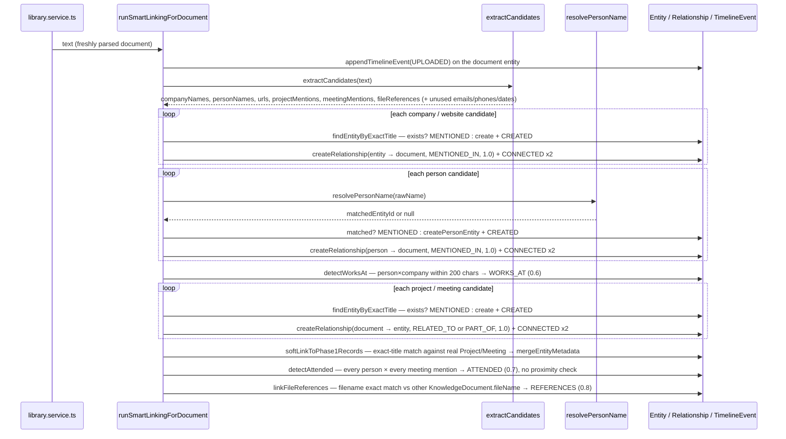

# Extraction Pipeline

"Smart Linking": when a document finishes uploading and parsing in the Library, its text is run
through a fully automatic, fully deterministic pipeline that extracts entity candidates, resolves
duplicates, creates graph nodes, creates relationships, and appends timeline events — with zero AI,
zero LLM calls, and zero embeddings involved. The orchestrator is
`runSmartLinkingForDocument` in `apps/web/features/graph/services/extraction-pipeline.service.ts`;
the candidate extraction itself is a separate, pure workspace package, `@bond-os/extraction`. See
[graph.md](graph.md) for how this fits the graph model, [entities.md](entities.md) for what gets
created, [relationships.md](relationships.md) for what gets connected, [resolution.md](resolution.md)
for how `PERSON` duplicates are avoided, and [timeline.md](timeline.md) for what gets logged.

## Where it's wired in

One additive hook into Phase 2's upload pipeline, inside the existing `try` block of
`parseAndChunk()` in `apps/web/features/library/services/library.service.ts`, right after chunking
succeeds and before the Phase 4 embedding pipeline runs:

```ts
// library.service.ts — parseAndChunk()
const chunks = chunkText(result.text);
await replaceChunks(id, organizationId, chunks);

// Phase 3 "Smart Linking" — extraction/resolution/relationship-detection over the freshly
// parsed text. Never allowed to break the upload.
try {
  await runSmartLinkingForDocument({ documentEntityId: entityId, organizationId, userId, text: result.text });
} catch (error) {
  log.error('Smart linking failed', { id, message: error instanceof Error ? error.message : String(error) });
}

// Phase 4 embedding pipeline — generate + store one embedding per chunk, runs next.
```

`runSmartLinkingForDocument` itself never throws to its caller — any internal failure is a no-op from
the upload's point of view, matching the same "new side-effecting call added to an existing function,
wrapped so failure never breaks existing behavior" pattern Phase 2 used when it hooked into Phase 1's
`search.service.ts`. A failed extraction pass means the document simply has no graph nodes/edges yet,
not a failed upload.

**Scope**: automatic extraction runs on Library document uploads only. It is not wired into Phase 1
Emails or Meetings directly — a documented scoping decision, not an oversight.

## The extraction engine: `@bond-os/extraction`

A pure, dependency-free workspace package (no DB, no network, no AI) — `extractCandidates(text)` runs
nine independent extractors and returns one `ExtractionResult`:

```ts
// packages/extraction/src/types.ts
export interface TextMatch { value: string; offset: number; }
export interface ExtractionResult {
  emails: TextMatch[]; phones: TextMatch[]; urls: TextMatch[]; dates: TextMatch[];
  fileReferences: TextMatch[]; personNames: TextMatch[]; companyNames: TextMatch[];
  projectMentions: TextMatch[]; meetingMentions: TextMatch[];
}
```

Every match carries a character `offset` into the source text — the only piece of positional data the
pipeline has, and it's what makes proximity-based relationship detection (`WORKS_AT`, see
[relationships.md](relationships.md)) possible without any real NLP.

### What each extractor actually matches

| Extractor | Pattern | Notes |
| --- | --- | --- |
| `extractEmails` | `/[\w.+-]+@[\w-]+\.[\w.-]+/g` | Plain regex. |
| `extractPhones` | US/international formats: `+1-555-123-4567`, `(555) 123-4567`, `555.123.4567` | Plain regex. |
| `extractUrls` | `/https?:\/\/[^\s<>"')]+/g` | Plain regex. |
| `extractDates` | 4 patterns: ISO (`2026-07-18`), US (`07/18/2026`), `Month DD, YYYY`, `DD Month YYYY` | Plain regex, sorted by offset. |
| `extractFileReferences` | Filename + a known extension (`pdf/docx?/xlsx?/pptx?/csv/txt/md/png/jpe?g/gif`) | Feeds `REFERENCES` relationship detection. |
| `extractPersonNames` | Three sub-patterns, first-match-wins by offset: `Mr./Mrs./Ms./Miss/Dr./Prof. Name` (trusted outright), `J. Smith`-style initials (trusted outright), and plain `Capitalized Capitalized` pairs (filtered against a stopword list of sentence-starts/days/months/salutations, and rejected if immediately followed by a company suffix like "Inc"/"LLC" — that's a company name, not a person). | `packages/extraction/src/names.ts`. Imprecision is explicit and expected — see "What's deliberately not built" below. |
| `extractCompanyNames` | One or more capitalized words ending in a recognized suffix (`Inc, LLC, Ltd, Corp, Corporation, Co, Company, Group, Technologies, Tech, Solutions, Partners`) | `packages/extraction/src/companies.ts`. |
| `extractProjectMentions` | `"Project Phoenix"` or `"the Phoenix project"` (normalized to `"Phoenix Project"`) | `packages/extraction/src/mentions.ts`. |
| `extractMeetingMentions` | `"<Words> {meeting\|sync\|standup\|kickoff\|review\|retro...}"` (e.g. `"Roadmap Sync"`, `"Q3 Kickoff"`) or `"Meeting: Roadmap Review"` | `packages/extraction/src/mentions.ts`. |

### A confirmed gap: three extractors run but their output is never used

`extractCandidates` always runs all nine extractors, but
`runSmartLinkingForDocument` only ever reads `candidates.companyNames`, `candidates.personNames`,
`candidates.urls`, `candidates.projectMentions`, `candidates.meetingMentions`, and
`candidates.fileReferences`. Verified directly against the pipeline file: `candidates.emails`,
`candidates.phones`, and `candidates.dates` are computed on every document but never referenced
anywhere in `extraction-pipeline.service.ts`. No `EMAIL`-type entity gets created from an extracted
email address, no relationship or timeline event is derived from a phone number or date match today.
This is real, currently-inert extraction output — not a documented design decision the way the
person-name imprecision is, just work the pipeline does and then doesn't act on.

## The pipeline, step by step

`runSmartLinkingForDocument({ documentEntityId, organizationId, userId, text })`:



1. **Guard**: `if (!text.trim()) return;` — an empty/whitespace-only document is a silent no-op.
2. **`UPLOADED` timeline event** on the document entity itself — always the first write, regardless
   of what extraction finds.
3. **`extractCandidates(text)`** — one synchronous call, all nine extractors run.
4. **Companies** (`resolveOrCreateMany(..., 'COMPANY', candidates.companyNames, ...)`) — dedup by
   exact (case-insensitive) title match (`findEntityByExactTitle`); create if no match.
5. **People** (`resolvePeople(...)`) — dedup via [`resolvePersonName`](resolution.md), the one
   extracted type with genuine name-normalization logic; create via `createPersonEntity` (which
   atomically creates the `Entity(PERSON)` + nested `Contact` row) if no match.
6. **Websites** (`resolveOrCreateMany(..., 'WEBSITE', candidates.urls, ...)`) — same exact-title dedup
   as companies.
7. **`detectWorksAt`** — every extracted person × every extracted company, `WORKS_AT` created if
   `Math.abs(person.offset - company.offset) <= PROXIMITY_CHARS` (`200`).
8. **Projects** (`resolveOrCreateMentions(..., 'PROJECT', 'RELATED_TO', ...)`) and **meetings**
   (`resolveOrCreateMentions(..., 'MEETING', 'PART_OF', ...)`) — same exact-title dedup, relationship
   direction is *document → entity* here (the reverse of the company/person/website case, which is
   *entity → document*).
9. **`softLinkToPhase1Records`** — for every newly-resolved project/meeting mention, an exact
   (case-insensitive) title match against the real `Project`/`Meeting` tables; on a match,
   `mergeEntityMetadata` writes `{ linkedRecordType, linkedRecordId }` into the mention's `metadata`.
   See [entities.md](entities.md#soft-linking-to-phase-1-records).
10. **`detectAttended`** — every extracted person × every extracted meeting mention in the document,
    unconditionally (`ATTENDED`, confidence `0.7`) — see
    [relationships.md](relationships.md#a-real-precision-limitation-detectattended-has-no-proximity-check)
    for why this is a real precision limitation, not a hypothetical.
11. **`linkFileReferences`** — each extracted filename is matched (case-insensitive, exact) against
    other `KnowledgeDocument.fileName` values in the org; a match creates `REFERENCES` (`0.8`) from
    the current document to the referenced one.
12. **`log.info('Smart linking finished', { documentEntityId, people, companies, websites, projects,
    meetings })`** — a structured log line with counts, no persisted summary record.

Every relationship write in the pipeline goes through one shared helper:

```ts
async function createRelationshipAndTrackTimeline(
  organizationId, userId, sourceEntityId, targetEntityId, relationshipType, confidence,
): Promise<void> {
  const created = await createRelationship({ organizationId, sourceEntityId, targetEntityId, relationshipType, confidence, createdById: userId });
  if (!created) return;  // no-op duplicate — skip the timeline writes too

  await Promise.all([
    appendTimelineEvent({ organizationId, entityId: sourceEntityId, eventType: 'CONNECTED', description: `Linked via ${relationshipType}.` }),
    appendTimelineEvent({ organizationId, entityId: targetEntityId, eventType: 'CONNECTED', description: `Linked via ${relationshipType}.` }),
  ]);
}
```

This is the single choke point that guarantees `CONNECTED` timeline events are appended to **both**
endpoints of a relationship, and only when the relationship was actually newly created — never on a
duplicate no-op. See [timeline.md](timeline.md#connected).

## What's deliberately not built

No AI, no ML, no NLP model, no embeddings — every rule above is regex, a dictionary lookup
(company suffixes, meeting keywords, honorifics), or a character-offset proximity heuristic. Missed
matches and over-matches are expected and explicitly accepted, not hidden — the extraction package's
own doc comment states it directly: "Imprecision (missed or over-matched names/companies) is expected
and explicitly acceptable." No extraction runs on Phase 1 Emails or Meetings directly (Library
documents only). No extraction for `TASK`, `PRODUCT`, `EVENT`, `CUSTOMER`, or generic `NOTE` mentions
— see [entities.md](entities.md#types-with-no-current-creation-path) for the full list of `EntityType`
values with no creation path today. No use of the `emails`/`phones`/`dates` extraction output (see
above). No confidence recalibration as more documents corroborate a detection. No manual "re-run
extraction on this document" trigger — extraction runs exactly once, at upload time.
