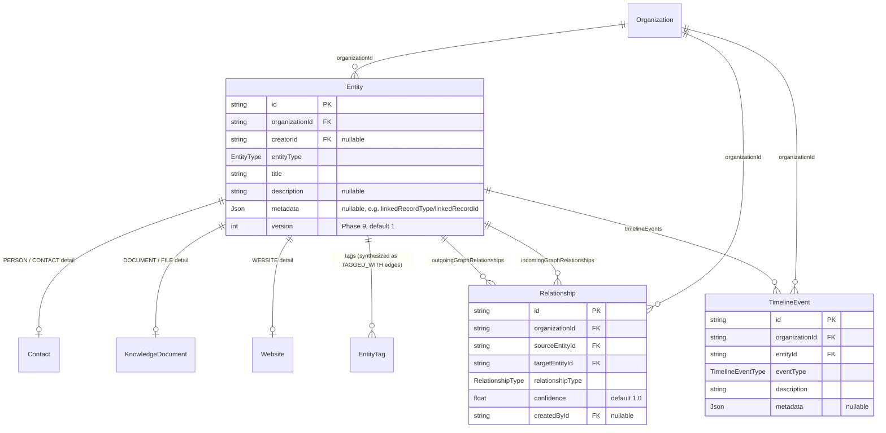
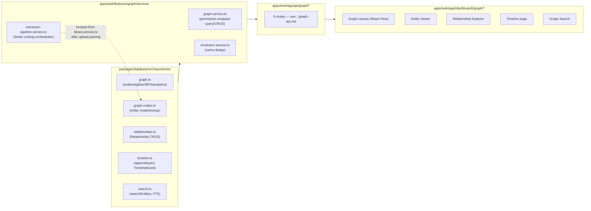
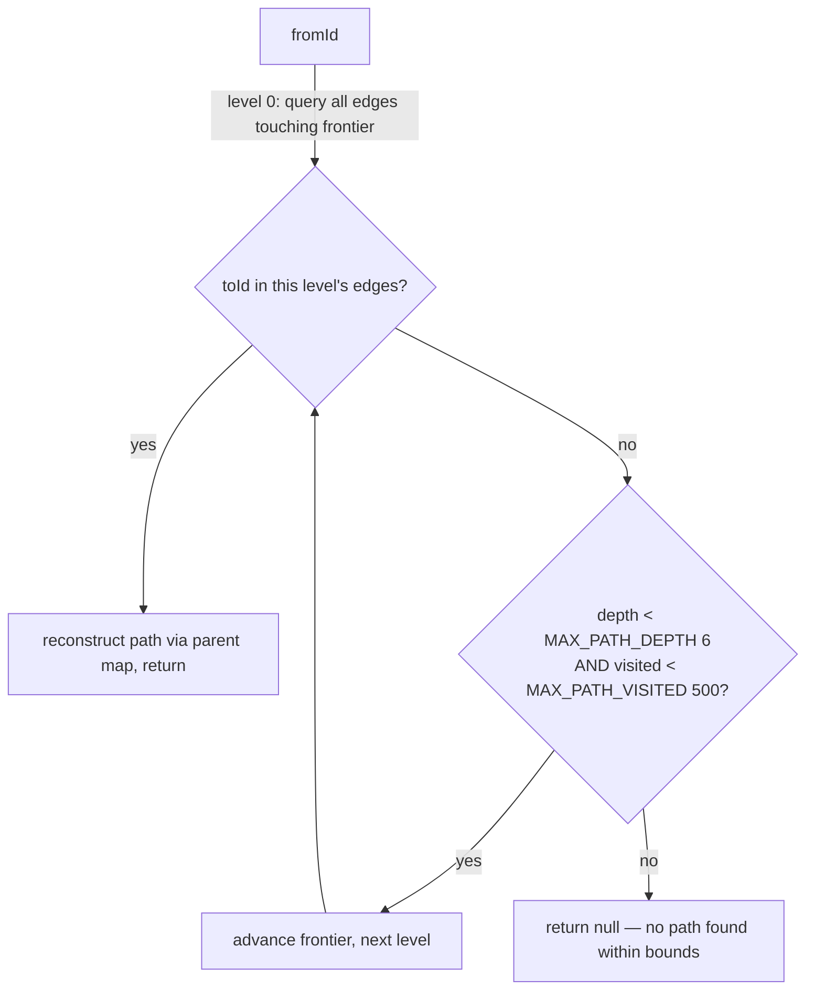

# Knowledge Graph Model

The knowledge graph is BOND OS's Phase 3 (P3) addition: a typed graph of nodes and edges built on
top of Phase 1's structured records and Phase 2's generic `Entity` system, populated automatically
and deterministically (no AI, no LLM calls, no embeddings) whenever a document is uploaded, and read
by almost every later phase — hybrid search's relationship signal, the RAG Context Builder's 1-hop
expansion, Mr. Bond's `graph`/`timeline` tools, and the multi-agent Knowledge specialist all query
it. This doc is the model overview: what a node and an edge are, how the graph is traversed, how it's
cached, and who reads it. See [entities.md](entities.md), [relationships.md](relationships.md),
[extraction.md](extraction.md), [resolution.md](resolution.md), and [timeline.md](timeline.md) for
the pieces in depth, and [../graph-api.md](../graph-api.md) for the full `/api/graph/*` route
reference (summarized here, not repeated).

## Why the graph reuses `Entity` rather than adding a new node table

Phase 2's `Entity` model (`packages/database/prisma/schema.prisma`) already has exactly the shape a
graph node needs — `id`, `organizationId`, `creatorId`, `entityType`, `title`, `description`,
`metadata (Json?)`, `createdAt`, `updatedAt` — so Phase 3 extends `Entity` rather than duplicating
it. The extension is additive: `EntityType` grows from 8 values to 14 (`PERSON, COMPANY, PROJECT,
TASK, PRODUCT, EVENT` are new), and `Entity` gets three new inverse relations
(`outgoingGraphRelationships`, `incomingGraphRelationships`, `timelineEvents`). Nothing existing is
removed or retyped. See [entities.md](entities.md) for the full `EntityType` breakdown and exactly
which entity types have a real creation path today.

Two node types in the spec — `Folder` and `Tag` — are **not** `Entity` rows at all. They're Phase
2's own standalone tables, exposed through the graph read-only via the same node resolver:

```ts
// packages/database/src/repositories/graph.ts
export type GraphNodeType = EntityType | 'FOLDER' | 'TAG';

export async function getNode(type: GraphNodeType, id: string, organizationId: string): Promise<GraphNode | null> {
  if (type === 'FOLDER') { /* prisma.folder.findFirst(...) reshaped into GraphNode */ }
  if (type === 'TAG') { /* prisma.tag.findFirst(...) reshaped into GraphNode */ }
  // everything else: prisma.entity.findFirst({ where: { id, organizationId, entityType: type } })
}
```

`GraphNode` is the one shape every node type — real `Entity` row or synthesized `Folder`/`Tag` —
gets flattened into before it reaches a service or the UI: `{ id, type, title, description, metadata,
createdAt, updatedAt }`.

## Edges are a new `Relationship` model, not a retrofit

Phase 2 already had a generic edge table, `EntityRelationship` (`sourceEntityId` / `targetEntityId` /
`relationType: String` / `createdAt`), but it's missing two fields the graph spec needs —
`confidence` and `createdBy` — and its `relationType` is a free-form string, not a typed enum.
Rather than change an existing column's type (a breaking change to whatever `EntityRelationship` was
built for), Phase 3 adds a **parallel** model, `Relationship`, and leaves `EntityRelationship` alone.
`EntityRelationship` has no real caller anywhere in the app today (confirmed: `createEntityRelationship`,
`listEntityRelationships`, and `deleteEntityRelationship` in
`packages/database/src/repositories/entities.ts` are the only place it's touched, and nothing calls
those three functions), so nothing regressed by leaving it in place unused. See
[relationships.md](relationships.md) for the full `Relationship`/`RelationshipType` reference.

## The graph's core shape



For the full column-level ERD across every model in the schema (not just the graph's own three), see
[../database/erd.md](../database/erd.md) and [../database/schema.md](../database/schema.md).

## Layering

The graph follows the same Repository → Service → API → UI shape every other feature in the
monorepo uses (see [../architecture/request-flow.md](../architecture/request-flow.md)):



- **Repository** (`packages/database/src/repositories/{graph,graph-nodes,relationships,timeline}.ts`)
  — pure Prisma data access. Neighbor/relationship loading is always batched
  (`findMany({ where: { OR: [...] } })`), never one query per neighbor.
- **Service** (`apps/web/features/graph/services/{graph,resolution,extraction-pipeline}.service.ts`)
  — every exported function starts with `requireRole(organizationId, ROLES.MEMBER)` (or `ROLES.ADMIN`
  for `deleteRelationshipService`), enforced in the service layer, not the route.
- **API** (`apps/web/app/api/graph/*`) — 9 routes, `apiHandler`/`assertSameOrigin`/
  `requireActiveOrganizationId`/Zod-validated bodies and queries, same envelope
  (`{ success: true, data }` / `{ success: false, error }`) as every other route. Full table in
  [../graph-api.md](../graph-api.md) and [../api/graph.md](../api/graph.md).
- **UI** (`apps/web/app/(dashboard)/graph/*`) — the graph canvas (React Flow, `@xyflow/react` — no
  custom canvas was built, per the spec's explicit instruction), the Entity Viewer
  (`/graph/entity/[id]`), Relationship Explorer (`/graph/relationships`), Timeline page
  (`/graph/timeline`), and Graph Search (`/graph/search`).

## Traversal: neighbors, shortest path, connected entities, analytics

All four live in `packages/database/src/repositories/graph.ts`, wrapped by
`apps/web/features/graph/services/graph.service.ts`.

### `getNeighbors(entityId, organizationId)` — one hop

Returns every real `Relationship` edge touching the entity (both directions, via
`listRelationships`) **plus** the entity's `EntityTag` rows synthesized as `TAGGED_WITH` edges at
`confidence: 1` — computed at query time, never duplicated into the `Relationship` table:

```ts
// packages/database/src/repositories/graph.ts
for (const entityTag of entityTags) {
  edges.push({
    relationshipId: `tag:${entityTag.id}`,
    relationshipType: 'TAGGED_WITH',
    confidence: 1,
    direction: 'outgoing',
    node: { id: entityTag.tag.id, type: 'TAG', title: entityTag.tag.name },
  });
}
```

Service-layer `getNeighborsService` caches the result 30 seconds
(`NEIGHBORS_CACHE_TTL_SECONDS = 30`) under key `graph:neighbors:${organizationId}:${entityId}` via
the shared `Cache` interface (`packages/shared/src/cache.ts`) — a new consumer of an existing
interface, not new caching infrastructure. Powers the graph canvas's expand-on-click
(`GET /api/graph/node`).

### `findShortestPath(fromId, toId, organizationId)` — bounded, undirected BFS

Level-by-level BFS, one batched `prisma.relationship.findMany` per level (not one query per edge),
walking `Relationship` **as an undirected graph** — a `WORKS_AT` edge from a person to a company is
just as traversable backwards as forwards for path-finding purposes:



Capped at `MAX_PATH_DEPTH = 6` levels and `MAX_PATH_VISITED = 500` nodes so a densely connected graph
can't make the query unbounded. `GET /api/graph/path?from=&to=` returns `{ path: string[] }` (a list
of entity ids) or 404 if no path exists within the bound.

### `findConnectedEntities(entityId, organizationId, maxDepth = 3)` — bounded BFS, one-sided

Same batched-BFS shape as shortest path, but collects **every** entity reachable within `maxDepth`
hops rather than stopping at a target, capped at `MAX_CONNECTED_NODES = 200`. Default depth 3,
caller-adjustable up to 6 (`GET /api/graph/entity/[id]/connected?maxDepth=`, validated by
`connectedEntitiesQuerySchema`, `packages/shared/src/schemas/graph.ts`). This is also the function
the RAG Context Builder calls for its lazy 1-hop graph expansion — see "Who reads the graph" below.

### `getGraphAnalytics(organizationId)` — dashboard aggregates

Six queries run in parallel (`Promise.all`): total entity count, total relationship count, the 10
most-recently-created entities, a `groupBy(relationshipType)` breakdown, and two more `groupBy`s (by
`sourceEntityId` and `targetEntityId`) that get merged **in process** into one connection-count map to
derive the top-10 "most connected" nodes — not a single SQL query, because Prisma's `groupBy` can't
express "count by either side of a self-referencing pair" in one call. A 90-day daily growth bucket
is computed with one raw query:

```sql
SELECT to_char(date_trunc('day', "createdAt"), 'YYYY-MM-DD') AS date, COUNT(*)::bigint AS count
FROM entities WHERE "organizationId" = $1 GROUP BY 1 ORDER BY 1 ASC LIMIT 90
```

Service-layer `getGraphAnalyticsService` caches this 30 seconds
(`ANALYTICS_CACHE_TTL_SECONDS = 30`, key `graph:analytics:${organizationId}`) — same pattern and TTL
as `getNeighborsService`. Backs `GET /api/graph` and the `/graph` dashboard's summary cards.

### Graph-wide search

`searchGraphService` (`apps/web/features/graph/services/graph.service.ts`) is broader than the main
`/api/search`: it runs `searchEntities` (Phase 2's Postgres full-text search over
`Entity.title`/`description`) **plus** a `contains`/`insensitive` substring match directly against
`Relationship` (by either endpoint's title) and `TimelineEvent` (by `description`) — up to 10 results
each, in parallel. `GET /api/graph/search?q=`.

## Permissions and multi-tenancy

Every service function in `graph.service.ts` calls `requireRole(organizationId, ROLES.MEMBER)` before
touching the database; `deleteRelationshipService` requires `ROLES.ADMIN` (the same destructive-action
bar every other feature uses). Every repository query is scoped by `organizationId` in its `WHERE`
clause — there is no cross-organization traversal possible: `findShortestPath` and
`findConnectedEntities` both include `organizationId` in every `Relationship` query issued during
BFS, so a path can never walk through another organization's edges even transiently. See
[../security/organization-isolation.md](../security/organization-isolation.md) and
[../security/permissions.md](../security/permissions.md) for the cross-cutting pattern.

## Who reads the graph

The graph isn't just a UI feature — three later-phase systems query it directly:

- **Hybrid search's relationship signal** (`apps/web/features/retrieval/services/hybrid-search.service.ts`)
  — one of hybrid search's four ranking signals counts, for each entity candidate already in the
  result pool, how many `Relationship` edges connect it to *other candidates already in that same
  pool* (via `listRelationshipsForEntities`) — not a graph-wide degree count, a same-query-result
  connectivity signal, weighted 0.2 of the final score. See [../ai/retrieval.md](../ai/retrieval.md).
- **The RAG Context Builder's lazy 1-hop expansion** (`apps/web/features/retrieval/services/context-builder.service.ts`)
  — only the top 5 highest-ranked `ENTITY` results in a query's hybrid-search output get expanded:
  `findConnectedEntities(id, organizationId, 1)` (1 hop) and a first page of `getTimeline`, run in
  parallel. This is what lets Mr. Bond mention an entity's immediate graph neighborhood and recent
  activity without the model ever calling a tool. See [../ai/context-builder.md](../ai/context-builder.md).
- **Mr. Bond's `graph` and `timeline` tools** (`apps/web/features/bond/services/tool-calling.service.ts`)
  — two of the 9 fixed read-only tools the model can invoke mid-answer call straight through to
  `getNeighborsService`/`getTimelineService` (the permission-wrapped service functions, not the bare
  repository functions — every tool branch independently re-enforces its own `requireRole`). See
  [../ai/tool-calling.md](../ai/tool-calling.md).

## What's deliberately not built

No AI, LLMs, embeddings, or semantic reasoning anywhere in the graph model itself — every extraction,
resolution, and relationship-detection rule is regex, an exact/normalized string match, or a
proximity heuristic (see [extraction.md](extraction.md) and [resolution.md](resolution.md)). No
custom graph-canvas rendering engine — the visualization is React Flow. No cross-organization graph
queries. No graph mutation API beyond manual relationship create/delete
(`POST`/`DELETE /api/graph/relationship`) — there is no API to create or edit an `Entity` node
directly through the graph feature itself; see [entities.md](entities.md) for exactly which entity
types have any creation path at all in the current build.
