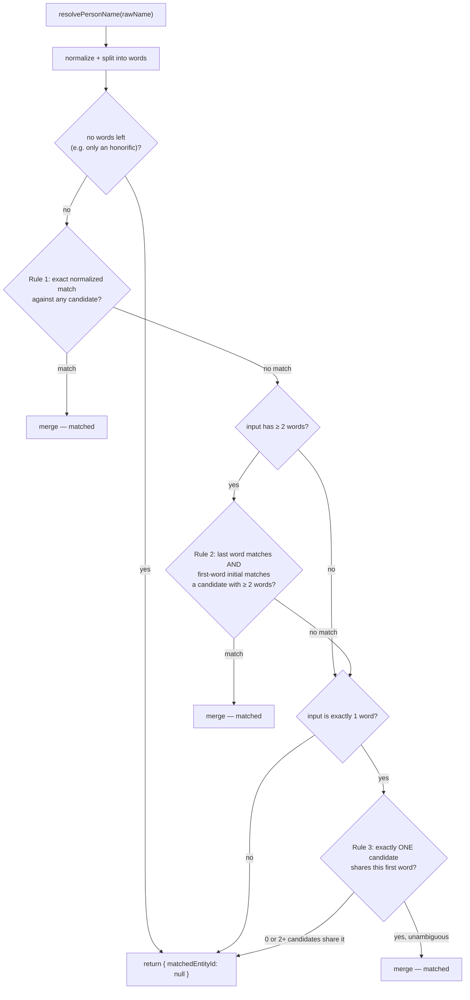

# Entity Resolution

Deterministic (no ML, no embeddings, no fuzzy string distance) duplicate merging for extracted
`PERSON` entities — "John Smith", "John", "Mr Smith", and "J. Smith" mentioned across different
documents should, where it's safe to infer, resolve to the same graph node rather than create a new
one every time. Implemented in one file, `apps/web/features/graph/services/resolution.service.ts`
(68 lines), called by the [extraction pipeline](extraction.md) before creating any new `PERSON`
entity. See [entities.md](entities.md) for the `PERSON` entity type and [graph.md](graph.md) for how
this fits the model overview.

## Why person names specifically

Person names are the one extracted type where the same real-world entity plausibly appears under
several different surface strings across documents — a first-reference full name, then a shortened
or title-prefixed reference later in the same or a different document. `COMPANY`, `PROJECT`,
`MEETING`, and `WEBSITE` mentions use a simpler rule instead — an exact, case-insensitive title match
(`findEntityByExactTitle` in `packages/database/src/repositories/graph-nodes.ts`) — because
extraction doesn't attempt to normalize those the way it does names, and there's no equivalent
"John" vs. "Mr. Smith" ambiguity for a company or project title.

## The algorithm

```ts
// resolution.service.ts
const HONORIFIC_PATTERN = /^(mr|mrs|ms|miss|dr|prof)\.?\s+/i;

function normalizeName(name: string): string {
  return name
    .replace(HONORIFIC_PATTERN, '')
    .replace(/[.,]/g, '')
    .trim()
    .toLowerCase()
    .replace(/\s+/g, ' ');
}
```

`resolvePersonName(organizationId, rawName): Promise<{ matchedEntityId: string | null }>` pulls the
full match pool up front — `listPersonCandidates(organizationId)`, every `PERSON`/`CONTACT` entity's
`Contact.name` in the org — then tries three rules, in order, first match wins:



1. **Exact normalized match** — `normalizeName(candidate) === normalizeName(input)`. Catches "John
   Smith" vs. "john smith" vs. "John  Smith" (extra whitespace), and honorific/punctuation variants
   of the same full name.
2. **Last-name + first-initial match** — only tried if the input has ≥ 2 words after normalization.
   Splits both names into words; matches if the last word is identical and the first letters of the
   first word match. Catches "J. Smith" vs. "John Smith".
3. **First-name-only match, only if unambiguous** — only tried if the input is exactly one word
   (e.g. "John") after normalization. If **exactly one** existing candidate in the org has that first
   word, it's treated as the same person. If two or more candidates share it, `resolvePersonName`
   returns `null` and the pipeline creates a new entity — an ambiguous guess is treated as a worse
   failure mode than an occasional duplicate.

If none of the three rules match, `{ matchedEntityId: null }` is returned and
[the extraction pipeline](extraction.md) creates a new `PERSON` entity via `createPersonEntity`.

## Worked example

Given an org that already has one `PERSON` entity, "John Smith":

| Input | Normalized | Rule that fires | Result |
| --- | --- | --- | --- |
| `John Smith` | `john smith` | 1 (exact) | merged |
| `J. Smith` | `j smith` (after punctuation strip) | 2 (last name `smith` + first initial `j`) | merged |
| `John` | `john` | 3 — only if "John" is the sole existing first name in the org | merged, if unambiguous |
| `Mr Smith` | `smith` (honorific stripped, one word left) | none | **new entity created** — a known gap, see below |

## The "Mr Smith" gap — confirmed, not hypothetical

A bare honorific + surname, with no first name given, is not matched by any of the three rules as
written:

- Rule 1 needs an exact match against an existing candidate's *full* normalized name — `"smith"`
  alone won't equal `"john smith"`.
- Rule 2 needs the *input* to have ≥ 2 words after normalization (`inputParts.length >= 2`) so it can
  compare a last name and a first initial — after the honorific is stripped, `"Mr Smith"` normalizes
  to the single word `"smith"`, so this rule's own gate excludes it entirely.
- Rule 3 only fires for single-word inputs, but it treats that single word as a **first** name
  candidate search (`candidateParts[0] === inputFirst`) — `"smith"` is being interpreted as if it
  were someone's first name, which essentially never matches a real first name in the candidate pool.

The result: `resolvePersonName('Mr Smith')` returns `{ matchedEntityId: null }`, and the extraction
pipeline silently creates a second, duplicate `PERSON` entity rather than merging into the existing
"John Smith". This is documented here as a real, checkable limitation of the rule set as implemented
— not a bug that was missed and left unfixed, but the expected boundary of what three simple,
explainable string rules can catch. The kind of imprecision the extraction package's own docs
describe as expected for "rule-based... no AI" matching (see [extraction.md](extraction.md)).

## Match pool

`listPersonCandidates(organizationId)` (`packages/database/src/repositories/graph-nodes.ts`) pulls
every `PERSON`/`CONTACT` entity's `Contact.name` in the organization:

```ts
export async function listPersonCandidates(organizationId: string): Promise<PersonCandidate[]> {
  const contacts = await prisma.contact.findMany({
    where: { organizationId, entity: { entityType: { in: ['PERSON', 'CONTACT'] } } },
    select: { entityId: true, name: true },
  });
  return contacts.map((contact) => ({ id: contact.entityId, name: contact.name }));
}
```

Resolution only ever compares against existing entities **within the same organization** —
multi-tenancy is preserved by construction, since the match pool query itself is `organizationId`-
scoped; there is no code path where a person from one org could resolve against a candidate from
another. `CONTACT`-type entities are included in the pool even though — per
[entities.md](entities.md#types-with-no-current-creation-path) — nothing in the current codebase
actually creates a `CONTACT`-type entity; the pool query is future-proofed for a manual-contact
feature that doesn't exist yet, without needing to change once it does.

## What's not built

No fuzzy/edit-distance matching (e.g. Levenshtein), no phonetic matching (e.g. Soundex), no
cross-organization resolution, no manual "merge these two entities" UI for a human to fix a case
resolution missed (like "Mr Smith" above) — a human reviewing and merging two entities that automatic
resolution failed to catch would be a reasonable future addition, not built here. No resolution logic
at all for any entity type other than `PERSON` — `COMPANY`/`PROJECT`/`MEETING`/`WEBSITE` dedup is
exact-title matching only, with no equivalent "resolution service." See
[extraction.md](extraction.md) for where this fits in the overall pipeline and
[relationships.md](relationships.md)'s `DUPLICATE_OF` discussion for why merging (not a linking edge)
is the chosen strategy when a match *is* found.
