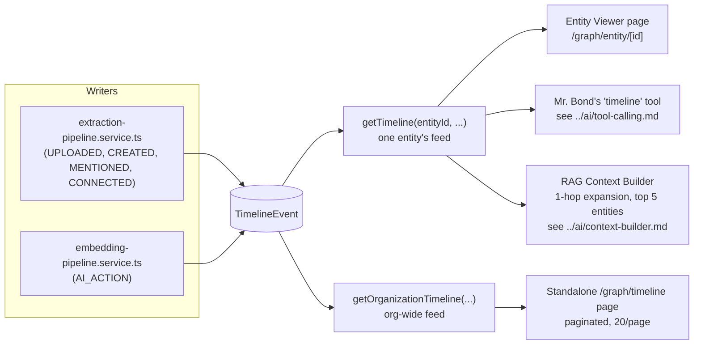

# Timeline

Every entity in the knowledge graph gets a chronological activity feed — `TimelineEvent`
(`packages/database/prisma/schema.prisma`), append-only by construction: there is no update or delete
path anywhere in the codebase, only `appendTimelineEvent`. See [graph.md](graph.md) for the model
overview, [entities.md](entities.md) for what a `TimelineEvent.entityId` points at, and
[extraction.md](extraction.md) / [relationships.md](relationships.md) for the two subsystems that
write most of these events.

## The model

```prisma
enum TimelineEventType { CREATED MODIFIED UPLOADED MENTIONED CONNECTED VIEWED AI_ACTION }

model TimelineEvent {
  id             String            @id @default(cuid())
  organizationId String
  entityId       String
  eventType      TimelineEventType
  description    String
  metadata       Json?
  createdAt      DateTime          @default(now())

  @@index([organizationId])
  @@index([entityId, createdAt])
}
```

The one repository function that writes a row, `appendTimelineEvent`
(`packages/database/src/repositories/timeline.ts`), is a plain, unconditional insert — nothing in the
repository or service layer ever calls `update` or `delete` against `TimelineEvent`. The append-only
guarantee is structural (no code path exists to violate it), not just a naming convention.

## What actually writes each event type

This table reflects the two real callers of `appendTimelineEvent` found in the codebase today —
`extraction-pipeline.service.ts` and, importantly, `embedding-pipeline.service.ts` (Phase 4) — not
just the enum's original Phase 3 design intent.

| Event type | Written when | Where |
| --- | --- | --- |
| `UPLOADED` | Once per document, at the very start of `runSmartLinkingForDocument` — the document `Entity` itself gets this event, before any extraction runs. | [`extraction.md`](extraction.md) |
| `CREATED` | An extracted entity (person, company, website, project mention, meeting mention) is created for the first time — no matching existing entity was found. | [`extraction.md`](extraction.md), the `existing ? 'MENTIONED' : 'CREATED'` branch in `resolveOrCreateMany`/`resolvePeople`/`resolveOrCreateMentions` |
| `MENTIONED` | An extracted entity resolved to an **existing** entity (a repeat mention across documents) instead of creating a new one. | Same as above |
| `CONNECTED` | A `Relationship` was actually created (not a no-op duplicate) — appended to **both** endpoints in parallel. | `createRelationshipAndTrackTimeline` in `extraction-pipeline.service.ts` — see [`extraction.md`](extraction.md) |
| `AI_ACTION` | **Now live, not reserved.** Once per document, only if at least one chunk's embedding succeeded, after the embedding pipeline finishes generating embeddings for a document's chunks. | `embedDocumentChunks` in `apps/web/features/embeddings/services/embedding-pipeline.service.ts` — see "Update to the Phase 3 design" below |
| `VIEWED` | Not written by anything. Reserved for a future "record a page view" feature; the Entity Viewer page is a plain read and never calls the timeline API to record its own view. | — |
| `MODIFIED` | Not written by anything. Reserved for a future manual-edit feature. `Entity.version` (Phase 9) is "in practice only exercised for `entityType = NOTE` rows" per its own schema comment, but no code path appends a `MODIFIED` timeline event when that happens, and `EntityVersionSnapshot`'s creation function has zero callers anywhere in `apps/web` — see [entities.md](entities.md#the-entity-model). | — |

Confirmed by a repo-wide search: `appendTimelineEvent` is called from exactly two files —
`extraction-pipeline.service.ts` and `embedding-pipeline.service.ts`. `VIEWED` and `MODIFIED` are the
only two of the seven enum values with no writer anywhere in the current codebase.

## Update to the Phase 3 design: `AI_ACTION` is no longer a placeholder

The original Phase 3 documentation for this model described `AI_ACTION` as "reserved for a future AI
phase... deliberately unused, not a placeholder bug" — accurate when Phase 3 shipped, since no AI
phase existed yet. **That is no longer the current state.** The schema's own comment on the enum now
says so directly:

> `AI_ACTION` was reserved in Phase 3 for "future AI actions" — Phase 4 is that future phase: the
> embedding pipeline appends one `AI_ACTION` event per document once its chunks are embedded.

Verified directly in `embedding-pipeline.service.ts`'s `embedDocumentChunks`:

```ts
await logAiRequest({
  organizationId, userId,
  action: 'embedding.generate_chunks',
  provider: provider.providerName(),
  metadata: { documentEntityId, chunkCount: chunks.length, succeeded },
});

if (succeeded > 0) {
  await appendTimelineEvent({
    organizationId,
    entityId: documentEntityId,
    eventType: 'AI_ACTION',
    description: `Generated ${succeeded} of ${chunks.length} embedding(s) via ${provider.providerName()}.`,
  });
}
```

So as of Phase 4, **5 of the 7** `TimelineEventType` values are actually written (`UPLOADED`,
`CREATED`, `MENTIONED`, `CONNECTED`, `AI_ACTION`) — not 4, as the original Phase 3-era doc stated.
Only `VIEWED` and `MODIFIED` remain genuinely unwritten reservations. This is a case where a
later phase filled in a gap an earlier phase's doc explicitly called out as intentionally open —
worth knowing if you're cross-referencing the phase-era `docs/timeline.md` file, which predates this
and should be read alongside this page rather than in place of it.

## Reading the timeline



Both reader functions share one helper, `queryTimeline`, in
`packages/database/src/repositories/timeline.ts` — the only difference between them is whether
`entityId` is included in the `where` clause:

- **`getTimeline(entityId, { organizationId, page, pageSize })`** — one entity's feed, newest first.
  Used by the Entity Viewer page (first page, 20 events, no pagination controls on that page —
  `getEntityDetailService` in `apps/web/features/graph/services/graph.service.ts` fetches it in
  parallel with the entity's relationships). Also the function backing Mr. Bond's `timeline` tool
  (`GET`-equivalent: `getTimelineService(organizationId, entityId, { page: 1, pageSize: 10 })`) and
  the RAG Context Builder's lazy expansion (`getTimeline(id, { page: 1, pageSize: 5 })` for the top 5
  ranked entities in a retrieval result — see [graph.md](graph.md#who-reads-the-graph)).
- **`getOrganizationTimeline({ organizationId, page, pageSize })`** — every entity's events merged
  into one org-wide feed, newest first. Backs the standalone `/graph/timeline` page, which **does**
  paginate (20 per page, via `GET /api/graph/timeline` with `entityId` omitted).

Both are permission-wrapped in `graph.service.ts` behind `requireRole(organizationId, ROLES.MEMBER)`,
and both are org-scoped in their underlying query — no cross-organization timeline read is possible.

## What's not built

No timeline event editing or deletion — append-only, matching an audit-log semantic (a timeline that
could be rewritten after the fact wouldn't be trustworthy as a record of what happened). No
real-time/streaming updates — the timeline is a plain paginated read, refreshed on navigation, not a
live feed or subscription. No per-user "mark as read" state. `VIEWED` and `MODIFIED` remain
unwritten reservations for features that don't exist yet (page-view tracking, manual entity editing).
See [graph.md](graph.md) for how the timeline fits the broader graph model and
[extraction.md](extraction.md) for the pipeline responsible for most of what's actually written to
it today.
