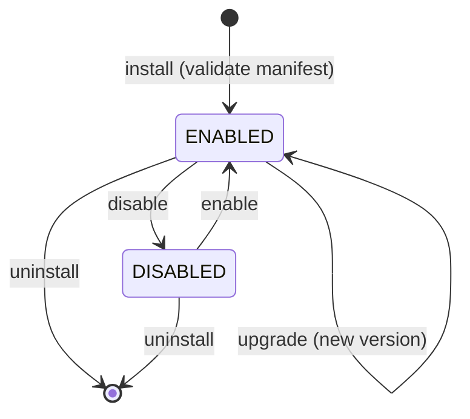

# Phase 11 — Extensibility Platform (v1.2.0)

## 1. Overview

Phase 11 turns BOND OS from a closed application into an **extensible platform**:
organizations can now read their data over a public API, react to events with
webhooks, build custom objects and forms with no code, install permission-scoped
plugins, share templates, and build against a first-class SDK — all **without
modifying core code**.

The guiding constraints were honored throughout:

- **Additive & reuse-first.** No core behavior was redesigned. The public API and
  GraphQL call the existing dashboard repositories; custom objects reuse the
  Knowledge Graph `Entity` table; automations reuse the Workflow Engine;
  webhooks, plugins, and the SDK share one event catalog.
- **Zero regressions.** The database migration is additive-only (new tables use
  plain scalar FK columns; `EntityType` gains a `CUSTOM` value). Nothing on an
  existing table changed. All four gates pass.
- **Secure by construction.** Plugins are declarative, not executable; every
  public-API path is scope-gated and hard-scoped to one organization.

Shipped as **v1.2.0** across 12 logically-scoped commits.

## 2. Architecture

### 2.1 Request paths

```mermaid
flowchart LR
  subgraph Clients
    EXT[External app / SDK]
    UI[Dashboard UI]
    WH[Webhook receiver]
  end

  EXT -->|Bearer bond_sk_| V1[/api/v1/*]
  EXT -->|Bearer bond_sk_| GQL[/api/graphql]
  UI -->|session cookie| MGMT[/api/api-keys, /api/webhooks,\n/api/custom-objects, /api/forms,\n/api/templates, /api/plugins/]

  V1 --> AUTH[apiV1Handler:\nresolve key -> rate limit -> scope]
  GQL --> AUTH
  AUTH --> REPO[(Repositories\norg-scoped)]
  MGMT --> SVC[Services\nrequireRole + org] --> REPO

  REPO --> DB[(Postgres)]
  DB -->|publishEvent| BUS[Event Bus]
  BUS --> NOTIF[Notifications]
  BUS --> EMIT[In-process emitter]
  BUS --> WHD[Webhook dispatch] -->|signed POST| WH
  BUS --> WF[Workflow dispatch]
```

### 2.2 Layering (unchanged pattern)

`Repository → Service → Route (apiHandler) → Page`. Phase 11 adds a second
authenticated entry — `apiV1Handler` — that sits beside the session-based
`apiHandler`, authenticates by API key instead of cookie, and then reuses the
**same repositories**. This is why the public API can never read more than the
first-party app: it shares the data layer and adds only scope + org filtering.

## 3. What shipped

| Capability | Backend | API | UI |
| --- | --- | --- | --- |
| API keys | `features/api-keys` | `/api/api-keys/*` | Settings → API keys |
| Public REST API | `features/api-v1` | `/api/v1/*` | Swagger `/api/v1/docs` |
| Typed events | `features/events`, shared `events.ts` | — | — |
| Webhooks | `features/webhooks` | `/api/webhooks/*` | Settings → Webhooks |
| Custom objects | `features/custom-objects` | `/api/custom-objects/*` | Developer → Objects |
| Dynamic forms | `features/forms` | `/api/forms/*` | Developer → Forms |
| Templates + import/export | `features/templates`, `features/export` | `/api/templates/*`, `/api/export` | Developer → Templates |
| SDK | `packages/sdk` | — | — |
| Plugins | `features/plugins`, shared `plugins.ts` | `/api/plugins/*` | Developer → Plugins |
| GraphQL | `features/graphql` | `/api/graphql` | — |
| Developer portal | — | — | `/developer` |

## 4. API surface

### 4.1 Public REST API (`/api/v1`)

Read endpoints for **projects, tasks, documents, customers, meetings** (list +
detail), plus **search**, **graph analytics**, **notifications**, **workflows**,
and **custom objects** (read + record create/list). Each declares a scope
(`projects:read`, `search:read`, `custom-objects:write`, …). Self-described by
`GET /api/v1/openapi.json` and an interactive Swagger UI at `/api/v1/docs`.

Guard chain (`apiV1Handler`): resolve key → per-key rate limit (Phase 10 `API`
scope) → scope check → org-scoped repository call.

### 4.2 GraphQL (`/api/graphql`, optional, read-only)

Same keys, same per-field scopes, same repositories. `POST` executes a query;
`GET` returns the SDL. Domain rows pass through a `JSON` scalar to avoid
duplicating field definitions the REST/OpenAPI layer already owns.

### 4.3 Management APIs (session, `requireRole`)

`/api/api-keys`, `/api/webhooks`, `/api/custom-objects`, `/api/forms`,
`/api/templates`, `/api/plugins` — CRUD + lifecycle, ADMIN where the operation is
org-level, MEMBER for records/submissions.

## 5. SDK overview (`@bond-os/sdk`)

Zero runtime dependencies (global `fetch` + Web Crypto → runs in Node 18+, Deno,
Bun, browsers, edge).

```ts
const bond = createClient({ apiKey, baseUrl });
await bond.projects.list({ pageSize: 50 });
await bond.customObjects.records('invoice').create({ values: { amount: 1200 } });

const router = createEventRouter();
router.on(EVENT_TYPES.TASK_COMPLETED, (e) => handle(e.payload));
const event = await parseWebhookEvent({ secret, body: rawBody, signatureHeader });
await router.dispatch(event);
```

Three pieces: a typed **client** wrapping every `/api/v1` resource + a `raw`
escape hatch; a typed **event router** (`*` / `ns.*` / exact patterns); and
isomorphic **webhook verification** (HMAC-SHA256 over `"<ts>.<body>"`).

## 6. Plugin lifecycle & isolation

Plugins are **validated declarative manifests** — never executed code.



Four security invariants enforced by `pluginManifestSchema` +
`validatePluginManifestSafety`:

1. **No permission bypass** — permissions must be real, non-super API scopes;
   the installation records only those `grantedScopes`.
2. **No cross-org access** — registry key is `<orgId>.<manifestId>`;
   installations and plugin calls are org-scoped like first-party calls.
3. **No core modification** — routes must live under `/plugins/<id>/`.
4. **No code injection** — there is no code field; behavior is delivered
   out-of-process via hosted URLs (components) and webhooks (hooks).

`resolveEnabledPluginContributions(orgId)` returns only ENABLED plugins'
contributions, each carrying its granted scopes — the single, isolated point the
UI and event system read from.

## 7. Data model (additive tables)

`ApiKey`, `WebhookSubscription`, `WebhookDelivery`, `CustomObjectDefinition`,
`CustomFieldDefinition`, `CustomRelationshipDefinition`, `FormDefinition`,
`Template`, `Plugin`, `PluginInstallation` — 10 new tables, all with plain scalar
FK columns (`organizationId`, `userId` as `String`, no `@relation`
back-references), so existing tables are untouched. Custom-object **instances**
add no table at all: they are `Entity` rows with `entityType = CUSTOM` and
`{ customObjectKey, values }` in `metadata`.

## 8. Migration notes

Migration `20260723000000_phase11_extensibility` (5 `CREATE TYPE`, 1
`ALTER TYPE … ADD VALUE 'CUSTOM'`, 10 `CREATE TABLE`).

- Applied to the production database via the Supabase Management API (raw
  Postgres ports are blocked from the build sandbox). The `ALTER TYPE ADD VALUE`
  was applied in its own statement (Postgres forbids sharing a transaction with
  usage) guarded by an idempotent `DO $$ … $$` block.
- Recorded in `_prisma_migrations` with the computed SHA-256 checksum and
  `finished_at`, so a future `prisma migrate deploy` treats it as applied.
- Verified post-apply: 10/10 tables present, `EntityType.CUSTOM` present.

Because the schema is additive, a rollback is a straight `DROP TABLE` of the ten
new tables (the enum value can remain harmlessly).

## 9. Verification

| Gate | Result |
| --- | --- |
| `prisma validate` | ✅ valid |
| `typecheck` (12 packages) | ✅ 12/12 |
| `lint` (12 packages, `--max-warnings 0`) | ✅ 12/12 |
| `build` (Next.js production) | ✅ all routes compiled, incl. 40+ new routes |
| Regressions (P0–P10) | ✅ none — additive migration + additive code |

## 10. Out of scope (deliberately not built)

Per the Phase 11 brief: payments/billing, mobile or desktop apps, autonomous AI
agents, self-modifying code, and arbitrary remote code execution. The plugin
system is declarative specifically to keep the last two impossible.

## 11. Follow-ups

- Seed a public template/plugin marketplace (cross-org discovery) — the model
  supports `isPublic` templates today; plugins are currently org-namespaced.
- Wire plugin `hooks` to auto-provision webhook subscriptions (today a plugin
  declares hooks and uses the webhook system for delivery).
- Schedule `POST /api/webhooks/process-retries` on a cron for hands-off retries.
