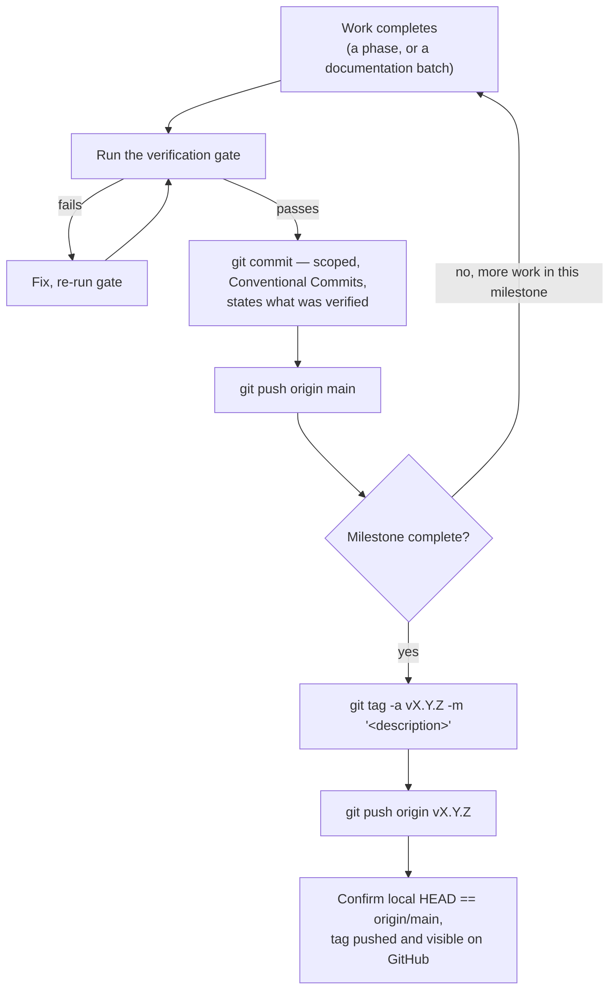

# Release Process

## Scope

The actual, real steps this repository's two completed milestones (`v0.9.0`, `v0.9.1`) and this
documentation milestone (`v1.0.0`) were each cut by — not a proposed or idealized process. There is no
release-automation tooling in this repository (no `.github/workflows`, no `semantic-release`, no
`changesets` — see [`deployment/github.md`](../deployment/github.md)); every step below is run by
hand.

## The actual process, as practiced



### 1. The verification gate — run before every commit, not just before a tag

The same four commands, in the same order, every time — this is the one piece of this process that is
completely uniform across every commit in this repository's history, milestone or not:

```bash
pnpm --filter @bond-os/database run validate   # prisma validate — schema only, no live DB required
pnpm typecheck                                  # tsc --noEmit, every workspace
pnpm lint                                       # eslint --max-warnings 0, every workspace
pnpm build                                      # every workspace, including next build
```

A commit is only made if all four pass. This project has never merged or tagged a commit with a known
failing gate — see [`checklist.md`](./checklist.md) for the fuller pre-tag checklist this expands into
at milestone boundaries specifically.

### 2. Commit — scoped, states what was verified

Per [`CONTRIBUTING.md`](../../CONTRIBUTING.md#commit-conventions): one concern per commit, a
Conventional Commits subject, and a body stating what was actually run to verify it. This project's
own real commits (`54049c9`, `87de897`) are the reference examples cited throughout
[`docs/testing/strategy.md`](../testing/strategy.md).

### 3. Push immediately — never accumulate local commits

Every commit in this repository's history was pushed to `origin/main` at or near the time it was made
— there is no long-lived local-only branch anywhere in this project's practice. This documentation
suite itself was generated under this exact rule, explicitly stated as governing: each of the 10
documentation batches was committed and pushed independently, immediately after its own verification
gate passed, rather than batched into one final push — see [`changelog.md`](./changelog.md#v100--bond-os-foundation-documentation-complete)
for the resulting one-commit-per-batch history.

### 4. Tag only at a real milestone boundary

A tag is not cut per commit — it marks the point a phase or a defined body of work (like this
documentation suite) is genuinely complete, verified, and pushed. The two real tags to date:

- `v0.9.0` — cut once Phases 0–9 were confirmed complete on the (freshly re-cloned) repository history.
- `v0.9.1` — cut once Phase 9 (Enterprise Collaboration)'s eight feature commits were complete and
  the adversarial security review (`0a70630`) had run.

Both used the same two-command sequence:

```bash
git tag -a vX.Y.Z -m "<description of what completed>"
git push origin vX.Y.Z
```

### 5. Confirm synchronization

After both the final commit and the tag push, confirm local and remote actually agree — this project's
practiced habit, repeated after every single commit in this documentation suite specifically:

```bash
git rev-parse HEAD
git rev-parse origin/main
# both must print the same hash
git ls-remote --tags origin   # confirm the tag is visible on the remote
```

## What this process deliberately does not include

Stated plainly, matching this documentation set's own convention:

- **No CI gate.** Nothing on GitHub re-runs the verification gate automatically — it is trusted
  because it was actually run locally before every commit, not because a pipeline enforces it. See
  [`deployment/github.md`](../deployment/github.md).
- **No automated version bump.** `package.json`'s `version` field is not touched by this process at
  all — see [`versioning.md`](./versioning.md#packagejson-does-not-track-the-tag-version) for the
  resulting, real mismatch.
- **No release-notes generation tool.** [`changelog.md`](./changelog.md) is hand-written from `git
  log`, not generated by `semantic-release`, `changesets`, or any similar tool — none is a dependency
  anywhere in this repository.
- **No package publishing.** No workspace package here has ever been published to npm or any other
  registry; a tag marks a milestone in this single application's own repository, not a published
  artifact's version.
- **No staging/canary deployment step.** There is no staging environment or canary rollout process in
  this repository — see [Production](../deployment/production.md) for what "deploying" actually means
  here today.

## Related documents

- [`checklist.md`](./checklist.md) — the fuller pre-tag verification list this process's step 1
  expands into at a milestone boundary.
- [`versioning.md`](./versioning.md) — what the resulting tag numbers mean (and the `package.json`
  mismatch).
- [`changelog.md`](./changelog.md) — the record this process has produced so far.
- [`CONTRIBUTING.md`](../../CONTRIBUTING.md#commit-conventions) — the commit-message convention step 2
  follows.
- [`deployment/github.md`](../deployment/github.md) — the confirmed absence of CI this whole process
  runs without.
