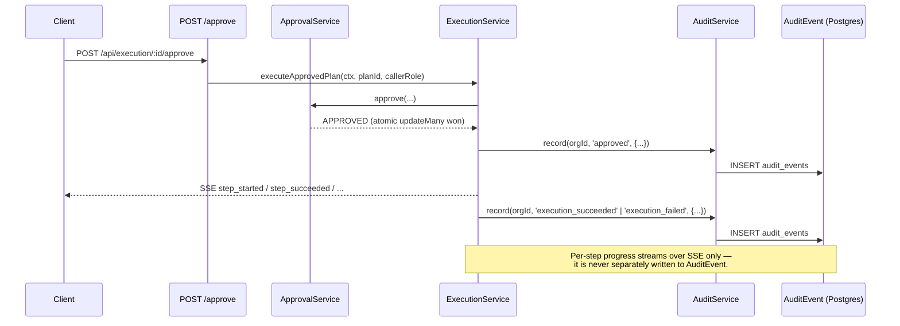

# Audit Trail

## Scope

`AuditEvent` is BOND OS's immutable, append-only compliance trail for the **write lifecycle** —
the sequence of state transitions a plan goes through from approval to execution to (if needed)
rollback. It is written by exactly one service, `AuditService`
(`apps/web/features/audit/services/audit.service.ts`), which wraps exactly one repository function,
`appendAuditEvent` (`packages/database/src/repositories/audit-events.ts:22-24`). There is no update
or delete function for `AuditEvent` anywhere in the codebase — a grep for callers of the
`AuditEvent` Prisma delegate outside `audit-events.ts` turns up nothing. This is deliberate, not an
oversight: the repository file's own header comment states the model "mirrors `TimelineEvent`'s
'never edited or deleted' convention," and the same sentence is repeated on the model's schema
comment.

This document covers what `AuditEvent` is, what actually writes to it today, what reads it back,
and — because this is production documentation and not marketing copy — where the schema's own
illustrative comment promises more than the running code currently delivers.

## The schema: `AuditEvent`

```prisma
/// Immutable, append-only — mirrors `TimelineEvent`'s "never edited or
/// deleted" convention. Distinct from Phase 4's `AiAuditLog` (documented
/// fire-and-forget observability for read/generation calls); this is the
/// compliance trail for write-lifecycle state transitions (plan_created,
/// approved, rejected, step_started, step_succeeded, step_failed,
/// rolled_back, ...).
model AuditEvent {
  id             String   @id @default(cuid())
  organizationId String
  executionId    String?
  userId         String?
  action         String
  metadata       Json?
  createdAt      DateTime @default(now())

  organization Organization   @relation(fields: [organizationId], references: [id], onDelete: Cascade)
  execution    ToolExecution? @relation(fields: [executionId], references: [id], onDelete: SetNull)
  user         User?          @relation("AuditEventUser", fields: [userId], references: [id], onDelete: SetNull)

  @@index([organizationId])
  @@index([executionId])
  @@map("audit_events")
}
```

Every row carries `organizationId` directly (indexed, and part of every query — see
[Organization Isolation](./organization-isolation.md)), an optional `executionId` linking it to a
`ToolExecution`, an optional `userId` for the acting caller (`SetNull` on user deletion — the row
survives the user), a free-form `action` string, and an open `metadata` JSON blob. `action` is a
plain `String`, not an enum — new action names can be introduced by any future caller without a
migration, the same "additive by convention, not by constraint" choice this codebase makes for
`Event.eventType` (see [Event Bus](../workflows/event-bus.md)).

### `AuditEvent` vs `AiAuditLog` — two different logs, two different jobs

The schema comment is explicit that `AuditEvent` is **not** the only audit-shaped table in BOND
OS. `AiAuditLog` (`packages/database/src/repositories/ai-audit-log.ts`) is a separate model
documented as "fire-and-forget observability for read/generation calls" — it records AI usage and
cost (tokens, provider, latency) for chat/agent turns. `AuditEvent` is narrower and stricter in
purpose: it exists specifically for the [Approval Engine](./approvals.md)'s write-lifecycle
transitions — a compliance trail an organization can point to and say "this is exactly what
changed, when, and who authorized it" — not a usage/cost log. Do not conflate the two when reading
either the schema or the UI: a request that only ever *reads* data (a chat answer, a search) never
produces an `AuditEvent`; only a request that reaches the [Tool Execution Framework](../workflows/workflow-engine.md)'s
write path can.

## `AuditService`

```ts
export class AuditService {
  async record(
    organizationId: string,
    action: string,
    options: { executionId?: string | null; userId?: string | null; metadata?: Record<string, unknown> } = {},
  ): Promise<void> {
    await appendAuditEvent({
      organizationId,
      action,
      executionId: options.executionId,
      userId: options.userId,
      metadata: options.metadata as Prisma.InputJsonValue | undefined,
    });
  }

  async listForExecution(
    organizationId: string,
    executionId: string,
    query: { page: number; pageSize: number },
  ): Promise<PaginatedResult<AuditEventItem>> {
    await requireRole(organizationId, ROLES.MEMBER);
    return listAuditEvents({ organizationId, executionId, ...query });
  }
}
```

Two methods, no more (`apps/web/features/audit/services/audit.service.ts:10-33`):

- **`record`** performs no authorization check of its own. It is never exposed as a public write
  endpoint — the only callers are trusted, internal service code (`ExecutionService`,
  `RollbackService`, both covered below) that has already established its own authorization
  before calling it. There is no `POST /api/.../audit` route anywhere in the codebase; a client
  cannot write an `AuditEvent` directly.
- **`listForExecution`** calls `requireRole(organizationId, ROLES.MEMBER)` itself — the
  authorization check lives in the *service*, not the calling route. The route that exposes this
  (below) performs no role check of its own; it relies on the service to gate the read.

## What actually gets audited today

The schema comment above lists an illustrative action vocabulary — `plan_created`, `approved`,
`rejected`, `step_started`, `step_succeeded`, `step_failed`, `rolled_back`. **That list describes
the model's intended shape, not what the running code writes.** A repo-wide search for every
`.record(` call against `AuditService`/`RollbackService` turns up exactly five call sites and five
distinct `action` strings:

| `action` | Call site | When |
|---|---|---|
| `'approved'` | `execution.service.ts:53` | Immediately after `ApprovalService.approve()` succeeds — line 52, the *first statement* of `executeApprovedPlan`, is that approval call; line 53 records it. |
| `'execution_succeeded'` | `execution.service.ts:157` | Every step in the plan finished without a hard failure. |
| `'execution_failed'` | `execution.service.ts:138-142` | A step failed and the plan could not complete; `metadata: { stepKey, error }`. |
| `'step_bookkeeping_write_failed'` | `execution.service.ts:242-249` | A best-effort log for when the *post-execute bookkeeping write* to `ExecutionStep` itself fails — deliberately **not** treated as a step failure, since re-entering a retry after a real write already happened risks a duplicate write. |
| `'rolled_back'` | `rollback.service.ts:58-62` | After `RollbackService.rollbackSteps` finishes (success or partial failure); `metadata: { succeeded: allOk, details }`. |

Concretely, this means:

- **There is no `plan_created` audit event.** A plan being built and an `ApprovalRequest` being
  created (see [Approval Engine](./approvals.md)) produces no `AuditEvent` — only the moment a
  human actually approves it does.
- **There is no `rejected` audit event.** `POST /api/execution/[id]/reject` calls
  `ApprovalService.reject`, which never calls `AuditService.record` — declining a plan leaves no
  row in this table at all (it is, of course, still visible as the `ApprovalRequest.status`
  transition to `REJECTED`).
- **There is no per-step `step_started`/`step_succeeded`/`step_failed` audit event.** Per-step
  progress exists only as `ExecutionStreamEvent`s sent over the `/approve` route's SSE stream (see
  [Approval Engine](./approvals.md)) and as `ExecutionStep.status` updates in the database — neither
  is mirrored into `AuditEvent`.

A technical reader should describe BOND OS's audit trail by these five actually-implemented
actions, not by the model comment's broader illustrative list. This is a real, verifiable gap
between the schema's stated intent and the shipped behavior — not a hypothetical one — and it is
worth knowing before relying on `AuditEvent` as a complete record of every state transition a plan
goes through. What it *does* reliably capture is the three moments that matter most for
"who authorized this write and what happened to it": the approval itself, the terminal
success/failure of execution, and any rollback.

## Read surface

### `GET /api/execution/[id]/audit`

```ts
export const GET = apiHandler<Context>(async (request, { params }) => {
  const { id } = await params;
  const query = parseQueryParams(request, executionAuditQuerySchema);
  const organizationId = await requireActiveOrganizationId();

  const execution = await getToolExecutionByPlanId(id, organizationId);
  if (!execution) {
    return apiSuccess({ items: [], page: query.page, pageSize: query.pageSize, total: 0, totalPages: 1 });
  }

  const result = await getAuditService().listForExecution(organizationId, execution.id, query);
  return apiSuccess(result);
});
```

(`apps/web/app/api/execution/[id]/audit/route.ts:16-28`)

The route resolves `organizationId` via `requireActiveOrganizationId()` — **not** `requireRole` —
because the role check lives inside `AuditService.listForExecution` itself, as noted above. The `id`
path parameter is the `ExecutionPlan`'s own id; the route looks up the `ToolExecution` by that
`planId`, scoped to the caller's org. If a plan has been proposed and approved but execution hasn't
started (or was proposed and never approved), there is no `ToolExecution` row yet — the route
returns an empty paginated result, not a 404. The route's own comment states this explicitly: "that's
a normal empty state, not a 404."

This endpoint is **not** rate-limited — no `withRateLimit` wrapper appears in the file, unlike
`POST /api/execution/[id]/approve` (see [Rate Limiting](./threat-model.md#rate-limiting)).

## How the audit trail is org-scoped

`listAuditEvents` (`packages/database/src/repositories/audit-events.ts:42-57`) builds its `where`
clause as `{ organizationId, ...(executionId && { executionId }) }` — every read is filtered by the
caller's own organization first, `executionId` second. There is no code path that lists
`AuditEvent` rows across organizations; see [Organization Isolation](./organization-isolation.md)
for the broader convention this follows.

## Relationship to the rest of the write pipeline

`AuditEvent` is the durable record; it is not the live-progress channel. The two exist side by
side for different consumers:



For the mechanism that makes the initial `'approved'` write safe under concurrent double-clicks or
retries, see [Approval Engine](./approvals.md). For the full step-by-step execution flow this
sequence is drawn from, see `execution.service.ts` and [Workflow Engine](../workflows/workflow-engine.md).

## What's deliberately not built

- **No audit event for plan proposal or rejection.** See "What actually gets audited today" above.
- **No per-step audit rows.** Step-level detail lives in `ExecutionStep`/SSE only.
- **No audit-log export, retention policy, or archival job.** Rows accumulate indefinitely; there
  is no background job that prunes or archives `AuditEvent` rows (consistent with this codebase's
  broader "no background worker exists anywhere" posture — see
  [Agents Overview](../agents/overview.md) and [Scheduler](../workflows/scheduler.md) for the same
  point made about goals and workflow scheduling).
- **No tamper-evidence beyond database-level immutability.** There is no hash-chaining, digital
  signature, or write-once storage backing `AuditEvent` — "immutable" here means "no code path
  updates or deletes rows," not a cryptographically enforced guarantee. A party with direct
  database access could still alter history; the application layer simply never does.

## Related documents

- [Approval Engine](./approvals.md) — the atomic transition that the `'approved'` audit event
  records the outcome of.
- [Threat Model](./threat-model.md) — how the audit trail fits into BOND OS's broader security
  posture.
- [Organization Isolation](./organization-isolation.md) — the tenancy pattern `AuditEvent` follows.
- [Workflow Engine](../workflows/workflow-engine.md) — `failRun`'s own rollback path, which is what
  triggers the `'rolled_back'` audit event for a workflow-originated plan.
