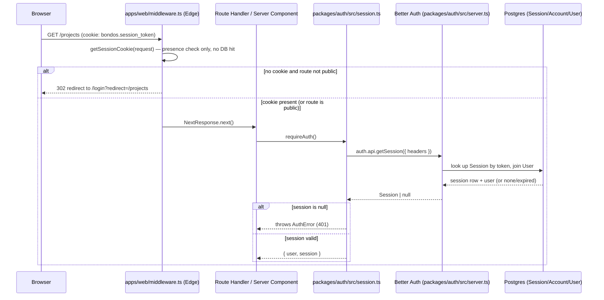

# Authentication

How BOND OS establishes and verifies "who is making this request." Covers the Better Auth server
instance, the database-backed session model, the `requireAuth()`/`getServerSession()` primitives every
protected route and Server Component relies on, the client/server import split, password reset, and
the Edge middleware's role as a fast pre-check in front of the authoritative server-side check.

This document is about the *mechanism* of authentication (identity, sessions, cookies). For "does this
authenticated user have permission to do X," see [Authorization](./authorization.md) and
[Permissions](./permissions.md). For how a request's org is resolved and scoped once the user is
identified, see [Organization Isolation](./organization-isolation.md).

## Table of contents

- [Where authentication lives](#where-authentication-lives)
- [The Better Auth server instance](#the-better-auth-server-instance)
- [The session model](#the-session-model)
- [`getServerSession()` and `requireAuth()`](#getserversession-and-requireauth)
- [Two layers of gating: Edge middleware vs. the authoritative check](#two-layers-of-gating-edge-middleware-vs-the-authoritative-check)
- [Client vs. server: two entry points, one package](#client-vs-server-two-entry-points-one-package)
- [Password reset](#password-reset)
- [Cookies](#cookies)
- [Environment / secrets](#environment--secrets)
- [What is not built](#what-is-not-built)
- [See also](#see-also)



## Where authentication lives

All authentication code is in `packages/auth/src/`, a small, dedicated package:

| File | Role |
|---|---|
| `packages/auth/src/server.ts` | The single Better Auth server instance (`auth`), configured once. |
| `packages/auth/src/session.ts` | `'server-only'`. `getServerSession()`, `requireAuth()`, `requireRole()` — the authorization primitives layered on top of Better Auth. |
| `packages/auth/src/client.ts` | Better Auth's React client, safe for Client Components. |
| `packages/auth/src/email.ts` | Password-reset email delivery, provider-abstracted. |
| `packages/auth/src/index.ts` | `'server-only'` re-export barrel of `email.ts` + `server.ts` + `session.ts`. |

`packages/auth/src/server.ts:22-58` constructs `betterAuth({...})` exactly once, module-level — it is
the only `betterAuth()` call anywhere in the repo. It is mounted as the actual HTTP surface by
`apps/web/app/api/auth/[...all]/route.ts` (Better Auth's own catch-all handler), and consumed
server-side through `session.ts`'s wrappers, never called directly by feature code.

## The Better Auth server instance

`packages/auth/src/server.ts:22-58`:

```ts
export const auth = betterAuth({
  database: prismaAdapter(prisma, { provider: 'postgresql' }),
  secret: env.BETTER_AUTH_SECRET,
  baseURL: env.APP_URL,
  trustedOrigins: [env.APP_URL],
  emailAndPassword: {
    enabled: true,
    requireEmailVerification: false,
    minPasswordLength: 8,
    maxPasswordLength: 128,
    resetPasswordTokenExpiresIn: 60 * 60, // 1 hour
    sendResetPassword: async ({ user, url }) => { /* ... */ },
  },
  session: {
    expiresIn: ONE_WEEK_SECONDS,
    updateAge: ONE_DAY_SECONDS,
    cookieCache: { enabled: true, maxAge: 60 * 5 },
  },
  advanced: {
    useSecureCookies: env.NODE_ENV === 'production',
    cookiePrefix: 'bondos',
  },
});
```

Key choices, each traceable to the config above:

- **Database adapter, not JWT.** `prismaAdapter(prisma, { provider: 'postgresql' })` means sessions
  are rows in a real `Session` table (`packages/database/prisma/schema.prisma:?` — see the schema
  excerpt below), not self-contained signed tokens. Revoking a session is a DB delete, not a key
  rotation; there is no session state to reason about outside Postgres.
- **Email + password only.** `emailAndPassword.enabled: true` is the only credential strategy
  configured. No `socialProviders` block exists in `server.ts` — there is no Google/GitHub/etc. OAuth
  login wired up (see [What is not built](#what-is-not-built)).
- **`requireEmailVerification: false`.** A new account is usable immediately after sign-up; there is
  no "verify your email before you can do anything" gate. This is a deliberate simplification for the
  current phase, not an oversight — but it does mean the `emailVerified` column on `User`
  (`schema.prisma:202`, `Boolean @default(false)`) is not currently enforced anywhere as a gate.
  BOND OS trusts an email address the moment an account signs up with it.
- **Password policy**: 8–128 characters (`minPasswordLength`/`maxPasswordLength`). No complexity
  requirements (uppercase/digit/symbol) are enforced by this config — Better Auth's own length check
  is the only server-side rule.
- **`secret: env.BETTER_AUTH_SECRET`** — validated at process start by
  `packages/shared/src/env.ts:16-33`: must resolve (from `BETTER_AUTH_SECRET`, falling back to the
  legacy `NEXTAUTH_SECRET`) to a string of at least 16 characters, or the app fails to boot. This is
  the key Better Auth uses to sign/verify its own internal tokens (not a JWT for the *session* itself,
  which is DB-backed, but still load-bearing for Better Auth's internal CSRF/state tokens).
- **`baseURL: env.APP_URL`, `trustedOrigins: [env.APP_URL]`** — Better Auth's own CSRF defense for its
  `/api/auth/*` endpoints (sign-in, sign-up, password reset, etc.). This is a *separate* mechanism from
  `assertSameOrigin()` (see [Authorization](./authorization.md#csrf-assertsameorigin)), which protects
  BOND OS's own mutating routes, not Better Auth's.

## The session model

Sessions are conventional Better Auth / Prisma rows, not stateless tokens
(`packages/database/prisma/schema.prisma:253-264`):

```prisma
model Session {
  id        String   @id @default(cuid())
  userId    String
  token     String   @unique
  expiresAt DateTime
  ipAddress String?
  userAgent String?
  createdAt DateTime @default(now())
  updatedAt DateTime @updatedAt

  user User @relation(fields: [userId], references: [id], onDelete: Cascade)
}
```

- **`expiresIn: ONE_WEEK_SECONDS`** (`server.ts:13,47`) — a session is valid for 7 days from creation.
- **`updateAge: ONE_DAY_SECONDS`** (`server.ts:14,48`) — Better Auth refreshes (extends) the session's
  expiry at most once per day of activity, rather than on every single request.
- **`cookieCache: { enabled: true, maxAge: 60 * 5 }`** (`server.ts:49-52`) — a 5-minute in-memory/cookie
  cache of the session payload so `auth.api.getSession()` doesn't have to hit Postgres on *every*
  request. This is purely a performance optimization layered on top of the DB-backed model above — it
  does not change where the session's source of truth lives, and a session revoked mid-window (e.g. a
  row deleted directly) can still be honored for up to 5 minutes by a stale cache entry.
- Deleting a `User` row cascades to `Session` (`onDelete: Cascade`) — there is no orphaned-session
  state to clean up separately.
- `Account` (`schema.prisma`) holds the credential itself for the `email-password` provider (a hashed
  `password` column) — one `Account` row per (`providerId`, `accountId`) pair, following Better Auth's
  standard multi-provider-ready shape even though only one provider is configured today.

## `getServerSession()` and `requireAuth()`

`packages/auth/src/session.ts:1` starts with `import 'server-only'` — this file (and everything it
re-exports through `index.ts`) is uncompilable from a Client Component; Next.js fails the build if a
Client Component tries to import it.

```ts
// packages/auth/src/session.ts:12-23
export async function getServerSession(): Promise<Session> {
  return auth.api.getSession({ headers: await headers() });
}

export async function requireAuth() {
  const session = await getServerSession();
  if (!session) {
    throw new AuthError();
  }
  return session;
}
```

- **`getServerSession()`** never throws — it returns `null` on no session, so it's "safe to call
  anywhere on the server" (the function's own doc comment). Used where the caller wants to render
  differently for signed-in vs. signed-out without forcing a redirect/error.
- **`requireAuth()`** is the actual gate: it calls `getServerSession()` and throws `AuthError` (401,
  `packages/shared/src/errors.ts:27-31`) if there's no session, otherwise returns `{ user, session }`.
  Every mutating API route in the codebase that isn't gated by `requireRole` directly still resolves
  its caller through `requireAuth()` — either directly, or transitively via
  `requireActiveOrganizationId()` (see [Organization Isolation](./organization-isolation.md)), which
  calls `requireAuth()` as its first line (`apps/web/lib/organization.ts:43`).
- **`requireRole(organizationId, minimumRole)`** builds on `requireAuth()` to add an authorization
  check — that belongs to [Authorization](./authorization.md), not this document, since it answers "is
  this user allowed," not "who is this user."

Because `requireAuth()` throws a typed `AppError`, and every route is wrapped in
`apiHandler()` (`apps/web/lib/api-handler.ts:14-24`), an unauthenticated request to any protected
route always comes back as a clean `401 { success: false, error: { code: 'AUTH_ERROR', ... } }` JSON
body — callers never see a raw exception or an HTML error page from an API route.

## Two layers of gating: Edge middleware vs. the authoritative check

`apps/web/middleware.ts` runs at the Edge, in front of every non-`/api` route:

```ts
// apps/web/middleware.ts:12-29
export function middleware(request: NextRequest) {
  const { pathname } = request.nextUrl;
  const hasSession = Boolean(getSessionCookie(request));
  const isPublicRoute = PUBLIC_ROUTES.some((route) => pathname.startsWith(route));

  if (!hasSession && !isPublicRoute && pathname !== ROUTES.home) {
    const loginUrl = new URL(ROUTES.login, request.url);
    loginUrl.searchParams.set('redirect', pathname);
    return NextResponse.redirect(loginUrl);
  }
  if (hasSession && isPublicRoute) {
    return NextResponse.redirect(new URL(ROUTES.dashboard, request.url));
  }
  return NextResponse.next();
}

export const config = {
  matcher: ['/((?!_next/static|_next/image|favicon.ico|api).*)'],
};
```

This is explicitly **not** the authoritative check — the function's own doc comment (`middleware.ts:5-11`)
calls it "a fast, Edge-safe check of the session cookie's presence (no DB hit)," whose only job is to
avoid flashing a protected page before redirecting to `/login`. `getSessionCookie()` (from
`better-auth/cookies`) only checks that a correctly-named, correctly-shaped cookie exists — it cannot
verify the cookie's session is still valid in the database (expired, revoked, or forged would all pass
this check). `PUBLIC_ROUTES` (`packages/shared/src/constants.ts:78`) is exactly
`[login, signup, forgotPassword, resetPassword]`.

The `matcher` (`middleware.ts:32`) explicitly excludes `/api/*` — **API routes never get an HTML
redirect from middleware**; they rely entirely on `requireAuth()`/`requireRole()` throwing `AuthError`
inside `apiHandler()`, which becomes a `401` JSON response. Every Route Handler still calls
`requireAuth()` (directly or via `requireActiveOrganizationId()`/`requireRole()`) as the real,
DB-verified check — middleware's redirect is a UX nicety, not a security boundary.

## Client vs. server: two entry points, one package

```ts
// packages/auth/src/client.ts:1-12
import { createAuthClient } from 'better-auth/react';

export const authClient = createAuthClient({
  baseURL: process.env.NEXT_PUBLIC_APP_URL ?? 'http://localhost:3000',
});

export const { signIn, signUp, signOut, useSession, requestPasswordReset, resetPassword } = authClient;
```

`@bond-os/auth/client` has no `server-only` dependency and is the *only* auth surface Client
Components may import — `@bond-os/auth` (the `index.ts` barrel) is `'server-only'`, so importing it
from a Client Component is a build-time error, not a runtime one. This hard split means there is no
code path by which server-only session logic (or, transitively, `getMembership`/Prisma access) can end
up in the client bundle.

`baseURL` reads `NEXT_PUBLIC_APP_URL`, which Next.js inlines into the client bundle at build time —
distinct from the server-side `APP_URL` env var `server.ts` uses, even though both should point at the
same origin in a correctly configured deployment.

## Password reset

`packages/auth/src/email.ts` — provider-abstracted email delivery, used only for the password-reset
flow in the current codebase:

- **`EmailProvider` interface**: one method, `send(input: SendEmailInput): Promise<void>`
  (`email.ts:11-13`).
- **`ConsoleEmailProvider`** (`email.ts:16-22`) — the dev default. Logs the email via
  `logger.child('email')` instead of sending it, so the full password-reset flow works in local
  development with zero external configuration.
- **`SmtpEmailProvider`** (`email.ts:25-52`) — lazily imports `nodemailer`, builds a transport from
  `SMTP_HOST`/`SMTP_PORT`/`SMTP_USER`/`SMTP_PASS`, sends via `transport.sendMail`.
- **`getEmailProvider()`** (`email.ts:61-66`) — a memoized singleton that picks `SmtpEmailProvider` iff
  `getEnv().SMTP_HOST` is set, else falls back to `ConsoleEmailProvider`. This is the same
  "always have a working default, upgrade automatically once configured" pattern used elsewhere in the
  codebase (e.g. the rate limiter, the cache).
- **`renderResetPasswordEmail(resetUrl)`** (`email.ts:68-84`) returns plain-text + inline-styled HTML
  with a reset link, explicitly stating "This link expires in 1 hour" — matching
  `resetPasswordTokenExpiresIn: 60 * 60` in `server.ts:34`.
- The flow itself (`server.ts:35-44`) is Better Auth's own `sendResetPassword` hook: Better Auth
  generates and validates the reset token; BOND OS only supplies how the resulting `url` gets emailed.

## Cookies

- **`cookiePrefix: 'bondos'`** (`server.ts:56`) — every Better Auth cookie is prefixed `bondos.*`
  (e.g. the session token cookie), distinguishing it from BOND OS's own non-auth cookies like
  `bondos_active_org` (see [Organization Isolation](./organization-isolation.md)), which is set by a
  Server Action, not by Better Auth.
- **`useSecureCookies: env.NODE_ENV === 'production'`** (`server.ts:55`) — the `Secure` cookie flag is
  set only in production, so local HTTP development isn't broken by a cookie the browser refuses to
  send over plain HTTP.
- `httpOnly` and `sameSite` are Better Auth's own internal defaults (`httpOnly: true`, `sameSite: lax`
  for its session cookie) — this document did not re-derive them from Better Auth's own source, but
  they are consistent with `useSecureCookies` being the only cookie-security knob BOND OS's own config
  exposes, and with the CSRF posture described in
  [Authorization § CSRF](./authorization.md#csrf-assertsameorigin) (a `lax` session cookie plus
  explicit `Origin`-header checking on mutating routes is a coherent, standard combination).

## Environment / secrets

Relevant variables, all validated fail-fast by `packages/shared/src/env.ts` at process start (an
invalid or missing required value stops the app from booting rather than failing at first use):

| Variable | Validation | Purpose |
|---|---|---|
| `BETTER_AUTH_SECRET` (or legacy `NEXTAUTH_SECRET`) | required, ≥16 chars | Better Auth's signing secret. |
| `APP_URL` | valid URL, defaults to `http://localhost:3000` | Session `baseURL`/`trustedOrigins`, and the origin `assertSameOrigin()` compares against. |
| `NEXT_PUBLIC_APP_URL` | inlined client-side | `authClient`'s `baseURL`. |
| `SMTP_HOST`/`SMTP_PORT`/`SMTP_USER`/`SMTP_PASS` | all optional | Activates `SmtpEmailProvider` once `SMTP_HOST` is set; otherwise password-reset emails just log. |
| `EMAIL_FROM` | defaults to `BOND OS <noreply@bondos.dev>` | `From` header for SMTP-sent email. |
| `DATABASE_URL` | required, valid Postgres URL | Where `Session`/`Account`/`User` rows actually live. |

See [Deployment › Environment](../deployment/environment.md) for the full variable inventory and
[Security › Secrets](./secrets.md) for how these are meant to be provisioned/rotated in production.

## What is not built

Stated plainly, per direct reading of `server.ts` and the surrounding package — these are not present:

- **No social/OAuth login.** No `socialProviders` block exists; email+password is the only credential
  strategy.
- **No email-verification gate.** `requireEmailVerification: false` — an account is fully usable the
  moment it's created, and nothing else in the codebase checks `User.emailVerified` as a precondition
  for any action.
- **No multi-factor authentication.** No MFA/2FA plugin or configuration is present.
- **No password complexity rules beyond length** (8–128 characters) — no uppercase/digit/symbol
  requirement, no breached-password check.
- **No account lockout / brute-force throttling specific to sign-in.** The generic `withRateLimit`
  helper (`packages/shared/src/rate-limit.ts`) is applied to a handful of mutating API routes (see
  [Authorization](./authorization.md)), but `/api/auth/*` (Better Auth's own sign-in endpoint) is not
  one of the routes wrapped in it anywhere this document's source reading covered — sign-in attempts
  are not observed to be independently rate-limited by BOND OS's own code.
- **No session-revocation UI** ("log out all other devices," active-session list) was found in the
  routes/services read for this pass.

## See also

- [Authorization](./authorization.md) — `requireRole`, `ROLE_HIERARCHY`, and the two-layer
  authorization pattern built on top of the session this document describes.
- [Permissions](./permissions.md) — the full OWNER/ADMIN/MEMBER capability matrix.
- [Organization Isolation](./organization-isolation.md) — how the authenticated user's active
  organization is resolved and enforced.
- [Secrets](./secrets.md) — provisioning `BETTER_AUTH_SECRET` and friends in production.
- [Threat Model](./threat-model.md) — how session/cookie handling fits the broader threat model.
- [`../api/authentication.md`](../api/authentication.md) — the `/api/auth/*` endpoint reference itself.
- [`../database/schema.md`](../database/schema.md) — full `User`/`Session`/`Account`/`Membership`
  schema reference.
- [`../deployment/environment.md`](../deployment/environment.md) — the complete environment variable
  inventory.
- [`../development/setup.md`](../development/setup.md) — local dev setup, including why password reset
  needs no SMTP configuration to work out of the box.
