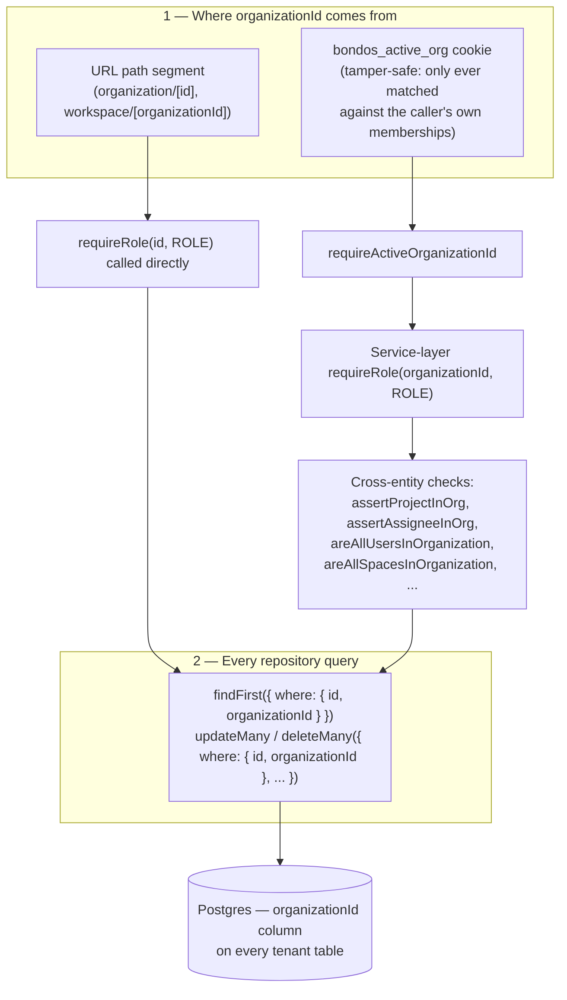

# Organization Isolation

BOND OS is multi-tenant at the organization level: every piece of data belongs to exactly one
`Organization`, and no request may read or write another organization's data. There is no database-level
tenancy enforcement (no Postgres row-level security) — isolation is a discipline enforced entirely in
application code, repeated identically across every repository and service written from Phase 0 through
Phase 9. This document is that discipline: how the "active" organization is resolved, how every query is
scoped to it, how references *between* entities are re-validated instead of trusted, and how Phase 9
closed the one place a cross-tenant reference could previously have snuck in.

For "who is this user" see [Authentication](./authentication.md); for "is this user allowed to do X"
see [Authorization](./authorization.md) and [Permissions](./permissions.md) — this document is
specifically about "and is it scoped to the *right organization*."

## Table of contents

- [Two ways `organizationId` enters a request](#two-ways-organizationid-enters-a-request)
- [The `bondos_active_org` cookie](#the-bondos_active_org-cookie)
- [The repository-level pattern](#the-repository-level-pattern)
- [Concrete examples across every phase](#concrete-examples-across-every-phase)
- [Cross-entity ("soft FK") validation](#cross-entity-soft-fk-validation)
- [Phase 9: closing the polymorphic-reference gap](#phase-9-closing-the-polymorphic-reference-gap)
- [Team Spaces: curation, not isolation](#team-spaces-curation-not-isolation)
- [What isolation does not cover](#what-isolation-does-not-cover)
- [See also](#see-also)



## Two ways `organizationId` enters a request

As covered in [Authorization § Two request-gating patterns](./authorization.md#two-request-gating-patterns),
there are exactly two places a request's `organizationId` comes from, and isolation depends on knowing
which one applies:

1. **From the URL path** — `apps/web/app/api/organization/[id]/**` and
   `apps/web/app/api/workspace/[organizationId]/**`. The id is whatever the caller put in the URL;
   isolation here is entirely `requireRole(id, ROLE)`'s job (`packages/auth/src/session.ts:30-39`) —
   it throws `ForbiddenError` unless the caller actually holds a `Membership` row for *that specific*
   id. A caller cannot view or modify an organization they don't belong to simply by changing the URL
   segment, because every read in these routes is additionally scoped by that same id
   (e.g. `organization/[id]/route.ts:14`: `prisma.organization.findUnique({ where: { id } })` is only
   ever reached after `requireRole(id, ROLES.MEMBER)` has already confirmed membership).
2. **From the `bondos_active_org` cookie** — every other feature (Company Data, Library, Connectors,
   Sync, Knowledge Graph, AI/Retrieval, Bond, Agents, Workflows, Execution/Approvals, Comments,
   Notifications, Activity, Presence, Spaces). `requireActiveOrganizationId()`
   (`apps/web/lib/organization.ts:42-49`) resolves the id server-side; the client never supplies an
   `organizationId` for these routes at all — not in the URL, not in the body.

## The `bondos_active_org` cookie

`apps/web/lib/organization.ts:6` (the cookie name) and `:20-31` (the resolver):

```ts
export const ACTIVE_ORG_COOKIE = 'bondos_active_org';

export async function getActiveOrganization(userId: string): Promise<ActiveOrganizationResult> {
  const organizations = await getOrganizationsForUser(userId);
  if (organizations.length === 0) {
    return { organizations, active: null };
  }

  const cookieStore = await cookies();
  const activeId = cookieStore.get(ACTIVE_ORG_COOKIE)?.value;
  const active = organizations.find((org) => org.id === activeId) ?? organizations[0]!;

  return { organizations, active };
}
```

This is the single most important line for isolation in the whole codebase:
**`organizations.find((org) => org.id === activeId)`** — the cookie's value is never trusted directly;
it is only ever used to *select among* the organizations `getOrganizationsForUser(userId)` already
proves the caller belongs to. If the cookie is missing, stale, or has been hand-edited by the client to
name an organization the user isn't a member of, `.find()` simply returns `undefined` and the code
falls back to `organizations[0]!` (the user's first membership, ordered by `createdAt`) — it does
**not** throw, and it never returns an organization outside that list. The function's own doc comment
states this explicitly: *"Tampering with the cookie is harmless — the value is only ever matched
against the user's own memberships, never trusted directly."*

`requireActiveOrganizationId()` (`apps/web/lib/organization.ts:42-49`) wraps this for Route Handlers:

```ts
export async function requireActiveOrganizationId(): Promise<string> {
  const session = await requireAuth();
  const { active } = await getActiveOrganization(session.user.id);
  if (!active) {
    throw new AuthError('No active organization. Create or join an organization first.');
  }
  return active.id;
}
```

It calls `requireAuth()` first (so every caller of this function is automatically authenticated — see
[Authentication](./authentication.md)), then throws `AuthError` if the user belongs to zero
organizations (there's no such thing as an "active org" for someone with no memberships). This is why
routes like `GET /api/activity`, `GET /api/spaces/[id]`, and `POST /api/comments/[id]/unresolve` are
fully authenticated even though they never call `requireAuth()` directly — `requireActiveOrganizationId()`
does it for them, as a side effect of resolving the org.

**The cookie is not the source of authorization**, only of *which* org a request is scoped to among
the ones the caller already belongs to. `requireActiveOrganizationId()` returns an id; every route that
calls it still separately calls `requireRole(organizationId, ROLE)` (directly, or inside the service it
delegates to) to check the caller's *role* in that org — resolving the active org and checking
permission in it are two different steps, covered by two different functions. Per
[Architecture](../architecture/overview.md), the cookie is set by a Server Action
(`setActiveOrganization`), and a client-side Zustand store mirrors it only for instant UI feedback —
that store is never itself read by any server-side authorization or isolation check.

## The repository-level pattern

Every tenant-scoped Prisma model carries a direct `organizationId` column (not a join through some
other table), and every repository function that reads, updates, or deletes a specific row follows the
same shape, repeated near-verbatim across dozens of files from Phase 0 through Phase 9:

```ts
// Read a specific row: always findFirst with BOTH id and organizationId in the where clause
export async function getXById(id: string, organizationId: string) {
  return prisma.x.findFirst({ where: { id, organizationId } });
}

// Update: updateMany, not update — see below
export async function updateX(id: string, organizationId: string, data: UpdateXData) {
  const result = await prisma.x.updateMany({ where: { id, organizationId }, data });
  return result.count > 0;
}

// Delete: deleteMany, not delete
export async function deleteX(id: string, organizationId: string): Promise<boolean> {
  const result = await prisma.x.deleteMany({ where: { id, organizationId } });
  return result.count > 0;
}
```

**Why `updateMany`/`deleteMany` instead of Prisma's `update`/`delete`**: Prisma's unique-record
`update`/`delete` can only take a `where` built from a model's own unique fields (e.g. `{ id }`) — it
cannot combine a unique `id` with a non-unique `organizationId` filter in the same `where`. A bare
`prisma.x.update({ where: { id } })` would therefore **silently ignore tenancy entirely**: given a
row's raw `id`, it would update it regardless of which organization owns it. Using `updateMany`/
`deleteMany` with `{ id, organizationId }` together means a cross-tenant `id` (a real row that belongs
to a *different* org) matches zero rows and the operation is a no-op — the calling code then checks
`result.count` (or the repository's own boolean return) and raises `NotFoundError`/`ConflictError`
rather than silently succeeding against nothing. This exact reasoning is written out, nearly verbatim,
as a comment in at least four separate repository files
(`packages/database/src/repositories/projects.ts:190-199`, `tasks.ts`, `customers.ts`, `documents.ts`)
and summarized in [Data Layer](../database/schema.md) — it is a deliberate, repeated convention, not
something four different people happened to reinvent independently.

Where a row's mutation touches a junction table (project members, task assignees, etc.), the junction
replacement only runs **after** the scoped `updateMany` has already confirmed it matched a row — so a
cross-tenant `id` can't sneak a junction-table write through even though the primary field update was a
no-op. See `projects.ts:200-250` for the fullest example, including the Phase 9 optimistic-locking
(`expectedVersion`)/`EntityVersionSnapshot` logic layered on top of the same guard.

## Concrete examples across every phase

Verified directly, not inferred from naming conventions:

| Phase / area | Repository | Pattern confirmed at |
|---|---|---|
| P0/P1 — Projects | `packages/database/src/repositories/projects.ts` | `getProjectById` (108-111, `findFirst`), `updateProject` (200-250, transactional `findFirst` + version-guarded `updateMany`), `deleteProject` (252-254, `deleteMany`) |
| P0/P1 — Tasks | `packages/database/src/repositories/tasks.ts` | `getTaskById`, `updateTask` (`tx.task.updateMany({ where: { id, organizationId }, ... })`), `deleteTask` (`deleteMany`) |
| P0/P1 — Customers | `packages/database/src/repositories/customers.ts` | Identical shape |
| P0/P1 — Documents | `packages/database/src/repositories/documents.ts` | Identical shape, plus the same `expectedVersion`/`EntityVersionSnapshot` guard as Projects |
| P2 — Knowledge Graph entities/relationships | `packages/database/src/repositories/entities.ts` | `deleteEntityRelationship` (44-46), `deleteEntity` (49-52) — both `deleteMany({ where: { id, organizationId } })` |
| P2 — Knowledge Documents | `packages/database/src/repositories/knowledge-documents.ts` | Same shape (per [Library](../api/company-data.md)) |
| P6 — Execution Plans | `packages/database/src/repositories/execution-plans.ts` | `getExecutionPlanById(id, organizationId)` — `findFirst({ where: { id, organizationId } })` |
| P6 — Approval Requests | `packages/database/src/repositories/approval-requests.ts` | `transitionApprovalRequest`'s guard is `updateMany({ where: { id, organizationId, status: 'PENDING', expiresAt: { gt: now } }, ... })` — org-scoping is fused into the *same* atomic conditional update that provides single-use/replay protection (see [Workflows › Approvals](../workflows/approvals.md)) |
| P8 — Workflow Runs | `packages/database/src/repositories/workflow-runs.ts` | `getWorkflowRunById` (`findFirst`), `updateWorkflowRunStatus` (`updateMany`) |
| P9 — Comments | `packages/database/src/repositories/comments.ts` | `getCommentById`/`updateCommentContent`/`deleteComment` — same shape, plus the polymorphic-entity handling below |
| P9 — Team Spaces | `packages/database/src/repositories/spaces.ts` | `getSpaceById`, `updateSpace`/`deleteSpace` — same shape |

Every one of the ~15 files above independently arrives at `findFirst({ id, organizationId })` for reads
and `updateMany`/`deleteMany({ id, organizationId })` for writes — this is the load-bearing,
universal isolation primitive of the codebase. A technical reviewer auditing for tenancy bugs should
look for exactly one anti-pattern: a bare `prisma.x.update({ where: { id } })` or
`prisma.x.delete({ where: { id } })` with no `organizationId` anywhere in the call — none was found in
any repository file read for this and the accompanying API-inventory passes.

## Cross-entity ("soft FK") validation

Scoping a row to its own organization isn't sufficient once that row can *reference* another row by id
— an owner, an assignee, a project, a customer, a tag. Prisma foreign keys enforce referential
integrity (the row exists) but not tenancy (the row belongs to *this* org) unless the FK's target table
is itself always queried org-scoped, which isn't guaranteed at the schema level for a caller-supplied
id. BOND OS closes this with small, repeated service-layer helper functions — 15 of them, found by
grepping every `assert*InOrg`-shaped function across `apps/web/features`:

| Function | File | Checks | On failure |
|---|---|---|---|
| `assertAssigneesInOrg` | `projects/services/project.service.ts:44` | Every `memberIds` entry (+ `ownerId`) is a member of the org | `ValidationError` |
| `assertAssigneeInOrg` | `tasks/services/task.service.ts:55` | A single `assigneeId` | `ValidationError` |
| `assertProjectInOrg` | `tasks/services/task.service.ts:63` | `projectId` belongs to the org | `NotFoundError` |
| `assertProjectInOrg` | `meetings/services/meeting.service.ts:52` | Same check, **different error type** (`ValidationError`, not `NotFoundError`) — a real, minor inconsistency between two structurally identical checks in different files | `ValidationError` |
| `assertAttendeesInOrg` | `meetings/services/meeting.service.ts:45` | Every `attendeeIds` entry | `ValidationError` |
| `assertProjectInOrg` / `assertMeetingInOrg` | `documents/services/document.service.ts:45,50` | Optional `projectId`/`meetingId` | — |
| `assertProjectsInOrg` | `customers/services/customer.service.ts:44` | Every `projectIds` entry (customer-to-project links) | `ValidationError` |
| `assertCustomerInOrg` / `assertProjectInOrg` | `emails/services/email.service.ts:27,32` | Required `customerId`, optional `projectId` | `NotFoundError` / — |
| `assertFolderInOrg` | `library/services/library.service.ts:71` | `folderId` | — |
| `assertTagsInOrg` | `library/services/library.service.ts:77` | Every `tagIds` entry — its own comment explains this exists specifically so a caller can't attach another org's tag id and have it later exposed via `GET` | — |
| `areAllUsersInOrganization` | `packages/database/src/repositories/shared.ts:39-48` | The general-purpose primitive most of the above delegate to: `prisma.membership.count({ where: { organizationId, userId: { in: uniqueIds } } })` compared against the input length. An empty array is vacuously valid. | Caller decides |
| `areAllSpacesInOrganization` | `packages/database/src/repositories/shared.ts:51-57` | Same shape, for `@space`/`@team` mention targets | Caller decides |

Every one of these runs **inside the service layer**, after `requireRole` has already confirmed the
*caller's* membership and role, but **before** the repository write — so a `MEMBER` in good standing
still cannot wire a Task to a Project from a different organization, name an assignee who isn't in
their org, or mention a `@space` that belongs to someone else's tenant, even though nothing at the
schema level would stop the raw Prisma write from succeeding.

## Phase 9: closing the polymorphic-reference gap

Comments introduce a genuinely different shape of reference than anything in P0–P8: `Comment.entityType`
+ `Comment.entityId` (`schema.prisma:2055-2081`) can point at a `PROJECT`, `TASK`, `MEETING`,
`DOCUMENT`, `CUSTOMER`, or `GRAPH_NODE` — **one polymorphic pair of columns standing in for six
different foreign keys**, deliberately with no hard FK at the schema level (the same "soft reference"
precedent as `Embedding.sourceType`/`sourceId`). A hard FK can't span six different target tables at
once, so without an application-level check, nothing would stop a comment from being created with
`entityType: 'PROJECT', entityId: '<some id from a different organization entirely>'` — a dangling,
cross-tenant reference that would silently "work" at the database layer (the insert would succeed; only
a later join/lookup against the wrong org would reveal the row was never really reachable, or worse,
leak metadata about a foreign org's row existing at all).

`apps/web/features/comments/services/comment.service.ts:57-77` closes this with a dispatch function
that re-resolves the target through the *owning* feature's own org-scoped lookup, for whichever
`entityType` was given:

```ts
async function assertEntityExists(organizationId: string, entityType: CommentableEntityType, entityId: string) {
  const exists = await (async () => {
    switch (entityType) {
      case 'PROJECT':  return (await getProjectById(entityId, organizationId)) !== null;
      case 'TASK':     return (await getTaskById(entityId, organizationId)) !== null;
      case 'MEETING':  return (await getMeetingById(entityId, organizationId)) !== null;
      case 'DOCUMENT': return (await getDocumentById(entityId, organizationId)) !== null;
      case 'CUSTOMER': return (await getCustomerById(entityId, organizationId)) !== null;
      case 'GRAPH_NODE': return (await getEntityNode(entityId, organizationId)) !== null;
      default: return false;
    }
  })();
  if (!exists) throw new NotFoundError(`${entityType.toLowerCase().replace('_', ' ')} not found.`);
}
```

This is the app-level substitute for a foreign key the schema deliberately doesn't have — it reuses
each entity type's *own* already-org-scoped `getXById(id, organizationId)` function (the same functions
their own dedicated CRUD routes use), so isolation logic isn't duplicated, only re-invoked. Called from
`createCommentService` (`comment.service.ts:90-92`) before a `Comment` row is ever written, and also
when a *reply* is created (its `parentCommentId` must resolve to a comment whose own `entityType`/
`entityId` match the reply's target — `comment.service.ts:94-100` — preventing a reply from being
silently reparented onto an unrelated entity).

The same file closes the analogous gap for **mention targets**, which are equally polymorphic
(`Mention.mentionedType`: `USER` | `SPACE` | `AGENT`):

```ts
// comment.service.ts:107-120
if (userMentionIds.length > 0 && !(await areAllUsersInOrganization(userMentionIds, organizationId))) {
  throw new ValidationError('You can only mention members of your organization.');
}
if (spaceMentionIds.length > 0 && !(await areAllSpacesInOrganization(spaceMentionIds, organizationId))) {
  throw new ValidationError('You can only mention spaces in your organization.');
}
if (agentMentions.length > 0) {
  const registry = await getAgentRegistryService();
  for (const agentMention of agentMentions) {
    if (!registry.get(agentMention.targetId)) {
      throw new ValidationError(`Unknown agent: ${agentMention.targetId}`);
    }
  }
}
```

`@user` mentions are checked against `areAllUsersInOrganization` (the same primitive
owner/assignee/attendee fields use); `@space` mentions against `areAllSpacesInOrganization`; `@agent`
mentions against the (organization-independent, globally-registered) Agent Registry, since agents
aren't tenant-scoped rows at all. **A comment with an unresolvable or cross-tenant mention target is
rejected outright (`ValidationError`) before the comment is ever persisted** — mentions can't be
silently dropped or silently created dangling; the whole create fails.

Between `assertEntityExists` (the commented-on target) and the mention-target checks above, Phase 9
comments have **no path to a cross-tenant dangling reference** anywhere in their create flow — every
id a `Comment` or its `Mention` rows can carry is re-validated against the caller's own `organizationId`
before the write, using the same `findFirst`/`count`-based primitives every other phase already
established, applied to a genuinely new (polymorphic) shape of reference.

## Team Spaces: curation, not isolation

Team Spaces (`Space`, plus four link tables: `SpaceProject`, `SpaceKnowledgeDocument`, `SpaceWorkflow`,
`SpaceAgent`) deserve a specific note here because they are the one place "belongs to a Space" could be
mistaken for a tenancy or visibility boundary — it is neither.

- The four link tables are **soft references** (`schema.prisma:2208-2258`): `@unique([spaceId,
  targetId])`, cascading only on `Space` delete, with **no `@relation`/FK on the target-id side at
  all** — the same precedent as `ExecutionStep.tool` ("resolved at runtime, re-validated by the service
  layer"). Linking a Project/Knowledge Document/Workflow/Agent into a Space still goes through the
  owning feature's own org-scoped existence check first (`getProjectById(projectId, organizationId)`,
  etc., inside `apps/web/features/spaces/services/space.service.ts`'s link functions) — so a Space
  cannot link in a resource from a different organization; the isolation guarantee is intact.
- What Spaces do **not** provide is content *visibility* restriction. `isSpaceMember`
  (`packages/database/src/repositories/spaces.ts:156-159`) is exported but never called anywhere in
  `space.service.ts` — confirmed by direct reading of every exported function in that file. Every read
  (`listSpacesService`, `getSpaceService`) is gated purely on **organization role**
  (`requireRole(organizationId, ROLES.MEMBER)`), identical to every other org-scoped read in the
  codebase. A non-member of a Space can still see (and, per every linked feature's own service, directly
  fetch) any Project/Document/Workflow/Agent linked into a Space they never joined — linking something
  into a Space changes nothing about that resource's own read gate.
- Because the target-id side has no FK, deleting a Project/Knowledge Document/Workflow elsewhere in the
  app does **not** cascade-clean its `SpaceProject`/etc. link row — a link can point at an id that no
  longer resolves. This is an accepted, by-design gap in referential cleanliness, not an isolation gap:
  every *read* of a linked id still goes back through the owning feature's own org-scoped `getXById`
  (per the repository's own doc comment: this repository only ever returns raw ids for linked content,
  resolving them into display data is left to the owning feature), so a stale link can at worst produce
  a "not found" when resolved, never a cross-tenant leak.

Full detail on Spaces' management-permission tier (creator-or-ADMIN) is in
[Permissions § Team Spaces](./permissions.md#13-collaboration--comments-mentions-notifications-activity-presence-team-spaces)
and [Authorization § Beyond role](./authorization.md#beyond-role-resource-level-ownership-authorization).

## What isolation does not cover

Stated plainly:

- **No database-level tenancy enforcement.** There is no Postgres row-level security (RLS) policy
  anywhere in the schema or migrations. Every guarantee in this document is enforced by application
  code (`requireRole` + org-scoped `where` clauses) — a bug in a repository function that forgot the
  `organizationId` filter would not be caught by the database itself. The consistent repetition of the
  `findFirst`/`updateMany`/`deleteMany` pattern across every repository (see above) is the actual
  mitigation for this; there is no independent, defense-in-depth layer beneath it.
- **Rate limiting is IP-keyed, not organization-keyed** (`packages/shared/src/rate-limit.ts` — see
  [Authorization](./authorization.md) and [Threat Model](./threat-model.md)). This isn't a tenancy leak
  (no data crosses organizations), but it means the request budget for e.g. `POST /api/presence` is
  shared across every organization's users behind the same NAT/corporate egress IP, not partitioned per
  tenant.
- **The Activity Feed and Audit Trail are org-scoped but have no actor/user filter** — `Event` has no
  `userId` column at all (every `publishEvent()` call records *what* happened, never *who* did it), so
  while activity is correctly isolated *to* an organization, it cannot be further filtered *within* it
  by actor. See [Audit](./audit.md).
- **Presence and the generic realtime channel (`GET /api/collaboration/stream`) are correctly
  org-scoped in their Cache keys** (`presence:org:${organizationId}:page:${page}`,
  `notifications:user:${userId}`, `activity:org:${organizationId}`, `dashboard:org:${organizationId}`)
  — the client only ever supplies a channel `type` (+ `page` where required), never a raw key, so
  cross-org/cross-user channel-key steering is structurally impossible (`apps/web/app/api/collaboration/stream/route.ts:43-81`).
  This is a correctly-isolated subsystem, noted here only because it's the one place isolation is
  enforced via a cache-key convention rather than a Prisma `where` clause.

## See also

- [Authorization](./authorization.md) — `requireRole`, the two request-gating patterns, and
  resource-level checks that run alongside the isolation checks in this document.
- [Permissions](./permissions.md) — the full role matrix, including which actions the cross-entity
  validators in this document guard.
- [Authentication](./authentication.md) — session resolution feeding `requireActiveOrganizationId()`.
- [Audit](./audit.md) — the org-scoped, actor-less activity/audit trail.
- [Threat Model](./threat-model.md) — cross-tenant access as an explicit threat category.
- [`../database/schema.md`](../database/schema.md), [`../database/erd.md`](../database/erd.md) — every
  model's `organizationId` column and cascade behavior.
- [`../knowledge/graph.md`](../knowledge/graph.md) — the Knowledge Graph's `Entity`/`EntityRelationship`
  isolation, following the identical pattern established in Phase 1/2.
- [`../api/collaboration.md`](../api/collaboration.md) — Comments, Mentions, and Team Spaces
  endpoint-level reference, including the Phase 9 validators described above.
- [`../workflows/approvals.md`](../workflows/approvals.md) — `transitionApprovalRequest`'s fused
  org-scoping + single-use guard.
