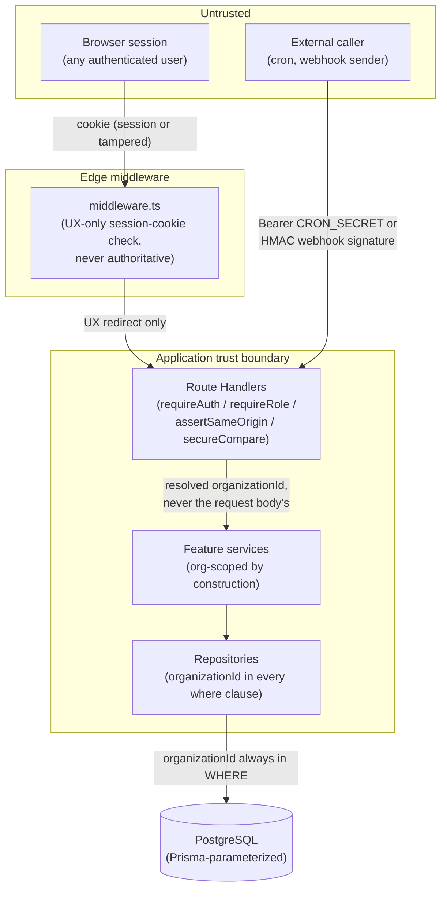

# Threat Model

## Scope and method

This document enumerates the threats BOND OS's security controls are designed against, states what
actually mitigates each one (with the exact code, not a description of intent), and — as plainly as
the rest of this documentation set — says where a threat is only partially mitigated or not
mitigated at all. Every mitigation cited here was confirmed by reading the actual source; nothing
below is inferred from naming conventions or aspirational comments.

BOND OS is a multi-tenant, session-authenticated Next.js application. Its most consequential asset
is not any single piece of data but the **write boundary**: the guarantee that no organization's
data can be read by another organization, and that no write to any organization's data happens
without passing through the [Approval Engine](./approvals.md). Most of this document is organized
around defending that boundary from different angles.

## Trust boundaries



The one boundary every other control in this document assumes: **`organizationId` is always
resolved server-side** (from the session via `requireActiveOrganizationId()`/`requireRole()`, or
from a webhook/cron caller's own verified identity), **never taken from a client-supplied request
body or query parameter.** Every threat in the "cross-tenant" category below is really a check for
whether that assumption held in a specific code path.

## Cross-tenant data access

**Threat:** Organization A's authenticated user reads or writes Organization B's data — by
guessing/enumerating an id, by a stale/tampered cookie, or by a route that forgot to scope a query.

### Mitigation: `organizationId` in every query, `updateMany`/`deleteMany` for mutations

Every mutating or lookup query in the repository layer includes `organizationId` in the same
`where` clause as the row's own `id`. Mutations use `updateMany`/`deleteMany`, never a bare
`update`/`delete` keyed only on `id` — Prisma's unique-`update`/`delete` cannot combine a unique
`id` with a non-unique `organizationId` filter, so a bare `update({ where: { id } })` would
silently ignore tenancy and let a caller mutate a row it merely knows the id of. This reasoning is
stated identically across multiple repository files (`projects.ts`, `tasks.ts`, `customers.ts`,
`documents.ts`) and summarized in [Data Layer](../database/schema.md). Representative examples,
each independently confirmed by direct reading:

- `packages/database/src/repositories/projects.ts` — `getProjectById(id, organizationId)` is a
  `findFirst({ where: { id, organizationId } })`; `deleteProject` is `deleteMany({ where: { id,
  organizationId } })`.
- `packages/database/src/repositories/tasks.ts`, `customers.ts`, `documents.ts` — identical shape.
- `packages/database/src/repositories/entities.ts` — the Knowledge Graph layer follows the same
  pattern: `deleteEntity(id, organizationId)` → `deleteMany({ where: { id, organizationId } })`.
- `packages/database/src/repositories/workflow-runs.ts`, `approval-requests.ts`,
  `execution-plans.ts` — the [Tool Execution Framework](../workflows/workflow-engine.md) and
  [Workflow Engine](../workflows/workflow-engine.md) follow it too.

This pattern is universal across the data layer, not incidental to a few files — every Knowledge
Graph entity, every write-lifecycle model, and every workflow model carries a direct
`organizationId` column and is queried through it.

### Mitigation: raw SQL is parameterized, not string-concatenated

Two subsystems bypass the Prisma Client for functionality Prisma has no first-class support for —
PostgreSQL full-text search (`packages/database/src/repositories/search.ts`, no Prisma-managed
`tsvector` type) and pgvector similarity search
(`packages/database/src/repositories/embeddings.ts`, `vector` is an `Unsupported("vector(1536)")`
Prisma field). Both use `prisma.$queryRaw`/`$executeRaw` **tagged templates**, which Prisma
auto-parameterizes for every interpolated value — the file's own comment states this directly:
"Prisma auto-parameterizes interpolated values, so this is safe against SQL injection despite being
raw SQL." Every such query still carries `organizationId` in its `WHERE` clause
(`embeddings.ts:51`'s `$executeRaw` is representative: `... WHERE id = ${row.id} AND
"organizationId" = ${organizationId}`). There is no string-concatenated SQL anywhere in either
file — confirmed by reading both in full; every dynamic fragment (e.g. an optional `sourceTypes`
filter in `vectorSimilaritySearch`) is built with `Prisma.sql`/`Prisma.join`, not template-literal
string building.

### Mitigation: the active-organization cookie is advisory, never authoritative

```ts
/**
 * Resolves the caller's organizations plus which one is "active" (from the
 * `bondos_active_org` cookie, falling back to their first membership).
 * Tampering with the cookie is harmless — the value is only ever matched
 * against the user's own memberships, never trusted directly.
 */
export async function getActiveOrganization(userId: string): Promise<ActiveOrganizationResult> {
  const organizations = await getOrganizationsForUser(userId);
  if (organizations.length === 0) return { organizations, active: null };

  const cookieStore = await cookies();
  const activeId = cookieStore.get(ACTIVE_ORG_COOKIE)?.value;
  const active = organizations.find((org) => org.id === activeId) ?? organizations[0]!;

  return { organizations, active };
}
```

(`apps/web/lib/organization.ts:14-31`) — `bondos_active_org` selects *which of the caller's own
memberships* is currently active for UI purposes. Setting it to an arbitrary organization id an
attacker does not belong to has no effect: `organizations.find(...)` is scoped to
`getOrganizationsForUser(userId)` — the authenticated caller's own membership list, resolved
server-side — so a foreign org id in the cookie simply fails to match and falls back to the
caller's first real membership. The cookie can only ever *select among* organizations the session's
own user already belongs to; it cannot grant access to one it doesn't.

### Mitigation: edge middleware is UX-only, never the authorization boundary

```ts
/**
 * Route-level auth gating only — a fast, Edge-safe check of the session
 * cookie's presence (no DB hit). Route Handlers still call `requireAuth()`
 * server-side for the authoritative check; this just avoids flashing
 * protected pages before redirecting. `/api/*` is excluded via `matcher`
 * below — API routes return 401 JSON instead of an HTML redirect.
 */
export function middleware(request: NextRequest) {
  const hasSession = Boolean(getSessionCookie(request));
  ...
}
```

(`apps/web/middleware.ts:5-14`) — `getSessionCookie` only checks that *a* session cookie is
present; it never validates it against the database. The comment is explicit about why this is
safe: every Route Handler independently calls `requireAuth()`/`requireRole()` (backed by a real
`auth.api.getSession()` DB-validated lookup — see [Authentication](./authentication.md)), so a
forged or stale cookie that passes the Edge check still fails the authoritative one. Middleware
exists purely to avoid flashing a protected page before redirecting to login — it is explicitly
**not** where authorization decisions are made. `config.matcher` excludes `/api/*` entirely; API
routes never rely on middleware at all.

## Privilege escalation

**Threat:** A lower-privileged organization member (`MEMBER` or `ADMIN`) grants themselves or
another account a higher role than they're entitled to hand out.

### Mitigation: role hierarchy is a single comparison function, evaluated per-organization

```ts
export const ROLE_HIERARCHY: Record<Role, number> = { OWNER: 3, ADMIN: 2, MEMBER: 1 };
export function roleSatisfies(role: Role, required: Role): boolean {
  return ROLE_HIERARCHY[role] >= ROLE_HIERARCHY[required];
}
```

(`packages/shared/src/constants.ts`) — the single comparison function used everywhere a role check
happens: `requireRole` (`packages/auth/src/session.ts:30-39`), `ApprovalService.approve`
(see [Approval Engine](./approvals.md)), and `PermissionService.requiredRoleForTools`. Role is a
`Membership.role` field, scoped per-organization — never a global field on `User` — so a user's
role in one organization has no bearing on their role in another.

### Mitigation: explicit guards against self-promotion and last-owner removal

`apps/web/app/api/organization/[id]/members/route.ts` and `.../[userId]/route.ts` implement three
specific guards, each independently confirmed by direct reading:

- **Granting `OWNER` requires already being `OWNER`.** `POST /members`
  (`members/route.ts:49-51`) and `PATCH /members/[userId]` (`members/[userId]/route.ts:57-59`)
  both throw `ForbiddenError('Only an owner can grant ownership.')` /
  `ForbiddenError('Only an owner can modify an owner membership or grant ownership.')` when a
  non-`OWNER` caller (who has already cleared the `ADMIN` floor from `requireRole(id,
  ROLES.ADMIN)`) attempts to set `role: 'OWNER'` on any membership, or to modify a membership that
  is *already* `OWNER`.
- **The organization's last `OWNER` cannot be demoted or removed.**
  ```ts
  async function assertNotLastOwner(organizationId: string): Promise<void> {
    const ownerCount = await prisma.membership.count({ where: { organizationId, role: 'OWNER' } });
    if (ownerCount <= 1) {
      throw new ValidationError('An organization must have at least one owner.');
    }
  }
  ```
  (`members/[userId]/route.ts:30-38`) — called before demoting (`PATCH`, line 61-63) or removing
  (`DELETE`, line 90-92) an `OWNER` membership. This prevents an organization from ever being left
  with zero owners, a state nothing in the codebase could recover from without direct database
  access.
- **`DELETE /members/[userId]`** applies the identical owner-removal guard
  (`members/[userId]/route.ts:86-92`): a non-`OWNER` cannot remove an `OWNER` membership at all,
  and even an `OWNER` cannot remove the organization's last one.

All three checks were verified directly against the route files, not merely asserted by a
comment — an `ADMIN` genuinely cannot promote anyone to `OWNER` or remove the org's last `OWNER`
through any code path this session located.

### Mitigation: `ApprovalRequest.requiredRole` cannot be lowered by a client

Approving a write requires a role computed **server-side, once, at plan-build time** — never
accepted from the client on the approval call itself. See
[Approval Security](./approvals.md#requiredrole-computed-server-side-never-client-supplied) for the
full mechanism (`PermissionService.requiredRoleForTools`, `ApprovalService.approve`'s comparison
against the caller's live session-derived role).

### Mitigation: per-hop role re-check on agent delegation

Multi-agent delegation (see [Delegation](../agents/delegation.md)) re-checks
`roleSatisfies(ctx.role, descriptor.minimumRole)` on **every** delegation hop inside
`runThinkLoop`, not just the entry point — a target agent's stricter `minimumRole` cannot be
bypassed by routing through an intermediate agent with a looser one.

## Replay attacks on approvals

**Threat:** An attacker (or an accidental double-click, or a retried network request) resubmits an
approval action to approve a plan a second time, or to approve a plan after it was already
rejected/expired.

### Mitigation: atomic conditional `updateMany` — no read-then-write window

Covered in full in [Approval Security](./approvals.md), which is the authoritative document for
this specific threat. Summary: `transitionApprovalRequest` folds the "is this still approvable"
check and the write into a single, atomic `updateMany` whose `where` clause includes `status:
'PENDING'` and `expiresAt: { gt: new Date() }`. There is no separate `findFirst` + `update` pair
anywhere in this path — the shape that would let two concurrent requests, or a genuine replay,
both observe `PENDING` before either commits. A second attempt against an already-resolved
`ApprovalRequest` — whether a true replay, a double-click, or a deliberately resubmitted request —
sees `count === 0` and surfaces as `ConflictError`, never a second write and never a silent
success.

This closes the specific replay scenario a signed, reusable token would be vulnerable to: presenting
the same credential twice. Because there is no token — the authority to act comes from the caller's
live session plus the row's own database state, re-checked atomically on every attempt — "replaying
a request" and "making the request for the first time" are indistinguishable to the server except
for the row's current `status`, which the atomic transition is the sole arbiter of.

## CSRF (Cross-Site Request Forgery)

**Threat:** A malicious page in the victim's browser, on a different origin, triggers a
state-changing request against BOND OS using the victim's authenticated session cookie.

### Mitigation: `assertSameOrigin` on every session-authenticated mutating route

```ts
/**
 * Lightweight CSRF defense for our own mutating API routes (Better Auth's
 * `/api/auth/*` endpoints protect themselves via `trustedOrigins`). Verifies
 * the request's `Origin` header — set by browsers on every cross-origin and
 * same-origin fetch/form POST — matches our own app URL. This is the same
 * mitigation Next.js Server Actions use internally, and is simpler and less
 * error-prone than hand-rolled double-submit tokens while covering the same
 * threat model for a same-origin SPA with no public write API.
 */
export function assertSameOrigin(request: Request): void {
  const origin = request.headers.get('origin');
  if (!origin) {
    throw new ForbiddenError('Missing Origin header.');
  }
  const allowed = new URL(getEnv().APP_URL).origin;
  if (origin !== allowed) {
    throw new ForbiddenError('Cross-origin request rejected.');
  }
}
```

(`apps/web/lib/csrf.ts:13-26`) — a missing `Origin` header is treated as suspicious and rejected
outright, not passed through: same-origin `fetch()` calls always send `Origin` on state-changing
methods, so its absence on a mutating request is itself a signal, not a benign edge case. Confirmed
live call sites in every mutating route checked this session: `execution/plan/route.ts:16`,
`execution/[id]/approve/route.ts:59`, `execution/[id]/reject/route.ts:16`,
`organization/[id]/members/route.ts:44`, `organization/[id]/members/[userId]/route.ts:41,75`.

Two mutating routes are deliberately exempted, and this is worth naming rather than treating as an
oversight:

- **`POST /api/workflows/schedule/tick`** — no session exists to hijack; authentication is a bearer
  `CRON_SECRET`, not a cookie (see "Non-session authentication boundaries" below).
- **`POST /api/workflows/webhook/[id]`** — no session exists; authentication is an HMAC signature
  over the request body from an external caller, not a cookie.

Better Auth's own `/api/auth/*` endpoints (sign-in, sign-up, sign-out) are separately protected via
`trustedOrigins: [env.APP_URL]` (`packages/auth/src/server.ts:28`), Better Auth's own internal CSRF
defense — `assertSameOrigin` is specifically for BOND OS's *own* mutating routes layered on top of
that.

### Residual CSRF surface

`assertSameOrigin` depends on the `Origin` header being present and browser-set — a property that
holds for `fetch()`/XHR and modern form submissions but is a property of browser behavior, not a
cryptographic guarantee. There is no double-submit cookie token or per-form CSRF token anywhere in
this codebase as a second layer; the design bet, stated in the function's own comment, is that
same-origin header verification is "simpler and less error-prone... while covering the same threat
model for a same-origin SPA with no public write API." This is a reasonable, common pattern (shared
with Next.js Server Actions' own internal CSRF handling) but is worth naming as the codebase's one
and only CSRF layer, not one of several redundant ones.

## Non-session authentication boundaries

Two endpoints deliberately have **no session, no CSRF check, and no `requireAuth`**, because their
callers are not browsers:

- **`POST /api/workflows/schedule/tick`** — authenticated via `Authorization: Bearer <CRON_SECRET>`,
  compared with `secureCompare` (below). **Fails closed as `404`**, not `401`/`403`, both when
  `CRON_SECRET` is unset and when the provided secret doesn't match — the route's own comment states
  the reasoning: "an unauthenticated prober should not be able to tell this endpoint exists at
  all." See [Secrets Management](./secrets.md) and [Scheduler](../workflows/scheduler.md).
- **`POST /api/workflows/webhook/[id]`** — `id` is a non-guessable `WorkflowDefinition` cuid; real
  authentication is an HMAC-SHA256 signature over the raw request body, verified against a
  per-workflow `webhookSecret`. Fails closed as a generic `404` — never revealing *which* of
  "definition doesn't exist," "not active," "wrong trigger type," or "no secret configured" was the
  actual reason — via `getWorkflowDefinitionByIdUnscoped` (there is no session to scope the lookup
  by organization). See [Workflow Engine](../workflows/workflow-engine.md) for the full inbound
  webhook flow.

### Mitigation: constant-time secret comparison

```ts
/**
 * Constant-time string comparison for secret verification (Phase 8's tick
 * endpoint and webhook signatures) — no precedent for this exists anywhere
 * else in this codebase, so specified explicitly rather than left to a
 * plain `===` (timing side-channel) or an unguarded `timingSafeEqual`
 * (throws on length mismatch, which itself leaks length via a thrown
 * exception vs a clean `false` — checked first here to fail closed
 * uniformly regardless of length).
 */
export function secureCompare(a: string, b: string): boolean {
  const bufferA = Buffer.from(a);
  const bufferB = Buffer.from(b);
  if (bufferA.length !== bufferB.length) return false;
  return timingSafeEqual(bufferA, bufferB);
}
```

(`apps/web/features/workflows/lib/secure-compare.ts`) — used for both the cron bearer token and the
webhook HMAC signature. The length check before `timingSafeEqual` is deliberate: an unguarded
`timingSafeEqual` throws on a length mismatch, and that thrown-exception-vs-clean-`false`
distinction is itself a timing/behavioral side channel this implementation closes.

### Mitigation: webhook replay protection via a real database constraint

```prisma
@@unique([workflowDefinitionId, idempotencyKey])
```

`WorkflowWebhookDelivery`'s unique constraint enforces idempotency at the schema level — a caller
retrying the same `idempotencyKey` sees `{ status: 'duplicate' }` from an atomic unique-constraint
insert (`recordWebhookDelivery`), not a check-then-insert race. A signature alone would not have
prevented a legitimate sender's own retried delivery from double-dispatching a workflow run; this
constraint is what does.

## Injection

### SQL injection

Covered above under "Cross-tenant data access" — Prisma's tagged-template `$queryRaw`/`$executeRaw`
auto-parameterizes every interpolated value; dynamic filter fragments use `Prisma.sql`/`Prisma.join`
rather than string concatenation. No raw, unparameterized SQL string-building was found anywhere in
the codebase during this review.

### Cross-site scripting (XSS) via LLM-authored content

**Threat:** An AI-generated Mermaid diagram — content an attacker could influence via prompt
injection in ingested documents — is rendered client-side and used to smuggle executable HTML/JS
into the DOM.

**Mitigation — two independent layers**, both confirmed directly in
`apps/web/features/bond/components/mermaid-block.tsx`:

1. Mermaid's own `securityLevel: 'strict'` (the library default, explicitly never overridden to
   `'loose'`/`'antiscript'` per the file's comment) sanitizes HTML/script content at render time.
2. A `DOMPurify.sanitize(svg, { USE_PROFILES: { svg: true, svgFilters: true } })` pass on the
   rendered SVG before it is written via `containerRef.current.innerHTML = sanitizedSvg` — the
   file's own comment names this "defense-in-depth in case (1) ever regresses," and is explicit
   that the imperative `innerHTML` write "carries the exact same DOM-XSS risk profile as React's
   `dangerouslySetInnerHTML`" and that using a ref instead of that prop is not itself a safety
   mechanism.

This is a narrow, specific control for one rendering surface, not a general output-encoding audit
of the whole application — it is documented here because it is the one place this review found
LLM-influenced content deliberately reaching `innerHTML`.

### Prompt injection

Covered in full in [Prompt Injection](./prompt-injection.md) — the short version: real but narrow
mitigations exist (a system-prompt framing instruction plus mechanical neutralization of the
`<<TOOL:` marker syntax in ingested content), and the primary containment for anything a prompt
injection could induce an AI agent to attempt is the [Approval Engine](./approvals.md)'s write
gate — an injected instruction can, at most, get an agent to *propose* an action; it cannot get
that action executed without a human's approval.

## Error handling: no internal detail leaked to clients

```ts
} else {
  log.error('Unhandled error', { message: error instanceof Error ? error.message : String(error), stack: ... });
  return NextResponse.json({ error: { message: 'Something went wrong.', code: 'INTERNAL_ERROR' } }, { status: 500 });
}
```

`apps/web/lib/api-handler.ts`'s `toErrorResponse` maps every known `AppError` subclass
(`ValidationError` 422, `AuthError` 401, `ForbiddenError` 403, `NotFoundError` 404, `ConflictError`
409, `RateLimitError` 429) to its own status/code/message, and anything unrecognized becomes a
generic `500 INTERNAL_ERROR` with no stack trace or internal message reaching the client — full
detail is logged server-side only (`log.error`, including the stack trace). This prevents error
responses themselves from becoming a cross-tenant or system-internals information-disclosure
vector.

## Rate limiting

`packages/shared/src/rate-limit.ts`'s `InMemoryRateLimiter` is a fixed-window limiter backed by a
plain `Map<string, { count, resetAt }>` — **genuinely in-memory and single-instance.** There is no
Redis-backed `RateLimiter` implementation anywhere in this codebase, despite `REDIS_URL` existing
as a configured env var and `Cache` having a documented Redis swap-in path. A technical reader
should not assume rate limiting holds across multiple running instances of BOND OS — today it only
bounds abuse against a single process.

| Route | Limit | Window | Auth model |
|---|---|---|---|
| `POST /api/execution/[id]/approve` | 20 | 60s | session |
| `POST /api/bond/chat` | 20 | 60s | session |
| `POST /api/agents/chat` | 20 | 60s | session |
| `POST /api/presence` | 8 | 60s | session |
| `POST /api/workflows/schedule/tick` | 6 | 60s | bearer `CRON_SECRET` |
| `POST /api/workflows/webhook/[id]` | 30 | 60s | HMAC signature |

Notably **not** rate-limited: `POST /api/execution/plan`, `POST /api/execution/[id]/reject`, and
`GET /api/execution/[id]/audit` — confirmed by direct reads showing no `withRateLimit` wrapper in
any of the three files. `/reject` and the audit read are lower-risk (rejecting only blocks a write;
reading audit history is read-only and already role-gated), but the plan-proposal endpoint's
absence of rate limiting is worth flagging as a gap rather than assuming it was a deliberate
security decision — nothing in the codebase's comments states a rationale for excluding it
specifically.

## Session and credential handling

Covered in depth in [Authentication](./authentication.md); summarized here for threat-model
completeness. Sessions are Better Auth-issued, `httpOnly`, `sameSite: lax`, and `secure` in
production (`useSecureCookies: env.NODE_ENV === 'production'`); session lookups on the server always
go through a real, DB-backed `auth.api.getSession()` call (`requireAuth`/`requireRole` in
`packages/auth/src/session.ts`) — the Edge middleware's cookie-presence check is UX-only, as shown
above. Passwords are handled entirely by Better Auth's `emailAndPassword` config
(`minPasswordLength: 8`, `maxPasswordLength: 128`); BOND OS application code never touches a raw
password. See [Secrets Management](./secrets.md) for how `BETTER_AUTH_SECRET` itself is provisioned
and validated.

## Summary: mitigated vs. residual

| Threat | Mitigated by | Residual risk |
|---|---|---|
| Cross-tenant data access | `organizationId` in every query; `updateMany`/`deleteMany` convention; advisory-only active-org cookie | A future repository function that forgets the `organizationId` filter would reintroduce this — no automated test/lint enforces the convention |
| Privilege escalation via membership routes | Explicit owner-only/last-owner guards, verified directly in route code | None found in this review |
| Approval replay/race | Atomic conditional `updateMany` (`transitionApprovalRequest`) | None — this is the strongest-verified control in the codebase |
| CSRF | `assertSameOrigin` on every session-mutating route | Relies on browser-set `Origin` header behavior; no secondary token-based layer |
| SQL injection | Prisma parameterization (ORM and tagged-template raw queries alike) | None found |
| XSS via LLM content | Mermaid `securityLevel: 'strict'` + DOMPurify, two independent layers | Narrow in scope — audited for the one known `innerHTML` write site, not a whole-app sweep |
| Prompt injection | System-prompt framing + `<<TOOL:` marker neutralization; real containment is the approval gate | Explicitly self-described as "not a guarantee" — see [Prompt Injection](./prompt-injection.md) |
| Cron/webhook forgery | `secureCompare` constant-time comparison; fail-closed 404s; DB-level webhook idempotency constraint | `CRON_SECRET` is optional — an operator who never sets it simply loses the endpoint (fails closed), but a misconfigured/leaked secret has no rotation tooling |
| Rate-limit bypass | Fixed-window in-memory limiter on the highest-value routes | Single-instance only; three routes (`plan`, `reject`, `audit` read) have no limiter at all |
| Information disclosure via errors | Generic `500` envelope; full detail server-logged only | None found |

## Related documents

- [Approval Security](./approvals.md) — the deepest coverage of the replay/single-use guarantee.
- [Audit Trail](./audit.md) — what's recorded once a threat-relevant transition (approval,
  execution outcome, rollback) actually happens.
- [Prompt Injection](./prompt-injection.md) — the AI-specific containment strategy referenced above.
- [Secrets Management](./secrets.md) — how every secret named in this document
  (`BETTER_AUTH_SECRET`, `CRON_SECRET`, webhook `webhookSecret`) is provisioned and validated.
- [Authentication](./authentication.md) and [Authorization](./permissions.md) — the session and
  role mechanics this document treats as prerequisites.
- [Organization Isolation](./organization-isolation.md) — the tenancy pattern in full detail.
