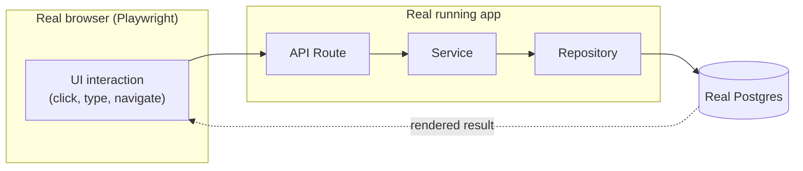

# End-to-End Testing

## Current coverage: none

There is no end-to-end test anywhere in this repository — no Playwright, Cypress, or Puppeteer
dependency in any `package.json` across the monorepo, and no `*.e2e.*`/`e2e/` directory outside
`node_modules`. See [`strategy.md`](./strategy.md) for the repository-wide confirmation this document
inherits.

## What exists today instead: the manual dev-server smoke test

The closest thing BOND OS has to an e2e check today is the same manual step
[`integration.md`](./integration.md) describes for that layer, performed at the UI level rather than
against a route directly: `pnpm dev`, then a human navigates to every page a change touches, exercises
the actual flow through the browser, and confirms the expected result — including the specific
unauthenticated-redirect check (`307` on pages) both `54049c9` and `87de897` recorded doing in their
commit bodies (see [`strategy.md`](./strategy.md#why-the-project-got-here)). This is real,
UI-through-database verification; it is just performed by a human once per change, not by a script
that can be re-run on every future change to confirm nothing regressed.

## Why this codebase specifically needs an e2e layer, not just integration tests

Most of BOND OS's highest-consequence behavior is only fully proven when the UI, the API route, and
the database all agree — a passing integration test on the API route alone doesn't confirm the button
that triggers it actually sends the right request, or that the approval UI actually reflects a
plan's real state. Two properties of this codebase make that gap unusually consequential:

1. **The propose → approve → execute journey is the single most security-relevant flow in the
   application** (see [Approval Security](../security/approvals.md) and
   [Threat Model](../security/threat-model.md)) — a UI bug that silently fails to call `/approve`, or
   one that calls it twice, would only be caught by a test that drives the real browser through the
   real button, not by testing the API route in isolation.
2. **Several surfaces are SSE-streamed** (`GET /api/collaboration/stream`, `/api/bond/chat`,
   `/api/agents/chat`, `/api/execution/[id]/approve` — see
   [Collaboration](../../docs/collaboration.md) and [Event Bus](../workflows/event-bus.md)) — a
   reconnecting, multi-event stream is exactly the kind of timing-sensitive behavior that's hard to
   assert correctly with anything short of driving a real client against a real connection.

## What e2e testing would mean in this codebase



A first e2e slice, in priority order — each journey named because it's the one place a bug in the UI,
the API, and the database could each independently cause the wrong outcome without any single-layer
test catching it:

1. **Sign up → create organization → land on dashboard.** The one flow every other journey depends on;
   if this breaks, nothing else is reachable. Exercises Better Auth's real password hashing (see
   [Authentication](../security/authentication.md)) — deliberately not mocked, since
   [Local Development](../deployment/local.md#3-database) already establishes that the seed script
   doesn't create a working login for exactly this reason.
2. **Propose → approve → execute a write.** The highest-value single journey in the app: a user (or
   Mr. Bond, via a tool call) proposes a plan, a second session (or the same user with sufficient
   role) approves it via `POST /api/execution/[id]/approve`, and the SSE stream reflects real
   progress through to a persisted result. See [Approvals](../workflows/approvals.md) and
   [Approval Security](../security/approvals.md).
3. **A workflow trigger fires and a run completes.** Publish a domain event (e.g. create a task
   matching a configured `TASK_CREATED` trigger), confirm a `WorkflowRun` starts, and confirm its
   steps execute through to `COMPLETED` — covering the Event Bus, the dispatch budget, and the
   Workflow Engine's driver together. See [Workflow Engine](../workflows/workflow-engine.md).
4. **Two sessions collaborate in real time.** Two authenticated browser contexts (Playwright supports
   this natively) on the same page: one leaves a comment with an `@mention`, the other sees a live
   notification via the SSE `notifications` channel without reloading. See
   [Collaboration](../../docs/collaboration.md).
5. **Cross-tenant access is refused end to end.** A user authenticated into Organization A attempts to
   navigate directly to an Organization B entity's URL by id — confirming the full stack (not just the
   repository layer `integration.md` already covers) actually refuses it, matching
   [Organization Isolation](../security/organization-isolation.md).
6. **Mr. Bond answers a question grounded in real data.** Seed a project/document, ask Mr. Bond a
   question that requires retrieval, and confirm the answer's citations point at the real seeded
   records — the one journey that exercises the [RAG pipeline](../ai/rag.md) end to end rather than at
   the unit or integration level.

## How to run what exists today

There is no automated e2e command. The manual equivalent:

```bash
docker compose up -d postgres redis
pnpm db:migrate
pnpm db:seed
pnpm dev
# then, by hand, in a browser: sign up, exercise the changed journey end to end,
# confirm the 307 unauthenticated-redirect behavior for at least one page.
```

## Roadmap: adding real e2e tests

**Framework: Playwright** — the tool Next.js's own App Router documentation recommends, capable of
driving multiple authenticated browser contexts concurrently (needed for journey 4 above) and
asserting on SSE traffic via its network-interception APIs (needed for journeys 2 and 3). Concretely,
adding this would mean:

- A new `apps/web/e2e/` (or root-level `e2e/`) directory with Playwright specs, plus a `test:e2e`
  script in `apps/web/package.json` and a corresponding `turbo.json` task — following the same
  per-workspace script convention `lint`/`typecheck` already use (see
  [`strategy.md`](./strategy.md#what-would-need-to-change-in-the-repo-to-support-this)).
- Running against either `pnpm dev` (fast local iteration, non-standalone build) or the compiled
  standalone build (`docker compose --profile full up -d --build`, closer to production — see
  [Docker](../deployment/docker.md)) — the latter is the more realistic target once the suite is
  stable, since the standalone build and `next dev` are genuinely different code paths.
- A dedicated seed/reset routine per test run, distinct from the developer's own `pnpm db:seed`, so
  e2e tests don't collide with or depend on a developer's local data — the same test-database
  consideration [`integration.md`](./integration.md#roadmap-adding-real-integration-tests) names for
  that layer, since e2e tests sit on top of the same real database.
- **Not proposed as a first step**: cross-browser matrix testing (Playwright supports Chromium/
  Firefox/WebKit, but a first suite gets more value from covering more journeys in one browser than
  the same few journeys across three) and visual regression testing (no design-system snapshot
  tooling exists in this codebase today).

No specific test counts or CI integration are claimed as existing — this document is entirely proposed
target state, consistent with [`strategy.md`](./strategy.md).

## Related documents

- [`strategy.md`](./strategy.md) — the overall pyramid this document's journeys are prioritized
  against.
- [`integration.md`](./integration.md) — the layer below this one; an e2e journey typically re-proves
  what an integration test already covers, plus the UI wiring on top.
- [Approvals](../workflows/approvals.md) / [Approval Security](../security/approvals.md) — the
  propose→approve→execute journey in full detail.
- [Workflow Engine](../workflows/workflow-engine.md) — the trigger→run journey in full detail.
- [Organization Isolation](../security/organization-isolation.md) — the cross-tenant-refusal journey
  in full detail.
- [Docker](../deployment/docker.md) — the standalone build this document proposes testing against.
