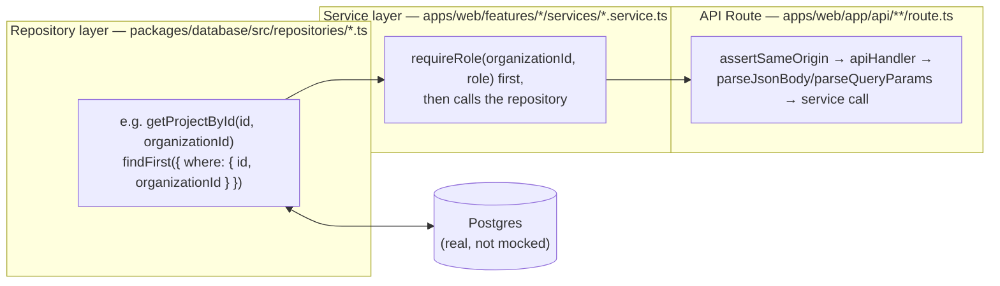

# Integration Testing

## Current coverage: none automated

There are no integration tests in this repository — no test file anywhere exercises a repository
function against a real database, a service against a real repository, or a Next.js Route Handler
end to end. See [`strategy.md`](./strategy.md) for the repository-wide confirmation (no test
framework dependency, no CI, no `test` script in any `package.json`).

## What exists today that's closest to integration verification

Two things, both manual, both already documented in [`strategy.md`](./strategy.md) and
[`CONTRIBUTING.md`](../../CONTRIBUTING.md#review-checklist):

1. **`prisma validate`** (`pnpm --filter @bond-os/database run validate`) — confirms
   `packages/database/prisma/schema.prisma` is internally consistent. This runs against the schema
   file only; it does not require or touch a live database, and it says nothing about whether a
   query written against that schema behaves correctly.
2. **The dev-server smoke test** — run `pnpm dev` (which brings up `apps/web` against whatever
   `DATABASE_URL` is configured, typically the Postgres container from `docker-compose.yml`), then
   manually call the changed API route(s) and confirm the response — including the specific
   unauthenticated-request check (`307` on pages, `401` on APIs) both `54049c9` and `87de897`
   recorded doing in their commit bodies. This is a real, repeatedly-performed integration check —
   it just isn't automated or repeatable without a human running it again.

There is no seeded, disposable test database used for this today — `pnpm dev` and
`pnpm db:seed`/`pnpm db:migrate` operate against whatever database `DATABASE_URL` in `.env` points
to, which in local development is ordinarily the same `postgres` container `docker-compose.yml`
defines for normal use, not a separate test instance.

## What integration testing would mean in this codebase

BOND OS follows one consistent request path everywhere:
**Repository → Service → API Route → UI** (see
[Request Flow](../architecture/request-flow.md) for the full architectural treatment). Most of the
codebase's actual behavior — org isolation, role checks, the approval gate, the workflow engine —
only exists at the point where a repository call, a service method, and a real database row all
interact. That makes this layer, not the unit layer, where most of BOND OS's test value would come
from.



Each of these three layers is a distinct integration-test target:

### Repository layer — against a real Postgres

This is the single highest-priority integration-test target in the codebase, and the reasoning is
drawn directly from [`security/threat-model.md`](../security/threat-model.md)'s own residual-risk
table: *"A future repository function that forgets the `organizationId` filter would reintroduce
[cross-tenant data access] — no automated test/lint enforces the convention."* That sentence is the
single strongest argument in this codebase's own documentation for why this layer needs automated
coverage before any other.

Concretely, this means tests against the real Prisma client (not a mock — the convention being
verified, `updateMany`/`deleteMany` with `organizationId` in the `where` clause rather than a bare
`update`/`delete` on `id` alone, is a property of the actual SQL Prisma generates, which a mock would
trivially "pass" without proving anything) confirming, for a representative sample of the 50
repository files in `packages/database/src/repositories/`:

- A row created under organization A is invisible to every read function when called with
  organization B's id.
- `deleteX(id, organizationId)`/`updateX(id, organizationId, ...)` called with the *correct* `id` but
  the *wrong* `organizationId` affects zero rows (proving `updateMany`/`deleteMany` semantics, not
  merely that a role check happened earlier in the call stack).
- The two raw-SQL repositories — `packages/database/src/repositories/search.ts` (Postgres full-text
  search) and `embeddings.ts` (pgvector similarity search via the `Unsupported("vector(1536)")`
  field and the `embeddings_vector_hnsw_idx` HNSW index) — remain injection-safe and org-scoped under
  real query execution, not just by reading the `Prisma.sql`/`Prisma.join` usage in the source (see
  [Threat Model → SQL injection](../security/threat-model.md#sql-injection)).

### Service layer — against a real repository, with authorization asserted

Every feature service takes `organizationId` and calls `requireRole(organizationId, role)` before
any repository call — a hard, repeatedly-enforced convention per
[`CONTRIBUTING.md`](../../CONTRIBUTING.md#repository-standards). The highest-value service-level
integration test in the entire codebase is the one [`strategy.md`](./strategy.md) and
[Approval Security](../security/approvals.md) both call out by name: **the atomic, race-safe,
single-use transition in `transitionApprovalRequest`**
(`packages/database/src/repositories/approval-requests.ts`). This is specifically a concurrency
property — "two concurrent callers approving the same plan, exactly one wins" — that cannot be
meaningfully asserted without firing genuinely concurrent requests at a real database and checking
that `result.count === 1` for exactly one of them. A unit test with a mocked repository would have to
fake the very race condition it's supposed to be proving is handled, which proves nothing.

Other service-layer behavior worth covering here, all requiring a real (or realistically stateful)
repository:

- **Composition-root / container wiring** — the lazy-singleton pattern in
  `apps/web/features/execution/lib/container.ts`,
  `apps/web/features/workflows/lib/container.ts`, and
  `apps/web/features/agents/lib/container.ts` (see
  [Design Principles](../architecture/design-principles.md)) — confirming a container resolves the
  same instance on repeated calls and that its wired dependencies are the real ones.
- **The Event Bus** — `publishEvent()`'s synchronous, in-process dispatch and the
  `getPublishEvent()` dynamic-import pattern (see [Event Bus](../workflows/event-bus.md)) —
  confirming a published event actually reaches every subscriber it should, including
  workflow-trigger subscribers.
- **`AuditService.record`/`listForExecution`** — confirming the five real audit actions
  (`approved`, `execution_succeeded`, `execution_failed`, `step_bookkeeping_write_failed`,
  `rolled_back` — see [Audit Trail](../security/audit.md)) are actually written at the points the
  audit doc claims, and nowhere else (e.g. confirming there is genuinely no `plan_created` or
  `rejected` audit row, matching the documented gap).

### API Route layer — Route Handlers as plain functions

Next.js App Router Route Handlers are exported async functions (`export const GET = apiHandler<Context>(...)`),
not a framework object that requires a running HTTP server to invoke. That means a Route Handler can,
in principle, be imported directly and called with a constructed `Request` object in a test — no
`supertest`-style server needed for most cases, though a real database and a real (or seeded)
session/cookie context are still required to exercise `requireAuth`/`requireRole` realistically. This
layer is where `apiHandler`'s error-mapping (`apps/web/lib/api-handler.ts`'s `toErrorResponse`) and
`assertSameOrigin`'s CSRF check (`apps/web/lib/csrf.ts`) are best exercised together with real
service/repository behavior — confirming, for example, that a request missing the `Origin` header is
rejected with `403` before any service code runs at all, for every mutating route that wraps it
(`execution/plan`, `execution/[id]/approve`, `execution/[id]/reject`,
`organization/[id]/members`, and others — see
[Threat Model → CSRF](../security/threat-model.md#csrf-cross-site-request-forgery) for the full,
confirmed list).

## How to run what exists today

There is no automated integration test command. The manual equivalent, step by step, as actually
performed per commit:

```bash
docker compose up -d postgres redis     # bring up the real Postgres + Redis this repo already defines
pnpm db:migrate                          # prisma migrate dev, against DATABASE_URL in .env
pnpm db:seed                             # prisma/seed.ts — populates representative data
pnpm dev                                 # starts apps/web
# then, by hand: call the changed route(s), confirm status codes and response shape,
# confirm the 307/401 unauthenticated behavior, re-check one existing caller of any
# shared primitive touched by the change.
```

See [Local Setup](../deployment/local.md) for the full environment-variable and prerequisite list
this depends on.

## Roadmap: adding real integration tests

**Framework: Vitest, against a real Postgres instance** — not an in-memory or mocked Prisma client.
`docker-compose.yml` already provisions a healthchecked `postgres:16-alpine` service with the
`pgvector` extension enabled by the existing init migration
(`packages/database/prisma/migrations/20260718000000_init/migration.sql`); the realistic addition is
a dedicated test database (a second `DATABASE_URL`, or a `docker compose --profile test` variant)
that tests can migrate, seed, exercise, and reset between runs — rather than reusing the developer's
own local database. An alternative worth naming is
[Testcontainers](https://testcontainers.com/) for spinning up an ephemeral Postgres per test run in
CI, which would remove the dependency on a developer having `docker compose up` running locally, at
the cost of slower test startup.

A first integration-test slice, in priority order (cross-referenced against
[`strategy.md`](./strategy.md#prioritization-what-to-test-first)):

1. **Organization isolation** across a representative sample of repositories
   (`projects.ts`, `tasks.ts`, `customers.ts`, `documents.ts`, `entities.ts` — the exact set named
   in [Threat Model → Cross-tenant data access](../security/threat-model.md#cross-tenant-data-access)).
2. **`transitionApprovalRequest`'s concurrency guarantee** — fire two concurrent `approve()` calls
   against the same `ApprovalRequest` and assert exactly one succeeds and the other surfaces
   `ConflictError`.
3. **`apiHandler`'s error-status mapping**, exercised against at least one route per `AppError`
   subclass, plus the generic-500-on-unknown-error fallback.
4. **`assertSameOrigin`** — a missing/mismatched `Origin` header rejected before the wrapped handler
   ever runs, for a sample of mutating routes.
5. **The Event Bus → workflow trigger path** — publishing a domain event and confirming a matching
   `WorkflowDefinition` trigger actually starts a `WorkflowRun`.

No specific test counts, coverage percentages, or CI integration are claimed as existing — this
section is entirely proposed target state, consistent with [`strategy.md`](./strategy.md).

## Related documents

- [`strategy.md`](./strategy.md) — the overall pyramid and prioritization this document expands on.
- [`unit.md`](./unit.md) — the pure-function layer excluded from this document's scope.
- [`e2e.md`](./e2e.md) — the layer above this one, covering full UI + API + database journeys.
- [Request Flow](../architecture/request-flow.md) — the Repository → Service → API Route → UI path
  this document's structure mirrors.
- [Organization Isolation](../security/organization-isolation.md) — the convention this layer's
  highest-priority tests would enforce.
- [Approval Security](../security/approvals.md) — the atomic transition this document names as the
  top service-layer target.
- [Event Bus](../workflows/event-bus.md) — the publish/subscribe mechanism covered above.
- [Local Setup](../deployment/local.md) — the environment this layer's manual equivalent runs against
  today.
