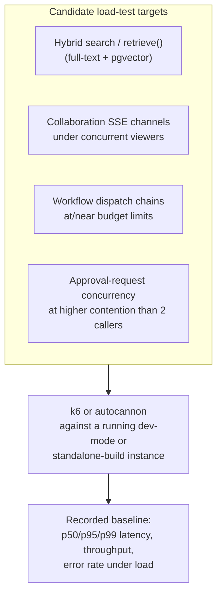

# Performance Testing

## Current coverage: none

There is no load-testing, benchmarking, or performance-regression tooling anywhere in this
repository — no k6/Artillery/autocannon dependency in any `package.json`, no benchmark script, and no
recorded baseline numbers for latency or throughput. See [`strategy.md`](./strategy.md) for the
repository-wide confirmation this document inherits. This is consistent with, not separate from, this
project's own honesty about its testing posture: nothing here has ever been load-tested.

## What exists today that bears on performance, even without dedicated testing

Unlike security (which has at least one dedicated adversarial pass — see
[`security.md`](./security.md)), performance work in this codebase so far has been architectural
decisions made and documented at build time, not measured and tuned afterward. Several are directly
relevant to what a future performance-testing effort would need to validate:

- **Per-channel snapshot caching** ([Collaboration](../../docs/collaboration.md)) — every SSE poll
  tick goes through `getCache()` with a short TTL before reaching Postgres, specifically to collapse N
  simultaneous viewers of the same channel into ~1 underlying query per TTL window. This is a
  performance-motivated design with **no benchmark confirming the collapse actually happens** under
  real concurrent load — the reasoning is architectural, not measured.
- **The `WorkflowDispatchBudget`** ([Workflow Engine](../workflows/workflow-engine.md)) — a
  step-count/time ceiling bounding one synchronous dispatch chain (`WORKFLOW_MAX_SYNC_STEPS`,
  `WORKFLOW_MAX_SYNC_MS`), and `LOOP`'s own `MAX_ITERATIONS = 50` — both are bounds against runaway
  execution, not performance targets derived from measuring actual latency under load.
  `MAX_ACTIVE_RUNS_PER_DEFINITION = 5` is the same shape at the run-count level.
- **The in-memory `Cache`/`RateLimiter`/`Queue` primitives** ([Architecture: Scalability](../architecture/scalability.md))
  — per-instance by default, shared via Redis only when `REDIS_URL` is set, and — a real, documented
  gap — `RateLimiter` has no Redis-backed implementation even when `REDIS_URL` is set. No load test
  exists confirming what actually happens to rate-limit enforcement or cache hit rate once more than
  one `web` instance runs concurrently; the multiplied-rate-limit consequence is reasoned about, not
  measured.
- **pgvector HNSW indexing** (`embeddings_vector_hnsw_idx`, see [Database: Migrations](../database/migrations.md))
  — the index exists because approximate-nearest-neighbor search over embeddings needs one to avoid a
  full table scan at any real data volume, but there is no recorded benchmark of retrieval latency at
  a representative embedding count (hundreds vs. hundreds of thousands of rows) with or without it.

## What performance testing would mean in this codebase



A first performance-test slice, in priority order — chosen for where an unmeasured assumption is
carrying the most architectural weight:

1. **Hybrid retrieval latency** (`retrieve()`, [ai/retrieval.md](../ai/retrieval.md)) — the pgvector
   HNSW index and full-text `tsvector` index both exist specifically to keep this fast; a load test
   confirming p95 latency at a realistic embedding/document count is the most direct way to validate
   that the indexing strategy actually works, rather than trusting that an index exists is sufficient.
2. **SSE channel fan-out under concurrent viewers** — the exact scenario the per-channel `Cache`
   dedup in [Collaboration](../../docs/collaboration.md) was built for: N simulated concurrent clients
   subscribed to the same `presence:org:<id>:page:<key>` channel, confirming the underlying query rate
   stays roughly flat as N grows rather than scaling linearly with it.
3. **Rate limiter behavior across multiple instances** — directly testing the documented gap in
   [Architecture: Scalability](../architecture/scalability.md#cache-in-memory-by-default-genuinely-optional-redis): run two `web`
   instances behind a load balancer (or simulate two `InMemoryRateLimiter`s), confirm a client can
   exceed the nominal per-route limit by roughly a factor of instance count — turning a reasoned-about
   gap into a measured, reproducible one.
4. **Workflow dispatch chains near their budget ceiling** — a workflow graph engineered to approach
   `WORKFLOW_MAX_SYNC_STEPS`/`WORKFLOW_MAX_SYNC_MS`, confirming the budget actually trips before a
   real timeout/resource problem occurs, and that `WorkflowDispatchBudgetExhaustedError` is the
   observed failure mode rather than something uglier (a hung request, an OOM).
5. **Approval-request contention beyond two callers** — [`integration.md`](./integration.md#service-layer--against-a-real-repository-with-authorization-asserted)
   already proposes a 2-concurrent-caller correctness test for `transitionApprovalRequest`; a
   performance variant asks a different question — not "does exactly one win," which correctness
   testing already covers, but "how does latency/throughput hold up under 10 or 50 simultaneous
   approval attempts on the same row," relevant because the atomic `updateMany` still serializes at
   the database row-lock level.

## How to check performance today

There is no automated performance-test command. The closest thing available is manual observation
during the dev-server smoke test — noting whether a page or route feels slow — which is subjective and
unrecorded, not a substitute for a real measurement.

```bash
docker compose --profile full up -d --build   # closest to a production-topology instance
# then, manually: observe response times in browser devtools / curl -w '%{time_total}',
# no scripted load generation, no recorded baseline.
```

## Roadmap: adding real performance tests

**Tooling: [k6](https://k6.io/) or [autocannon](https://github.com/mcollina/autocannon) for HTTP load
generation** — either is a reasonable, low-ceremony fit; autocannon is Node-native and would sit
naturally alongside the existing pnpm/Turborepo tooling with no new language runtime, while k6
(Go-based, JS test scripts) has stronger built-in support for scripted multi-stage load profiles and
threshold-based pass/fail, which matters more once there's a baseline worth protecting with a
regression gate. Concretely, adding this would mean:

- A new `perf/` (or `apps/web/perf/`) directory with load-test scripts, one per target above, plus a
  `test:perf` script — not wired into `turbo.json`'s default `build`/`lint`/`typecheck` pipeline, since
  performance tests are meaningfully slower and noisier than a correctness gate and shouldn't block
  every commit the way `pnpm lint`/`pnpm typecheck` do.
- Running against the standalone build (`docker compose --profile full up -d --build`), not `pnpm dev`
  — the dev server's hot-reload machinery and unoptimized dev bundle make its performance
  characteristics meaningfully different from what actually ships, the same reasoning
  [`e2e.md`](./e2e.md#roadmap-adding-real-e2e-tests) gives for testing against the standalone build.
- A recorded baseline (p50/p95/p99 latency, throughput, error rate) checked into the repository or a
  tracked external location, so a future load-test run has something to compare against — without a
  baseline, "is this slower than before" has no answer.
- **Not proposed as a first step**: a full production-scale load simulation (this repository has never
  been deployed at any real scale, so there's no realistic traffic profile to simulate yet) or
  synthetic monitoring against a live production deployment (there is no production deployment today —
  see [Production](../deployment/production.md)).

No specific latency numbers, throughput figures, or performance regressions are claimed as measured —
this document is entirely proposed target state, consistent with [`strategy.md`](./strategy.md).

## Related documents

- [`strategy.md`](./strategy.md) — the overall testing posture this document narrows to the
  performance dimension.
- [`integration.md`](./integration.md) — the correctness-focused counterpart to this document's
  concurrency-under-load target (`transitionApprovalRequest`).
- [Architecture: Scalability](../architecture/scalability.md) — the horizontal-scaling gaps (the
  per-instance rate limiter, specifically) this document proposes measuring rather than only reasoning
  about.
- [ai/retrieval.md](../ai/retrieval.md) — the hybrid search path section 1's load test targets.
- [Collaboration](../../docs/collaboration.md) — the SSE channel and per-channel cache dedup section 2
  targets.
- [Workflow Engine](../workflows/workflow-engine.md) — the dispatch budget section 4 targets.
