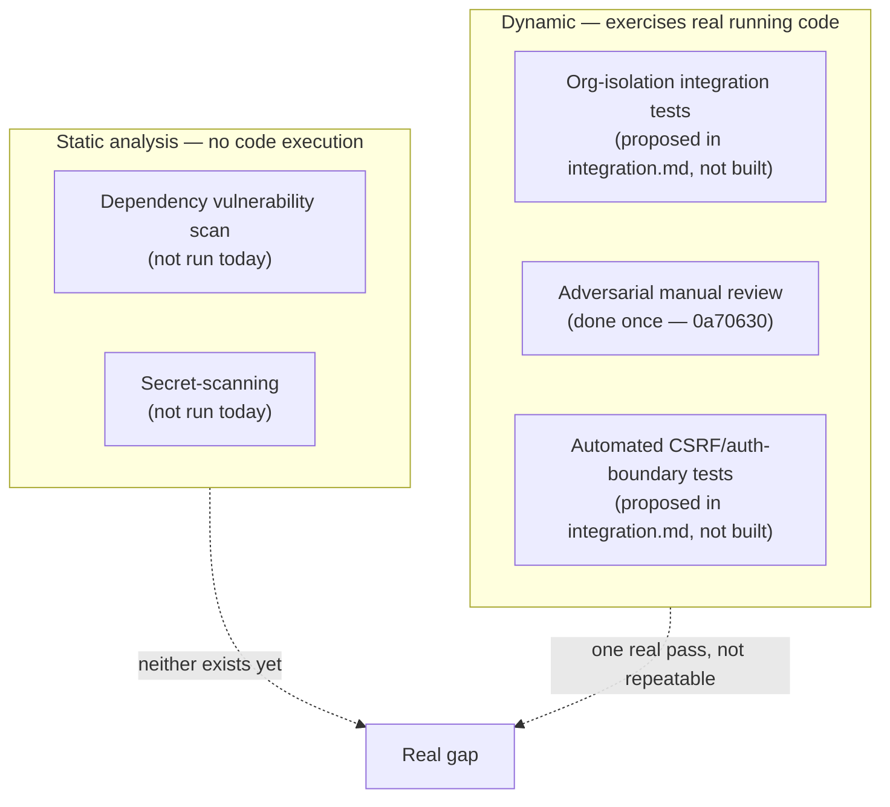

# Security Testing

## Scope

This document is about **verifying** BOND OS's security properties — what's been checked, how, and
what a repeatable security-testing practice would look like. It is not a restatement of
[`docs/security/`](../security/threat-model.md), which documents the mitigations themselves; this
page covers only how those mitigations have been (and could be) tested. See
[Threat Model](../security/threat-model.md) for what's actually being defended against.

## Current coverage: one manual adversarial review pass, no automated security testing

There is no security-testing tool of any kind wired into this repository — no SAST scanner, no
dependency-vulnerability scanner (`npm audit`/Snyk/Dependabot alerts) configured in CI (there is no CI
— see [`deployment/github.md`](../deployment/github.md)), no fuzzing, and no automated
penetration-testing harness. What does exist is one real, checklist-driven manual review, recorded in
the repository's own history:

> `0a70630` — `fix(collaboration): adversarial security review findings` — a dedicated pass run at the
> end of Phase 9 specifically targeting org isolation, the Space-curation-not-ACL boundary, mention
> validation, notification authorization, and SSE-channel authorization (see
> [`strategy.md`](./strategy.md#why-the-project-got-here)). It found and fixed two real issues rather
> than confirming a clean bill of health — the kind of outcome that gives the pass credibility as a
> genuine check rather than a formality.

That single commit is the entire history of dedicated security testing in this codebase. Every other
security property named in [Threat Model](../security/threat-model.md) was verified by direct code
reading at documentation time (this session), not by an automated test or a prior dedicated review
pass — a meaningfully weaker guarantee than either an automated test (which re-runs on every future
change) or a review (which at least involved someone actively trying to break something).

## What "security testing" would need to cover in this codebase

Cross-referencing [Threat Model → Summary: mitigated vs. residual](../security/threat-model.md#summary-mitigated-vs-residual)
directly — every row in that table with a non-empty "Residual risk" cell is, by definition, a
candidate for testing that doesn't exist yet:

### 1. Organization isolation — the single most-repeated residual risk

[Threat Model](../security/threat-model.md#cross-tenant-data-access) states it directly: *"A future
repository function that forgets the `organizationId` filter would reintroduce [cross-tenant access] —
no automated test/lint enforces the convention."* This is named identically in
[`integration.md`](./integration.md#repository-layer--against-a-real-postgres) as the top-priority
integration-test target. Security testing and correctness testing converge completely here — there is
no separate "security-specific" version of this test beyond what a thorough integration suite would
already need to cover (a row created under org A is invisible to org B; `updateMany`/`deleteMany`
scoped to the wrong `organizationId` affects zero rows).

### 2. The approval engine's replay/race resistance

[Threat Model](../security/threat-model.md#replay-attacks-on-approvals) names
`transitionApprovalRequest`'s atomic conditional `updateMany` as *"the strongest-verified control in
the codebase"* — verified by reading the code, not by firing concurrent requests at it. A real
security test here means exactly what [`integration.md`](./integration.md#service-layer--against-a-real-repository-with-authorization-asserted)
already proposes: two genuinely concurrent `approve()` calls against the same `ApprovalRequest`,
asserting exactly one succeeds. This is the one property in the entire threat model that a code
review — however careful — cannot fully confirm; only firing real concurrent requests can.

### 3. CSRF boundary — every mutating route, not just a sample

[Threat Model](../security/threat-model.md#csrf-cross-site-request-forgery) lists specific confirmed
call sites of `assertSameOrigin` (`execution/plan`, `execution/[id]/approve`,
`execution/[id]/reject`, `organization/[id]/members`, and others) found by direct reading this
session — a manual, one-time confirmation, not an enforced invariant. A real test would assert, for
every mutating route in `apps/web/app/api/`, that a request with a missing or mismatched `Origin`
header is rejected with `403` before any service code runs — cheap to write once the integration-test
harness in [`integration.md`](./integration.md) exists, and valuable specifically because it would
catch a *future* route that forgets to wrap itself in the pattern, which a one-time manual audit
cannot.

### 4. Rate-limit and auth-boundary coverage gaps, made explicit

[Threat Model](../security/threat-model.md#rate-limiting) already names three unrated routes
(`POST /api/execution/plan`, `POST /api/execution/[id]/reject`, `GET /api/execution/[id]/audit`) as a
flagged gap rather than a confirmed decision. Security testing doesn't fix this — closing it is a code
change — but a test asserting "every mutating route is wrapped in `withRateLimit`" (a structural check,
not a behavioral one) would at least prevent the gap from silently growing as new routes are added.

### 5. Prompt injection — inherently the hardest to test mechanically

[Prompt Injection](../security/prompt-injection.md) and [Threat Model](../security/threat-model.md#prompt-injection)
are explicit that the real containment is the approval gate, not the mitigations that try to prevent
an injection from having effect in the first place — an injected instruction can, at most, get an
agent to *propose* an action, never to execute one unapproved. That framing matters for testing too:
the highest-value automated test here isn't "does the AI resist a crafted prompt" (adversarial-input
testing against an LLM's output is inherently probabilistic and expensive to make reliable), it's
**"can any code path reach a write without going through `proposeAction`/the approval gate"** — a
structural, deterministic, testable property, unlike the LLM's behavior itself.

### 6. Dependency and secret scanning — not security-specific to this codebase, but absent

Two standard practices that apply to any Node/TypeScript project and are not wired in here at all:

- **Dependency vulnerability scanning** — no `npm audit`/Snyk/Dependabot configuration exists (there
  is no `.github/` directory of any kind, dependabot config included). A known-vulnerable transitive
  dependency would go unnoticed until manually checked.
- **Secret scanning** — nothing prevents a committed `.env` file or a hardcoded API key from landing
  in the repository's history via a pre-commit hook or CI check; `.gitignore`/`.dockerignore` excluding
  `.env` is the only current line of defense, and that's a convention, not an enforced gate. See
  [Security: Secrets](../security/secrets.md) for what's actually stored where.

## The write-boundary grep: a real, existing, but manual security check

Worth naming because it already exists and is genuinely valuable, even though it isn't automated: this
documentation set and the Phase 9 review both used
`grep -rn "execution.service" apps/web/features/{notifications,comments,spaces}` (and equivalents) to
confirm a feature layer never bypasses the approval chain for a write. This is cheap enough to become
an actual CI-less but scripted check — a `pnpm verify:write-boundary`-style command that fails if any
`features/*/services/*.service.ts` file outside `execution/` imports `ExecutionService` directly —
without needing a full test framework first. This is the single lowest-effort, highest-leverage next
step this document can point to, since it needs no new infrastructure (no Vitest, no Playwright, no
test database) — just a script.

## Roadmap

In priority order, matching the residual-risk ordering above:

1. **The write-boundary grep, scripted** (see above) — no new tooling required, immediately buildable.
2. **Organization-isolation integration tests** — shared work with [`integration.md`](./integration.md),
   not a separate security-specific suite.
3. **The approval-engine concurrency test** — shared work with [`integration.md`](./integration.md).
4. **A structural CSRF-coverage test** — asserts every mutating route wraps `assertSameOrigin`, once
   the integration-test harness exists.
5. **Dependency and secret scanning wired into a future CI setup** — blocked on
   [`deployment/github.md`](../deployment/github.md)'s larger, separate "is there CI at all" decision.
6. **A second dedicated adversarial review pass**, repeating `0a70630`'s exercise, once Comments/
   Spaces/Shared AI Sessions or any future collaboration surface grows further — the manual practice
   that's already proven to find real issues, applied again rather than assumed to still hold.

No automated security-testing tool, scanner, or CI gate is claimed as existing — this section is
entirely proposed target state, consistent with [`strategy.md`](./strategy.md).

## Related documents

- [`strategy.md`](./strategy.md) — the overall testing posture and prioritization this document
  narrows to the security dimension.
- [`integration.md`](./integration.md) — where most of the actual test-writing work for organization
  isolation and the approval engine lives; this document doesn't duplicate it.
- [Threat Model](../security/threat-model.md) — the mitigated-vs-residual table this whole document is
  organized around.
- [Approval Security](../security/approvals.md) — the atomic-transition property section 2 covers.
- [Prompt Injection](../security/prompt-injection.md) — the AI-specific containment section 5 covers.
- [Security: Secrets](../security/secrets.md) — what secret-scanning (section 6) would be protecting.
- [`deployment/github.md`](../deployment/github.md) — the absence of CI this whole roadmap depends on
  eventually being addressed.
