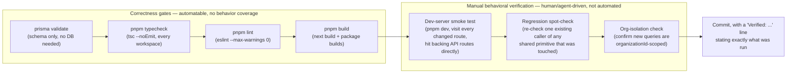
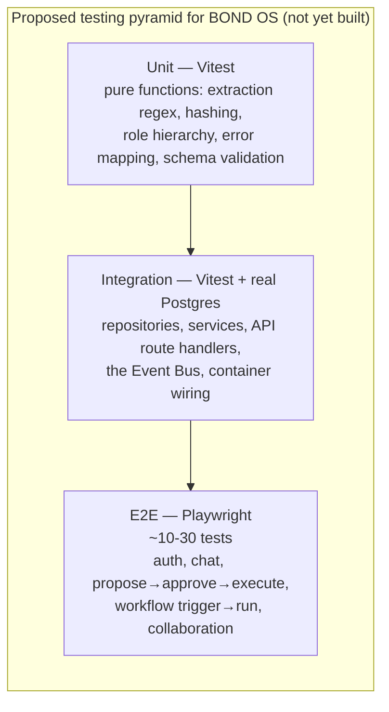

# Testing Strategy

## Scope

This document states, as plainly as [`README.md`](../../README.md) and
[`CONTRIBUTING.md`](../../CONTRIBUTING.md) already do, what BOND OS's testing posture actually is
today, why it got that way, and what a real automated suite would need to look like. It is the
index for the rest of `docs/testing/` — [`unit.md`](./unit.md), [`integration.md`](./integration.md),
[`e2e.md`](./e2e.md), [`security.md`](./security.md), and [`performance.md`](./performance.md) each
go deeper on one layer, but all five share this document's central fact:

> **BOND OS has no automated test suite.** There is no `test` script in any `package.json` across
> the monorepo, no test-framework dependency (Jest, Vitest, Playwright, Cypress, or otherwise) in
> any `devDependencies`, and no CI configuration anywhere in the repository — no `.github/workflows`
> directory exists on disk. This was independently re-confirmed for this document by grepping every
> `package.json` in the workspace (`package.json`, `apps/web/package.json`, and all nine
> `packages/*/package.json`) for `vitest`, `jest`, `playwright`, `@testing-library`, `cypress`, and
> `supertest`, and by searching the whole tree (outside `node_modules`) for `*.test.*`/`*.spec.*`
> files. Both searches returned nothing.

This is not a gap discovered late — it is stated in [`README.md`](../../README.md)'s Roadmap section
as one of the project's explicit, named boundaries, alongside "no CRDT," "no live OAuth connector
sync," and "no field-level secret encryption." The rest of this document explains what fills that
space today, and what should replace it.

## Why the project got here

BOND OS's own commit history explains the shape of its verification practice better than any
external description would. Per [`CONTRIBUTING.md`](../../CONTRIBUTING.md)'s Branch Strategy
section, this repository has, to date, been developed **direct-to-main** by a single author/agent
working incrementally, with its own verification discipline recorded in every commit body rather
than enforced by CI. Two representative examples from the real `git log`:

- `54049c9` (`feat(collaboration): wire comment threads and live presence into entity pages`):
  *"Verified: typecheck, lint, and a dev-server smoke test against all 4 updated detail pages plus
  `/api/presence` and the SSE stream route."*
- `87de897` (`feat(collaboration): add Inbox, Activity Feed, Spaces, Team Dashboard, and Shared
  Conversations UI`): *"Verified: typecheck, lint, and a dev-server smoke test against all 6 new
  pages plus their backing API routes (307 unauth redirect on pages, 401 on APIs, matching the
  existing pattern)."*

That "Verified: ..." line is a load-bearing convention in this project's own commit discipline (see
[`CONTRIBUTING.md`](../../CONTRIBUTING.md#commit-conventions)), not incidental detail — it is the
closest thing to a test report this codebase's history produces per change. A tenth commit,
`0a70630` (`fix(collaboration): adversarial security review findings`), shows the other half of the
practice: a dedicated, checklist-driven manual review pass run at the end of Phase 9, which found and
fixed two real issues. See [`security.md`](./security.md) for that commit in full.

## What "verification" means today

There are two distinct things worth separating, because conflating them is exactly the
misrepresentation [`CONTRIBUTING.md`](../../CONTRIBUTING.md#testing-requirements) warns against:

1. **Correctness gates** — commands that catch a class of bug (type errors, lint violations, a
   schema that doesn't compile, a build that doesn't produce output) but say nothing about whether
   the code's *behavior* is correct.
2. **Manual behavioral verification** — a human (or an agent acting like one) actually running the
   app and exercising the changed surface by hand.

BOND OS today has (1) as an automatable, repeatable gate and (2) as a documented-but-manual
discipline. It has no automated version of (2) at any layer.



Every box in this diagram is real and traceable to
[`CONTRIBUTING.md`](../../CONTRIBUTING.md#review-checklist)'s Review Checklist — none of it is
aspirational. What's aspirational is turning the bottom row into code, which is what
[`unit.md`](./unit.md), [`integration.md`](./integration.md), and [`e2e.md`](./e2e.md) each propose
for their own layer.

### Running the correctness gates today

These are real, working commands in this repository right now:

```bash
# Schema validity (no live DB connection required)
pnpm --filter @bond-os/database run validate      # prisma validate

# Type-check every workspace (fans out via Turborepo)
pnpm typecheck                                     # turbo run typecheck

# Lint every workspace — zero-warning policy, not just zero errors
pnpm lint                                           # turbo run lint

# Build every workspace
pnpm build                                          # turbo run build
```

`pnpm lint` is worth calling out specifically: every workspace's `lint` script is
`eslint . --max-warnings 0` (confirmed in `apps/web/package.json` and every `packages/*/package.json`
that defines a `lint` script), and the shared config
(`packages/config/eslint/base.mjs`) sets `@typescript-eslint/no-explicit-any`,
`@typescript-eslint/no-unused-vars`, `@typescript-eslint/consistent-type-imports`, and `no-console`
all as `'warn'` rather than `'error'` — but `--max-warnings 0` means a *warning* still fails the
gate. This is stricter than the rule severities alone would suggest.

None of the four commands above execute any application code path — they catch shape and syntax
problems, not logic bugs. A function that type-checks, lints clean, and builds can still return the
wrong answer, leak data across an `organizationId` boundary, or double-execute an approval. Catching
those requires the manual steps below today, and would require the automated suite proposed in this
document's Roadmap section in the future.

### Running the manual steps today

There is no script for these — they are literally "run `pnpm dev` and use the app," performed by
whoever is making the change:

```bash
pnpm dev          # starts the Next.js dev server (apps/web) via Turborepo
```

Then, by hand: navigate to every page the change touches, confirm it renders and behaves correctly;
call the backing API route(s) directly (e.g. via the browser, `curl`, or a REST client) including at
least one unauthenticated request to confirm the expected `307` redirect (pages) or `401` (APIs) —
the exact pattern both cited commits above verified. For anything touching a shared primitive (the
[Event Bus](../workflows/event-bus.md), a [registry](../development/coding-standards.md), a
[container](../development/coding-standards.md), the `AppError` hierarchy, CSRF, `requireRole`),
re-check at least one pre-existing caller still behaves correctly. For any new query, confirm it is
scoped by `organizationId` — see [Organization Isolation](../security/organization-isolation.md).

## What this means for a new contributor

Per [`CONTRIBUTING.md`](../../CONTRIBUTING.md#testing-requirements): treat the
[Review Checklist](../../CONTRIBUTING.md#review-checklist) as the minimum bar for any change, even
though nothing enforces it automatically. Do not describe a change as "tested" unless you mean
"manually verified per that checklist" — that is what this project's own commit history means by the
word, and it is important that this documentation set not inflate that claim. If you add the first
real tests for a piece of this codebase, document the decision here (in this file) rather than
adding test files silently, per the same section of `CONTRIBUTING.md`.

## What a real testing strategy would look like

The rest of this section is **forward-looking and aspirational** — describing target state, not
current state. Nothing described below exists in the repository today.

### The shape of the pyramid this codebase would need



The proportions matter here more than the exact counts: BOND OS is a service-heavy, database-backed
monorepo with relatively little standalone pure logic (most of the interesting behavior — org
isolation, the approval gate, the workflow engine — only means something once a repository, a
service, and a database row are all involved). That argues for a **bottom-heavy but not
unit-test-dominated** pyramid: a modest unit layer for the genuinely pure functions
([`unit.md`](./unit.md) enumerates them), a substantial integration layer doing most of the real
work ([`integration.md`](./integration.md)), and a thin, high-value e2e layer covering the handful of
journeys where UI + API + database all need to agree ([`e2e.md`](./e2e.md)).

### Recommended framework choices, and why

- **[Vitest](https://vitest.dev/) for unit and integration tests.** It is the natural fit for this
  stack specifically because the project already uses native ESM (`"type": "module"` in
  `packages/database/package.json`), TypeScript everywhere with `tsx` already a dependency
  (`packages/database` uses it to run `prisma/seed.ts`), and a Turborepo-orchestrated pnpm
  workspace — Vitest's per-workspace config and fast native TS/ESM support (no Babel/ts-jest
  transform step) line up with all three. Jest would work too but would add a transform layer this
  codebase's tooling doesn't otherwise need.
- **[Playwright](https://playwright.dev/) for e2e tests.** It is the tool Next.js's own
  documentation recommends for the App Router, drives a real browser against `pnpm dev` or a
  production build, and can assert on the SSE-based streams this codebase relies on (execution
  progress, presence, notifications — see [Event Bus](../workflows/event-bus.md) and
  [Workflow Engine → Approvals](../workflows/approvals.md)) via its network-interception APIs. See
  [`e2e.md`](./e2e.md) for the concrete journeys this would cover first.
- **No dedicated security- or performance-testing framework is proposed as a first step** — see
  [`security.md`](./security.md) and [`performance.md`](./performance.md) for why those layers'
  roadmaps lean on the integration suite plus targeted tooling rather than a wholesale new framework.

### What would need to change in the repo to support this

Concretely, adding a real suite would touch:

- **`turbo.json`** — a new `test` task (and probably `test:integration`, `test:e2e`) alongside the
  existing `build`/`lint`/`typecheck`/`generate` tasks, with `dependsOn: ["^generate"]` the same way
  `lint`/`typecheck` already depend on the Prisma client being generated first.
- **Each `package.json`** — a `test` script per workspace, following the exact pattern `lint` and
  `typecheck` already use (`"lint": "eslint . --max-warnings 0"` → `"test": "vitest run"`).
- **`docker-compose.yml`** — this file already provisions `postgres` (with the `pgvector` extension
  enabled via the Prisma migration, see `packages/database/prisma/migrations/20260718000000_init/`)
  and `redis`, healthchecked and ready to use as-is for integration tests; a dedicated test database
  name/`DATABASE_URL` would be the only realistic addition (see [`integration.md`](./integration.md)).
- **`.github/workflows/`** — does not exist today (confirmed on disk); adding CI is a separate,
  larger decision than adding tests, and is out of scope for this document. See
  [`deployment/github.md`](../deployment/github.md) for the current, honest state of that gap.
- **`CONTRIBUTING.md`** — the [Testing Requirements](../../CONTRIBUTING.md#testing-requirements)
  section already anticipates this and asks that the framework choice and coverage decision be
  documented here, in this file, when it happens.

### Prioritization: what to test first

Not everything is equally valuable to cover first. Cross-referencing
[`security/threat-model.md`](../security/threat-model.md)'s own "Summary: mitigated vs. residual"
table — which repeatedly flags *"no automated test/lint enforces the convention"* as the residual
risk on BOND OS's most important invariant — the highest-value first targets are:

1. **Organization isolation** — that every repository query is scoped by `organizationId`, and that
   mutations use `updateMany`/`deleteMany` rather than a bare `id`-only `update`/`delete`. This is
   the single most repeated "residual risk" line in the threat model precisely because nothing
   automated checks it today. See [`integration.md`](./integration.md) and
   [Organization Isolation](../security/organization-isolation.md).
2. **The approval engine's atomic single-use transition** (`transitionApprovalRequest`'s conditional
   `updateMany`) — concurrency-sensitive code that a unit test cannot meaningfully exercise; it needs
   real concurrent requests against a real database. See [`integration.md`](./integration.md) and
   [Approval Security](../security/approvals.md).
3. **The `AppError` → HTTP status mapping in `apiHandler`** (`apps/web/lib/api-handler.ts`) — cheap
   to test, exercised by every single API route, and a regression here silently changes every route's
   error contract at once.
4. **The pure extraction/hashing/permission functions** — cheap, fast, high-signal unit tests with no
   infrastructure dependency. See [`unit.md`](./unit.md) for the concrete list.
5. **The propose → approve → execute journey end-to-end** — the one flow where a UI bug, an API bug,
   and a database bug could each independently cause a write to happen (or not happen) without
   authorization, and only an e2e test would catch every layer at once. See [`e2e.md`](./e2e.md).

## Related documents

- [`unit.md`](./unit.md), [`integration.md`](./integration.md), [`e2e.md`](./e2e.md),
  [`security.md`](./security.md), [`performance.md`](./performance.md) — the layer-specific
  documents this one indexes.
- [`../../CONTRIBUTING.md`](../../CONTRIBUTING.md) — the Review Checklist and Testing Requirements
  this document expands on.
- [`../../README.md`](../../README.md) — the Roadmap section naming "no automated test suite yet" as
  an explicit, stated boundary.
- [`../development/coding-standards.md`](../development/coding-standards.md) — the
  repository→service→route→UI layering and composition-root/registry patterns that the proposed
  integration-test layer would exercise.
- [`../security/threat-model.md`](../security/threat-model.md) — the residual-risk table this
  document's prioritization section is drawn from.
- [`../deployment/github.md`](../deployment/github.md) — the current absence of CI configuration.
