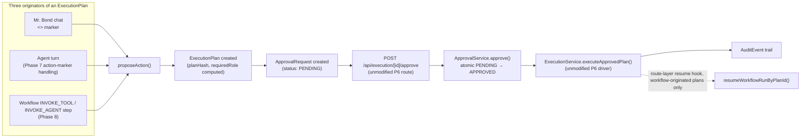

# Approval Integration

## Scope

How a workflow's `INVOKE_TOOL`/`INVOKE_AGENT` step reaches a write, and why it is structurally
incapable of skipping the same human approval gate every other write in this codebase goes through.
This doc covers a concise recap of the Phase 6 approval gate itself (full depth belongs in
`docs/security/approvals.md`), then the Phase 8-specific integration in full: the identical
`proposeAction()`/`ApprovalRequest`/`ExecutionService` chain a workflow step becomes a third caller of,
how a `WorkflowRun` pauses as `WAITING_APPROVAL`, the route-layer resume hook that nudges a paused run
forward after a human decides, and the one UI/API surface built specifically for workflow approvals
today (`/workflows/approvals`) along with its known limitation.

## Why this can never be bypassed — the invariant, stated once

Every write this codebase can ever perform — from a chat message, an agent's own turn, or a workflow
step — funnels through exactly one function, `proposeAction()`, and exactly one gate,
`ApprovalService.approve()`. `ExecutionService.executeApprovedPlan`'s opening line is
`await this.approvalService.approve(...)`; nothing else in the Tool Execution Framework runs before
that call succeeds. There is no configuration flag, no workflow-level "trusted" setting, no elevated
role, and no code path anywhere in `apps/web/features/workflows/` that calls `ExecutionService`
directly or writes a domain record without going through this chain first. A workflow's `INVOKE_TOOL`
step is not a variant of this rule with a workflow-shaped exception carved out of it — it is a plain
third caller of the identical mechanism Mr. Bond's `<<ACTION:...>>` marker and Phase 7's agent-proposed
actions already use, with zero special-casing anywhere in the approval gate itself.



## Recap: the Phase 6 approval gate

Full mechanics belong in `docs/security/approvals.md`; the load-bearing facts for this doc are:

- **`ApprovalRequest`** is a real table, `planId @unique` (a true 1:1 with `ExecutionPlan`), with
  `requiredRole: Role`, `status: ApprovalStatus` (`PENDING|APPROVED|REJECTED|EXPIRED|CANCELLED`), and
  `expiresAt`. There is no signed token, secret, or signature column anywhere on this model — the row's
  own primary key plus its `organizationId`/`status`/`expiresAt` columns are the entirety of what
  authorizes a transition.
- **Single-use/replay protection is an atomic, org-scoped conditional `updateMany`**
  (`transitionApprovalRequest`) — `status` only transitions `PENDING → APPROVED`/`REJECTED` if it's
  still `PENDING` and not expired, checked and written in the same database query as the tenant filter.
  A second concurrent call (double-click, retried request) sees `count === 0` and gets `ConflictError`,
  never a silent no-op or a second write.
- **`planHash`** — a plain SHA-256 digest over the plan's canonicalized steps, computed once at
  plan-build time and recomputed immediately before execution. A mismatch (the stored `ExecutionPlan`
  row somehow changed between build and execution) hard-fails with `ConflictError` rather than running a
  possibly-tampered plan.
- **`requiredRole`** — computed server-side by `PermissionService.requiredRoleForTools`, the maximum
  `ROLE_HIERARCHY` severity across every tool the plan touches, written once onto `ApprovalRequest.requiredRole`
  and never client-supplied or recomputed. `ApprovalService.approve()` compares this stored value
  against the *caller's live, freshly-looked-up* membership role — never anything the client sends.
- **`APPROVAL_EXPIRY_MINUTES`** (default 15) — how long a `PENDING` request survives before
  `expireStaleApprovalRequests` (swept opportunistically on lookup, not by a background timer) flags it
  `EXPIRED`.
- **The approve route is an SSE stream** (`POST /api/execution/[id]/approve`), reusing the identical
  `createSseStream` transport Mr. Bond's own chat route uses. `ExecutionService.executeApprovedPlan`
  streams `execution_started` → per-layer `step_started`/`step_succeeded`/`step_failed` →
  (on failure) `rollback_started`/`rollback_succeeded`/`rollback_failed` → terminal
  `execution_done`/`execution_failed`.
- **The reject route** (`POST /api/execution/[id]/reject`) needs no role check beyond org membership —
  rejecting can only block a write, never cause one, so any member may decline it. It's the same atomic
  `updateMany` idiom, transitioning `PENDING → REJECTED`.

None of this is modified, extended, or special-cased by Phase 8 — the entire point of this doc's next
section is that a workflow-originated plan is *indistinguishable*, once persisted, from a chat- or
agent-originated one.

## `INVOKE_TOOL`: the same chain, exactly

`invoke-tool.handler.ts`'s own doc comment states the invariant directly:

```ts
/**
 * INVOKE_TOOL — the ONE way a workflow reaches a write: calls the same
 * `proposeAction()` Mr. Bond's `<<ACTION:...>>` marker and Phase 7's agent
 * ACTION-marker handling already use. Never executes anything itself —
 * always returns `waiting_approval`; the run stays paused until a human
 * approves via the unmodified `/api/execution/[id]/approve`, matching the
 * spec's own diagram exactly: Workflow -> Execution Plan -> P6 Action
 * Engine -> Approval -> Execution.
 */
export const invokeToolHandler: WorkflowStepHandler = {
  stepType: 'INVOKE_TOOL',
  async execute(ctx: WorkflowStepHandlerContext, params) {
    if (!ctx.ownerId) {
      throw new ValidationError('INVOKE_TOOL requires this workflow to have an owner — set one before publishing.');
    }

    const plan = params.__plan;
    const request = plan && typeof plan === 'object'
      ? { kind: 'compound' as const, ...(plan as { summary: string; steps: unknown[] }) }
      : buildSingleToolRequest(params);

    const proposed = await proposeAction(
      { organizationId: ctx.organizationId, userId: ctx.ownerId },
      request as Parameters<typeof proposeAction>[1],
    );

    return { kind: 'waiting_approval', planId: proposed.plan.id };
  },
};
```

`proposeAction` is the identical function both Mr. Bond's in-pipeline action handling and
`POST /api/execution/plan` already share — Phase 8 doesn't add a fourth variant, it becomes a third
caller of the same one. The `ExecutionPlan` this produces, the `ApprovalRequest` `requestApproval`
creates for it, and every mechanism the recap above covers — the atomic `updateMany`, `planHash`
verification, server-computed `requiredRole`, `APPROVAL_EXPIRY_MINUTES` — apply to a
workflow-originated plan with **zero special-casing**. An approver looking at a pending
`ApprovalRequest` cannot tell, from the approval gate's own code path, whether the plan behind it came
from a chat message, an agent's turn, or a workflow step — that symmetry is the entire point.

`INVOKE_TOOL` requires the workflow to have an `ownerId` (`ctx.ownerId`, propagated from
`WorkflowDefinition.ownerId`) — the accountable party `proposeAction` runs as. A workflow with no owner
cannot publish a graph containing an `INVOKE_TOOL`/`INVOKE_AGENT` step at all
(`WorkflowDefinitionService.publish`'s own check — see [Workflow Engine](./workflow-engine.md) and
[Templates](./templates.md)) — this is caught long before a run ever reaches this handler, not
discovered as a runtime error mid-execution. `INVOKE_AGENT` reaches the same chain indirectly: if the
invoked agent's own turn proposes an action mid-conversation (`action_proposed`), that step reaches the
identical `waiting_approval` outcome with no special-casing needed, since under the hood it's the same
`proposeAction()` call Phase 7's agent pipeline already makes on any agent's turn.

## `WorkflowRun` pauses as `WAITING_APPROVAL`

The handler's return value, `{ kind: 'waiting_approval', planId }`, is what the re-entrant driver
(`driveWorkflowRun`, see [Workflow Engine](./workflow-engine.md)) does with it:

```ts
case 'waiting_approval':
  await updateWorkflowRunStep(stepRow.id, { status: 'WAITING_APPROVAL', planId: outcome.planId });
  await updateWorkflowRunStatus(run.id, definition.organizationId, { status: 'WAITING_APPROVAL' });
  return;
```

The step row records the `planId` it's waiting on, the whole `WorkflowRun` is marked
`WAITING_APPROVAL`, and `driveWorkflowRun` returns immediately — exactly like a `WAIT`/`DELAY` step
pausing at `WAITING_TIMER` (see [Scheduler](./scheduler.md)), just waiting on a human decision instead
of a clock. On a later re-entry into the same run, the driver checks whether that wait is over before
doing anything else:

```ts
if (stepRow.status === 'WAITING_APPROVAL') {
  const resolution = await tryResolveWaitingApproval(stepRow, definition.organizationId);
  if (resolution.kind === 'still_waiting') {
    await updateWorkflowRunStatus(run.id, definition.organizationId, { status: 'WAITING_APPROVAL' });
    return;
  }
  if (resolution.kind === 'failed') {
    await failStep(stepRow, resolution.error);
    await failRun(definition, run, stepRow.key, resolution.error, existingSteps);
    return;
  }
  stepRow = { ...stepRow, status: 'SUCCEEDED', output: resolution.output };
  // ... continue to the next step in the layer
}
```

`tryResolveWaitingApproval` reads the plan's `ToolExecution` (if execution has already started) or its
`ApprovalRequest` (if it hasn't) by the step's stored `planId` — `SUCCEEDED` execution resolves the
step `SUCCEEDED`; a `FAILED`/`ROLLED_BACK` execution or a `REJECTED`/`EXPIRED` approval resolves it
`failed` (triggering the `failRun`/rollback path documented in [Retries & Rollback](./retries.md));
anything else (still `PENDING`, still `EXECUTING`) reports `still_waiting` and the driver returns
again, unchanged, ready for the next re-entry.

## The route-layer resume hook: cross-phase awareness lives in the route, not in the service

Something has to notice when a plan a workflow was waiting on finishes, and nudge that `WorkflowRun`
forward — but `ExecutionService.executeApprovedPlan` (Phase 6) has no reason to know Phase 8 exists,
and this codebase's own standing rule (applied identically for Phase 6 not knowing about Phase 7's
agents) is that a lower phase never gains awareness of a higher one. The resolution is the same one
used elsewhere: put the cross-phase awareness in the **route**, which is allowed to know about both,
rather than in the service. `apps/web/app/api/execution/[id]/approve/route.ts`'s own comment states
this directly:

```ts
/**
 * Wraps the execution generator with a Phase-8-aware completion hook,
 * without `execution.service.ts` (P6) ever importing or knowing about
 * Phase 8 — this file (a route, allowed to know about both) is where that
 * cross-phase awareness lives. `for await`-driving the original generator
 * and re-yielding preserves `createSseStream`'s exact priming/streaming
 * contract; the resume attempt only runs once the underlying generator is
 * exhausted, and never throws into the SSE stream itself (best-effort,
 * matching every other "can't break the caller" event hook in this phase).
 */
async function* withWorkflowResumeHook<T>(
  generator: AsyncGenerator<T>,
  planId: string,
  organizationId: string,
): AsyncGenerator<T> {
  try {
    yield* generator;
  } finally {
    try {
      await resumeWorkflowRunByPlanId(planId, organizationId);
    } catch (error) {
      log.error('Workflow resume-on-approval failed', { planId, organizationId, message: error instanceof Error ? error.message : String(error) });
    }
  }
}
```

The route's `POST` handler is otherwise character-for-character the same as the Phase 6 recap above —
same `assertSameOrigin`, same `requireAuth`/`requireRole(..., ROLES.MEMBER)` floor, same
`getExecutionService().executeApprovedPlan(...)` call — with exactly one addition: the raw generator is
wrapped before being handed to `createSseStream`:

```ts
const rawGenerator = getExecutionService().executeApprovedPlan(
  { organizationId, userId: user.id, conversationId: plan?.conversationId ?? undefined },
  planId,
  membership.role,
);
const generator = withWorkflowResumeHook(rawGenerator, planId, organizationId);

const first = await generator.next();
return createSseStream(generator, first);
```

`withWorkflowResumeHook` is a pass-through async generator — `yield* generator` re-yields every event
`executeApprovedPlan` produces completely unchanged, so `createSseStream`'s priming/streaming contract
is preserved exactly: the client sees the identical SSE stream it always would have. The resume attempt
happens in a `finally` block, meaning it runs once the underlying generator is fully exhausted — after
execution has completed (successfully or not) and every `execution_*`/`step_*`/`rollback_*` event has
already been yielded — never interleaved with or ahead of that stream.

`resumeWorkflowRunByPlanId` (`workflow-run.service.ts`) is the one entry point this hook calls:

```ts
/**
 * The route-layer approval-resume hook's one entry point — `POST
 * /api/execution/[id]/approve` calls this after its own SSE stream
 * completes, best-effort. Resolves the `WorkflowRunStep` a just-approved
 * `planId` belongs to (if any — most approvals are NOT workflow-originated)
 * and re-drives that run. A no-op, not an error, when `planId` doesn't
 * belong to any workflow.
 */
export async function resumeWorkflowRunByPlanId(planId: string, organizationId: string): Promise<void> {
  const step = await getWorkflowRunStepByPlanId(planId);
  if (!step || step.run.organizationId !== organizationId) return;
  // ... re-derives WorkflowDefinition + the run's original triggering Event,
  //     builds a fresh WorkflowDispatchBudget, calls resumeWorkflowRunById
}
```

`getWorkflowRunStepByPlanId` is a plain lookup against `WorkflowRunStep.planId` — the common case,
"most approvals are NOT workflow-originated," is a `null` result and an immediate, silent no-op. There
is no error, no wasted work beyond one indexed query, and no behavioral difference for a Phase 6/7
human- or agent-proposed plan approved through this exact same route. When it *does* find a match, it
re-derives the `WorkflowDefinition` and the run's original triggering `Event`, builds a fresh
`WorkflowDispatchBudget`, and calls `resumeWorkflowRunById` — the identical re-entrant driver entry
point the tick endpoint uses to resume a `WAITING_TIMER` step (see [Scheduler](./scheduler.md)), just
triggered by an approval completing instead of a clock passing.

The `try`/`catch` around this call inside `withWorkflowResumeHook` means a failure in the resume attempt
itself — a bug, a transient DB error — is logged (`log.error('Workflow resume-on-approval failed', ...)`)
and swallowed, never thrown into the SSE stream the client is reading. This matches every other
"can't break the caller" event hook in this platform (the same posture `publishEvent()`'s own dispatch
failure handling takes — see [Event Bus](./event-bus.md)): approving a plan must always succeed or fail
on its own terms, regardless of whether some workflow happens to be waiting on it.

## What `execution.service.ts` itself still knows about Phase 8: nothing

Worth stating as plainly as the rest of this doc: `apps/web/features/execution/services/execution.service.ts`
has no Phase 8 import, no `WorkflowRun`/`WorkflowRunStep` reference, and no branch of any kind that
behaves differently for a workflow-originated plan versus any other. The only schema-level
acknowledgment that a `ToolExecution` might have come from a workflow is a single nullable, `@unique`
foreign key added to the model — `ToolExecution.workflowRunStepId` — read by nothing inside
`execution.service.ts` itself:

```prisma
/// Set only when this execution was submitted by a Workflow's Invoke-Tool
/// step (via the same `proposeAction()` every other caller uses — no
/// separate write path). How the `/api/execution/[id]/approve` route-layer
/// hook identifies "resume this WorkflowRun after executing". Null for
/// every non-workflow execution.
workflowRunStepId String? @unique
```

This is checkable, not just claimed: a grep for `workflow` (case-insensitive) inside
`apps/web/features/execution/` turns up nothing. Every piece of Phase 8-specific behavior — pausing a
run, resolving a waiting step, resuming after approval — lives in `apps/web/features/workflows/` and
the one route file allowed to bridge the two, never in the Phase 6 service this doc's recap describes.

## The workflow-approvals UI and API surface

`/workflows/approvals` (`apps/web/app/(dashboard)/workflows/approvals/page.tsx`) and its backing
`GET /api/workflows/approvals` route are the operator-facing view of pending approvals from the
Workflow Automation dashboard. This route's own comment states a real, documented limitation directly:

> There is **no dedicated "list pending approvals for an org" method or repository query** —
> `ApprovalService` only exposes single-plan lookups (`getForPlan`/`approve`/`reject`). This route is a
> documented workaround reusing `/api/execution`'s listing service (`listExecutionsService`), with
> `status` forced to `AWAITING_APPROVAL` regardless of query input.

Concretely, this means `/workflows/approvals` shows every `AWAITING_APPROVAL` `ToolExecution` in the
organization — chat-originated, agent-originated, and workflow-originated approvals all mixed together
— not a filtered "approvals this workflow is waiting on" view. There is no code path today that joins
this listing against `WorkflowRunStep.planId` to distinguish which pending approvals actually belong to
a workflow run. An operator using this page to decide what to approve next cannot tell from the page
alone whether a given pending item came from a workflow, a chat action proposal, or an agent turn — they
would need to cross-reference a `WorkflowRun`'s own detail page (`/workflows/runs/[id]`, which does show
a `WAITING_APPROVAL` step's `planId`) to make that connection.

Approving or rejecting from anywhere — this page, the general `/execution` surface, or directly via
`POST /api/execution/[id]/approve`/`reject` — behaves identically regardless of the plan's origin, per
the "zero special-casing" invariant this whole doc is about.

## What's deliberately not built

- **No signed or bearer approval tokens, no out-of-band approval channel.** Approving a plan requires an
  authenticated, same-origin session against `/api/execution/[id]/approve` — there is no code path that
  approves a plan from outside the app, workflow-originated or otherwise.
- **No multi-approver / quorum approval, no approval delegation or reassignment.** A single successful
  `approve()` call is sufficient regardless of plan origin or organization size; any member whose live
  role satisfies `requiredRole` may approve.
- **No per-plan or per-workflow configurable expiry.** `APPROVAL_EXPIRY_MINUTES` is one global value
  for every organization, every plan, and every workflow.
- **No push notification or webhook when a workflow's plan enters `AWAITING_APPROVAL`.** The only signal
  is the pending `ApprovalRequest` row itself, discoverable by polling `/workflows/approvals`,
  `/execution`, or a specific run's detail page — expiry is swept opportunistically, not pushed.
- **No partial or step-level approval within a compound `__plan`.** `ApprovalRequest` gates the whole
  plan a workflow step proposed; there's no way to approve some of a multi-step compound plan and reject
  others.
- **No workflow-scoped pending-approvals query.** Covered above — `/api/workflows/approvals` is a
  documented reuse of the general execution-history listing, not a purpose-built workflow query.

## Documentation index

- **[Overview](./overview.md)** — the full chain this doc's approval integration is one link of.
- **[Workflow Engine](./workflow-engine.md)** — the re-entrant driver's `WAITING_APPROVAL` handling in
  full context alongside its `WAITING_TIMER` counterpart, and every step type's outcome shape.
- **[Retries & Rollback](./retries.md)** — what happens when a `REJECTED`/`EXPIRED` approval or a
  `FAILED` execution resolves a waiting step to `failed`.
- **[Templates](./templates.md)** — `new-employee-onboarding`'s `create_onboarding_task` step, the
  clearest worked example of a workflow pausing on this gate.
- **[Scheduler](./scheduler.md)** — the sibling pause/resume mechanism (`WAITING_TIMER`) this doc's
  `WAITING_APPROVAL` mirrors structurally.
- **`docs/security/approvals.md`** (forthcoming) — the full Phase 6 approval-gate mechanics this doc's
  recap section summarizes: why no HMAC-signed token was used, the atomic `updateMany` idiom in full,
  and `planHash`/`requiredRole` computation in depth.
- **`docs/api/tools.md`** / **`docs/api/workflows.md`** (forthcoming) — full request/response contracts
  for `/api/execution/**` and `/api/workflows/**`.
