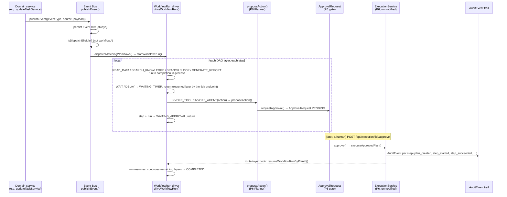

# Workflow Automation Platform — Overview

## Scope

This is the entry point to the `docs/workflows/` suite. It covers what the Workflow Automation
Platform (Phase 8 of BOND OS) is end to end: the six pieces it's built from, the full chain a
triggering write travels through, why a `WorkflowDefinition` is org-authored *data* while the code
that executes it is a fixed, developer-owned catalog, the data model, the UI and API surface, and — in
the same plain-statement style the rest of this codebase's docs use — what does not exist yet. Deeper
detail on each piece lives in its own doc, linked throughout and indexed at the bottom.

Every claim below is grounded in `apps/web/features/workflows/`, `packages/database/prisma/schema.prisma`,
and the corresponding `app/api/workflows/**` routes, read directly — not inferred from naming.

## What Phase 8 adds

Phase 6 gave Mr. Bond an approval-gated way to *propose* a write ([Approvals](./approvals.md), and the
forthcoming `docs/security/approvals.md`/`docs/api/tools.md`). Phase 7 multiplied the reasoning side
into a Coordinator plus five specialist agents (`docs/agents/overview.md`). Phase 8 adds a third way
work gets triggered — not a human typing a request, but the *system itself* reacting to something that
already happened elsewhere in the product.

`packages/database/prisma/schema.prisma`'s own Phase 8 section header states the design goal directly:

```prisma
// ── Phase 8: Workflow Automation Platform ───────────────────────────────────
// Event-driven workflows built by organizations via a visual editor, not
// developer-registered code — unlike `Tool`/`Agent`, `WorkflowDefinition` is
// genuinely org-scoped user data (trigger/conditions/graph are all Json).
// Only the ~10 step-type handlers are developer code (code owns behavior for
// EXECUTING a step; the graph itself is data). Every write a workflow needs
// still flows through the unmodified Phase 6 chain via the same
// `proposeAction()` every other caller uses — no new write path. No
// background worker exists anywhere in this codebase (confirmed again this
// phase) — scheduling and Wait/Delay-step resumption both go through one
// externally-triggered tick endpoint, and the Event Bus is synchronous/
// in-process, wrapped so a workflow can never break the write that triggered
// it.
```

Concretely, the platform is six pieces, each documented on its own:

| Piece | What it does | Doc |
|---|---|---|
| **Event Bus** | A synchronous, in-process `publishEvent()` a curated set of ~10 domain-service call sites invoke after their own write already committed. Persists an `Event` row unconditionally, then attempts to dispatch matching workflows. | [Event Bus](./event-bus.md) |
| **Workflow graph & step handlers** | `WorkflowStepDefinition`/`WorkflowGraphDefinition` — a flat DAG reusing Phase 6's `dag.ts` — interpreted by a fixed, ~10-entry step-handler registry. | [Workflow Engine](./workflow-engine.md) |
| **Re-entrant Workflow Run driver** | `driveWorkflowRun` — repeatedly invocable, picks up exactly where a persisted `WorkflowRunStep` left off, so a run can survive a step waiting days for a timer or a human approval. | [Workflow Engine](./workflow-engine.md) |
| **Scheduling surface** | One externally-triggered tick endpoint (`POST /api/workflows/schedule/tick`) — the sole door into time-based execution (`SCHEDULED` triggers and `WAIT`/`DELAY` resumption). | [Scheduler](./scheduler.md) |
| **Retry / rollback posture** | Built entirely from pieces Phase 6 already proved out — `RollbackService` reused unmodified; per-step retry is a declared, validated schema shape the driver does not yet act on. | [Retries & Rollback](./retries.md) |
| **Approval integration** | An `INVOKE_TOOL`/`INVOKE_AGENT` step pauses a run exactly the way a human-facing plan waits for approval — zero special-casing in the Phase 6 gate. | [Approvals](./approvals.md) |
| **Visual builder + built-in templates** | A React Flow canvas over the graph JSON, and 5 built-in templates a user instantiates into their own editable draft, never auto-published. | [Builder](./builder.md), [Templates](./templates.md) |

## The chain: Event Bus → Workflow Engine → Execution Plan → P6 Approval → Execution → Audit

This is the platform's own spec diagram, and it is a literal description of the call graph traced
through the actual source, not a simplification:



1. A domain write succeeds (e.g. `updateTaskService` marks a task `DONE`) and calls `publishEvent()`
   ([Event Bus](./event-bus.md)). This persists an immutable `Event` row unconditionally, then
   attempts synchronous, in-process dispatch.
2. `publishEvent()`'s dispatch resolves every `ACTIVE` `WorkflowDefinition` in the organization whose
   `triggerType`/`trigger.config` and optional `WorkflowConditionNode` tree match this event, and
   calls `startWorkflowRun()` for each match (`apps/web/features/workflows/services/event-bus.service.ts`).
3. `startWorkflowRun()`/`driveWorkflowRun()` (`workflow-run.service.ts`) walk the definition's graph
   one DAG layer at a time, dispatching each step to its registered handler
   ([Workflow Engine](./workflow-engine.md)). Most step types run to completion inside this same
   synchronous call. Exactly one step type ever reaches a write: `INVOKE_TOOL` (and, indirectly,
   `INVOKE_AGENT`, if the invoked agent itself proposes an action mid-turn).
4. An `INVOKE_TOOL` step calls `proposeAction()` — the *exact same* function Mr. Bond's
   `<<ACTION:...>>` marker and Phase 7's agent action-marker handling already call. This builds an
   `ExecutionPlan` and an `ApprovalRequest` and returns; the step (and the whole `WorkflowRun`)
   transitions to `WAITING_APPROVAL`. There is no separate, workflow-specific write path — a
   workflow's plan is indistinguishable, once persisted, from one a human or an agent proposed. See
   [Approvals](./approvals.md).
5. A human approves via the unmodified `POST /api/execution/[id]/approve`. `ExecutionService.executeApprovedPlan`
   runs exactly as it always has — the Phase 6 file is untouched by this phase. Only after that
   route's own SSE stream finishes does a route-layer hook (`withWorkflowResumeHook`) call back into
   `resumeWorkflowRunByPlanId`, nudging the paused `WorkflowRun` forward.
6. Every state transition along the way — `Event`, `WorkflowRun`, `WorkflowRunStep`, `ExecutionPlan`,
   `ApprovalRequest`, `ToolExecution`, `AuditEvent` — is a persisted, queryable row. No step of this
   chain exists only in memory or only in an SSE stream.

## Core principles

- **Event-driven.** A workflow never polls for state; it reacts to a curated `Event` a domain service
  published after its own write already committed. See [Event Bus](./event-bus.md).
- **Human-in-the-loop, never bypassable.** The one step type that writes, `INVOKE_TOOL`, never
  executes anything itself — it always returns `waiting_approval` and stops. There is no
  configuration, no "auto-approve" flag, no privileged workflow that skips the Phase 6 gate. This is
  the same "propose, never execute" invariant Phase 7 upheld for agents, now upheld for workflows too.
  See [Approvals](./approvals.md).
- **Deterministic execution.** Every step handler is plain code operating on already-resolved params —
  `GENERATE_REPORT` assembles prior outputs with no AI call and no invented narrative; conditions
  (`workflow-condition.ts`) are pure functions of the event payload plus, for the one `predicate` leaf
  type, a live DB lookup. Nothing in the run driver asks a model what to do next. See
  [Workflow Engine](./workflow-engine.md).
- **Auditable.** Every `Event`, `WorkflowRun`, and `WorkflowRunStep` is a persisted row, and every write
  a workflow produces still flows through Phase 6's `AuditEvent` trail via the unmodified
  `ExecutionService`/`ApprovalService`.
- **Org-isolated, with two documented exceptions.** `WorkflowDefinition`, `WorkflowRun`, `Event`, and
  every other Phase 8 model carry `organizationId`, and almost every repository function takes it as a
  scoping parameter. The two deliberate exceptions — the tick endpoint's cross-organization
  schedule/timer sweep, and the webhook route's unscoped definition lookup (there is no session to
  scope by) — are each independently re-secured: the tick endpoint by a shared-secret bearer token
  ([Scheduler](./scheduler.md)), the webhook route by an HMAC signature plus a unique-constraint replay
  guard, both re-deriving `organizationId` from the row they find rather than trusting a
  caller-supplied one.
- **Extensible.** New step types are added by writing one handler file and one line in
  `apps/web/features/workflows/registry.ts` ([Workflow Engine](./workflow-engine.md)) — the same
  registry shape `ToolRegistryService`/`AgentRegistryService` already established. New
  trigger-eligible events are added by one `publishEvent()` call site, not a schema change.

## `WorkflowDefinition` is data; `Tool`/`Agent` are code

This is the single sentence that distinguishes Phase 8 from Phase 6/7's registries, and it's worth
stating precisely because the two shapes look superficially similar (both have an in-memory registry,
both sync metadata to a DB row):

- A `Tool` or `Agent` row is a **snapshot of code that already exists** — `ToolRegistryService`/
  `AgentRegistryService` upsert static metadata from a `*.tool.ts`/`*.agent.ts` module a developer
  wrote and shipped; the actual `validate()`/`execute()`/`think()` behavior lives in that code, never
  in the database. Registering a new tool or agent is a source-code change, reviewed like any other.
- A `WorkflowDefinition` row **is the workflow** — its `trigger`, `conditions`, and `graph` columns are
  `Json`, authored by an organization through the visual builder, not by a developer through a pull
  request. `WorkflowDefinitionService.create`/`updateDraft`
  (`apps/web/features/workflows/services/workflow-definition.service.ts`) are ordinary,
  `requireRole`-gated, org-scoped CRUD over that data — there is no `getWorkflowRegistry()` that
  imports every organization's workflows at module-load time, because there's no way it could:
  workflows aren't known until an organization creates one at runtime.
- What **is** code, and does get an in-memory registry mirroring `ToolRegistryService`'s shape exactly,
  is the fixed, 10-entry catalog of *step-type handlers* (`apps/web/features/workflows/registry.ts`,
  [Workflow Engine](./workflow-engine.md)) — `READ_DATA`, `INVOKE_TOOL`, `LOOP`, and so on. A
  `WorkflowDefinition`'s graph names a `stepType` (data, referencing a fixed vocabulary); the handler
  that interprets what that `stepType` actually *does* is developer code, registered once, identically
  to how `Tool`/`Agent` split "metadata row" from "behavior in code" — just drawn one level down: the
  step TYPE is code, the specific WORKFLOW built from those types is data.

This is also why `WorkflowDefinition` is versioned and immutable-once-published rather than a bare
mutable row: a `Tool`/`Agent` row never needs this because the code behind it is deployed atomically
with the row that describes it; a `WorkflowDefinition`'s "code" is itself org-authored data that can be
edited at any time in the visual builder, so publishing has to freeze a specific graph an in-flight
`WorkflowRun` — possibly waiting days on a `DELAY` step — can safely keep resuming against. This is the
same reasoning `ExecutionPlan.planHash` is re-verified against at execution time (see
[Approvals](./approvals.md)).

## Data model at a glance

All models live in `packages/database/prisma/schema.prisma`'s Phase 8 section (around line 1699
onward). Full field-level detail belongs in `docs/database/schema.md`; this table is oriented to what
each model is *for* within the workflow chain.

| Model | Purpose | Key fields |
|---|---|---|
| `WorkflowDefinition` | The workflow itself — org-authored data. `DRAFT` rows mutate in place; publishing freezes an immutable, versioned `ACTIVE` row. | `status` (`DRAFT\|ACTIVE\|DISABLED`), `ownerId` (nullable — required if the graph has a write step before it can publish), `triggerType`, `trigger: Json`, `conditions: Json?`, `graph: Json`, `retryPolicy: Json?`, `rollbackPolicy: Json?`, `webhookSecret: String?` (plaintext at rest — no field-level encryption utility exists in this codebase yet) |
| `WorkflowRun` | One row per trigger firing, pinned to the exact `WorkflowDefinition` version active at trigger time. | `status` (`PENDING\|RUNNING\|WAITING_APPROVAL\|WAITING_TIMER\|COMPLETED\|FAILED\|CANCELLED\|ROLLED_BACK`), `correlationId` (propagates unchanged through every step this run produces), `causationId?` |
| `WorkflowRunStep` | Per-step runtime history for a run. | `status` (`PENDING\|RUNNING\|WAITING_APPROVAL\|WAITING_TIMER\|SUCCEEDED\|FAILED\|SKIPPED\|ROLLED_BACK`), `stepType`, `input/output: Json`, `attempt: Int @default(1)` (never incremented — see [Retries](./retries.md)), `loopIndex: Int?` (documented, never written — see [Workflow Engine](./workflow-engine.md)), `waitUntil: DateTime?`, `planId: String?` |
| `Event` | The Event Bus's append-only envelope. | `eventType: String` (free-form, dotted), `source: EventSource` enum, `payload: Json`, `correlationId`, `causationId?`, `entityType?`/`entityId?` (Phase 9 addition for the Activity Feed) |
| `WorkflowSchedule` | One row per `SCHEDULED`-trigger definition, driving the tick endpoint. | `cronExpression`, `timezone`, `nextRunAt` (claimed atomically), `status` (`ACTIVE\|PAUSED`) — see the gap noted in [Scheduler](./scheduler.md) |
| `WorkflowWebhookDelivery` | Replay protection for inbound webhooks. | `@@unique([workflowDefinitionId, idempotencyKey])` — a real DB constraint, not application logic |

## The UI surface

Five pages under `apps/web/app/(dashboard)/workflows/` (`ROUTES.workflows` etc. in
`packages/shared/src/constants.ts`):

| Route | Page | What it does |
|---|---|---|
| `/workflows` | `workflows/page.tsx` | Lists every `WorkflowDefinition` in the org (name, status badge, trigger type, updated date) and embeds the **Templates** section inline — instantiating a template is the *only* creation path exposed in the UI today (see [Builder](./builder.md)). |
| `/workflows/builder/[id]` | `workflows/builder/[id]/page.tsx` | Metadata card (workflow key, version, trigger type) plus the React Flow `WorkflowBuilderCanvas`. Editable only while `status === 'DRAFT'`; a published definition renders the identical canvas read-only. |
| `/workflows/runs` | `workflows/runs/page.tsx` | Run history across every definition (also served at `/workflows/history`, a literal route alias). |
| `/workflows/runs/[id]` | `workflows/runs/[id]/page.tsx` | Single run detail with its full per-step history; includes a Cancel action for non-terminal runs. |
| `/workflows/approvals` | `workflows/approvals/page.tsx` | Pending-approvals feed — reuses the Phase 6 execution-history listing filtered to `AWAITING_APPROVAL`; **not** workflow-scoped (see [Approvals](./approvals.md)). |
| `/workflows/events` | `workflows/events/page.tsx` | Event Monitor — a pure read over the Event Bus's append-only `Event` log, with a manual refresh button. |

## The API surface

15 route files under `apps/web/app/api/workflows/**` (two are literal re-export aliases, not distinct
implementations). Full request/response documentation belongs in `docs/api/workflows.md`; summarized
here for orientation:

| Method & path | Purpose |
|---|---|
| `GET /api/workflows` · `POST /api/workflows` | List definitions · create a new `DRAFT` from a hand-built graph |
| `GET /api/workflows/[id]` · `PATCH /api/workflows/[id]` | Read one definition · edit a `DRAFT` in place |
| `POST /api/workflows/[id]/publish` | `DRAFT` → immutable, versioned `ACTIVE` |
| `POST /api/workflows/[id]/disable` | Stop the Event Bus from matching this workflow going forward |
| `GET /api/workflows/approvals` | Pending-approvals feed (org-wide, not workflow-scoped — see [Approvals](./approvals.md)) |
| `GET /api/workflows/events` | Event Monitor read |
| `GET /api/workflows/history` | Alias of `GET /api/workflows/run` |
| `GET /api/workflows/run` · `GET /api/workflows/run/[id]` | Run history · single-run detail with steps |
| `POST /api/workflows/run/[id]/cancel` | Cancel an in-flight run (`id` here is a `WorkflowRun.id`) |
| `POST /api/workflows/run/[id]/trigger` | **Naming trap:** `id` here is a `WorkflowDefinition.id`, not a run id — starts a brand-new run ("Run Now") |
| `POST /api/workflows/schedule/tick` | The one door into time-based execution — see [Scheduler](./scheduler.md) |
| `GET /api/workflows/templates` · `POST /api/workflows/templates/[key]/instantiate` | List built-in templates · turn one into an editable `DRAFT` — see [Templates](./templates.md) |
| `POST /api/workflows/webhook/[id]` | The one door a caller with no BOND OS session can use to start a workflow |

`GET /api/agents/list` and `GET /api/workflows/history` are the two literal `export { GET } from
'...'` route aliases in this codebase — document them as aliases, not as distinct behavior.

## Environment configuration

| Var | Default | Max | Purpose |
|---|---|---|---|
| `WORKFLOW_MAX_SYNC_STEPS` | 20 | 100 | Total synchronous steps one event's whole dispatch chain may consume — see [Workflow Engine](./workflow-engine.md) |
| `WORKFLOW_MAX_SYNC_MS` | 5000 | 30000 | Wall-clock deadline for the same chain |
| `CRON_SECRET` | unset (optional) | — | Bearer token the tick endpoint requires; unset → the endpoint 404s. See [Scheduler](./scheduler.md) |
| `APPROVAL_EXPIRY_MINUTES` | 15 | — | Phase 6 — how long a pending `ApprovalRequest` stays `PENDING` before it's swept to `EXPIRED` |
| `BOND_MAX_TOOL_CALLS` | 3 | 10 | Phase 7 — relevant only when an `INVOKE_AGENT` step's target agent itself uses tools/delegation mid-turn |

## What this platform does not do

Stated plainly, per this doc suite's own house rule of never papering over a gap:

- **No background worker or scheduler process anywhere in this codebase.** Every time-based or
  "autonomous" behavior — scheduled triggers, `WAIT`/`DELAY` resumption, goal advancement in Phase 7 —
  is triggered by an explicit external call (a user action, or an operator-wired cron hitting the tick
  endpoint), never a loop running inside the process. See [Scheduler](./scheduler.md).
- **No code path anywhere creates a `WorkflowSchedule` row.** This is a real, verified gap, not a
  documentation nuance — see [Scheduler](./scheduler.md) for the full detail and how to confirm it
  yourself.
- **No automatic retry for a failed workflow step.** `RetryPolicy` is a validated, persisted schema
  shape; `driveWorkflowRun` does not currently read or act on it. See [Retries](./retries.md).
- **No `WorkflowRunStatus.ROLLED_BACK` ever actually written.** `failRun` always sets `FAILED`,
  regardless of whether the compensating rollback it triggers fully succeeds. See [Retries](./retries.md).
- **No resumable `LOOP` body.** A loop iteration must complete synchronously within one
  `WorkflowRunStep`; `INVOKE_TOOL`/`INVOKE_AGENT`/`WAIT`/`DELAY`/`LOOP` are excluded from a loop body by
  validation. See [Workflow Engine](./workflow-engine.md).
- **No drag-and-drop step palette, no adding/removing nodes, in the visual builder.** The current
  builder canvas is a read/edit-params view over an already-authored graph; the only UI-driven way to
  create a new workflow is instantiating one of the 5 built-in templates. See [Builder](./builder.md).
- **No automated test suite for any of this.** There are zero `*.test.ts`/`*.spec.ts` files under
  `apps/web`, no test runner configured at the repo root, and no `"test"` script in
  `apps/web/package.json`. Nothing in this documentation should be read as implying regression-test
  coverage exists for the workflow platform.

## Documentation index

- **[Event Bus](./event-bus.md)** — `publishEvent()`, `isDispatchEligible`, dispatch matching, the
  curated call-site table, and the dynamic-import cycle-breaking pattern.
- **[Scheduler](./scheduler.md)** — the tick-based scheduling model, `WorkflowSchedule`, why there's no
  in-process timer, and the confirmed gap in how (or rather, how not) a schedule row gets created.
- **[Workflow Engine](./workflow-engine.md)** — the re-entrant `WorkflowRun` driver,
  `WorkflowDispatchBudget`, and all 10 step types.
- **[Builder](./builder.md)** — the Visual Workflow Builder, its React Flow node types, and its current
  scope.
- **[Templates](./templates.md)** — the 5 built-in templates.
- **[Retries & Rollback](./retries.md)** — retry policy (declared, not consumed) and
  compensation/rollback (fully reused from Phase 6).
- **[Approvals](./approvals.md)** — the mandatory Workflow → Execution Plan → P6 Action Engine →
  Approval → Execution chain, and why it can never be bypassed.
- **[docs/agents/overview.md](../agents/overview.md)** — the agent framework an `INVOKE_AGENT` step
  calls into.
- **[docs/api/workflows.md](../api/workflows.md)** — full request/response contracts for every route
  summarized above.
- **[docs/database/schema.md](../database/schema.md)** — full field-level schema reference.
