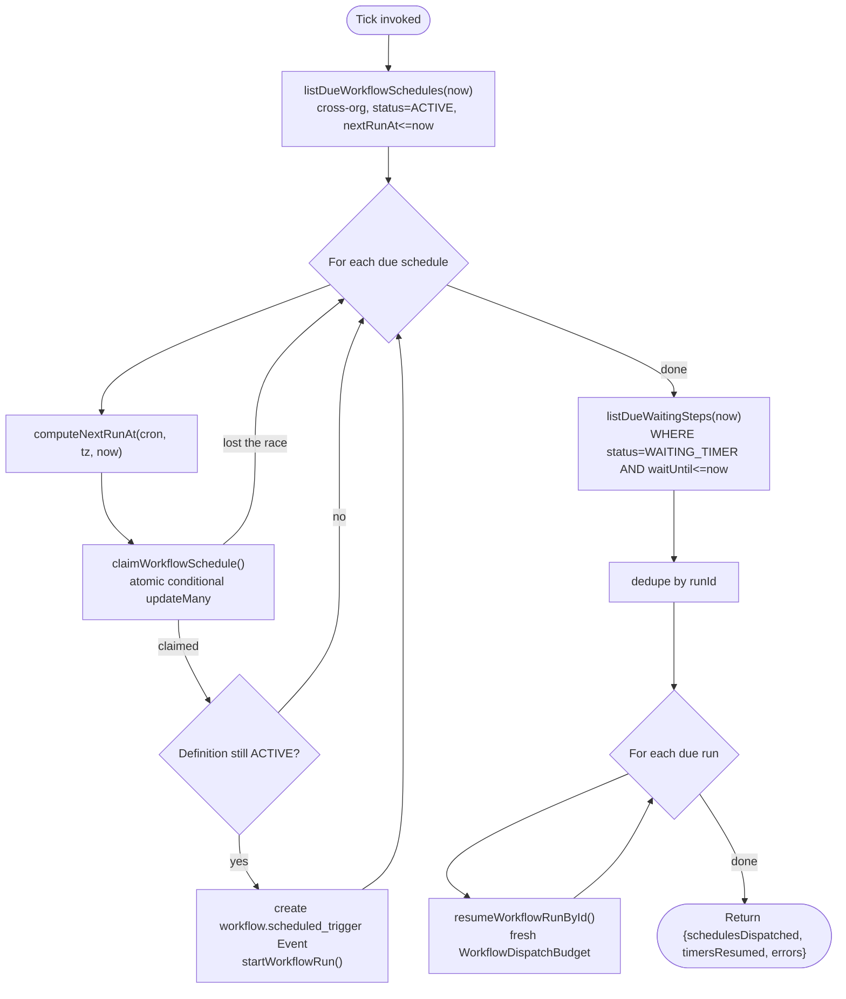

# Scheduler

## Scope

`apps/web/app/api/workflows/schedule/tick/route.ts` and
`apps/web/features/workflows/services/workflow-tick.service.ts` — the one door into every piece of
time-based workflow execution in this codebase: `SCHEDULED`-trigger workflows firing on a cron
expression, and `WAIT`/`DELAY` steps resuming once their deadline passes. This doc covers why that
endpoint is the *only* path (there is no background worker), its `CRON_SECRET` bearer-token auth and
why it fails closed, the atomic claim that prevents a schedule firing twice, `cron.ts`'s own documented
scope limits — and, verified directly against the source rather than assumed, a real gap in how (or
rather, how not) a `WorkflowSchedule` row ever comes to exist in the first place.

## The tick-based model: no in-process timer, ever

There is no `setTimeout`, `setInterval`, cron daemon, or background worker process anywhere in this
codebase's workflow platform. `workflow-tick.service.ts`'s own doc comment states this directly:

```ts
/**
 * The one entry point for all time-based workflow execution (Phase 8) — no
 * background worker exists anywhere in this codebase, so this only ever
 * runs when something external calls it. Genuinely cross-organization
 * (there is no session to scope by), which is why it calls the
 * deliberately-unscoped repository functions (`listDueWorkflowSchedules`/
 * `listDueWaitingSteps`) directly rather than going through any per-org
 * service. One workflow's failure never aborts the sweep for every other
 * organization's due work.
 */
export async function runWorkflowTick(): Promise<WorkflowTickResult> {
```

This is not a Phase 8-specific gap; it's a standing property of this codebase Phase 8 inherits and
states again explicitly. Phase 6's `expireStaleApprovalRequests` sweeps stale `ApprovalRequest` rows
opportunistically on lookup rather than on a timer; earlier phases' `SyncJob`/`EmbeddingJob` are
checked on access, not driven by a worker process. `runWorkflowTick` follows the same "no real worker
loop, checked on access" posture, with one necessary difference: a cron schedule or a `DELAY` step's
deadline is not something anyone happens to "access" — nothing reads it until it's due. So Phase 8
exposes exactly one HTTP endpoint that does the check, and relies on something *outside this codebase*
to call it periodically.

## `POST /api/workflows/schedule/tick`: the only door

```ts
/**
 * The only door into time-based workflow execution (Phase 8) — Scheduled
 * triggers and Delay/Wait-step resumption both go through here. Meant to be
 * called periodically by an external caller (Vercel Cron, a GitHub Actions
 * scheduled workflow, or an OS-level Task Scheduler entry) against
 * `CRON_SECRET` as a bearer token — never by a browser session, so this
 * intentionally has no CSRF check (no cookie/session exists to hijack) and
 * no `requireAuth` (there is no user). Fails closed (404, not 401/403) both
 * when `CRON_SECRET` is unset and when the provided secret doesn't match —
 * an unauthenticated prober should not be able to tell this endpoint exists
 * at all.
 */
export const POST = apiHandler(
  withRateLimit(
    async (request) => {
      const env = getEnv();
      if (!env.CRON_SECRET) throw new NotFoundError('Not found.');

      const provided = request.headers.get('authorization');
      const expected = `Bearer ${env.CRON_SECRET}`;
      if (!provided || !secureCompare(provided, expected)) throw new NotFoundError('Not found.');

      const result = await runWorkflowTick();
      return apiSuccess(result);
    },
    { limit: 6, windowSeconds: 60 },
  ),
);
```

Two properties worth naming precisely:

- **No user session anywhere in this call.** There is no `requireAuth()`, no `assertSameOrigin`, no
  cookie. This route is meant to be called by infrastructure, not a browser — the doc comment states it
  directly: "never by a browser session, so this intentionally has no CSRF check (no cookie/session
  exists to hijack)." Authorization is entirely the shared-secret header.
- **Fails closed as `404`, not `401`/`403`, in both failure modes.** An unset `CRON_SECRET` and a
  wrong/missing `Authorization` header both produce the identical `NotFoundError('Not found.')` — an
  unauthenticated prober gets no signal distinguishing "this endpoint doesn't exist," "you got the
  secret wrong," and "no secret is configured yet." Returning `401`/`403` would leak the fact that a
  real, protected endpoint lives at this URL; `404` gives an attacker nothing to work with.

The comparison itself uses `secureCompare`, not `===`:

```ts
/**
 * Constant-time string comparison for secret verification — checked for a
 * length mismatch first, because `node:crypto`'s `timingSafeEqual` throws
 * on unequal lengths rather than returning `false`, and letting that
 * exception propagate would itself be a timing/behavioral side-channel.
 */
export function secureCompare(a: string, b: string): boolean {
  const bufferA = Buffer.from(a);
  const bufferB = Buffer.from(b);
  if (bufferA.length !== bufferB.length) return false;
  return timingSafeEqual(bufferA, bufferB);
}
```

This same helper (`apps/web/features/workflows/lib/secure-compare.ts`) secures the inbound webhook
route's HMAC check too (see [Approvals](./approvals.md) and [Workflow Engine](./workflow-engine.md) for
the webhook path).

## `CRON_SECRET`: no default, deliberately

```ts
// Shared-secret header the tick endpoint (`POST /api/workflows/schedule/tick`)
// requires, compared via `crypto.timingSafeEqual` — fails closed (404) if
// unset. No default: an operator must deliberately set this to wire an
// external caller (Vercel Cron, GitHub Actions, OS Task Scheduler) to the
// tick URL.
CRON_SECRET: z.string().optional().or(z.literal('')),
```

Every other secret-shaped env var in this codebase either has a validated-fail-fast requirement or a
sane default; `CRON_SECRET` has neither — it is `optional().or(z.literal(''))`, meaning an unset or
empty value is a **valid, expected configuration state** that the route itself already handles (by
refusing every request with `404`). This is deliberate, not an oversight: there is no way for this
codebase to auto-generate a secret an operator hasn't yet told an external scheduler about, and a
silently-defaulted secret would create a false sense that scheduling "just works" out of the box when
nothing is actually calling the endpoint yet.

## Wiring an external caller: nothing fires until this is done

**State this plainly, the same honesty this codebase's docs use for every prior "no background worker"
limitation:** until an operator does the steps below, no `SCHEDULED`-trigger workflow will ever fire,
and no `WAIT`/`DELAY` step will ever resume, no matter how many are created or how long they wait. A
`WorkflowRun` sitting at `WAITING_TIMER` with a `waitUntil` in the past is not automatically noticed by
anything — it stays exactly as it is until a tick call happens to sweep it.

To make time-based execution actually work in a deployment:

1. **Set `CRON_SECRET`** to a long, random value in the deployment's environment configuration.
2. **Wire an external caller to `POST /api/workflows/schedule/tick`**, sending
   `Authorization: Bearer <CRON_SECRET>`, on a recurring interval short enough to satisfy the shortest
   cron granularity or `DELAY` an organization actually configures (a schedule matching "every minute"
   needs the tick called at least that often to fire on time; a tick call that only happens every 15
   minutes will still fire a due schedule, just up to ~15 minutes late — `listDueWorkflowSchedules`/
   `listDueWaitingSteps` are simple "is this due yet" queries, not a precise-instant trigger). Options
   this codebase's own comments name explicitly:
   - **Vercel Cron** (a `vercel.json` cron entry hitting the route on a schedule) — the natural choice
     if this app is deployed to Vercel.
   - **A GitHub Actions scheduled workflow** (`on: schedule`) making an authenticated `curl`/`fetch`
     call to the deployed tick URL.
   - **An OS-level Task Scheduler entry** (cron on Linux, Task Scheduler on Windows) if running on a
     traditional server, calling the same URL with the same header.
3. **Rate limiting is already handled** — the route is wrapped in
   `withRateLimit({ limit: 6, windowSeconds: 60 })`, so an external caller should not need to call more
   often than once every ~10 seconds regardless of how aggressive its own schedule is.

None of this is optional infrastructure glue outside the application's concern — it is the literal
mechanism by which `SCHEDULED` triggers and `WAIT`/`DELAY` resumption work at all. A deployment that
skips it has a fully functional event-driven and manually-triggered workflow platform, and zero
time-based execution.

## A confirmed gap: nothing in this codebase ever creates a `WorkflowSchedule` row

This is stated plainly because it changes what "wire up the cron caller" above actually buys an
operator, and it does not appear to be documented anywhere else in this codebase. It was verified, not
assumed, by exhaustively grepping every `*.ts`/`*.tsx` file under `apps/web` (excluding build output)
for the repository functions that touch the `WorkflowSchedule` table.

`packages/database/src/repositories/workflow-schedules.ts` defines four functions:

```ts
export async function createWorkflowSchedule(data: CreateWorkflowScheduleData): Promise<WorkflowScheduleData> {
  return prisma.workflowSchedule.create({ data });
}
export async function getWorkflowScheduleByDefinitionId(workflowDefinitionId: string, organizationId: string) { ... }
export async function pauseWorkflowSchedule(id: string, organizationId: string): Promise<boolean> { ... }
export async function resumeWorkflowSchedule(id: string, organizationId: string): Promise<boolean> { ... }
```

None of `createWorkflowSchedule`, `getWorkflowScheduleByDefinitionId`, `pauseWorkflowSchedule`, or
`resumeWorkflowSchedule` is imported anywhere under `apps/web` outside this one repository file. The
only two functions actually called from application code are `listDueWorkflowSchedules` and
`claimWorkflowSchedule` — both from inside `workflow-tick.service.ts` itself, both **reads/claims
against rows that must already exist**. `WorkflowDefinitionService.create` (the service every
create-workflow path, including template instantiation, ultimately calls) never touches
`WorkflowSchedule` either — it only writes the `WorkflowDefinition` row itself. There is no seed data
creating one (`packages/database/prisma/seed.ts` contains zero references to `WorkflowSchedule`), and
`prisma.workflowSchedule.create(...)` appears exactly once in this entire repository, inside the
`createWorkflowSchedule` function that nothing calls.

Concretely, this means: an organization can build a `SCHEDULED`-trigger workflow (for example, by
instantiating the `weekly-project-report` template — see [Templates](./templates.md)) and publish it to
`ACTIVE`. `listDueWorkflowSchedules` — the query the tick sweep's schedule half runs — only ever
returns rows from the `WorkflowSchedule` table, and today, nothing in this codebase ever inserts a row
into it. So even with `CRON_SECRET` set and an external caller correctly wired up and firing every
minute, **a `SCHEDULED`-trigger workflow will never fire**, because it has no `WorkflowSchedule` row to
be found by. The `WAIT`/`DELAY`-step resumption half of the tick sweep (`listDueWaitingSteps`,
operating on `WorkflowRunStep.waitUntil`) is unaffected by this — those rows *are* written, by
`driveWorkflowRun` itself, so `customer-follow-up-reminder`-style `DELAY` steps resume correctly once
the tick endpoint is wired up (see below).

This should be read as a real, currently-unclosed gap between the schema/repository layer and the rest
of the application, not a documentation nuance — the `WorkflowSchedule` model, its repository functions,
and the tick endpoint's schedule-sweep half are all fully built and internally consistent; what's
missing is the one piece that would let an organization actually attach a cron expression and timezone
to a published `SCHEDULED` workflow through the product. Closing it would mean adding a route (or
extending `POST /api/workflows/[id]/publish`, or a new endpoint alongside it) that calls the existing
`createWorkflowSchedule` with a caller-supplied `cronExpression`/`timezone`, computing the first
`nextRunAt` via the existing `computeNextRunAt`.

## What `runWorkflowTick` actually does

```ts
export async function runWorkflowTick(): Promise<WorkflowTickResult> {
  const dueSchedules = await listDueWorkflowSchedules(now);
  for (const schedule of dueSchedules) {
    try {
      const nextRunAt = computeNextRunAt(schedule.cronExpression, schedule.timezone, now);
      const claimed = await claimWorkflowSchedule(schedule.id, schedule.nextRunAt, nextRunAt, now);
      if (!claimed) continue; // another concurrent tick invocation already claimed this firing
      // ... build workflow.scheduled_trigger Event, fresh budget, startWorkflowRun()
      schedulesDispatched += 1;
    } catch (error) {
      errors += 1;
    }
  }

  const dueSteps = await listDueWaitingSteps(now);
  // grouped by runId — a run with multiple due steps is only resumed once
  for (const [runId, organizationId] of runsToResume) {
    try {
      // ... resumeWorkflowRunById()
      timersResumed += 1;
    } catch (error) {
      errors += 1;
    }
  }

  return { schedulesDispatched, timersResumed, errors };
}
```



Two independent sweeps in one call, each wrapped per-item in its own `try`/`catch` — "one workflow's
failure never aborts the sweep for every other organization's due work." The response body
(`WorkflowTickResult { schedulesDispatched, timersResumed, errors }`) is the caller's only feedback;
there is no separate alerting mechanism, so an operator wiring this up should watch the `errors` count
(or the structured `log.error` entries) if they want to notice a persistently-failing schedule.

**Schedule sweep:** `listDueWorkflowSchedules` finds every `ACTIVE` `WorkflowSchedule` whose
`nextRunAt <= now`, cross-organization (there is no session to scope by — the one deliberate exception
to this codebase's "every service function takes `organizationId` first" convention, kept in a
repository function structurally separate from every other workflow repository function). For each due
schedule, `computeNextRunAt` (below) computes the *next* firing before attempting to claim this one, and
`claimWorkflowSchedule` atomically advances `nextRunAt` — only if it still matches what was just read.

**Timer sweep:** `listDueWaitingSteps` finds every `WorkflowRunStep` with `status = WAITING_TIMER AND
waitUntil <= now()` (the same index, `@@index([status, waitUntil])`, that makes this a cheap query),
also cross-organization, grouped by `runId` so a run with multiple due steps is only resumed once per
tick. `resumeWorkflowRunById` re-enters the re-entrant driver ([Workflow Engine](./workflow-engine.md)),
with a fresh `WorkflowDispatchBudget` for this resume.

## The atomic claim: `claimWorkflowSchedule`

```ts
/**
 * Atomic claim — mirrors `ApprovalRequest`'s single-use-enforcement idiom
 * via a conditional `updateMany`: only succeeds (returns `true`) if
 * `nextRunAt` still matches what the caller last read, preventing two
 * overlapping tick invocations from both dispatching the same firing.
 */
export async function claimWorkflowSchedule(
  id: string,
  expectedNextRunAt: Date,
  newNextRunAt: Date,
  firedAt: Date,
): Promise<boolean> {
  const result = await prisma.workflowSchedule.updateMany({
    where: { id, nextRunAt: expectedNextRunAt },
    data: { nextRunAt: newNextRunAt, lastRunAt: firedAt },
  });
  return result.count === 1;
}
```

This is the exact same idiom `ApprovalRequest.transitionApprovalRequest` uses for single-use approval
enforcement (see [Approvals](./approvals.md)) — the `where` clause includes the value the caller
believes is still current (`nextRunAt: expectedNextRunAt`), so the write only lands if nothing else has
already changed it. Two overlapping tick invocations (a retried external call, or two schedulers both
configured against the same endpoint by mistake) racing on the same due schedule both compute a
`nextRunAt` and both attempt this `updateMany`; whichever one the database processes first wins, and
the loser's `where` no longer matches (`nextRunAt` has already moved), so its `count` comes back `0`
and `runWorkflowTick` simply `continue`s past it — no duplicate `WorkflowRun` is ever started for the
same firing.

`ONE_TIME_SENTINEL` (`cronExpression = 'ONCE'`) is the one-shot-schedule case: `computeNextRunAt`
returns `NEVER_AGAIN` (JS's actual max `Date` value) for it, so after firing once, `claimWorkflowSchedule`'s
own advance sets `nextRunAt` so far in the future that `listDueWorkflowSchedules` will never select this
row again — retiring a one-time schedule without a separate pause code path.

`WorkflowScheduleStatus` also defines `PAUSED` alongside `ACTIVE`, and `pauseWorkflowSchedule`/
`resumeWorkflowSchedule` exist in the repository layer to toggle it — but per the gap above, since
nothing creates a `WorkflowSchedule` row to begin with, these two functions are equally unreached from
application code today.

## `cron.ts`'s documented scope limits

```ts
/**
 * A minimal, self-contained cron evaluator (Phase 8) — no cron-parsing
 * dependency exists anywhere in this monorepo, and adding a new dependency
 * for standard 5-field cron matching is more than this phase needs.
 * Supports a wildcard, exact numbers, comma lists, and step values (a
 * wildcard followed by a slash and a number, e.g. every-5-minutes) — NOT
 * ranges (e.g. one-through-five) — a deliberate, documented scope limit,
 * not an oversight. Time-zone aware via `Intl.DateTimeFormat`'s `timeZone`
 * option, so "every Monday 9am America/New_York" is evaluated against that
 * zone's wall-clock fields, not the server's local time or UTC.
 */
```

`cron.ts` is a from-scratch, dependency-free evaluator. Its scope, precisely:

- **Exactly 5 space-separated fields** — minute, hour, day-of-month, month, day-of-week. A 6-field
  (seconds) or 7-field (year) expression throws `InvalidCronExpressionError`.
- **Supported per-field syntax:** a bare wildcard (`*`), an exact number, a comma-separated list of
  numbers (`1,15,30`), and a step value (`*/5` — "every 5 units"). Three-letter weekday names
  (`MON`–`SUN`) are normalized to their numeric index in the day-of-week field.
- **NOT supported: ranges** (`1-5`) — a deliberate, documented scope limit, not an oversight. A workflow
  author who wants "every weekday" must currently spell it out as `1,2,3,4,5`, not `1-5`.
- **Time-zone aware**, via `Intl.DateTimeFormat`'s `timeZone` option — every field is matched against
  the *local wall-clock time in the schedule's own configured `timezone`*, not the server's local time
  and not UTC. "Every Monday 9am America/New_York" evaluates correctly regardless of where the process
  computing it happens to be running or what time zone its host OS is set to.
- **`computeNextRunAt`'s search is bounded** — it walks forward minute by minute, capped at
  `MAX_LOOKAHEAD_MINUTES` (just over a year). A cron expression that can never match anything (a
  contradictory combination of day-of-month and month, for instance) throws `InvalidCronExpressionError`
  after exhausting that search, rather than looping forever — "a schedule matching nothing within a
  year is a configuration error, not something to search forever."

None of these limits are silent — an expression this evaluator can't handle throws immediately, either
at `parseCron` (wrong field count) or at the end of a year-long fruitless search (`computeNextRunAt`),
never producing a wrong or approximate answer.

## What this does NOT do

- **No background worker, scheduler process, or cron daemon shipped with this codebase.** The
  application itself never initiates a scheduled or timer-resumed run on its own.
- **No code path anywhere creates, pauses, or resumes a `WorkflowSchedule` row.** Covered in full above
  — the single most important, concretely verifiable gap in this doc.
- **No range syntax in cron expressions** (`1-5`). Use an explicit comma list instead.
- **No seconds-level cron precision.** The evaluator is strictly 5-field, minute-granularity — the
  finest schedule expressible is "every minute" (`* * * * *`), not "every 30 seconds."
- **No per-schedule retry or backoff if a tick call itself never happens.** If no external caller
  invokes the tick endpoint for an extended window, every schedule that became due during that window
  simply fires (once, on the next tick that does happen) at whatever `now()` the next successful tick
  observes — there's no catch-up mechanism that fires a schedule multiple times to make up for missed
  windows, and no alert generated purely from the *absence* of tick calls.
- **No dynamic tick-interval configuration inside this codebase.** How often the external caller polls
  the tick endpoint is entirely the operator's own scheduler configuration — nothing here negotiates or
  advertises a desired polling interval.

## Documentation index

- **[Overview](./overview.md)** — the full trigger chain a scheduled or timer-resumed run flows
  through once `runWorkflowTick` starts or resumes it.
- **[Approvals](./approvals.md)** — `ApprovalRequest.transitionApprovalRequest`, the atomic `updateMany`
  idiom `claimWorkflowSchedule` mirrors.
- **[Workflow Engine](./workflow-engine.md)** — the re-entrant driver `resumeWorkflowRunById` re-enters,
  and the `WAIT`/`DELAY` step handlers that produce the `waitUntil` rows this doc's timer sweep resumes.
- **[Retries & Rollback](./retries.md)** — what happens to a `WorkflowRun` if a resumed step then fails.
