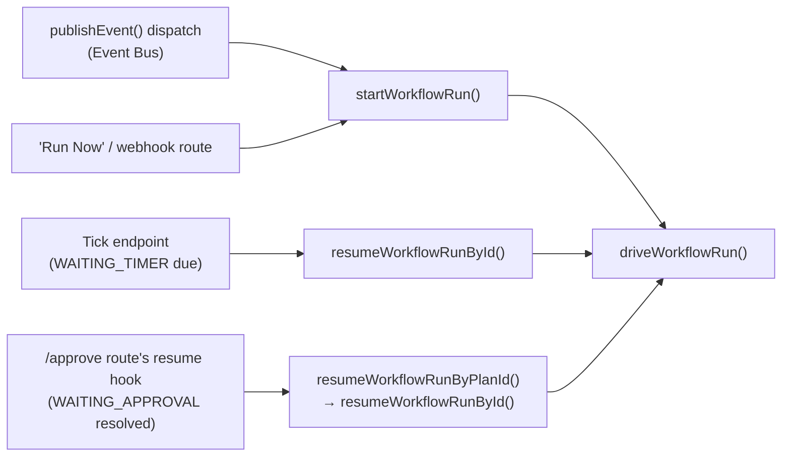
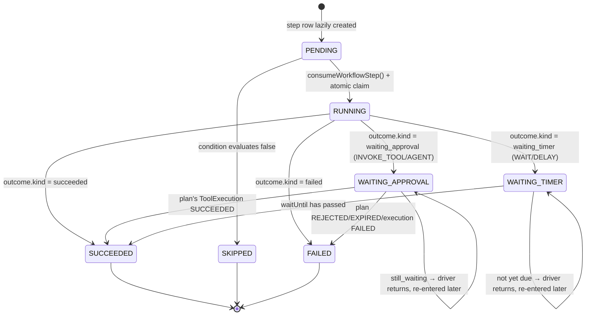

# Workflow Engine

## Scope

`apps/web/features/workflows/services/workflow-run.service.ts` (the re-entrant `WorkflowRun` driver),
`apps/web/features/workflows/lib/workflow-dispatch-budget.ts` (the step-count/time/cycle budget every
synchronous dispatch chain is bounded by), `apps/web/features/workflows/lib/workflow-graph.ts` (the
graph shape a `WorkflowDefinition.graph` column stores), `apps/web/features/workflows/lib/step-handler.ts`
(the Step Handler SDK), `apps/web/features/workflows/registry.ts` (the registry wiring the two
together), `apps/web/features/workflows/lib/workflow-condition.ts` (the trigger-level condition tree),
and the 10 concrete handlers under `apps/web/features/workflows/step-handlers/`. This doc covers the
graph shape and why it reuses Phase 6's `dag.ts` rather than forking it, the re-entrant driver's whole
reason for existing, `WorkflowDispatchBudget`'s two independent guards, and each of the 10 step types'
real params/output shape as implemented — not as designed on paper.

## The graph shape: `WorkflowStepDefinition` extends `dag.ts`'s `GraphStep`

```ts
/**
 * A `WorkflowDefinition.graph`'s shape — a flat DAG via `dependsOn`, reusing
 * `dag.ts`'s `computeLayers`/`validatePlanSteps` instead of a Phase-8-
 * specific graph engine. `stepType` stands in for
 * `ExecutionStepDefinition.toolKey`/`version` — a workflow step names a
 * STEP TYPE (one of the 10 developer-defined handlers), never a tool
 * directly; `INVOKE_TOOL` steps carry the actual `toolKey` inside `params`.
 */
export interface WorkflowStepDefinition extends GraphStep {
  stepType: WorkflowStepType;
  /** May contain `$steps.<key>.output.<path>` references, resolved via `dag.ts`'s `resolveStepParams` — identical syntax to Phase 6 Plan Graph params. */
  params: Record<string, unknown>;
  condition?: StepCondition;
  retry?: RetryPolicy;
}

export interface WorkflowGraphDefinition {
  steps: WorkflowStepDefinition[];
}
```

Nothing about `computeLayers`/`validatePlanSteps` (Phase 6's planner, `apps/web/features/planner/lib/dag.ts`)
actually needs to know about `toolKey`/`version` — both functions only ever touch `key` and
`dependsOn`. `dag.ts` makes that minimal dependency explicit as its own exported type, generalized so
Phase 8 can reuse the identical algorithm rather than fork it:

```ts
/** The minimal shape `validatePlanSteps`/`computeLayers` actually need. This is what lets Phase 8's `WorkflowStepDefinition` (a different shape — `stepType` instead of `toolKey`/`version`) reuse the same graph-layering algorithm instead of forking it; `T` is inferred automatically. */
export interface GraphStep {
  key: string;
  dependsOn: string[];
}

export function validatePlanSteps<T extends GraphStep>(steps: T[]): void { /* cycle/duplicate/unknown-dependency checks */ }
export function computeLayers<T extends GraphStep>(steps: T[]): PlanGraph { /* Kahn's-algorithm topological layering */ }
```

`workflow-run.service.ts`'s `driveWorkflowRun` calls `validatePlanSteps(graph.steps)` and
`computeLayers(graph.steps)` directly on `WorkflowStepDefinition[]` — the exact same cycle-detection,
duplicate-key-detection, and topological layering Phase 6 plans use, with `T` inferred as
`WorkflowStepDefinition` automatically. Sequential dependency, implicit same-layer parallelism, and
per-step `RetryPolicy` all fall out of this reuse for free. Param resolution is the same reuse too:
`resolveStepParams`/`resolveParamValue` (`dag.ts`) resolve a step's `$steps.<key>.output.<path>`
references — including a ` ?? ` fallback-chain syntax — against a `Record<string, StepRuntimeInfo>` the
driver builds from `WorkflowRunStep` rows, identical syntax and identical
resolve-once-per-step-immediately-before-it-runs timing to Phase 6's Plan Graph params.

A workflow step's own `condition` (`StepCondition`, a named predicate from
`apps/web/features/planner/lib/condition-registry.ts`) is a distinct mechanism from a workflow's
*trigger-level* `WorkflowConditionNode` tree (`workflow-condition.ts`) — the driver's own comment draws
this line explicitly: "Phase 6-style named predicate, distinct from the workflow-level trigger
`WorkflowConditionNode` tree." The former gates whether one step inside an already-running graph
executes (the IF-EXISTS/ELSE pattern, reused verbatim from Phase 6); the latter gates whether an
*event* is even eligible to start a run in the first place (see [Event Bus](./event-bus.md)).

`WorkflowDefinitionService.publish` (`apps/web/features/workflows/services/workflow-definition.service.ts`)
checks every step's `stepType` resolves against the step-handler registry (`registry.get(step.stepType)`)
before a `DRAFT` can ever become `ACTIVE` — an unknown step type is caught at publish time, not
discovered mid-execution.

## The trigger-level condition tree

`workflow-condition.ts` extends `condition-registry.ts` for its one leaf type that needs a live DB
lookup (`predicate`) rather than duplicating the AND/OR/NOT tree logic:

- **Node types (`WorkflowConditionNode`):** `comparison{field, operator, value}` (operators: `eq|neq|gt|gte|lt|lte|contains|startsWith|endsWith|in`), `date{field, operator, value}` (operators: `before|after|onOrBefore|onOrAfter`; `value` may be the literal `"now"`, resolved at evaluation time — never cached from workflow-creation time), `predicate{predicate, args, negate?}` (delegates to `condition-registry.ts`'s `evaluateCondition`), `and{nodes}`, `or{nodes}`, `not{node}`.
- **`resolveField(context, "payload.status")`-style dot-path resolution** against the triggering event's own payload.
- **`evaluateWorkflowCondition`** recurses through the tree; a `predicate` node throws if the predicate
  name isn't registered — "unknown predicate is a build-time-catchable mistake, not a silent false."

`condition-registry.ts` registers exactly 2 predicates: `project_exists_by_title` (used by Phase 6's
`create_project`/`update_project` IF-EXISTS/ELSE Plan template) and `user_has_role` (added for
workflow "User filters"):

```ts
/**
 * Phase 8: Workflow "User filters" — a named predicate (not a plain payload
 * comparison, since it needs a live DB lookup).
 */
async user_has_role(organizationId, args) {
  const membership = await prisma.membership.findUnique({ where: { userId_organizationId: { userId: args.userId, organizationId } } });
  if (!membership) return false;
  return ROLE_HIERARCHY[membership.role] >= ROLE_HIERARCHY[args.role];
},
```

`role` uses the same "at least this role" comparison `roleSatisfies` uses for approval-gate checks (see
[Approvals](./approvals.md)), not exact equality — a condition of
`{ predicate: 'user_has_role', args: { userId, role: 'MEMBER' } }` matches an `ADMIN` or `OWNER` too.

## `WorkflowDispatchBudget`: two independent guards

`apps/web/features/workflows/lib/workflow-dispatch-budget.ts` explicitly mirrors
`agents/lib/delegation-budget.ts` (docs/agents.md) for the identical reason: a step-count/time budget
alone bounds waste but not runaway-before-detection; a cycle guard is what stops a loop before it runs
at all. The concretely motivating case its own comment cites: "a workflow that fires on `AI_INSIGHT`
and itself calls `InsightService.record()` as one of its own effects."

```ts
export interface WorkflowDispatchBudget {
  stepsRemaining: number;
  deadlineAt: number;                          // Date.now()-comparable wall-clock deadline
  visitedWorkflowDefinitionIds: Set<string>;
}

export function createWorkflowDispatchBudget(maxSteps: number, maxMs: number): WorkflowDispatchBudget { ... }

export function enterWorkflowDispatch(budget: WorkflowDispatchBudget, id: string): void {
  if (budget.visitedWorkflowDefinitionIds.has(id)) throw new WorkflowCyclicDispatchError(id);
  budget.visitedWorkflowDefinitionIds.add(id);
}

export function consumeWorkflowStep(budget: WorkflowDispatchBudget): void {
  if (budget.stepsRemaining <= 0 || Date.now() >= budget.deadlineAt) throw new WorkflowDispatchBudgetExhaustedError();
  budget.stepsRemaining -= 1;
}
```

- **Cycle guard (`enterWorkflowDispatch`)** — throws `WorkflowCyclicDispatchError` if the same
  `WorkflowDefinition.id` is already in `visitedWorkflowDefinitionIds` for this budget, checked and
  thrown *before* a candidate run starts, mutated only on success. Refuses to start a second run of the
  *same* definition within one synchronous dispatch chain.
- **Step/time backstop (`consumeWorkflowStep`)** — throws `WorkflowDispatchBudgetExhaustedError` if
  `stepsRemaining <= 0` **or** `Date.now() >= deadlineAt`, else decrements. The deadline is *checked*,
  not just decremented alongside the count, so a chain of slow steps can't quietly exceed the wall-clock
  budget even while `stepsRemaining` is still positive. Called once per synchronous step of *any* type
  — including once per `LOOP` iteration.

`createWorkflowDispatchBudget(maxSteps, maxMs)` is seeded from `env.WORKFLOW_MAX_SYNC_STEPS` (default
20, max 100) and `env.WORKFLOW_MAX_SYNC_MS` (default 5000ms, max 30000) — `packages/shared/src/env.ts`.

Each entry point that starts or resumes a run builds its **own fresh budget** — a resumed run's
remaining work is bounded independently of whatever consumed the budget of the event that originally
triggered it, since by the time a resume happens (after a human approves, or a timer elapses) the
original synchronous dispatch call has long since returned.

## The Step Handler SDK and registry

```ts
/**
 * The Step Handler SDK — mirrors `ToolDefinition`'s "code owns behavior"
 * shape exactly, but for the ~10 fixed step TYPES rather than an open-ended
 * set of tools.
 */
export interface WorkflowStepHandler {
  stepType: WorkflowStepType;
  execute(ctx: WorkflowStepHandlerContext, params: Record<string, unknown>, budget: WorkflowDispatchBudget): Promise<WorkflowStepOutcome>;
}
```

`WorkflowStepHandlerContext` carries `organizationId`, `ownerId: string | null` (the workflow's owner,
the accountable party for any write a run proposes — a workflow with a write step cannot be published
without one, see [Approvals](./approvals.md)), `runId`, `workflowDefinitionId`, and the triggering
`Event`. `WorkflowStepOutcome` is a 5-case discriminated union every handler returns:

| Outcome | Meaning |
|---|---|
| `succeeded { output }` | Step finished; `output` is available to later steps via `$steps.<key>.output.<path>` |
| `skipped` | The step's `condition` evaluated false |
| `waiting_approval { planId }` | An `INVOKE_TOOL`/`INVOKE_AGENT` step proposed a write; the run pauses |
| `waiting_timer { waitUntil }` | A `WAIT`/`DELAY` step is pausing until a point in time |
| `failed { error, continueOnFailure? }` | The step failed — see [Retries & Rollback](./retries.md) |

`apps/web/features/workflows/registry.ts` is the single file that imports every concrete handler,
mirroring `apps/web/features/tools/registry.ts`/`apps/web/features/agents/registry.ts` exactly:

```ts
const ALL_HANDLERS: WorkflowStepHandler[] = [
  readDataHandler, searchKnowledgeHandler, invokeAgentHandler, invokeToolHandler,
  waitHandler, branchHandler, delayHandler, loopHandler, notificationHandler, generateReportHandler,
];
```

`event-bus.service.ts` and `workflow-run.service.ts` only ever call `registry.get(stepType)`, never
import a concrete `*.handler.ts` file directly.

## The re-entrant driver: why this isn't `ExecutionService` reused

`workflow-run.service.ts`'s own doc comment states the one design choice this whole engine turns on:

```ts
/**
 * The re-entrant Workflow Run driver — NOT a reuse of `execution.service.ts`'s
 * driver: that one assumes an entire DAG layer resolves in one synchronous
 * pass, which cannot survive a Wait/Delay step with a downstream dependent
 * in a later layer. This driver is repeatedly invocable (from
 * `publishEvent()`, the tick endpoint, or a manual resume call) and picks up
 * exactly where persisted `WorkflowRunStep` rows left off — the same
 * "explicitly invoked, one step at a time, state persists" shape
 * `GoalService.advance()` already established.
 */
```

`ExecutionService.executeApprovedPlan` (Phase 6) is a single async generator that runs every layer of
an approved plan to completion in one call — every tool it invokes either returns or throws within that
one request. A workflow step can do neither: `DELAY`/`WAIT` return `waiting_timer` and expect to be
resumed *later*, possibly days later; `INVOKE_TOOL`/`INVOKE_AGENT` return `waiting_approval` and expect
to be resumed only after a human acts. There is no way to keep an HTTP request (or even a process)
alive across either gap. So `driveWorkflowRun` is written to be safely re-called: it reloads every
already-created `WorkflowRunStep` row by `key`, skips anything already in a terminal status
(`isTerminalStepStatus`, reused from `dag.ts`), and for a step still `WAITING_APPROVAL`/`WAITING_TIMER`
checks whether the wait is now over — if not, it persists `WorkflowRun.status` accordingly and returns
immediately, doing nothing further, ready to be called again later with no lost or duplicated work.

**`MAX_ACTIVE_RUNS_PER_DEFINITION = 5`** — an honest, bounded mitigation for a gap its own comment
states explicitly: the dispatch budget's cycle guard only protects *one synchronous dispatch chain*; it
cannot see across an approval gap, since resuming after a human approval (hours/days later) necessarily
starts a fresh in-memory budget. A workflow whose own approved write re-publishes a matching trigger
event could spawn a new generation on every approval, forever. A fully correct fix (threading
`correlationId` through the entire approval chain) is explicitly out of scope. `startWorkflowRun` throws
`WorkflowRunLimitExceededError` if `countActiveRunsForDefinition >= 5`.

### Three entry points, one driver



- **`startWorkflowRun(definition, event, budget)`** — checks the active-run cap, creates a `WorkflowRun`
  row (`status: RUNNING`, `correlationId`/`causationId` from the triggering event), then
  `driveWorkflowRun`.
- **`resumeWorkflowRunById(runId, organizationId, definition, event, budget)`** — called by the tick
  endpoint (`WAITING_TIMER`) and the approval-resume hook (`WAITING_APPROVAL`). No-ops on terminal
  statuses (`COMPLETED|FAILED|CANCELLED|ROLLED_BACK`). Gets a **fresh budget** each resume.
- **`resumeWorkflowRunByPlanId(planId, organizationId)`** — the hook `POST /api/execution/[id]/approve`
  calls after its own SSE stream completes (see [Approvals](./approvals.md)). Resolves which
  `WorkflowRunStep` (if any) owns `planId` — most approvals are *not* workflow-originated, so this is a
  no-op, not an error, when it isn't.

### `driveWorkflowRun(definition, run, event, budget)` — the actual engine loop



1. `graph = definition.graph`; `validatePlanSteps(graph.steps)`; `planGraph = computeLayers(graph.steps)`
   — the same Kahn's-algorithm topological layering Phase 6's Plan Graph uses, generalized via the
   `GraphStep` minimal interface so `WorkflowStepDefinition` satisfies it without a fork.
2. Loads `existingSteps` via `listWorkflowRunSteps(run.id)`, indexed by `key`.
3. A `WorkflowStepHandlerContext` is built once.
4. **`for (const layer of planGraph.layers) { for (const key of layer) { ... } }`** — layers run
   sequentially; within a layer, steps are visited in a plain `for` loop, **not `Promise.all`** —
   unlike Phase 6's execution engine, which does run a layer's steps concurrently. There is no
   `Promise.all` anywhere in this function.
5. **Lazy step-row creation** — for each key in the layer not yet in `stepRowByKey`, creates a
   `PENDING` `WorkflowRunStep` row from the graph's static step definition.
6. **Per-step dispatch, by current status:**
   - **Terminal status** (`isTerminalStepStatus`) → `continue` — already done.
   - **`WAITING_APPROVAL`** — calls `tryResolveWaitingApproval` (below). If `still_waiting`, sets
     `WorkflowRun.status = WAITING_APPROVAL` and **returns** — the whole drive call ends here, ready to
     be re-invoked later. Otherwise atomically claims the step (a conditional update only one
     concurrent invocation can win — closes a race where a double-clicked Approve or a retried SSE
     request could resolve the same step twice; the loser stops its whole drive invocation since it
     can't safely know how far the winner got downstream). On `failed`, records the error and calls
     `failRun`. On `succeeded`, records the output and continues to the next step in the layer.
   - **`WAITING_TIMER`** — if `waitUntil` hasn't passed, sets run status to `WAITING_TIMER` and
     **returns**. Otherwise the same atomic-claim protection, marks `SUCCEEDED` with
     `{ resumedAt: ISO }` output.
   - **`PENDING`** — evaluates the step's own `condition` first; if false, marks `SKIPPED` and
     `continue`s. Otherwise `consumeWorkflowStep(budget)` (throws `WorkflowDispatchBudgetExhaustedError`
     if exhausted — caught, fails the step and the run). Resolves params via `resolveStepParams`.
     Looks up the handler; if none registered, fails the step+run. Atomically claims
     `PENDING → RUNNING`. Sets `startedAt`. Calls `handler.execute(...)` inside a try/catch that
     converts a thrown error into a `failed` outcome. Switches on `outcome.kind`: `succeeded` → persist
     output, `SUCCEEDED`; `skipped` → `SKIPPED`; `waiting_approval` → persist `planId`, set run status
     `WAITING_APPROVAL`, **return**; `waiting_timer` → persist `waitUntil`, set run status
     `WAITING_TIMER`, **return**; `failed` → persist error; if `!outcome.continueOnFailure`, call
     `failRun` and **return**, else mark `FAILED` and continue the layer (see
     [Retries & Rollback](./retries.md) for `continueOnFailure`).
7. If every layer completes without an early return: `updateWorkflowRunStatus(run.id, { status:
   'COMPLETED', completedAt })`, then publishes a `workflow.notification` event with
   `payload: { status: 'completed' }`.

**`tryResolveWaitingApproval(step, organizationId)`** checks `getToolExecutionByPlanId` first — if a
`ToolExecution` exists, `SUCCEEDED` → `succeeded { toolExecutionId }`, `FAILED`/`ROLLED_BACK` →
`failed`, else `still_waiting`. If no execution yet, checks `getApprovalRequestByPlanId` —
`REJECTED`/`EXPIRED` → `failed`, else `still_waiting`. See [Approvals](./approvals.md) for the full
chain this reads from.

## The 10 step types

### `READ_DATA`

Reads one record by entity type and id, straight from `@bond-os/database` repository functions —
deliberately not the feature service layer (`getProjectService`, etc.), since those services are
transitively reachable *from* the workflow engine already via `proposeAction`'s Tool Registry for an
`INVOKE_TOOL` step, and importing them here would close a real circular import (see
[Event Bus](./event-bus.md)'s dynamic-import section for the same boundary from the domain-service
side). No `requireRole` re-check — `ctx.organizationId` is already trusted by the time this handler
runs (an already-authenticated write, a secret-verified tick, or a signature-verified webhook started
the chain).

- **Params:** `{ entityType: 'project' | 'task' | 'meeting' | 'customer' | 'document' | 'knowledgeDocument', id: string }`
- **Output (`succeeded`):** `{ record: <the entity> }`
- Throws `ValidationError` for an unknown `entityType`, `NotFoundError` if the record doesn't resolve in
  `ctx.organizationId`.

### `SEARCH_KNOWLEDGE`

Calls the same hybrid-search primitive (`retrieve()`, `apps/web/features/retrieval/services/retrieval.service.ts`)
Bond's own `search` read-tool and every retrieval-driven surface already use — never bypasses
retrieval, matching the RAG pipeline's own "no shortcuts" rule.

- **Params:** `{ query: string, limit?: number }` (`limit` defaults to `10`)
- **Output:** `{ results: Array<{ ref, title, snippet }> }`

### `INVOKE_AGENT`

Resolves an agent via the same `AgentRegistryService` Phase 7's Coordinator/specialists use, requires
`ctx.ownerId` (throws `ValidationError` otherwise), resolves the owner's `Membership` (throws
`ForbiddenError` if they've left the org), **creates a real `Conversation`** titled `"Workflow run
{runId}"` — required because `runThinkLoop`'s action-marker handling needs `ctx.conversationId` to
persist a proposed plan; an earlier version omitting this broke mid-workflow action proposals. Builds a
real `AgentContext` + fresh root `DelegationBudget`, calls `agent.think(...)`. If the agent's stream
emits `action_proposed`, the step becomes `waiting_approval` with that `planId` — the same terminal
state an `INVOKE_TOOL` step reaches, no special-casing needed.

- **Params:** `{ agentKey: string, question: string }`
- **Output (`succeeded`):** `{ agentKey, answer: string }`
- **Or:** `waiting_approval { planId }` if the agent's turn produced an action.

### `INVOKE_TOOL`

The **only** way a workflow reaches a write. Requires `ctx.ownerId`. Calls the same `proposeAction()`
Mr. Bond's `<<ACTION:...>>` marker and Phase 7's agent action-marker handling already call. **Always
returns `waiting_approval`** — never executes anything itself; the run stays paused until a human
approves via the unmodified `POST /api/execution/[id]/approve`. See [Approvals](./approvals.md).

- **Params (single tool):** `{ __toolKey: string, __version?: string, ...toolParams }`
- **Params (compound plan):** `{ __plan: { summary: string, steps: [...] } }` — mirrors
  `PlanRequestInput`'s own discriminated `single`/`compound` shape.
- **Output:** always `{ kind: 'waiting_approval', planId }`.

### `WAIT`

Pauses until a specific point in time.

- **Params:** `{ until: string }` — an ISO timestamp.
- **Output:** `waiting_timer { waitUntil }` if `until` is still in the future; otherwise resolves
  immediately with `succeeded { waitedUntil: until }`.

### `DELAY`

Pauses a fixed duration from when the step first ran (as opposed to `WAIT`'s fixed point in time).

- **Params:** `{ durationMs: number }` — must be positive and at most 30 days
  (`MAX_DELAY_MS = 1000 * 60 * 60 * 24 * 30`).
- **Output:** `waiting_timer { waitUntil: new Date(Date.now() + durationMs) }`.
- `execute()` runs exactly once, to compute `waitUntil`; the driver resumes a `WAITING_TIMER` step
  directly once the deadline passes, without calling this handler again — re-calling it on resume would
  recompute a fresh duration-from-now and the wait would never actually elapse.

### `BRANCH`

Not a distinct runtime behavior — a fork point in the visual builder only. The actual branching is two
downstream steps at the same DAG layer with complementary `condition`s, the exact IF-EXISTS/ELSE
pattern Phase 6 established; `computeLayers` doesn't need to know branching exists, it just sees two
steps with identical `dependsOn`, and the driver's generic per-step `condition` check decides which one
runs vs. lands `SKIPPED`. `BRANCH` exists purely so the type itself is a valid, registerable `stepType`
for the graph.

- **Params:** none required.
- **Output:** always `succeeded {}`.

### `LOOP`

Bounded iteration over `params.items`, running `params.subStep` once per item, substituting
`$loop.item`/`$loop.index` placeholders into the sub-step's own params.

**Why `LOOP` can't reuse the flat-DAG invariant the other 9 step types do:** every other step type is a
single node in the outer graph — it runs once, and its readiness/placement is entirely governed by
`computeLayers`. `LOOP` is different: its body is itself a sub-step that must run once *per item* in a
runtime-determined array, and the whole iteration has to complete inside one `WorkflowRunStep`'s single
`execute()` call, not as N additional nodes in the outer DAG. The handler's own comment states why a
more general design — letting a loop body be resumable mid-iteration — was deliberately not built:

```ts
/**
 * Step types a LOOP body may use — deliberately excludes INVOKE_TOOL/
 * INVOKE_AGENT/WAIT/DELAY/LOOP. A loop iteration must complete
 * synchronously within one `WorkflowRunStep`; allowing a sub-step that
 * itself needs approval or a timer would require making LOOP resumable
 * mid-iteration, tracking which of N items already ran — genuinely new
 * engine complexity out of scope. Documented here, not silently
 * unsupported: an excluded sub-step type fails validation immediately, not
 * at iteration 30 of 50.
 */
const ALLOWED_LOOP_BODY_TYPES = new Set<WorkflowStepType>(['READ_DATA', 'SEARCH_KNOWLEDGE', 'GENERATE_REPORT', 'NOTIFICATION', 'BRANCH']);
```

If a loop body could contain `INVOKE_TOOL`, one iteration pausing at `WAITING_APPROVAL` would require
the outer `LOOP` step itself to become resumable — persisting which of N items had already run, which
one is mid-flight, and re-entering the loop body at the right index after a human approves days later.
That's real, new state machinery the driver's current re-entrancy model (one `WorkflowRunStep` = one
terminal outcome, or a wait) doesn't provide. An excluded sub-step type throws `ValidationError` the
moment the loop step runs, not partway through a long iteration.

`loop.handler.ts` is itself one of the files the step-handler registry imports, so it cannot statically
import `getWorkflowStepHandlerRegistry` — doing so would be a direct self-referential cycle. It
resolves its sub-step's handler via the same dynamic-`import()` cycle-breaking pattern documented in
[Event Bus](./event-bus.md):

```ts
const { getWorkflowStepHandlerRegistry } = await import('../registry');
const registry = getWorkflowStepHandlerRegistry();
const subHandler = registry.get(subStep.stepType);
```

- **Params:** `{ items: unknown[], subStep: { stepType, params }, maxIterations?: number }`
  (`MAX_ITERATIONS = 50`, or a caller-supplied `maxIterations` clamped to that ceiling)
- **Output:** `{ iterations: number, results: Array<{ index, output }> }`
- A `failed` sub-step outcome fails the whole loop; a `skipped` sub-step outcome is simply omitted from
  `results` and iteration continues.
- Consumes one unit of the shared `WorkflowDispatchBudget` per iteration
  (`consumeWorkflowStep(budget)`), so a loop over a large `items` array is still subject to the same
  step/time ceiling every other synchronous dispatch chain is.
- **`WorkflowRunStep.loopIndex` is never actually set.** The schema documents it for "a child step
  materialized by a LOOP step's nested sub-graph iteration," but this handler's real implementation
  runs the whole loop as one in-memory step, calling the sub-handler directly per item without ever
  materializing child `WorkflowRunStep` rows — a real, confirmed gap between the schema comment and the
  running code, not something inferred from the field's presence.

### `NOTIFICATION`

Sends an email via `getEmailProvider()` and publishes its own outcome back onto the Event Bus as
`workflow.notification`. `to` **must be a current member of the triggering organization** — resolved
via `prisma.user.findUnique({ email: to })` + `getMembership`, throws `ForbiddenError` otherwise, a
deliberate data-exfiltration guard, since Notification has no approval gate. See
[Retries & Rollback](./retries.md) for why this is the one step type that sets `continueOnFailure: true`.

- **Params:** `{ to: string, subject: string, body: string }`
- **Output (send succeeded):** `{ to, subject, status: 'sent' }`
- **Output (send failed):** `failed { error, continueOnFailure: true }`

### `GENERATE_REPORT`

Deterministically assembles prior step outputs into a structured report — no AI call, no invented
narrative, matching the platform's own "Deterministic execution" core principle (see
[Overview](./overview.md)). `sections[].content` values are plain params, already resolved by the
driver via `dag.ts`'s `resolveStepParams` before this handler ever sees them, exactly like every other
step's params.

- **Params:** `{ title: string, sections: Array<{ label: string, content: unknown }> }`
- **Output:** `{ title, generatedAt: <ISO timestamp>, sections: [...] }`

## What this does NOT do

- **No visual-builder UI covered here.** This doc covers the `WorkflowGraphDefinition` JSON shape and
  the handlers that interpret it — how an organization's visual editor produces that JSON is
  [Builder](./builder.md)'s scope.
- **No custom/plugin step types.** `ALL_HANDLERS` is a literal array in `registry.ts`, populated at
  module load, mirroring the Tool/Agent registries' own "no dynamic/plugin loading" posture — adding an
  11th step type is a source-code change, not something reachable from the builder UI or an API call.
- **No resumable `LOOP` body.** Covered above in full.
- **No nested/recursive workflow graphs.** Every `WorkflowGraphDefinition` is a flat
  `WorkflowStepDefinition[]`, exactly like a Phase 6 Plan Graph — there is no sub-workflow, no step
  whose params embed another graph (`LOOP`'s single `subStep` is the one place a step's params embed
  another step definition, and it's bounded to the 5 allowed types above, not a general nesting
  mechanism).
- **No layer-level concurrency.** Unlike Phase 6's `ExecutionService`, steps within one DAG layer run
  sequentially, one at a time, not via `Promise.all`.

## Documentation index

- **[Overview](./overview.md)** — the full chain a matched `WorkflowDefinition` runs through, and why
  `WorkflowDefinition` is data while these step-type handlers are code.
- **[Event Bus](./event-bus.md)** — how a `WorkflowRun` gets started in the first place.
- **[Retries & Rollback](./retries.md)** — per-step retry policy (declared, not consumed), rollback of
  `INVOKE_TOOL` steps, and `NOTIFICATION`'s `continueOnFailure`.
- **[Scheduler](./scheduler.md)** — how a `WAITING_TIMER` step (from `WAIT`/`DELAY`) actually gets
  resumed.
- **[Approvals](./approvals.md)** — how an `INVOKE_TOOL`/`INVOKE_AGENT` step's `planId` connects back
  to the Phase 6 `ExecutionPlan`/`ApprovalRequest` chain.
- **[Builder](./builder.md)** — the visual editor over this graph shape.
